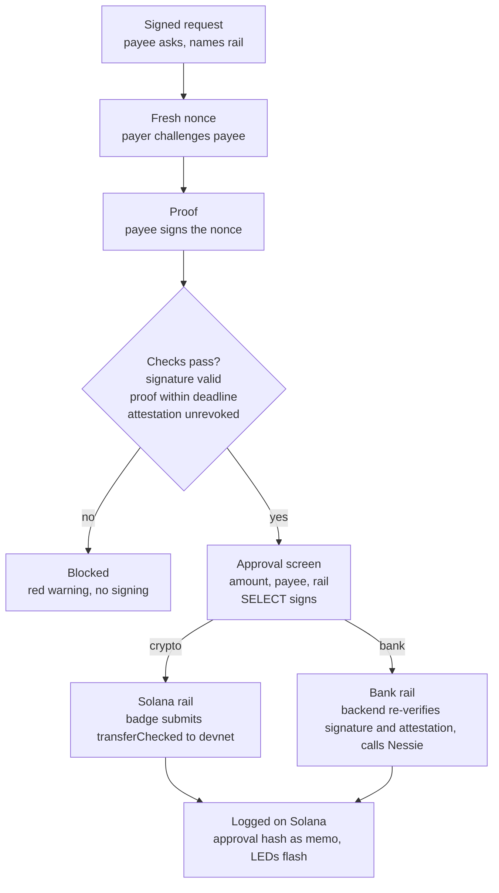
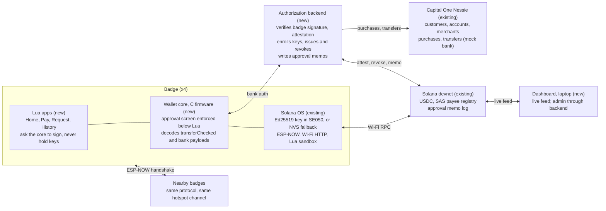
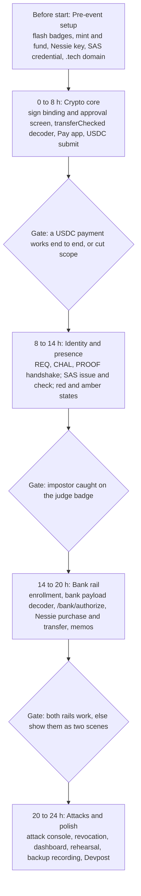

# PRD: Verified Payment Key (Solana + Capital One Nessie)

October 3, 2026

## Overview

A dedicated hardware key that proves who you are paying, proves they are standing in front of you, and shows exactly what you are signing, before money moves on either a crypto rail (Solana) or a bank rail (Capital One Nessie).

| Item | Value |
| --- | --- |
| Working name | TBD (see Open questions) |
| Event | MHacks 2026, 24-hour build |
| Prize targets | MLH Best Use of Solana (primary), FinTech main track, Capital One Best Use of Nessie, .Tech domain |
| Hardware | 4 Solana DEF CON 34 badges: 2 team, 2 handed to judges |
| Crypto rail | Solana devnet: USDC (Circle faucet) or a team SPL token; Solana Attestation Service (SAS) registry |
| Bank rail | Capital One Nessie mock banking API, behind an authorization backend |
| Base software | Solana OS by spacemandev (open source); we add the wallet, identity and authorization layers |
| Category line | "A security key for payments" |

## Problem

Most payment fraud losses now come from people authorizing payments to someone pretending to be someone else, and the device they confirm on is the device the scammer is talking to them through.

| Fact | Source |
| --- | --- |
| Americans reported $15.9B in fraud losses to the FTC in 2025, up from $12.5B in 2024 | [FTC testimony](https://www.ftc.gov/system/files/ftc_gov/pdf/ftc-testimony-jec-hearing-on-the-rising-scam-economy.pdf) |
| Imposter scams: $3.5B in 2025; bank impersonators caused the largest business-impersonation losses | [CNBC](https://www.cnbc.com/2026/06/26/imposter-scams-led-fraud-reports-to-ftc-in-2025-3point5-billion-losses.html) |
| About $2.1B of 2025 losses started on social media | [BleepingComputer](https://www.bleepingcomputer.com/news/security/ftc-warns-of-record-35-billion-losses-to-imposter-scams-in-2025/) |
| UK authorised push payment fraud rose 19% to £576.4M in 2025; banks reimbursed £354.3M | [UK Finance](https://www.ukfinance.org.uk/news-and-insight/press-release/fraud-report-2026-press-release) |
| Since Oct 2024 UK banks must reimburse victims up to £85,000 | [Kael Tripton](https://www.kaeltripton.com/latest/app-fraud-losses-uk-finance-report-explained/) |
| EU Verification of Payee mandatory since 9 Oct 2025: name must match IBAN | [McCann FitzGerald](https://www.mhc.ie/latest/insights/instant-payments-regulation-update) |
| Bybit lost about $1.5B when a tampered UI showed a normal transfer while hardware wallets signed a malicious payload | [Cyfrin](https://www.cyfrin.io/blog/safe-wallet-hack-bybit-exploit) |

Three failures follow:

1. **Identity.** Payment apps show an enrolled name or an address. Neither proves that the person asking for money controls that identity.
2. **Presence.** Nothing proves the payee is the person physically in front of you.
3. **Display.** The confirmation screen is drawn by the same phone or app the attacker controls or is coaching you through.

The bank rail has the same gap: Nessie, like most core banking APIs, executes any transfer its API key requests. There is no customer-held authorization step in front of it.

## Thesis and positioning

Hardware security keys largely stopped phishing for logins; payments never got the equivalent that also verifies who you are paying. Google required physical keys for 85,000+ employees in early 2017 and reported no confirmed account takeovers afterwards, after relying on app-generated codes before ([KrebsOnSecurity](https://krebsonsecurity.com/2018/07/google-security-keys-neutralized-employee-phishing/)).

Prior art covers each guarantee separately; none we found combines them:

| Prior art | Covers | Missing |
| --- | --- | --- |
| IBM ZTIC, Cronto/photoTAN, chipTAN | Bank-controlled screen shows amount and payee before signing | Verified payee identity, presence |
| W3C Secure Payment Confirmation; YubiKey 5.8 SPC support ([Yubico](https://www.yubico.com/press-releases/yubico-extends-passkeys-beyond-trusted-authentication-to-verified-authorization-with-launch-of-yubikey-5-8/)) | FIDO keys bound to payment amount and payee | Browser draws the screen; payee is whatever the merchant says; no presence |
| Ledger Clear Signing and Trusted Names ([Ledger](https://www.ledger.com/blog/ledger-now-supports-ens-domain-adresses)) | Decoded transaction and verified name ownership on device | Real-world identity, presence, bank rails |
| UK Confirmation of Payee, EU Verification of Payee | Name-to-account match at the bank | No hardware, no presence; shown in the app the scammer coaches you through |
| Mastercard relay resistance | Card-to-terminal proximity by timing | Identity, display |

**The open gap:** one key that, before signing, decodes the transaction itself; checks the payee's key holds a valid, unrevoked attestation binding it to a real name (and, for bank payees, an account); checks a fresh signed nonce from the payee's own key over short-range radio; shows amount, verified name and presence on its own screen; and signs only after a firmware-enforced button press, on either rail.

**Say:** "Security keys stopped phishing for logins. Banks proved trusted-display tokens work for payments. Ours is the first key we found that verifies who you are paying, and that they are standing in front of you, before you sign, on crypto or bank rails."

**Do not say:** "nobody has done this for payments", "first hardware clear signing", or "eliminates authorised push payment fraud".

## Goals, non-goals and success metrics

The build succeeds if a judge, holding a badge, completes a real payment on each rail and personally catches at least two attacks.

**Goals**

1. A judge pays a verified payee on Solana devnet and through Nessie with no help beyond on-screen hints.
2. The key refuses to present an impostor as verified, even under the same display name.
3. The key shows the true amount and recipient when a compromised relay tampers with a payment.
4. Every signature requires a physical button press enforced below the Lua app layer.
5. Solana is load-bearing (identity registry, revocation, payment rail, audit log) and Nessie is load-bearing (customers, merchants, purchases, transfers, balances).

**Non-goals**

- Mainnet, real money or a real bank.
- Stopping payments to a verified party who is dishonest, or a coached victim approving a verified mule account.
- Distance-bounded relay immunity (no UWB on the badge).
- Arbitrary tokens or programs; unknown instructions are refused.
- A stablecoin-to-fiat bridge; shown as a path-to-production slide only.

**Success metrics**

| Metric | Target |
| --- | --- |
| Judges completing a payment unaided | Every judge, both rails |
| Impostor and tamper attacks caught on the judge's own screen | 100% of attempts |
| Request to approval screen | Under 2 s |
| SELECT to confirmed on dashboard | Under 5 s (Solana); one Nessie round trip (bank) |
| Fixes needed during judging (faucet, Wi-Fi, reflash) | Zero |

## Users

| Role | In the demo | Needs |
| --- | --- | --- |
| Payer | A judge holding a badge | Know who they are paying and exactly how much, without crypto or banking jargon |
| Merchant payee | Team badge as "MHacks Merch" (a Nessie merchant and a Solana wallet) | Prove it is the real merchant; get paid on either rail |
| Person payee | Team badge as a named person (a Nessie customer) | Receive a bank transfer that the payer can trust |
| Issuer (the "bank") | Teammate on the dashboard acting as Capital One | Register keys to customers, verify payees, revoke lost or compromised keys |
| Attacker | Team laptop and an impostor badge | Spoof a verified name, tamper with a payment, replay an old request |

Real-world buyers (pitch only): banks issuing keys to customers most exposed to impersonation, businesses approving payments, and crypto users.

## Guarantees and threat model

The product is three guarantees, identical on both rails.

| Guarantee | Mechanism | Attack it stops |
| --- | --- | --- |
| Verified payee bound to hardware | An SAS attestation binds the payee badge's Ed25519 key to a verified name, a Solana wallet and/or a hashed Nessie account or merchant ID; revocable | Impostor using a verified name; revoked or lost key |
| Proof of presence | Payer badge sends a fresh nonce over ESP-NOW; payee badge signs it with the attested key within a deadline | Remote scammer posing as the person in front of you; replayed old requests |
| What you see is what you sign | Firmware decodes the Solana transaction or the bank authorization payload itself, renders amount, payee and rail, and signs only after SELECT | Compromised phone, laptop or backend relay altering amount or recipient |

The approval screen answers all three at once:

```
PAY   $40.00  via Capital One (Nessie)
TO    MHacks Merch  ✓ verified  ● present
      merchant 64f…a9c
```

**Not stopped (state these):**

- A verified payee who is dishonest. Identity names them; it does not prevent the payment.
- A coached victim paying a verified account that belongs to a scammer's accomplice.
- A fast relay between two distant badges: ESP-NOW range shows "nearby", not a measured distance.

**Assumptions:**

- The SE050 protects the key; the screen and buttons are driven by the ESP32-S3, so the display guarantee depends on firmware integrity (secure boot and flash encryption in production).
- The issuer is trusted to verify payees before attesting. In the demo the team plays Capital One; in production a bank or KYC provider.
- The authorization backend is untrusted for display: it can block a payment but cannot change one without failing the badge's signature.

## User flows

Every payment runs the same identity and presence checks and the same approval screen; only the last step differs by rail.



Attack flows reuse this path and fail at a named step:

| Flow | Where it stops | What the judge sees |
| --- | --- | --- |
| Impostor badge using "MHacks Merch" | Attestation check | Red "unverified" |
| Replayed old request | Nonce proof | Amber "not present" |
| Remote request with no badge nearby | Nonce proof | Amber "not present, remote payment" warning |
| Relay changes amount or recipient (either rail) | Approval screen, then signature check | True values on screen; judge presses CANCEL. A forged bank call fails the backend's signature check |
| Revoked key | Attestation check | Red "revoked" |
| Backend calls Nessie without a badge signature | Backend policy | Refused; shown on dashboard as blocked |

## Functional requirements

P0 ships the crypto core; P1 carries the differentiation; P2 adds the bank rail and the competitive layer; P3 is stretch.

**Firmware (C)**

| ID | Requirement | Priority |
| --- | --- | --- |
| FW1 | `identity.pubkey()` and `identity.sign(payload)` exposed to Lua; signing unreachable except through the approval screen | P0 |
| FW2 | Firmware-owned approval screen: rail, amount, payee name, verification and presence state; SELECT signs, CANCEL rejects; Lua cannot draw over or skip it | P0 |
| FW3 | Decoder for SPL Token `transferChecked`; any other instruction is shown as unknown and refused | P0 |
| FW4 | Decoder for the bank authorization payload (see Protocols) | P2 |
| FW5 | Domain-separated signing prefixes so a request, proof, Solana transaction and bank payload can never be confused | P1 |
| FW6 | Signing extends the Lua watchdog deadline | P0 |
| FW7 | Spending cap: above a limit, a second confirmation | P2 |
| FW8 | Key held in the SE050, verified on silicon | P3 |

**Badge apps (Lua)**

| ID | Requirement | Priority |
| --- | --- | --- |
| AP1 | Home: USDC balance and Nessie account balance, badge name, short address | P0 (USDC) / P2 (Nessie) |
| AP2 | Request: payee broadcasts a signed payment request naming amount and rail | P1 |
| AP3 | Pay: pick a nearby badge, strongest signal first; amount via D-pad | P0 |
| AP4 | Nonce handshake and presence state | P1 |
| AP5 | Attestation check with session cache | P1 |
| AP6 | Solana submit and confirmation poll; LEDs on both badges | P0 |
| AP7 | Bank submit: send signed payload to the backend; show Nessie result | P2 |
| AP8 | History of the last payments on both rails | P2 |

**Authorization backend**

| ID | Requirement | Priority |
| --- | --- | --- |
| BE1 | Registry: issue and revoke SAS attestations from the issuer keypair | P1 |
| BE2 | Key enrollment: bind a badge public key to a Nessie customer and account | P2 |
| BE3 | Bank authorize: verify badge signature, payload freshness, payee attestation and presence proof; only then call Nessie | P2 |
| BE4 | Audit: write each approved payload hash to Solana as a memo | P2 |
| BE5 | Refuse any Nessie money-movement call that lacks a verified badge signature | P2 |

**Dashboard and tooling**

| ID | Requirement | Priority |
| --- | --- | --- |
| DB1 | Live feed of both rails with explorer and Nessie links | P2 |
| DB2 | Admin: issue, revoke, enroll keys | P2 |
| DB3 | Attack console: tampered relay and impostor scenarios | P2 |
| DB4 | Voice readout of the approval screen (ElevenLabs) | P3 |

## Architecture

We build the two upper badge layers, the authorization backend and the dashboard; the key, radios, Solana and Nessie already exist.



| Component | Responsibility | Trust |
| --- | --- | --- |
| Wallet core (C) | Owns the key path: decode, display, button, sign | Trusted (with firmware integrity) |
| Lua apps | Discovery, requests, handshake, submission, history | Untrusted for signing; cannot sign without the core |
| Authorization backend | Holds the Nessie API key and issuer keypair; re-verifies every bank payment; writes memos | Trusted to block, not to change: a changed payload fails the badge signature |
| Solana devnet | USDC payments, SAS registry and revocation, approval memo log | Public, tamper-evident |
| Capital One Nessie | Customers, accounts, merchants, purchases, transfers | The bank core; reached only through the backend |
| Dashboard | Live feed, admin, attack console | Admin and attack views on localhost only |

Solana OS already generates the Ed25519 key on first boot, in the SE050 when it answers and in NVS otherwise; its SE050 path has not been run on real hardware ([Solana OS manual](https://github.com/spacemandev-git/solana-defcon-badge-26/blob/main/firmware/solana-os/README.md)).

## Data model

One attestation schema covers both rails; Nessie IDs appear on-chain only as salted hashes.

**SAS schema `payee_v1`** (credential: "MHacks Verified Payees", authority: the issuer keypair)

| Field | Type | Meaning |
| --- | --- | --- |
| display\_name | string | Name shown on the approval screen |
| device\_pubkey | 32 bytes | The payee badge's Ed25519 key; presence proofs must verify against it |
| kind | enum | merchant or person |
| solana\_wallet | 32 bytes, optional | Where USDC payments go (normally equal to device\_pubkey) |
| bank\_ref\_hash | 32 bytes, optional | SHA-256(salt ‖ Nessie merchant or account ID) |
| expiry | timestamp | Attestation lapses after this |

Revocation closes the attestation; the badge and backend both treat a missing or closed attestation as unverified ([SAS](https://solana.com/news/solana-attestation-service)).

**Nessie mapping**

| Nessie entity | Our use |
| --- | --- |
| Customer | One per badge holder; the backend binds the badge key to it at enrollment |
| Account | The payer's checking account; balance shown on the badge |
| Merchant | One per merchant payee; its ID is hashed into `bank_ref_hash` |
| Purchase | Payer account pays a verified merchant |
| Transfer | Payer account pays a verified person's account |

**Backend store** (SQLite or a JSON file is enough)

| Table | Columns |
| --- | --- |
| enrollments | badge\_pubkey, nessie\_customer\_id, nessie\_account\_id, enrolled\_at |
| payees | attestation\_address, display\_name, nessie\_ref (plaintext, server-side only), salt |
| approvals | payload\_hash, rail, status, nessie\_tx\_id or solana signature, memo signature, created\_at |
| nonces | used request ids and proof nonces, with expiry |

## Protocols and payloads

Three short radio messages establish identity and presence; the signed payment then goes to Solana or the backend, never over ESP-NOW.

**ESP-NOW handshake**

| Message | Direction | Fields | Budget |
| --- | --- | --- | --- |
| REQ | Payee → broadcast | version, rail, payee pubkey, amount, currency or mint, request id, expiry, signature over `pay-req:` + fields | ≤ 240 B |
| CHAL | Payer → payee | request id, 16 B nonce from the hardware RNG | ≤ 64 B |
| PROOF | Payee → payer | request id, signature over `pay-proof:` + request id + nonce + payer pubkey | ≤ 128 B |

The payer accepts PROOF only within a short deadline (target under 250 ms, set after measuring). ESP-NOW payloads are capped at 240 bytes and only reach badges on the same channel, so every badge joins one hotspot.

**Solana rail**

- One SPL Token `transferChecked` instruction (USDC devnet mint), plus an optional Memo instruction carrying the request id.
- Token accounts created ahead of time so the payment stays one decodable instruction.
- The badge builds, decodes, displays and signs the message itself, then submits through RPC.

**Bank rail authorization payload** (canonical, fixed field order, signed with prefix `bank-auth:`)

```
version      1
rail         nessie
action       purchase | transfer
amount_cents 4000
currency     USD
from_acct    <payer Nessie account id>
payee_name   MHacks Merch
payee_ref    <bank_ref_hash>
attestation  <SAS attestation address>
proof_nonce  <16 B from the handshake>
issued_at    <unix seconds>
```

This mirrors the PSD2 rule that an authentication code is bound to the amount and the payee. The backend rejects any payload older than a short window, with a reused nonce, or whose fields differ from the Nessie call it would make.

**Audit memo** (both rails): `appr:v1:<rail>:<sha256(payload)>` written by the backend, so every approval leaves a tamper-evident record even when money moves through Nessie.

## Backend API

The backend is the only holder of the Nessie API key and the issuer keypair; badges and the dashboard call it, and it calls Nessie and Solana.

| Endpoint | Caller | Does |
| --- | --- | --- |
| `POST /enroll` | Dashboard (admin) | Create or select a Nessie customer and account; bind a badge public key to them |
| `POST /registry/issue` | Dashboard (admin) | Create a `payee_v1` attestation for a badge key, with Nessie reference hashed |
| `POST /registry/revoke` | Dashboard (admin) | Close an attestation |
| `GET /registry/:pubkey` | Badge | Return the attestation (or none) for a payee key, with the issuer signature the badge checks |
| `POST /bank/authorize` | Badge | Body: signed bank payload + presence proof. Verify, then call Nessie, then write the memo; return Nessie result |
| `GET /balance/:pubkey` | Badge | Nessie account balance for the enrolled customer |
| `GET /feed` | Dashboard | Recent approvals across both rails |

**`/bank/authorize` order of checks** (any failure returns a refusal and logs it as blocked):

1. Badge signature valid against the enrolled key.
2. Payload fresh, nonce unused.
3. Payee attestation exists, unexpired, unrevoked; `payee_ref` matches the stored Nessie reference.
4. Presence proof signature valid against the attested `device_pubkey`.
5. Payload fields match the Nessie call exactly.
6. Call Nessie; write `appr:v1` memo; return.

**Nessie calls used** (verify paths against the current docs at [prod.nessieisreal.com](https://prod.nessieisreal.com/) before the event)

| Purpose | Call |
| --- | --- |
| List or create customers | `/customers` |
| Customer accounts and balance | `/customers/{id}/accounts`, `/accounts/{id}` |
| Merchants | `/merchants` |
| Pay a merchant | `POST /accounts/{id}/purchases` |
| Pay a person | `POST /accounts/{id}/transfers` |
| History for the dashboard | `GET /accounts/{id}/purchases`, `/transfers` |

## Dashboard (laptop)

The dashboard is the judges' window into both rails and the team's control panel for the issuer and attacker roles.

| View | Shows | Demo use |
| --- | --- | --- |
| Live feed | Every approval and refusal, newest first: time, rail, payer, payee with verified state, amount; Solana explorer link or Nessie transaction ID; memo link | All beats |
| Badges | Each badge: name, key location (secure element or software), USDC and Nessie balances, enrollment, attestation state | Setup |
| Issuer ("Capital One") | Enroll a badge to a Nessie customer; issue or revoke an attestation | Revocation beat |
| Attack console | Tampered relay (changes amount or recipient), impostor request, replay, unsigned Nessie call | Attack beats |

Requirements:

- Feed updates within about 3 seconds of a confirmation on either rail.
- Issuer keypair and Nessie key never reach the browser; issuer and attack views run on localhost; only the read-only feed is published on the .tech domain.
- Large type, readable from about 2 metres; uses the same hotspot as the badges.

## Track mapping

Each prize gets a component it cannot be removed from, so no track looks bolted on.

| Track | Load-bearing pieces | One-line pitch to that judge |
| --- | --- | --- |
| Best Use of Solana | SAS payee registry and live revocation; USDC payments signed on the badge; approval memo log for both rails | "Solana is the trust layer: who is verified, who is revoked, and a public record of every approval." |
| FinTech | Impersonation-fraud prevention on crypto and bank rails; verified payee, presence, trusted display | "Security keys stopped phishing for logins; this stops impersonation for payments." |
| Best Use of Nessie | Customers and accounts bound to badge keys; merchants as verified payees; purchases and transfers gated by the key; balances on the badge | "Nessie is the bank core; our key is the customer-held authorization layer Capital One could issue." |
| .Tech domain | Read-only live feed hosted on the domain | Register before the event |

Prior Nessie art for context: crypto plus Nessie has won before (Bitcard, HackMIT 2016, bitcoin to a virtual card) ([GitHub](https://github.com/ravirahman/Bitcard-Chrome-Extension)); no Nessie project found used hardware, payee verification or presence.

## Demo script

About four minutes; two judges each hold a badge, the dashboard is on a screen behind them.

1. **Hook (20 s).** "Americans lost $3.5B to imposter scams last year, and the scam happens on the phone you confirm on. Security keys stopped phishing for logins. This is one for payments."
2. **Crypto payment (40 s).** Judge buys a sticker from "MHacks Merch ✓ ● present" in USDC; the explorer link appears on the feed.
3. **Bank payment (40 s).** Same badge, same screen: "via Capital One"; judge pays $40; the Nessie purchase and its Solana memo appear on the feed.
4. **Impostor (30 s).** A second team badge claims "MHacks Merch"; the judge's screen shows red "unverified"; they reject it.
5. **Tampered relay (30 s).** Attack console changes $40 to $400 in transit; the badge shows $400; judge cancels. Then the console calls Nessie directly without a badge signature; the backend refuses and the feed shows it blocked.
6. **Revocation (30 s).** Issuer revokes the merchant's attestation; the next request turns red within one refresh.
7. **Close (30 s).** What exists (bank trusted-display tokens, SPC, Ledger) and what is new: verified payee plus presence plus a screen the attacker cannot touch, on both rails, on open hardware.

Backup: a screen recording of beats 2 to 6 in case venue radio or Wi-Fi fails.

## Build plan

Build in order of what secures a prize: the crypto core first, identity second, the bank rail third, with a go or cut decision at each gate.



**Team split** (assign by strength; roles pair up after hour 14)

| Role | Owns | Hands off to |
| --- | --- | --- |
| Firmware | Sign binding, approval screen, transferChecked and bank payload decoders, watchdog, SE050 check | Badge apps (sign API), backend (payload format) |
| Badge apps | Pay, Request, handshake, attestation check, RPC submit, history | Firmware (display data), backend (bank submit) |
| Backend and chain | SAS credential and schema, issue and revoke, `/bank/authorize`, Nessie calls, memos | Dashboard (feed), badge apps (registry lookups) |
| Dashboard and demo | Feed, issuer view, attack console, .tech hosting, pitch and recording | Everyone (rehearsal) |

**Cut order if behind:** spending cap → voice readout → SE050 key → history → person-to-person transfers (keep merchant purchases) → unified screen (show rails as two scenes).

## Risks and limitations

| Risk | Likelihood | Fallback |
| --- | --- | --- |
| SE050 Ed25519 path fails on silicon (never tested by its author) | Medium | Software key in NVS; drop the secure-element claim |
| Venue Wi-Fi blocks badges or splits ESP-NOW channels | High | One phone hotspot for every badge and the laptop |
| Devnet faucet limits | High | Fund every badge and wallet before the event |
| Nessie down, slow or paths changed | Medium | Test calls before the event; cached mock responses for the demo, labelled as such |
| SAS integration slower than expected | Medium | Minimal registry signed by the issuer key; same demo, less ecosystem credit |
| Two rails stretch the team | High | Gates in the build plan; show rails as two scenes |
| Judges stuck in a flow | Medium | CANCEL always exits; hold CANCEL to force-quit |

Limitations to state before judges ask:

- Identity names a dishonest verified payee; it does not stop the payment.
- A coached victim can still approve a verified account that belongs to a scammer's accomplice.
- Presence is nearby, not distance-bounded; a fast relay is possible without UWB.
- The ESP32 drives the screen; the SE050 protects only the key.
- Devnet and Nessie are test systems; no real money moves.

## Open questions

- Product name.
- USDC (Circle faucet) or a team SPL token on the crypto rail?
- Does the badge fetch attestations itself over RPC, or through `GET /registry/:pubkey` with an issuer signature?
- Exact Nessie endpoint paths and request fields in the current docs.
- Presence deadline value, set after measuring ESP-NOW round trips.
- Whether MHacks allows one project in Solana, Nessie and a main track at once.

## Pre-event checklist

- [ ] Flash Solana OS on all 4 badges; record whether Settings → Identity shows secure element or software
- [ ] Get a Nessie API key; create customers, accounts and the merchant; make one test purchase and transfer
- [ ] Create the SAS credential and `payee_v1` schema on devnet
- [ ] Fund every badge with devnet SOL and USDC; create token accounts
- [ ] Confirm a badge reaches devnet RPC and the backend through a phone hotspot
- [ ] Register the .tech domain
- [ ] Confirm prize-stacking rules on the MHacks Devpost

## Sources

- [Solana OS manual](https://github.com/spacemandev-git/solana-defcon-badge-26/blob/main/firmware/solana-os/README.md)
- [Solana Attestation Service](https://solana.com/news/solana-attestation-service)
- [Capital One Nessie](https://prod.nessieisreal.com/)
- [FTC testimony on 2025 fraud losses](https://www.ftc.gov/system/files/ftc_gov/pdf/ftc-testimony-jec-hearing-on-the-rising-scam-economy.pdf)
- [UK Finance Annual Fraud Report 2026 release](https://www.ukfinance.org.uk/news-and-insight/press-release/fraud-report-2026-press-release)
- [EU Verification of Payee](https://www.mhc.ie/latest/insights/instant-payments-regulation-update)
- [Google security keys, KrebsOnSecurity](https://krebsonsecurity.com/2018/07/google-security-keys-neutralized-employee-phishing/)
- [YubiKey 5.8 and Secure Payment Confirmation](https://www.yubico.com/press-releases/yubico-extends-passkeys-beyond-trusted-authentication-to-verified-authorization-with-launch-of-yubikey-5-8/)
- [Ledger Trusted Names](https://www.ledger.com/blog/ledger-now-supports-ens-domain-adresses)
- [Bybit exploit analysis](https://www.cyfrin.io/blog/safe-wallet-hack-bybit-exploit)
- [Bitcard, HackMIT 2016 Nessie winner](https://github.com/ravirahman/Bitcard-Chrome-Extension)