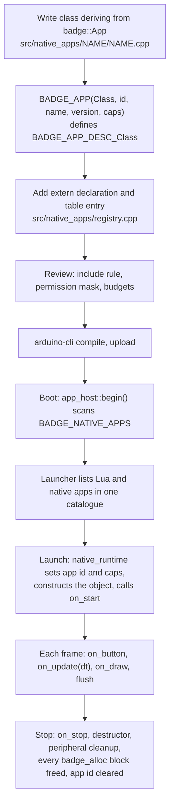

# Writing a C++ app

Purpose: how to write a native (C++) app, register it, build it into the firmware, and what trust a native app does and does not get.

Audience: C++ authors on the team, and reviewers of native apps. Read [overview.md](overview.md) first for the rules both runtimes share.

Status: design, not yet built on hardware. The SDK header, the registry file and the C++ example were syntax-checked only (`c++ -std=c++17 -fno-exceptions -fno-rtti -fsyntax-only`); they have never been linked, flashed or run. The native runtime (`src/app_host/native_runtime.cpp`) and the implementations behind the C ABI (`src/app_host/badge_api.cpp`) are specified and not written.

Upstream means Solana OS, `firmware/solana-os/` at commit `812b8c7` of the [upstream repository](https://github.com/spacemandev-git/solana-defcon-badge-26/tree/812b8c7/firmware/solana-os). Upstream has no native app mechanism; everything in this document is [OURS] unless tagged otherwise.

## The smallest app

Two edits: one new file, and two lines in the registry.

```cpp
// src/native_apps/gm/gm.cpp
#include "../../sdk/badge_sdk.hpp"

class Gm final : public badge::App {
 public:
  void on_draw() override {
    badge::gfx::clear();
    badge::gfx::text_center("gm", badge_gfx_width() / 2, 100, BADGE_SOLANA_GREEN, 3);
  }

  void on_button(badge_key_t key, bool pressed) override {
    if (key == BADGE_KEY_B && pressed) badge::system::exit();   // CANCEL
  }
};

BADGE_APP(Gm, "gm-native", "gm (C++)", "1.0.0", 0);
```

```cpp
// src/native_apps/registry.cpp — the single list of compiled-in apps
#include "../app_host/badge_api.h"
extern "C" const badge_app_desc_t BADGE_APP_DESC_TipJar;
extern "C" const badge_app_desc_t BADGE_APP_DESC_Gm;
extern "C" const badge_app_desc_t *const BADGE_NATIVE_APPS[] = {
    &BADGE_APP_DESC_TipJar,
    &BADGE_APP_DESC_Gm,
    nullptr,   // terminator
};
```

Build and flash from `firmware/solana-os/`:

```sh
FQBN="esp32:esp32:esp32s3:PSRAM=opi,FlashSize=16M,PartitionScheme=custom,CDCOnBoot=cdc"
arduino-cli compile --fqbn "$FQBN" .
arduino-cli upload  --fqbn "$FQBN" -p /dev/cu.usbserial-XXXX .
```

The app then appears in the launcher as `gm (C++)`. It is the same app as the smallest Lua app in [lua-apps.md](lua-apps.md#the-smallest-app): the callbacks, the drawing calls and the key names correspond one to one.

What the listing shows:

- The app is a class derived from `badge::App`. Override only the callbacks you need.
- `badge::gfx::clear()` and `badge::system::exit()` are SDK wrappers; `badge_gfx_width()` is the C function behind `badge::gfx::width`. Both spellings are the same call. Only four wrappers are written out in the SDK header today (see [The SDK header](#the-sdk-header)); use the C function for everything else.
- `BADGE_KEY_B` is the key marked CANCEL on the board; `BADGE_KEY_A` is SELECT.
- The last argument of `BADGE_APP` is the permission mask. `0` means none.
- The id (`gm-native`) shares one namespace with Lua app ids. A native id wins: pushing a Lua app called `gm-native` is refused.

## Delivery model

C++ apps are compiled into the firmware image and listed in an explicit registry table. Changing one means rebuilding and reflashing.

Why they are compiled in rather than loaded [OURS]:

- The ESP32-S3 has no MMU and the Arduino core has no dynamic loader.
- A loaded native blob would run with full privileges anyway, so loading adds risk and no isolation.
- Compiling in keeps one build, one review point (the registry table), and lets the linker check every API call.

Use a native app for code that needs speed, tight timing, or to ship inside the image. Use Lua for everything else: a Lua app can be pushed in seconds, and it is the only kind that is actually sandboxed.



## Trust statement

**Native code is trusted code.** A compiled-in C++ app runs in the same address space as the rest of the firmware, including the software key seed when the key is not in the secure element, and it can call internal functions. It is part of the trusted computing base. Only Lua apps are an enforced boundary.

This is stated plainly because the product's security claim is "an app can ask for a signature; only the wallet core can produce one". For a Lua app the firmware enforces that. For a native app it is a rule the author follows and a reviewer checks.

What the guard rails are:

| Guard rail | What it does |
|---|---|
| Include rule (rule 1 below) and its `grep` check | a native app that includes only `sdk/badge_sdk.hpp` can name only the badge API |
| `badge_identity_sign` is the only signing call in the API | it runs the same gate and the same approval screen as Lua's `identity.sign` |
| Compile-time key gate | `identity.h` declares no signing function; the one function that signs needs a token that only the wallet core's gate class can construct. See [key gate](../wallet-core/signing-gate.md#key-gate) |
| Permission mask in the descriptor | the badge API checks it on every guarded call and returns `BADGE_ERR_DENIED` |
| Registry table | an app that is not in `registry.cpp` does not exist; the table is one place to review |
| Flashing | only someone with the badge and the build can install a native app |
| Budget accounting and `badge_alloc` cap | overruns are logged and the app is stopped; accounted memory is bounded and freed at stop |
| Audit log | every signing decision is recorded with the app id |

What the guard rails are not:

| Not provided | Consequence |
|---|---|
| Memory isolation | a native app can read and write any firmware memory. Nothing stops it from declaring an internal function itself, including a forbidden header, or reading the software seed from NVS |
| A defence against a malicious author | the include rule, the token idiom and the `grep` rules stop mistakes, not malice |
| Pre-emption | a callback that never returns hangs the badge. Hold-CANCEL is handled by the main loop and never runs. There is no watchdog on the loop task [UPSTREAM: the Arduino loop-task watchdog is off and upstream does not enable it] |
| Accounting of `new`, `malloc`, statics or stack | only `badge_alloc` is counted |
| Stack protection | all apps share the 16 KB main-loop stack with the wallet, TLS and the shell [UNVERIFIED: needed size; fallback 24 KB] |

Mitigation: native apps are written by the team, reviewed, listed in one table, and only the team can flash. A third-party app belongs in Lua.

The full list of non-goals and residual risks is in [security-model.md](../security/security-model.md).

## Rules

1. Include only `sdk/badge_sdk.hpp`. No `hal/`, `net/`, `identity/`, `wallet/`, `lua_sdk/` headers. Enforced by review and by `grep -rn '#include' src/native_apps/*/ | grep -v 'badge_sdk.hpp\|<c\|<std\|<new>\|<string'` printing nothing.
2. No exceptions, no RTTI, no threads/tasks, no `delay()`; use `badge::system::sleep`. Do not depend on the core's exception or RTTI flags [UNVERIFIED which are on].
3. Buffers larger than 1 KB come from `badge_alloc`, not the stack (16 KB shared) or `new`.
4. All state lives in the app object; it is constructed at launch and destroyed at stop, like a Lua state.
5. Return from every callback within 250 ms unless inside a blocking badge API call.
6. Register in `src/native_apps/registry.cpp`; an app that is not in the table does not exist.

Notes on the rules:

- Rule 1: standard C and C++ library headers (`<cstdio>`, `<cstring>`, `<new>`, …) are allowed; the pattern lets them through. The rule and its command cover the app directories (`src/native_apps/*/`) only. `registry.cpp` is not an app: it sits one level up, the command does not look at it, and it may include only `../app_host/badge_api.h`.
- Rule 1 and JSON: a native app that needs the `jsmn` tokenizer gets it through the SDK header, never by including `wallet/vendor/jsmn.h` itself. See [What is Lua-only](#what-is-lua-only).
- Rule 2: `badge::system::sleep` is one of the wrappers not yet written out in the SDK header; until it is, call `badge_system_sleep(ms)` (at most 2000 ms per call).
- Rule 4: no file-scope or `static` mutable state. A second launch must start from the same state as the first.
- Rule 5: the blocking calls are the network calls (`badge_http_*`, `badge_rpc_*`, `badge_attest_check`, `badge_attest_self`), `badge_system_sleep`, and the wallet screens (`badge_identity_sign`, `badge_pay_request`, `badge_pay_receive`).

## The SDK header

`src/sdk/badge_sdk.hpp`, complete and verbatim from the repository copy at [`../reference/code/sdk-headers/sdk/badge_sdk.hpp`](../reference/code/sdk-headers/sdk/badge_sdk.hpp). Header only.

```cpp
// src/sdk/badge_sdk.hpp (essentials; the wrappers for every badge_* function follow the same pattern)
#pragma once
#include <new>
#include "../app_host/badge_api.h"

// JSON for native apps: define BADGE_SDK_WITH_JSMN before including this header to get jsmn (v1.1.0,
// vendored at src/wallet/vendor/jsmn.h) with static linkage. Native apps never include the vendor path themselves.
#ifdef BADGE_SDK_WITH_JSMN
#define JSMN_STATIC
#include "../wallet/vendor/jsmn.h"
#endif

namespace badge {

class App {
 public:
  virtual ~App() = default;
  virtual void on_start() {}
  virtual void on_update(float /*dt*/) {}
  virtual void on_draw() {}
  virtual void on_button(badge_key_t /*key*/, bool /*pressed*/) {}
  virtual void on_espnow(const uint8_t /*mac*/[6], const uint8_t * /*data*/, size_t /*len*/, int /*rssi*/) {}
  virtual void on_ble(const char * /*line*/) {}
  virtual void on_stop() {}
};

namespace gfx    { inline void clear(uint16_t c = BADGE_BG) { badge_gfx_clear(c); }
                   inline void text_center(const char *s, int cx, int y, uint16_t c = BADGE_WHITE, int size = 1) { badge_gfx_text_center(s, cx, y, c, size); } }
namespace system { inline uint32_t millis() { return badge_system_millis(); }
                   inline void exit() { badge_system_exit(); } }
// ... one inline wrapper per function in badge_api.h, same names without the prefix ...

}  // namespace badge

// Defines the descriptor `BADGE_APP_DESC_<Class>` with C linkage. The object is built with placement new at
// launch and destroyed at stop, so every launch starts from a fresh state.
#define BADGE_APP(Class, ID, NAME, VERSION, CAPS)                                                    \
  namespace {                                                                                        \
  alignas(Class) unsigned char badge_storage_##Class[sizeof(Class)];                                 \
  Class *badge_self_##Class = nullptr;                                                               \
  }                                                                                                  \
  extern "C" const badge_app_desc_t BADGE_APP_DESC_##Class = {                                       \
      BADGE_ABI_VERSION, ID, NAME, VERSION, "", "", (CAPS),                                          \
      [] { badge_self_##Class = new (badge_storage_##Class) Class(); badge_self_##Class->on_start(); }, \
      [](float dt) { badge_self_##Class->on_update(dt); },                                           \
      [] { badge_self_##Class->on_draw(); },                                                         \
      [](badge_key_t k, bool p) { badge_self_##Class->on_button(k, p); },                            \
      [](const uint8_t mac[6], const uint8_t *d, size_t n, int rssi) { badge_self_##Class->on_espnow(mac, d, n, rssi); }, \
      [](const char *line) { badge_self_##Class->on_ble(line); },                                    \
      [] { badge_self_##Class->on_stop(); badge_self_##Class->~Class(); badge_self_##Class = nullptr; }}
```

It provides four things:

| Part | Purpose |
|---|---|
| `badge::App` | base class with one virtual per lifecycle callback, each with an empty default |
| `badge::<module>::<fn>` wrappers | inline functions with the same arguments as `badge_<module>_<fn>`. Four exist in the header today: `badge::gfx::clear(c = BADGE_BG)`, `badge::gfx::text_center(s, cx, y, c = BADGE_WHITE, size = 1)`, `badge::system::millis()`, `badge::system::exit()`. The rest follow the same pattern and are still to be written |
| `BADGE_APP` | defines the descriptor the registry points at |
| `jsmn`, on request | with `BADGE_SDK_WITH_JSMN` defined before the include, the header pulls in the vendored `jsmn` v1.1.0 JSON tokenizer with static linkage |

The header includes `../app_host/badge_api.h`, so every `badge_*` function, type and constant is available. The complete C ABI is in [api-reference.md](api-reference.md#the-c-abi-in-full).

Callbacks:

| Virtual | When | Budget |
|---|---|---|
| `void on_start()` | once, right after the object is constructed | 5000 ms |
| `void on_update(float dt)` | every frame; `dt` in seconds | 250 ms |
| `void on_draw()` | every frame after update; the canvas is flushed afterwards | 250 ms |
| `void on_button(badge_key_t key, bool pressed)` | per edge | 250 ms |
| `void on_espnow(const uint8_t mac[6], const uint8_t *data, size_t len, int rssi)` | per application frame | 250 ms |
| `void on_ble(const char *line)` | per line after `badge_ble_listen(true)` | 250 ms |
| `void on_stop()` | before teardown | 250 ms |

## BADGE_APP

```cpp
BADGE_APP(Class, ID, NAME, VERSION, CAPS);
```

| Argument | Meaning |
|---|---|
| `Class` | the app class. The macro defines the descriptor `BADGE_APP_DESC_<Class>` with C linkage |
| `ID` | app id, `[a-z0-9._-]`, 1–32 characters, unique across Lua and native apps |
| `NAME` | shown in the launcher |
| `VERSION` | free text |
| `CAPS` | permission mask: any OR of `BADGE_CAP_SIGN`, `BADGE_CAP_NET`, `BADGE_CAP_RADIO`, `BADGE_CAP_WALLET`, `BADGE_CAP_SYSTEM`, or `0` |

What the macro generates:

- A static buffer sized and aligned for `Class`, and a pointer to the live object.
- A `badge_app_desc_t` whose function pointers forward to the object's virtuals. Author and description are empty strings.
- The start entry constructs the object in the static buffer with placement `new` and then calls `on_start`. The stop entry calls `on_stop`, then the destructor. Every launch therefore starts from a freshly constructed object.

Consequences:

- The class must be default-constructible. Put initial values in member initialisers.
- The object's storage is static: `sizeof(Class)` bytes of internal RAM are reserved for as long as the firmware runs, whether or not the app is running. Keep the class small and take large buffers from `badge_alloc`.
- Use `BADGE_APP` once per class: the generated names are derived from the class name.
- A native app has no `min_api`: it is compiled against the header it runs with, and the linker checks every call.

## Registry

`src/native_apps/registry.cpp`, verbatim from the repository copy at [`../reference/code/sdk-headers/native_apps/registry.cpp`](../reference/code/sdk-headers/native_apps/registry.cpp):

```cpp
// src/native_apps/registry.cpp — the single list of compiled-in apps
#include "../app_host/badge_api.h"
extern "C" const badge_app_desc_t BADGE_APP_DESC_TipJar;
extern "C" const badge_app_desc_t *const BADGE_NATIVE_APPS[] = {
    &BADGE_APP_DESC_TipJar,
    nullptr,   // terminator
};
```

To add an app: add one `extern "C"` declaration of its descriptor and one `&BADGE_APP_DESC_<Class>` entry before the `nullptr` terminator. To remove an app, delete both lines; its code is then dead and the linker may drop it.

The registry is explicit, instead of each app registering itself from a static constructor, because the table is the review point and because it avoids link-order surprises.

At boot `app_host::begin()` scans the table and adds each descriptor to the same catalogue as the Lua apps found on the filesystem.

## Build

There is no build integration beyond adding files. `arduino-cli` compiles every `.c` and `.cpp` under `src/` recursively and links them into the sketch [UPSTREAM build behaviour, README "Building"]. There is no component manifest and no CMake on the device side; CMake is used only for the host unit tests.

```sh
cd firmware/solana-os
FQBN="esp32:esp32:esp32s3:PSRAM=opi,FlashSize=16M,PartitionScheme=custom,CDCOnBoot=cdc"

# checks before every flash: must print nothing
grep -rn '#include' src/native_apps/*/ | grep -v 'badge_sdk.hpp\|<c\|<std\|<new>\|<string'

arduino-cli compile --fqbn "$FQBN" .
arduino-cli upload  --fqbn "$FQBN" -p /dev/cu.usbserial-XXXX .
arduino-cli monitor -p /dev/cu.usbserial-XXXX -c baudrate=115200
```

To check a native app's syntax on a laptop without the ESP32 toolchain, compile it against the headers alone, the way the reference files were checked:

```sh
c++ -std=c++17 -fno-exceptions -fno-rtti -fsyntax-only src/native_apps/gm/gm.cpp
```

This proves the file parses and type-checks against `badge_api.h`. It proves nothing about linking or behaviour.

Toolchain installation, the pre-flash checks for the wallet core and flashing four badges are in [build-and-flash.md](../guides/build-and-flash.md).

`arduino-cli` is not installed on the development machine as of writing, and which C++ standard and which exception and RTTI flags the installed ESP32 core uses is unconfirmed [UNVERIFIED; fallback: the rules above avoid depending on them].

## Budgets

| Callback | Budget |
|---|---|
| `on_start` | 5000 ms |
| every other callback | 250 ms |

The native runtime measures the wall time of each callback and subtracts the time spent inside blocking badge API calls. It cannot interrupt a callback.

- A callback over 250 ms logs `[native] <id> <callback> took <n> ms`.
- Three overruns within 10 s stop the app with the error `app exceeded its time budget`.
- `badge_app_fail("message")` stops the app immediately and shows the error screen.
- Hold CANCEL for 1.5 s force-quits the app, but only between callbacks: it works only if the callbacks return.

Because a native callback cannot be pre-empted, write long work as a state machine that advances a little per `on_update`, exactly as in Lua. The Tip Jar in [examples.md](examples.md) shows the pattern: `on_button` starts a step, `on_update` polls for its result.

Blocking calls and their limits:

| Call | Blocks for |
|---|---|
| `badge_system_sleep(ms)` | `ms`, at most 2000 |
| `badge_http_get`, `badge_http_post` | up to `timeout_ms` |
| `badge_rpc_*`, and `badge_attest_check` or `badge_attest_self` when they fetch | up to 4000 ms each (`BADGE_RPC_TIMEOUT_MS`) |
| `badge_identity_sign`, `badge_pay_request`, `badge_pay_receive` | until the user decides on the wallet's screen, at most 60 s |

While a wallet screen is up, no callback of the app runs and nothing the app drew is visible.

## Memory

| Kind | Where | Accounted | Freed |
|---|---|---|---|
| The app object | static buffer generated by `BADGE_APP`, internal RAM | no | never (reused at each launch) |
| `badge_alloc(bytes)` | PSRAM | yes, 1 MiB cap per app; returns `NULL` when over | by `badge_free`, and every outstanding block when the app stops |
| `new`, `malloc` | internal heap | **no** | only if the app frees it |
| Locals | the shared 16 KB main-loop stack | no | — |

Use `badge_alloc` for anything larger than 1 KB (rule 3). Always check for `NULL`.

```cpp
// src/native_apps/scope/scope.cpp — a buffer that is too large for the stack
#include "../../sdk/badge_sdk.hpp"

class Scope final : public badge::App {
  static constexpr size_t kSamples = 4096;
  float *level_ = nullptr;
  size_t next_ = 0;

 public:
  void on_start() override {
    level_ = static_cast<float *>(badge_alloc(kSamples * sizeof(float)));
    if (level_ == nullptr) { badge_app_fail("out of app memory"); return; }
    badge_mic_enable(true);
  }

  void on_update(float) override {
    if (level_ == nullptr) return;
    float left = 0, right = 0;
    badge_mic_level(&left, &right);
    level_[next_] = left;
    next_ = (next_ + 1) % kSamples;
  }

  void on_draw() override {
    badge::gfx::clear();
    if (level_ == nullptr) return;
    for (int x = 0; x < badge_gfx_width(); ++x) {
      const size_t i = (next_ + kSamples - 1 - static_cast<size_t>(x)) % kSamples;
      badge_gfx_line(x, 239, x, 239 - static_cast<int>(level_[i] * 2), BADGE_SOLANA_GREEN);
    }
  }

  void on_button(badge_key_t key, bool pressed) override {
    if (key == BADGE_KEY_B && pressed) badge::system::exit();
  }

  void on_stop() override {
    badge_free(level_);          // optional: the runtime frees outstanding blocks at stop
    level_ = nullptr;
  }
};

BADGE_APP(Scope, "scope-native", "Scope (C++)", "1.0.0", 0);
```

What the runtime cleans up at stop, after `on_stop`: microphones off, LEDs off, the BLE line handler released, any payment session the app opened closed, every outstanding `badge_alloc` block freed, the app id cleared. Files and key/value entries persist.

Files and key/value storage follow the same confinement as Lua: `badge_storage_*` paths are relative to `/apps/<id>/`, and `badge_storage_kv_*` keys are namespaced per app id.

## What is Lua-only

Some functions exist only in Lua in version 1 of the C ABI [OURS: not needed by any shipped native app; add on demand]:

| Module | Lua-only |
|---|---|
| top level | `badge.version`, `print` (use `badge_log`) |
| `json` | the whole module. Native apps parse JSON with `jsmn`, through the SDK header (below) |
| `gfx` | optional-colour defaults (C takes every colour explicitly); the colour constants not defined in `badge_api.h`: `SOLANA_TEAL`, `SOLANA_MAGENTA`, `PANEL`, `BORDER`, `YELLOW`, `CYAN`, `BLUE` |
| `input` | `keys()`, `COUNT` (in C the literal 6) |
| `led` | `COUNT` (in C the literal 2) |
| `system` | `apps()`, `chip()`, `uptime()`, `lua_memory()` |
| `storage` | `list()`, `space()` |
| `mic` | `read()`, `db()`, `enabled()` |
| `se050` | `atr()`, `test()`, `random_available()` |
| `wifi` | `connect`, `connect_enterprise`, `enterprise`, `disconnect`, `scan`, `scanning`, `networks`, `hotspot`, `ip`, `mac` |
| `espnow` | `signal()`, `beacon()`, `clear()`, `MAX_PAYLOAD` (in C the literal 240), `MAX_PEERS` (in C the literal 20) |
| `ble` | `address()`, `enabled()`, `listening()` |
| `app` | `kind()` (a native app is native) |

This is the same list as [Parity exceptions](api-reference.md#parity-exceptions) in the API reference. Every other Lua function has a C declaration in `badge_api.h`, including `badge_wallet_info`, `badge_identity_decode`, `badge_identity_badge_id`, `badge_codec_hex`, `badge_codec_unhex`, `badge_rpc_call`, `badge_attest_self`, `badge_system_reboot` and `badge_pay_receipt`. Three Lua constants are spelled differently in C: `badge.api_version` is `BADGE_API_VERSION`, `pay.TIMEOUT_MS` is `BADGE_PAY_TIMEOUT_MS`, and `pay.DEADLINE_MS` is the `deadline_ms` field that `badge_wallet_info` fills.

JSON in a native app: define `BADGE_SDK_WITH_JSMN` before including the SDK header. The header then includes `../wallet/vendor/jsmn.h` (jsmn v1.1.0) with `JSMN_STATIC`, so the tokenizer is compiled into the app's own translation unit and rule 1 still holds: the app includes one header.

```cpp
// first lines of a native app that parses JSON
#define BADGE_SDK_WITH_JSMN
#include "../../sdk/badge_sdk.hpp"
```

`jsmn.h` is vendored in the firmware tree, not in the repository's copy of the SDK headers, so this path has not been syntax-checked against the real file.

Things that exist only on the native side: `badge_alloc`, `badge_free`, `badge_app_fail`.

## Requirements covered

- F1: a native app reaches the key only through `badge_identity_sign`, which runs the same gate and approval screen as Lua.
- F2: no native callback runs while the approval screen is up.
- NFR "security": the statement that native code is trusted, and what the guard rails do and do not provide.
- Platform acceptance T-APP1 (Tip Jar in Lua and C++ behaves the same), in [acceptance.md](../testing/acceptance.md).

## Open items

- [UNVERIFIED] The SDK header, the registry and all C++ listings in this document were syntax-checked only; nothing was linked or run. Fallback: if the native runtime slips, ship Lua apps only and keep this document and the example marked "not built".
- [UNVERIFIED] C++ standard, exception and RTTI flags of the installed Arduino ESP32 core. Fallback: rule 2.
- [UNVERIFIED] Whether lambdas converting to C function pointers inside the `BADGE_APP` initialiser are accepted by the ESP32 toolchain's compiler as they are by the host compiler. Fallback: replace the lambdas with static member functions.
- [UNVERIFIED] Loop-task stack need (16 KB). Fallback: 24 KB.
- [UNVERIFIED] The `BADGE_SDK_WITH_JSMN` path: the SDK header was syntax-checked without it, because `jsmn.h` is not in the repository's copy of the headers. Fallback: none needed until a native app parses JSON; no shipped native app does.
