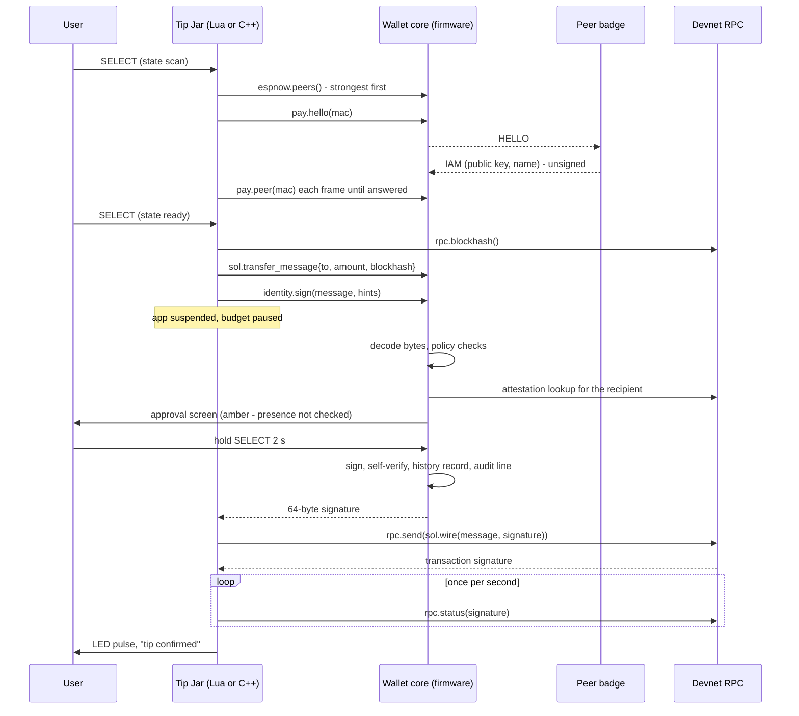

# Worked example: Tip Jar in Lua and in C++

Purpose: one complete payment app, written twice against the same API, with a line-by-line mapping between the two.

Audience: app authors who have read [lua-apps.md](lua-apps.md) or [cpp-apps.md](cpp-apps.md) and want to see a whole payment from discovery to confirmation.

Status: design, not yet built on hardware. The Lua listing was syntax-checked with `luac -p` on a development machine. The C++ listing was syntax-checked with `c++ -std=c++17 -fno-exceptions -fno-rtti -fsyntax-only` against the SDK header. Neither has been linked into firmware or run on a badge, and the modules they call (`badge.pay`, `badge.rpc`, `badge.sol`, `badge.identity`) are specified and not yet implemented.

Upstream means Solana OS, `firmware/solana-os/` at commit `812b8c7` of the [upstream repository](https://github.com/spacemandev-git/solana-defcon-badge-26/tree/812b8c7/firmware/solana-os). The example uses three upstream bindings (`badge.espnow.peers`, `badge.led`, `badge.gfx`) [UPSTREAM `src/lua_sdk/lib_espnow.cpp`, `lib_led.cpp`, `lib_gfx.cpp`]; everything else is [OURS]. Upstream paths are relative to that directory.

## What it does

Find the nearest badge, ask who it is, send it 1.00 HACK after the wallet's approval screen, wait for confirmation, flash the LEDs.

| Step | Trigger | Calls |
|---|---|---|
| Scan | SELECT | take the strongest peer from the ESP-NOW peer table; ask it for its public key |
| Hello | every frame | wait for the peer's answer |
| Ready | SELECT | fetch a blockhash, build the transfer message, ask the wallet to sign, submit |
| Confirm | once per second | poll the transaction status; flash green or red |

The app never sees the key and cannot sign by itself. Between "build" and "submit" the wallet core takes over the screen.

## Manifest

```ini
# apps/tipjar/app.ini
name=Tip Jar
version=1.0.0
description=Tip the nearest badge 1.00 HACK
permissions=sign,net,radio
min_api=2
```

| Permission | Needed for |
|---|---|
| `sign` | `identity.sign` |
| `net` | `rpc.blockhash`, `rpc.send`, `rpc.status` |
| `radio` | `espnow.peers`, `pay.hello`, `pay.peer` |

The C++ version has no `app.ini`. The same information is in its last line: `BADGE_APP(TipJar, "tipjar-native", "Tip Jar (C++)", "1.0.0", BADGE_CAP_SIGN | BADGE_CAP_NET | BADGE_CAP_RADIO);`. The two versions have different ids (`tipjar`, `tipjar-native`) because Lua and native ids share one namespace.

## Lua listing

`apps/tipjar/main.lua`, complete:

```lua
-- apps/tipjar/main.lua
local g, pay, rpc, sol, id = badge.gfx, badge.pay, badge.rpc, badge.sol, badge.identity
local TIP = "100"                         -- raw units: 1.00 HACK at 2 decimals
local state, msg, target, last = "scan", "SELECT to find a badge", nil, 0

function on_start() badge.led.take() end

function on_button(key, pressed)
  if not pressed then return end
  if key == "b" then badge.system.exit() return end
  if key ~= "a" then return end
  if state == "scan" then
    target = badge.espnow.peers()[1]      -- strongest signal first
    if not target then msg = "no badge nearby" return end
    pay.hello(target.mac)
    state, msg = "hello", "asking " .. target.name
  elseif state == "ready" then
    local bh, err = rpc.blockhash()
    if not bh then msg = "rpc: " .. err return end
    local m, e2 = sol.transfer_message{ to = target.pubkey, amount = TIP, blockhash = bh }
    if not m then msg = e2 return end
    local sig, e3 = id.sign(m, { recipient = target.pubkey, claimed_name = target.name, claimed_amount = TIP })
    if not sig then state, msg = "scan", "not signed: " .. e3 return end
    local txid, e4 = rpc.send(sol.wire(m, sig))
    if not txid then state, msg = "scan", "send: " .. e4 return end
    target.txid, state, msg = txid, "confirm", "sent, waiting"
  end
end

function on_update(dt)
  if state == "hello" then
    local p = pay.peer(target.mac)
    if p then
      target.pubkey, target.name = p.pubkey, p.name
      state, msg = "ready", "SELECT tips " .. p.name
    end
  elseif state == "confirm" and badge.millis() - last > 1000 then
    last = badge.millis()
    local s = rpc.status(target.txid)
    if s == "confirmed" or s == "finalized" then
      badge.led.pulse(20, 241, 149, 900); state, msg = "scan", "tip confirmed"
    elseif s == "failed" then
      badge.led.pulse(255, 69, 69, 900); state, msg = "scan", "tip failed"
    end
  end
end

function on_draw()
  g.clear()
  g.text_center("Tip Jar", 160, 30, g.SOLANA_GREEN, 3)
  g.text_center(msg, 160, 110, g.WHITE, 1)
  g.text_center("SELECT tip 1.00 HACK   CANCEL exit", 160, 226, g.MUTED, 1)
end
```

Install: `tools/badge-push.py --host <badge-ip> --token <code> push apps/tipjar --run`.

## C++ listing

`src/native_apps/tipjar/tipjar.cpp`, complete and verbatim from the repository copy at [`../reference/code/sdk-headers/native_apps/tipjar/tipjar.cpp`](../reference/code/sdk-headers/native_apps/tipjar/tipjar.cpp):

```cpp
// src/native_apps/tipjar/tipjar.cpp
#include <cstdio>
#include <cstring>
#include "../../sdk/badge_sdk.hpp"

class TipJar final : public badge::App {
  enum class State { Scan, Hello, Ready, Confirm } state_ = State::Scan;
  static constexpr uint64_t kTip = 100;            // raw units: 1.00 HACK at 2 decimals
  badge_peer_t target_{};
  badge_pay_peer_t who_{};
  uint8_t txid_[64]{};
  uint32_t lastPoll_ = 0;
  char msg_[64] = "SELECT to find a badge";

  void say(const char *text) { std::snprintf(msg_, sizeof msg_, "%s", text); }

 public:
  void on_start() override { badge_led_take(); }

  void on_button(badge_key_t key, bool pressed) override {
    if (!pressed) return;
    if (key == BADGE_KEY_B) { badge_system_exit(); return; }
    if (key != BADGE_KEY_A) return;

    if (state_ == State::Scan) {
      if (badge_espnow_peers(&target_, 1) == 0) { say("no badge nearby"); return; }   // strongest first
      badge_pay_hello(target_.mac);
      state_ = State::Hello;
      std::snprintf(msg_, sizeof msg_, "asking %s", target_.name);
    } else if (state_ == State::Ready) {
      uint8_t blockhash[32], message[256], signature[64], wire[1 + 64 + 256];
      char err[64];
      if (badge_rpc_blockhash(blockhash) != BADGE_OK) { say("rpc: no blockhash"); return; }
      const size_t n = badge_sol_transfer_message(who_.pubkey, kTip, blockhash, message, sizeof message);
      if (n == 0) { say("could not build"); return; }
      const badge_sign_hint_t hint = {who_.pubkey, who_.name, "100", nullptr};
      const badge_err_t rc = badge_identity_sign(message, n, &hint, signature);   // blocks on the approval screen
      if (rc != BADGE_OK) { state_ = State::Scan; std::snprintf(msg_, sizeof msg_, "not signed (%d)", (int)rc); return; }
      const size_t w = badge_sol_wire(message, n, signature, wire, sizeof wire);
      if (badge_rpc_send(wire, w, txid_, err, sizeof err) != BADGE_OK) {
        state_ = State::Scan; std::snprintf(msg_, sizeof msg_, "send: %s", err); return;
      }
      state_ = State::Confirm;
      say("sent, waiting");
    }
  }

  void on_update(float) override {
    if (state_ == State::Hello) {
      if (badge_pay_peer(target_.mac, &who_)) {
        state_ = State::Ready;
        std::snprintf(msg_, sizeof msg_, "SELECT tips %s", who_.name);
      }
    } else if (state_ == State::Confirm && badge_system_millis() - lastPoll_ > 1000) {
      lastPoll_ = badge_system_millis();
      badge_tx_status_t status;
      if (badge_rpc_status(txid_, &status) != BADGE_OK) return;
      if (status == BADGE_TX_CONFIRMED || status == BADGE_TX_FINALIZED) {
        badge_led_pulse(20, 241, 149, 900); state_ = State::Scan; say("tip confirmed");
      } else if (status == BADGE_TX_FAILED) {
        badge_led_pulse(255, 69, 69, 900); state_ = State::Scan; say("tip failed");
      }
    }
  }

  void on_draw() override {
    badge_gfx_clear(BADGE_BG);
    badge_gfx_text_center("Tip Jar", 160, 30, BADGE_SOLANA_GREEN, 3);
    badge_gfx_text_center(msg_, 160, 110, BADGE_WHITE, 1);
    badge_gfx_text_center("SELECT tip 1.00 HACK   CANCEL exit", 160, 226, BADGE_MUTED, 1);
  }
};

BADGE_APP(TipJar, "tipjar-native", "Tip Jar (C++)", "1.0.0", BADGE_CAP_SIGN | BADGE_CAP_NET | BADGE_CAP_RADIO);
```

Install: the descriptor `BADGE_APP_DESC_TipJar` is already in the registry ([cpp-apps.md](cpp-apps.md#registry)); build and flash the firmware.

## Line-by-line mapping

Line numbers refer to the two listings above.

| Lua lines | C++ lines | What happens | Same call in both |
|---|---|---|---|
| 2 | 2–4 | bring the API into scope | Lua aliases module tables; C++ includes the SDK header |
| 3 | 8 | the tip: raw 100 = 1.00 HACK at 2 decimals | a **string** in Lua (32-bit numbers), a `uint64_t` in C++ |
| 4 | 7, 9–13 | app state: state name, message line, target peer, last poll time | Lua locals; C++ members of the app object |
| 6 | 18 | stop the idle LED animation | `led.take()` / `badge_led_take()` |
| 8–11 | 20–23 | ignore releases; CANCEL exits; only SELECT continues | `system.exit()` / `badge_system_exit()`; `"b"`, `"a"` / `BADGE_KEY_B`, `BADGE_KEY_A` |
| 13–14 | 26 | strongest peer first; none → message | `espnow.peers()[1]` / `badge_espnow_peers(&target_, 1)` |
| 15 | 27 | ask that peer for its public key | `pay.hello(mac)` / `badge_pay_hello(mac)` |
| 16 | 28–29 | state → hello | — |
| 18–19 | 33 | fetch a recent blockhash (blocks ≤ 4 s) | `rpc.blockhash()` / `badge_rpc_blockhash(out)` |
| 20–21 | 34–35 | build the transfer message to the peer's wallet | `sol.transfer_message{to, amount, blockhash}` / `badge_sol_transfer_message(to, amount, blockhash, out, cap)` |
| 22 | 36–37 | ask the wallet to sign, with hints. **Blocks on the approval screen** | `identity.sign(msg, hints)` / `badge_identity_sign(msg, len, &hint, sig)` |
| 23 | 38 | not signed → back to scan | error string in Lua, error number in C++ |
| 24 | 39–40 | wrap signature + message into a wire transaction and submit (blocks ≤ 4 s) | `sol.wire` + `rpc.send` / `badge_sol_wire` + `badge_rpc_send` |
| 25 | 40–42 | send failed → back to scan | — |
| 26 | 43–44 | remember the transaction signature; state → confirm | base58 string in Lua, 64 bytes in C++ |
| 31–36 | 49–53 | hello state: when the peer has answered, keep its key and name; state → ready | `pay.peer(mac)` / `badge_pay_peer(mac, &who_)` |
| 37–38 | 54–55 | confirm state: at most one poll per second | `badge.millis()` / `badge_system_millis()` |
| 39 | 56–57 | poll the transaction status (blocks ≤ 4 s) | `rpc.status(sig)` / `badge_rpc_status(sig, &status)` |
| 40–41 | 58–59 | confirmed or finalized → green pulse, back to scan | `led.pulse(20, 241, 149, 900)` |
| 42–43 | 60–61 | failed → red pulse, back to scan | `led.pulse(255, 69, 69, 900)` |
| 48–53 | 66–71 | draw title, message line, key hints | `gfx.clear`, `gfx.text_center` |
| `app.ini` | 74 | id, name, version, permissions | — |

Differences that are not differences in behaviour:

| Topic | Lua | C++ |
|---|---|---|
| Error text on the message line | the error name (`"rpc: timeout"`, `"not signed: rejected"`) | fixed text or the number (`"rpc: no blockhash"`, `"not signed (27)"`); `"send: "` is followed by the node's message instead of the error name |
| Peer name | `target.name` is overwritten with the name from the peer's answer | `who_.name` holds it; `target_.name` keeps the beacon name |
| Where state lives | file-level locals, discarded with the Lua state | members, destroyed with the object |
| Buffers | none; strings are managed by Lua | fixed arrays on the stack: 256-byte message, 321-byte wire, all under 1 KB |
| Colours | `g.clear()` uses the default background | `BADGE_BG` passed explicitly |
| Budget | enforced by the VM hook; paused during `id.sign` | measured after each callback; time inside `badge_identity_sign` and the RPC calls is subtracted |

Points worth copying into your own app:

- The blockhash is fetched immediately before building, in the same callback as the signature and the submission. A blockhash lives roughly 60 to 90 s; the wallet call times out after 60 s.
- The callback that signs makes two network calls (blockhash, send). With the signature paused, that is at most 9 s of extension, inside the 12 s cap. A third call would not fit; the status poll therefore runs from `on_update`.
- `claimed_amount` is the amount the app showed the user (`"100"`). If the message said anything else, the wallet's screen would show `APP SAID 1.00 HACK` in red.
- `recipient` is the owner wallet from the peer's answer. The wallet derives that wallet's token account itself and uses the hint only if it matches the destination in the message.
- The peer's answer is unsigned and Tip Jar sends no presence challenge, so the wallet treats presence as not checked. A request-based flow that proves presence is in [apps/pay.md](../apps/pay.md).

## What the wallet screen shows

Both versions call the same gate, so they reach the same approval screen. The screen is drawn by firmware from the message bytes, the firmware's own attestation check and the firmware's presence table. Nothing on it comes from the app except the `app:` line, which is the app's id.

When the peer holds a valid attestation under the name it answered with (example: the merchant badge, attested as `MHacks Merch`):

```
+----------------------------------------+
| APPROVE PAYMENT            WiFi NOW 87%|
|########################################|  amber band
| PAY   1.00 HACK                        |
|                                        |
| TO    MHacks Merch                     |
|       Gn2G..Ecxq                       |
|                                        |
| [v] verified                           |
| [!] presence not checked               |
|                                        |
|                                        |
| app: tipjar   tx: legacy               |
| [=========>                          ] |
| hold SELECT 2s to sign   CANCEL reject |
+----------------------------------------+
```

When the peer has no attestation (example: a badge that calls itself `badge-51A0`):

```
+----------------------------------------+
| APPROVE PAYMENT            WiFi NOW 87%|
|########################################|  amber band
| PAY   1.00 HACK                        |
|                                        |
| TO    unverified badge                 |
|       DhEb..W511                       |
|                                        |
| [!] UNVERIFIED                         |
| [!] presence not checked               |
| calls itself: badge-51A0               |
|                                        |
| app: tipjar   tx: legacy               |
| [=========>                          ] |
| hold SELECT 2s to sign   CANCEL reject |
+----------------------------------------+
```

Why it is amber in both cases: Tip Jar never proves presence, and "verified" with "presence not checked" is amber ([severity and gestures](../wallet-core/signing-gate.md#severity-and-gestures)). Amber means the user holds SELECT for 2 s. A green screen needs a verified payee and a fresh presence proof, which the request flow in [apps/pay.md](../apps/pay.md) provides.

Other outcomes:

| Situation | Screen | Returned to the app |
|---|---|---|
| The peer answers with a name this badge has already seen verified for a different key | red, `DO NOT PAY`, `NAME MISMATCH`; signing is blocked | `blocked` (C++: 26) |
| The user presses CANCEL on an amber or green screen | — | `rejected` (27) |
| No decision in 60 s | — | `approval_timeout` (28) |
| The app lacks `sign` | no screen | `denied` (2) |
| A second attempt within 2 s of a rejection | no screen | `rate_limited` (5) |

The C++ version shows the same screens with `app: tipjar-native` on the context line. That line is the only difference between the two.

The mockups use the 40-column grid of the wallet screens (one cell is about 8 px); exact pixel positions are in [screens.md](../wallet-core/screens.md#screen-b). `[v]` and `[!]` stand for the tick and the warning glyph, which firmware draws with lines because the font is ASCII only.

## Sequence



## Acceptance check

T-APP1 in [acceptance.md](../testing/acceptance.md): run Tip Jar (Lua) and Tip Jar (C++) against the same peer. Pass text: identical behaviour; the wallet screens are identical except the context line (`app: tipjar` and `app: tipjar-native`).

## Requirements covered

- F1: both runtimes reach the key only through the gated sign call.
- F2: the approval screen is the wallet core's; the listing shows where the app is suspended.
- F5 (in part): choosing the nearest badge by signal strength.
- F7: submit, poll for confirmation, flash the LEDs (payer side).
- Platform acceptance T-APP1.

## Open items

- [UNVERIFIED] Neither listing has run on a badge. Fallback: if the native runtime is not built, only the Lua version ships and the C++ listing stays marked "not built".
- [UNVERIFIED] Time from SELECT to the approval screen (one RPC call, token-account derivation, one attestation lookup). Fallback: the attestation lookup has a 4 s timeout and CANCEL works during it.
- [UNVERIFIED] Whether the strongest ESP-NOW peer is the nearest badge at table distance. Fallback: none; signal strength is a hint for ordering, not a security property.
