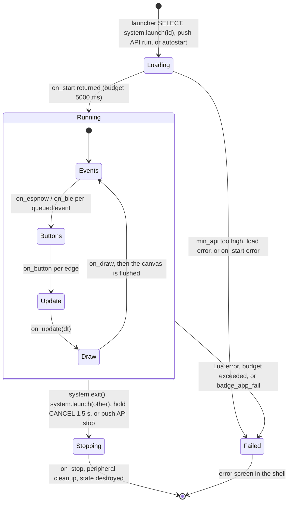

# App platform overview

Purpose: what an app is on this badge, the two ways to write one, and the rules both kinds live under.

Audience: app authors. Read this first, then [lua-apps.md](lua-apps.md) or [cpp-apps.md](cpp-apps.md), and keep [api-reference.md](api-reference.md) open.

Status: design, not yet built on hardware. The Lua runtime and its sandbox exist upstream and were read in source. The native runtime, the permission system and all wallet modules are specified and not yet implemented. Nothing here has run on a badge.

Upstream means Solana OS, `firmware/solana-os/` at commit `812b8c7` of the [upstream repository](https://github.com/spacemandev-git/solana-defcon-badge-26/tree/812b8c7/firmware/solana-os). Upstream paths below are relative to that directory.

## Two runtimes, one contract

An app is either a Lua script pushed to the badge at run time, or a C++ class compiled into the firmware. Both see the same host API, the "badge API", under the same names.

| | Lua app | C++ app |
|---|---|---|
| Trust | untrusted, sandboxed [UPSTREAM README "The sandbox"] | trusted, part of the firmware image [OURS] |
| Delivery | pushed at run time to `/apps/<id>/` over Wi-Fi, BLE or serial [UPSTREAM README "Pushing apps"] | compiled in; changing one means reflashing [OURS] |
| Entry | `main.lua`, global functions `on_*` [UPSTREAM `src/lua_sdk/lua_runtime.h:17-28`] | a class derived from `badge::App`, registered with `BADGE_APP(...)` [OURS] |
| API | `badge.<module>.<fn>` | `badge_<module>_<fn>` (C ABI) and `badge::<module>::<fn>` (SDK) |
| Memory | 1 MiB Lua heap in PSRAM, enforced by the allocator [UPSTREAM `src/config.h:192`, `lua_runtime.cpp:66-88`] | `badge_alloc()` from PSRAM, 1 MiB accounted cap; `new` and `malloc` are not accounted [OURS] |
| Time | 250 ms per callback, 5 s for start, enforced by a VM hook [UPSTREAM `src/config.h:195-196`] | 250 ms per callback **measured after the fact**; cannot be pre-empted [OURS] |
| Can it sign without the approval screen? | No. No binding exists. | Not through the API. It shares the address space; see the trust statement in [cpp-apps.md](cpp-apps.md#trust-statement). |
| Use it for | everything that can be Lua | code that needs speed, tight timing, or to ship in the image |

Why C++ apps are compiled in [OURS]: the ESP32-S3 has no MMU and the Arduino core has no dynamic loader. A loaded native blob would run with full privileges anyway, so loading adds risk and no isolation. Compiling in keeps one build, one review point (the registry table), and lets the linker check the API.

The rule every app lives under, whichever language it is written in:

> An app can ask for a signature. Only the wallet core can produce one. A transaction signature is produced only after the wallet core's own approval screen and a SELECT press on that screen.

For a Lua app this is an enforced boundary. For a C++ app it is a contract backed by review, not by hardware. See [security-model.md](../security/security-model.md).

All shipped apps (Home, Pay, Request, History, Checkout, and the Lua Tip Jar) are Lua. The only native app is the C++ Tip Jar, which exists to show that the two runtimes behave the same. See [examples.md](examples.md).

## Manifest

A Lua app is a directory `/apps/<id>/` on the badge's LittleFS filesystem, with `main.lua` and an optional `app.ini` [UPSTREAM `src/apps/app_store.h`].

`app.ini` is `key=value`, one per line; `#` and `;` start comments; unknown keys are ignored [UPSTREAM `src/apps/app_store.cpp:48-52`].

| Key | Status | Meaning |
|---|---|---|
| `name` | [UPSTREAM] | shown in the launcher; defaults to the directory name |
| `version` | [UPSTREAM] | free text |
| `author` | [UPSTREAM] | free text |
| `description` | [UPSTREAM] | one line |
| `entry` | [UPSTREAM] | entry file; defaults to `main.lua` |
| `permissions` | [OURS] | comma-separated list from the table in the next section. Absent → `net,radio,system`, so every upstream app keeps working |
| `min_api` | [OURS] | integer. The app is not launched if `badge.api_version < min_api`; the error screen says `needs API <n>` |

Example:

```ini
# apps/tipjar/app.ini
name=Tip Jar
version=1.0.0
description=Tip the nearest badge 1.00 HACK
permissions=sign,net,radio
min_api=2
```

A native app has no `app.ini`. It carries the same fields in its descriptor, filled by the `BADGE_APP` macro ([cpp-apps.md](cpp-apps.md#badge_app)).

App id: `[a-z0-9._-]`, 1 to 32 characters [UPSTREAM `src/apps/app_store.h:11-13`]. Lua and native ids share one namespace. A native id wins: pushing a Lua app with a native app's id is refused with HTTP 409, or `ERR id reserved` on the line protocol [OURS].

## Permissions

A permission is consent given by whoever installed the app, that is, whoever holds the badge's pairing code. [OURS]

| Name | C bit | Grants |
|---|---|---|
| `sign` | `BADGE_CAP_SIGN` `0x01` | `identity.sign`, `pay.request`, `pay.receive` (each still shows a firmware screen) |
| `net` | `BADGE_CAP_NET` `0x02` | `wifi.*`, `http.*`, `rpc.*`, `attest.*` |
| `radio` | `BADGE_CAP_RADIO` `0x04` | `espnow.*`, `ble.*`, `pay.*` other than request/receive |
| `wallet` | `BADGE_CAP_WALLET` `0x08` | `history.*` |
| `system` | `BADGE_CAP_SYSTEM` `0x10` | `system.launch`, `system.name` (set), `system.reboot` |

No permission is needed for `gfx`, `input`, `led`, `storage`, `battery`, `mic`, `se050`, the rest of `system`, `identity.pubkey/badge_id/source/decode`, `wallet.info/format/parse`, `sol.*`, `codec.*`, `json.*`, `app.*`.

Enforcement:

- Our functions return `nil, "denied"` in Lua and `BADGE_ERR_DENIED` in C.
- Upstream bindings that gained a guard (`wifi`, `http`, `espnow`, `ble`, and the guarded `system` functions) raise a Lua error naming the permission.
- The approval screen always shows `app: <id>`, so the user sees who asked.
- The launcher shows `$` after the name of any app that holds `sign`.

`sign` does not let an app sign. It lets an app ask; the wallet core's screen and the user's SELECT press decide. An app with every permission still cannot produce a signature on its own.

Permissions held by the shipped apps:

| App | Permissions |
|---|---|
| [Home](../apps/home.md) | `sign,net,radio,system` |
| [Pay](../apps/pay.md) | `sign,net,radio,wallet,system` |
| [Request](../apps/request.md) | `sign,net,radio,wallet,system` |
| [History](../apps/history.md) | `wallet,system` |
| [Checkout](../apps/checkout.md) | `sign,net,system` |
| [Tip Jar](examples.md) (both) | `sign,net,radio` |

Pay, Request, History and Checkout hold `system` for one call: `system.launch("home")`, which takes the user back to Home instead of the launcher when they leave the app's top screen.

## Lifecycle

The callbacks have identical semantics in both runtimes. All are optional.

| Callback | Lua | C++ (`badge::App` virtual) | When | Budget |
|---|---|---|---|---|
| start | `on_start()` | `void on_start()` | once after load / construction | 5000 ms |
| update | `on_update(dt)` | `void on_update(float dt)` | every frame, `dt` in seconds | 250 ms |
| draw | `on_draw()` | `void on_draw()` | every frame after update; the canvas is flushed afterwards | 250 ms |
| button | `on_button(key, pressed)` | `void on_button(badge_key_t key, bool pressed)` | per edge | 250 ms |
| espnow | `on_espnow(mac, data, rssi)` | `void on_espnow(const uint8_t mac[6], const uint8_t *data, size_t len, int rssi)` | per application frame | 250 ms |
| ble | `on_ble(line)` | `void on_ble(const char *line)` | per line after `ble.listen()` | 250 ms |
| stop | `on_stop()` | `void on_stop()` | before teardown | 250 ms |

In Lua the script's top level runs once before `on_start`, inside the same 5000 ms budget [UPSTREAM `lua_runtime.cpp:251-265`].



Facts behind the diagram:

- Frame order is radio events → `on_button` per edge → `on_update` → `on_draw` → flush [UPSTREAM README "Lifecycle"].
- Launch and exit are requests, applied between frames. An app cannot destroy the state it is executing in [UPSTREAM `lua_runtime.cpp:319-350`].
- Holding CANCEL for 1.5 s force-quits either kind of app from the main loop [UPSTREAM `solana-os.ino:71-78`]. For a native app this only works if its callbacks return [OURS].
- On stop the runtime calls `on_stop`, turns the microphones and LEDs off, releases the BLE line handler, closes any payment session the app opened, and destroys the Lua state or the C++ object [UPSTREAM `lua_runtime.cpp:273-317`; payment-session and native cleanup OURS].
- Nothing of an app survives its stop except its files and its key/value entries.
- While the wallet's approval screen is up, no callback of any app runs. The app is suspended inside its own call to `identity.sign`, `pay.request` or `pay.receive`. [OURS]

## Blocking rules

Every callback must return quickly. Three kinds of call are allowed to take longer.

| Kind | Calls | What happens to the budget |
|---|---|---|
| Network and sleep | `http.*`, `rpc.*`, `attest.check`, `system.sleep` | they block, and extend the budget by their timeout. Total extension is at most 12 s per callback [UPSTREAM `src/config.h:210`] |
| Wallet screens | `identity.sign`, `pay.request`, `pay.receive` | they block for as long as the user takes (at most 60 s) and **pause** the budget [OURS] |
| Everything else | — | returns immediately |

Rules for app authors:

1. Do network calls from `on_button` or from a state machine in `on_update`. Never call the network every frame.
2. Make at most two blocking network calls in one callback. Each RPC call may take 4 s; three in a row can pass the 12 s cap and the app is stopped. Spread a longer sequence over several frames, one step per `on_update`.
3. A payee with an open payment session must not block at all: a blocked main loop cannot answer a presence challenge in time. See [apps/request.md](../apps/request.md).
4. Do not draw from a blocking call's caller and expect it to appear: the screen is flushed after `on_draw`, and no frame is drawn while a callback is blocked. Draw a "working" state, return, and make the call on the next frame.

The exact extension per call is in [api-reference.md](api-reference.md#blocking-and-time-budgets).

## Storage and isolation

| Store | Scope | Rule |
|---|---|---|
| Files | `/apps/<id>/…` only, both runtimes | relative path, at most 96 characters, no leading `/`, no `..` [UPSTREAM `lua_runtime.cpp:404-410` for Lua; OURS for native, through the same resolver] |
| Key/value | NVS namespace `luakv`, both runtimes | stored key = 6 hex digits of FNV-1a(app id) + `:` + key; the app's key is at most 8 characters [UPSTREAM `lib_storage.cpp:186-225`] |

- One app runs at a time [UPSTREAM `lua_runtime.h:1-15`].
- Apps cannot read `/wallet/`, `/certs/`, or the NVS namespaces `wallet`, `badgeid`, `sysconf` through the API [UPSTREAM confinement + OURS]. The software key seed lives in `badgeid`; no API returns it.
- State shared between apps exists only in firmware stores: payment history (`badge.history`) and the wallet's tables (`badge.pay`, `badge.attest`).
- Key/value entries survive a filesystem reflash; files do not.

What isolation means for each kind:

- A Lua app is confined by the VM: no `io`, `os` or `debug` library, no bytecode loading, no native code [UPSTREAM README "The sandbox"]. Upstream states the limits of this sandbox itself: it stops accidents, and a hostile Lua app can still spin the CPU inside a binding, flood a radio or fill the filesystem. It cannot reach the key or draw over the approval screen.
- A native app is confined by convention only. See [cpp-apps.md](cpp-apps.md#trust-statement).

## Limits

| Limit | Value | Tag |
|---|---|---|
| Lua heap per app | 1 MiB, PSRAM | [UPSTREAM `src/config.h:192`] |
| Native app accounted heap (`badge_alloc`) | 1 MiB, PSRAM | [OURS] |
| Callback budget | 250 ms | [UPSTREAM `src/config.h:195`] |
| Start budget (top level + `on_start`) | 5000 ms | [UPSTREAM `src/config.h:196`] |
| Budget extension per callback | 12 000 ms in total | [UPSTREAM `src/config.h:210`] |
| Wallet call | 60 s for the whole call, whichever screens it shows, then `approval_timeout` | [OURS] |
| Native budget overruns before the app is stopped | 3 within 10 s | [OURS] |
| Shared task stack | 16 KB for the whole main loop, including the app | [OURS] [UNVERIFIED: needed size; fallback 24 KB] |
| App id | 1–32 characters of `[a-z0-9._-]` | [UPSTREAM] |
| File path | 96 characters, relative | [UPSTREAM] |
| One pushed file | 96 KB | [UPSTREAM `src/config.h:151`] |
| `storage.read` | 64 KB per call | [UPSTREAM `lib_storage.cpp`] |
| `gfx.image` file | 256 KB | [UPSTREAM `lib_gfx.cpp:230`] |
| Key/value key | 8 characters | [UPSTREAM] |
| ESP-NOW payload | 240 bytes | [UPSTREAM `src/config.h:147`] |
| ESP-NOW peer table | 20 peers, dropped after 12 s of silence | [UPSTREAM `src/config.h:145-146`] |
| HTTP timeout | default 5000 ms, 100..10 000 | [UPSTREAM `lib_net.cpp`] |
| HTTP body over the phone bridge | 32 KB | [UPSTREAM README "Phone bridge"] |
| RPC timeout / response body | 4000 ms / 8 KB | [OURS] |
| JSON input / depth | 32 KB / 16 | [OURS] |
| Transaction message | 256 bytes | [OURS, host-tested decoder] |
| Payment request lifetime | `ttl_s`, default and maximum 120 s; receive mode default and maximum 600 s. A larger value is clamped | [OURS] |
| Signing prompts | one at a time; 2 s cooldown after a non-approval; 3 non-approvals in 60 s lock the app out for 30 s | [OURS], see [rate limits](../wallet-core/signing-gate.md#rate-limits) |
| Lua numbers | 32-bit integers, 32-bit floats | [UPSTREAM `src/lua/luaconf.h:125`] |

## Discovery and launch

- The launcher lists one catalogue: Lua apps found under `/apps/` and native apps from the registry table [OURS: `app_host`; upstream lists Lua apps only, `src/ui/shell.cpp:237-314`]. After the apps comes a Settings row.
- In the launcher SELECT runs an app, RIGHT deletes it after a confirmation, CANCEL opens Settings [UPSTREAM `src/ui/shell.cpp:237-314`].
- A native app cannot be deleted; removing one means reflashing. RIGHT does nothing on a native app's row, and the footer there reads `SELECT run   up/down move   CANCEL settings`, without `right delete`, the same way upstream hides that hint on the Settings row [UPSTREAM `shell.cpp:280-281`]. `DELETE /api/app?id=<native id>` answers HTTP 409 `{"error":"id reserved"}`. [OURS]
- An app holding `sign` is marked with `$` after its name [OURS].
- An app can hand over to another with `system.launch(id)` (permission `system`) and return to the launcher with `system.exit()`. The shipped apps return to Home with `system.launch("home")`; Home's CANCEL opens the launcher.
- From a laptop: `tools/badge-push.py … run <id>` and `stop`, `POST /api/run?id=<id>`, `POST /api/stop`, or `RUN <id>` / `STOP` on the BLE and serial line protocol [UPSTREAM README "Pushing apps"].
- Autostart: on first boot the autostart app is set to `home` if it is unset [OURS]. Upstream has the setting but no UI that sets it.
- An app whose `min_api` is higher than the firmware's API version (2) is not launched; the error screen says `needs API <n>` [OURS].

## Error surfaces

Where an app author sees a failure:

| Surface | What appears there | Tag |
|---|---|---|
| Return values | `nil, "<error>"` in Lua, `badge_err_t` in C. The full list is in [error-codes.md](../reference/error-codes.md#badge_err_t) | [OURS] |
| Lua error | any uncaught error in a callback stops the app; the shell shows the message and a traceback, SELECT retries | [UPSTREAM `lua_runtime.cpp:103-161`, `shell.cpp:1250-1300`] |
| Time budget | Lua: `app exceeded its time budget (stuck in a loop?)`. Native: the log line `[native] <id> <callback> took <n> ms`, and after three overruns in 10 s the app is stopped with `app exceeded its time budget` | [UPSTREAM] / [OURS] |
| `badge_app_fail("message")` | native apps stop themselves and show the error screen | [OURS] |
| `needs API <n>` | `min_api` too high | [OURS] |
| Wallet blocked screen | codes `unknown_instruction`, `wrong_signer`, `unknown_mint`, `decimals`, `bad_source`, `over_limit`, `too_long` and `sign_failed` are shown to the user on [Screen E](../wallet-core/screens.md#screen-e) before the call returns. `blocked` is returned after the red [Screen C](../wallet-core/screens.md#screen-c). `no_display` is never drawn; the call returns at once | [OURS] |
| Log | `badge.log`, `print` and `badge_log` lines, tagged `[app]`; firmware tags `wallet`, `pay`, `attest`, `rpc`, `native`. Read on the serial console (115200 baud), on Settings → Console, at `GET /api/logs`, or with `tools/badge-push.py … logs` | [UPSTREAM transports], [OURS tags] |
| Audit log | every signing decision, with the app id | [OURS], see [config-limits-audit.md](../wallet-core/config-limits-audit.md) |

Symptoms and fixes are in [lua-apps.md](lua-apps.md#common-errors) and [troubleshooting.md](../guides/troubleshooting.md).

## Requirements covered

- F1: apps reach the key only through `identity.sign`, which is gated by the wallet core (both runtimes).
- F2: no app callback runs while the approval screen is up.
- NFR "sandbox fit": signing pauses the Lua time budget; network calls extend it.
- NFR "judge UX": CANCEL and hold-CANCEL leave any app.
- Platform acceptance: T-APP1 (Tip Jar in both languages behaves the same) and T-APP2 (ESP-NOW callbacks work in every app launched, not only the first), in [acceptance.md](../testing/acceptance.md).

## Open items

- [UNVERIFIED] Nothing here has run on a badge. Fallback: build and flash upstream unmodified first.
- [UNVERIFIED] Loop-task stack need with TLS, the Lua VM and a native app on one stack (set to 16 KB). Fallback: 24 KB.
- [UNVERIFIED] Compiler flags of the Arduino core (C++ standard, exceptions, RTTI). Fallback: the SDK rules avoid depending on them.
- [UNVERIFIED] The native runtime is the lowest-priority platform work. Fallback: ship Lua apps only and keep the C++ SDK and example marked "not built".
