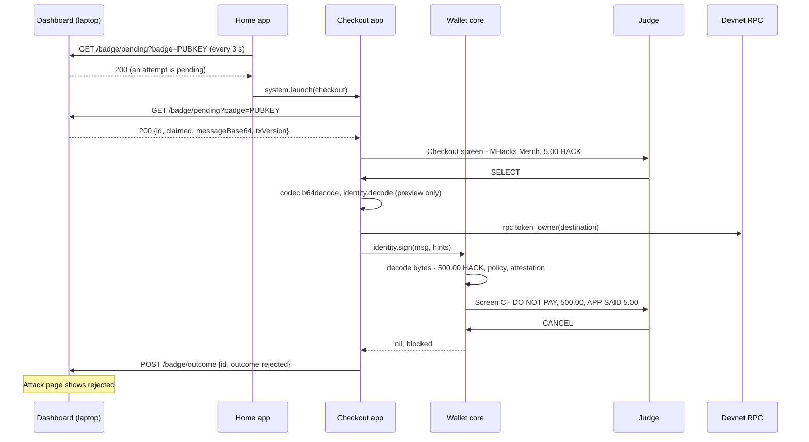

# Checkout app

Purpose: the honest merchant-checkout app on the judge's badge that a compromised laptop lies to. It shows what the laptop claims, asks the wallet to sign what the laptop sent, and reports a rejection back.

Audience: app authors implementing `apps/checkout`, and whoever runs the compromised-laptop demo.

Status: design, not yet built on hardware. The app is specified and not written. The core logic below is the design's own listing; the rest of the file was written for this document. Both were syntax-checked with `luac -p` and smoke-tested on a development machine against a mock of the badge API; the mock is not part of the repository. Nothing has run on a badge or against the real dashboard listener.

Upstream means Solana OS, `firmware/solana-os/` at commit `812b8c7` of the [upstream repository](https://github.com/spacemandev-git/solana-defcon-badge-26/tree/812b8c7/firmware/solana-os). Checkout is a Lua app [OURS]; it uses the upstream HTTP binding [UPSTREAM `src/lua_sdk/lib_net.cpp:217-271`] and key/value store [UPSTREAM `src/lua_sdk/lib_storage.cpp`]. Upstream paths are relative to that directory. Behaviour described here is [OURS] unless tagged otherwise.

## Purpose and requirement

Badge side of F12 (P2): a compromised-laptop tool builds a tampered transaction; the badge must show the true amount and recipient.

The demo: the laptop's "merchant checkout" displays 5 HACK while sending the judge's badge a prebuilt 500 HACK transfer to an attacker. Checkout is the app on the badge that receives it. Checkout itself is honest and simple: it believes the laptop. That is the point. The app shows `5.00 HACK` because the laptop said so; the wallet core's approval screen shows `500.00 HACK` because the bytes say so.

Security goal 3 of the product: the badge shows the true amount and recipient when a compromised app tampers with a transaction.

## Permissions

`apps/checkout/app.ini`:

```ini
name=Checkout
permissions=sign,net,system
min_api=2
```

| Permission | Used for |
|---|---|
| `sign` | `identity.sign` |
| `net` | `http.get`, `http.post`, `rpc.token_owner`, `rpc.send`, `rpc.status`, `wifi.connected` |
| `system` | `system.launch("home")` |

Checkout holds no `radio` permission: the attack transaction arrives over Wi-Fi HTTP, not ESP-NOW (a full transaction exceeds the 240-byte ESP-NOW payload). It holds `system` for one call: CANCEL returns to Home with `system.launch("home")`, since Home is the app that launched it.

## Screens

One screen before signing. The mockups use the 40-column grid described in [home.md](home.md#screens).

```
+----------------------------------------+
| Checkout                   WiFi NOW 87%|
|   MHacks Merch                         |
|                                        |
|        5.00 HACK                       |
|                                        |
| SELECT pay                CANCEL cancel|
+----------------------------------------+
```

| Element | Source |
|---|---|
| `MHacks Merch` | `claimed.merchant` from the laptop |
| `5.00 HACK` | `claimed.amount` and `claimed.symbol` from the laptop |

The first row of the mockup is drawn by the app itself; it imitates the shell's status bar, which has no binding. Checkout has no `radio` permission and cannot read the ESP-NOW state, so its own header shows the Wi-Fi state and the battery level and leaves out `NOW`.

Other states of the same screen:

| State | Text |
|---|---|
| nothing pending | `Waiting for checkout...`, centred |
| a result that is not a signature | `Not paid` and, below it, the reason line Pay uses: `You cancelled`, `Blocked by the wallet`, `No answer in 60 s, nothing was signed`, or `Not signed: <error name>` |
| after a signature | `Sent, waiting`, then `Paid` or `Not confirmed` |

SELECT calls `identity.sign`. The wallet core then draws its own screen from the transaction bytes. In the demo it is [Screen C](../wallet-core/screens.md#screen-c):

```
+----------------------------------------+
| DO NOT PAY                 WiFi NOW 87%|
|########################################|  red band
| PAY   500.00 HACK                      |
|                                        |
| TO    unverified badge                 |
|       FZEA..ei3K                       |
|                                        |
| [x] NAME MISMATCH                      |
| [!] presence not checked               |
| APP SAID 5.00 HACK                     |
| claims: MHacks Merch                   |
| MHacks Merch is verified for Gn2G..Ecxq|
| app: checkout   tx: legacy             |
|                                        |
| BLOCKED                CANCEL to close |
+----------------------------------------+
```

Every line that contradicts the laptop comes from firmware:

| Line | Where it comes from |
|---|---|
| `PAY 500.00 HACK` | the amount decoded from the message bytes |
| `unverified badge`, `FZEA..ei3K` | the recipient wallet, proven by deriving its token account and comparing with the destination in the message; no attestation exists for it |
| `APP SAID 5.00 HACK` | the `claimed_amount` hint differs from the decoded amount |
| `NAME MISMATCH`, `claims: MHacks Merch`, `MHacks Merch is verified for Gn2G..Ecxq` | the claimed name is already known as verified for a different key (the real merchant, paid in demo step 1) |
| `BLOCKED` | red state with `block_red = 1`: signing is not possible |

Red `NAME MISMATCH` needs the judge's badge to have seen the real merchant verified once; the demo order (pay the verified merchant first) and the pre-event seeding step guarantee that. A badge that has never seen the merchant shows amber `UNVERIFIED`, with `APP SAID 5.00 HACK` still on screen, and never `verified`. See [known names](../identity/attestation.md#known-names).

## Flow



Steps:

1. Home polls the dashboard listener. On status 200 it launches Checkout ([home.md](home.md#flow)).
2. Checkout polls the same URL every 3 s and takes the attempt if it has not handled that id before. The id of the last handled attempt is kept in the app's key/value store, because the listener returns the same attempt on every poll until it is resolved.
3. The screen shows the claimed merchant and amount.
4. On SELECT the app decodes the base64 message, looks up which wallet owns the destination token account (a hint), turns the claimed amount into raw units (a hint), and calls `identity.sign` with the message **byte for byte as received**. The badge never rebuilds it.
5. If the wallet returns a signature, the app submits the transaction, shows `Sent, waiting`, and polls `rpc.status` once per second for up to 30 s [OURS: the same window Pay uses]; the screen ends on `Paid` or `Not confirmed`. The dashboard sees the transaction on chain and marks the attempt `signed`; the badge reports nothing.
6. For every result that is not a signature, the app posts `{"id":…,"outcome":"rejected"}` to the listener: `rejected`, `blocked`, `approval_timeout`, and any code shown on the wallet's blocked screen. In the demo the judge presses CANCEL on the red screen, the wallet returns `blocked` (signing was never possible, so this is not `rejected`), and Checkout posts `rejected`.
7. CANCEL on Checkout's own screen returns to Home.

With the default configuration (`block_red = 1`) step 5 cannot happen in the demo: the screen is red and signing is disabled. With `block_red = 0` a judge who holds SELECT for 3 s gets [Screen D](../wallet-core/screens.md#screen-d) (500.00 is above the 100.00 limit) and, if they confirm again, the transfer lands. That variant exists to show what happens "if they sign anyway".

## Protocol

The listener is the dashboard's badge-facing HTTP port (default 8788). Its base URL is the wallet config key `dash_url`, for example `http://172.20.10.2:8788`; an empty value disables Checkout. Full details: [dashboard.md](../integration/dashboard.md) and the dashboard's own [API description](../../dashboard/API.md).

| Request | Response |
|---|---|
| `GET {dash_url}/badge/pending?badge=<base58 public key>` | `204` nothing pending · `404` the key is not in the dashboard's badge list · `200` with the JSON below |
| `POST {dash_url}/badge/outcome`, `Content-Type: application/json`, body `{"id":"<uuid>","outcome":"rejected"}` | `{"ok":true}` |

```json
{"id":"<uuid>","claimed":{"merchant":"MHacks Merch","amount":5,"symbol":"HACK"},
 "txBase64":"…","messageBase64":"…","txVersion":"legacy","txBytes":279}
```

- `claimed.amount` arrives as a JSON number (5). `tostring` then `wallet.parse` turns it into raw `"500"` (5.00 HACK at 2 decimals).
- `messageBase64` is the transaction message. It is the only field that is signed; `txBase64` is not used.
- `signed` is never reported by the badge. The server detects it on chain.
- An attempt older than 90 s is no longer returned by the listener, and its blockhash is stale.
- The link is plain HTTP on the hotspot. Nothing about it is trusted, which is the premise of the demo: the laptop is the attacker.

Core logic, as specified. Both parts are reference listings, run only against a host mock.

```lua
-- apps/checkout/main.lua (core logic)
local info = badge.wallet.info()
local base, me = info.dash_url, badge.identity.pubkey()
local handled = badge.storage.kv.get("last") or ""        -- the listener returns the same attempt until it resolves

local function poll()
  local status, body = badge.http.get(base .. "/badge/pending?badge=" .. me, 1500)
  if status ~= 200 then return nil end                     -- 204 = nothing pending; 404 = badge not in badges.json
  local a = badge.json.decode(body)
  if not a or a.id == handled then return nil end
  return a                                                 -- {id, claimed={merchant, amount, symbol}, messageBase64, txVersion, ...}
end

local function pay(a)
  handled = a.id; badge.storage.kv.set("last", a.id)
  local msg = badge.codec.b64decode(a.messageBase64)
  local d = badge.identity.decode(msg)                     -- preview only; the wallet decodes again
  local owner = d and badge.rpc.token_owner(d.destination) -- a hint the wallet verifies by derivation
  local claimed = badge.wallet.parse(tostring(a.claimed.amount))
  local sig, err = badge.identity.sign(msg, { recipient = owner, claimed_name = a.claimed.merchant, claimed_amount = claimed })
  if sig then
    return badge.rpc.send(badge.sol.wire(msg, sig))        -- the dashboard marks it 'signed' from chain
  end
  badge.http.post(base .. "/badge/outcome", '{"id":"' .. a.id .. '","outcome":"rejected"}', "application/json", 1500)
  return nil, err
end
```

The rest of `apps/checkout/main.lua` (screen and keys), written for this document:

```lua
-- The rest of the file: screen and keys around the core above.
local g = badge.gfx
local HEADER = g.color(0x16, 0x12, 0x24)
local REASON = { rejected = "You cancelled", blocked = "Blocked by the wallet",
                 approval_timeout = "No answer in 60 s, nothing was signed" }
local SEND = { no_network = true, timeout = true, io = true, rpc = true, parse = true }   -- errors only rpc.send returns
local attempt, next_poll = nil, 0
local head, reason = nil, nil                              -- result headline, and the reason line under "Not paid"
local tx, give_up = nil, 0                                 -- the transaction watched after a signature

local function header(title)                               -- no binding exposes the shell's status bar
  local right = (badge.wifi.connected() and "WiFi " or "wifi ") .. math.floor(badge.battery.percent()) .. "%"
  g.fill_rect(0, 0, 320, 22, HEADER)
  g.text(title, 8, 7, g.WHITE, 1)
  g.text_right(right, 312, 7, g.MUTED, 1)
end

local function leave()                                     -- back to Home; the launcher if Home is not installed
  if not pcall(badge.system.launch, "home") then badge.system.exit() end
end

local function decline(a)                                  -- CANCEL on this screen, before any wallet screen
  handled = a.id; badge.storage.kv.set("last", a.id)
  badge.http.post(base .. "/badge/outcome", '{"id":"' .. a.id .. '","outcome":"rejected"}', "application/json", 1500)
end

function on_update(dt)
  local now = badge.millis()
  if now < next_poll then return end
  if tx then                                               -- after a signature: one status poll per second, 30 s
    next_poll = now + 1000
    local s = badge.rpc.status(tx)
    if s == "confirmed" or s == "finalized" then
      head, tx = "Paid", nil
    elseif s == "failed" or now >= give_up then
      head, tx = "Not confirmed", nil
    end
  elseif not attempt and not head and base ~= "" and me then
    next_poll = now + 3000
    attempt = poll()
  end
end

function on_button(key, pressed)
  if not pressed then return end
  if key == "a" and attempt then
    local a = attempt
    attempt = nil
    local txid, err = pay(a)                               -- blocks on the wallet's approval screen
    if txid then
      head, tx, give_up, next_poll = "Sent, waiting", txid, badge.millis() + 30000, 0
    elseif SEND[err] then                                  -- signed, but the send failed or got no answer
      head = "Not confirmed"
    else                                                   -- not signed; the core has posted "rejected"
      head, reason = "Not paid", REASON[err] or ("Not signed: " .. tostring(err))
    end
  elseif key == "b" then
    if attempt then decline(attempt) end
    leave()
  end
end

function on_draw()
  g.clear()
  header("Checkout")
  if attempt then
    local c = attempt.claimed
    local raw = badge.wallet.parse(tostring(c.amount))
    g.text(tostring(c.merchant), 24, 40, g.WHITE, 2)
    g.text_center((raw and badge.wallet.format(raw) or tostring(c.amount)) .. " " .. tostring(c.symbol), 160, 96, g.WHITE, 3)
    g.text("SELECT pay", 8, 228, g.MUTED, 1)
    g.text_right("CANCEL cancel", 312, 228, g.MUTED, 1)
  else
    if head then
      g.text_center(head, 160, 90, g.WHITE, 2)
      if reason then g.text_center(reason, 160, 120, g.ORANGE, 1) end
    else
      g.text_center("Waiting for checkout...", 160, 104, g.MUTED, 1)
    end
    g.text_right("CANCEL cancel", 312, 228, g.MUTED, 1)
  end
end
```

Notes on the core:

- `badge.identity.decode(msg)` is a preview for the app. The wallet decodes again and trusts nothing the app saw.
- `badge.rpc.token_owner(d.destination)` returns the owner wallet of the destination token account. Passing it as `recipient` lets the wallet name the recipient: the wallet derives that owner's token account itself and accepts the hint only if it equals the destination in the message. A wrong hint makes the screen show a bare `token account`, never a wrong name.
- `claimed_name` and `claimed_amount` are what the laptop told the app. They are what turn the screen red: the claim does not match what firmware found.
- One callback makes at most two blocking network calls around the signature (`rpc.token_owner`, then `rpc.send` or `http.post`), inside the 12 s extension cap. The signature itself pauses the budget.

Notes on the rest:

- CANCEL on the Checkout screen itself, before any wallet screen, posts `rejected`, so the attempt is resolved on the dashboard.
- The core returns `nil, err` both when the wallet did not sign and when `rpc.send` failed after a signature. The rest tells them apart by the error name: `no_network`, `timeout`, `io`, `rpc` and `parse` come only from `rpc.send`, so they mean a signature exists; the screen then says `Not confirmed` and nothing is posted. Every other error means nothing was signed, and the core has already posted `rejected`.
- Two apps remember the attempt, each in its own key/value store: Checkout under `last` (so it does not offer a handled attempt again), Home under `co_id` (so it does not launch Checkout again for it). See [home.md](home.md#flow).
- CANCEL leaves with `system.launch("home")`; if Home is not installed the listing falls back to `system.exit()`.

## API calls

| Call | When | Blocks |
|---|---|---|
| `wallet.info()` | at load, for `dash_url` | no |
| `identity.pubkey()` | at load | no |
| `storage.kv.get("last")`, `storage.kv.set("last", id)` | at load; when an attempt is taken | no |
| `http.get(url, 1500)` | every 3 s while nothing is pending | up to 1.5 s |
| `json.decode(body)` | on status 200 | no |
| `codec.b64decode(text)` | SELECT | no |
| `identity.decode(msg)` | SELECT | no |
| `rpc.token_owner(token_account)` | SELECT | up to 4 s |
| `wallet.parse(text)`, `wallet.format(raw)` | SELECT; each draw | no |
| `identity.sign(msg, hints)` | SELECT | until the user decides, at most 60 s |
| `sol.wire(msg, sig)`, `rpc.send(wire)` | after a signature | up to 4 s |
| `rpc.status(txid)` | every 1 s for up to 30 s after a submitted transaction | up to 4 s |
| `http.post(url, body, "application/json", 1500)` | after any result that is not a signature; CANCEL on the Checkout screen | up to 1.5 s |
| `system.launch("home")` | CANCEL | no (deferred) |
| `gfx.*`, `battery.percent()`, `wifi.connected()` | each draw | no |

All are in [api-reference.md](../app-platform/api-reference.md).

## Error states

| Condition | What happens |
|---|---|
| `dash_url` is empty | Checkout does not poll; the screen stays on `Waiting for checkout...`; CANCEL returns to Home |
| listener returns 204 | nothing pending; keep polling |
| listener returns 404 | the badge's key is not in the dashboard's badge list; the idle text stays. Add the key on the laptop and restart the server |
| listener unreachable | `http.get` returns `nil`; keep polling |
| attempt already handled | ignored (same id as the stored one) |
| wallet returns `rejected` | `rejected` is posted; `Not paid`, `You cancelled` |
| wallet returns `blocked` | `rejected` is posted; `Not paid`, `Blocked by the wallet` |
| wallet returns `approval_timeout` | `rejected` is posted; `Not paid`, `No answer in 60 s, nothing was signed` |
| wallet returns any other error (`unknown_instruction` and the other blocked-screen codes, after the wallet showed its blocked screen; or `rate_limited`, `busy`, `not_ready`, `no_display` with no screen) | `rejected` is posted; `Not paid`, `Not signed: <error name>` |
| outcome POST fails | the attempt stays pending on the dashboard until it expires (90 s) or the operator presses "Mark rejected" |
| signed and sent | `Sent, waiting`; then `Paid` when the status is confirmed or finalized, `Not confirmed` when it failed or 30 s passed |
| `rpc.send` fails after a signature | `Not confirmed`; nothing is posted. The dashboard watches the chain, and the wallet's `signed` record is in History |

After any result, CANCEL returns to Home.

## Acceptance checks

Attack flow 3 in [attack-scripts.md](../testing/attack-scripts.md):

| Step | Pass when |
|---|---|
| Admin opens the Attack page: display 5, actual 500 | within a few seconds the judge's badge shows Checkout with `MHacks Merch` and `5.00 HACK` |
| Judge presses SELECT | the wallet shows **500.00 HACK**, `APP SAID 5.00 HACK`, red, title `DO NOT PAY` |
| Judge presses CANCEL | the wallet returns `blocked`, the badge shows `Not paid` and `Blocked by the wallet`, and the Attack page shows `rejected` |

## Requirements covered

- F12 (badge side): receive a tampered transaction from the laptop, show the truth, report rejection.
- F2, F3: the approval and blocked screens are reached from an app that was lied to.
- Security goal 3: true amount and recipient under a compromised app.

## Open items

- [UNVERIFIED] Whether the phone hotspot lets the badge reach the laptop's listener (client isolation). Fallback: the dashboard's manual "Mark rejected" button stays usable.
- [UNVERIFIED] Neither listing has run on a badge or against the real listener; both were smoke-tested on a host against a mock. Fallback: fix on first push.
- [UNVERIFIED] Time from the Attack page to the Checkout screen (two 3 s polls in the worst case, plus app launch). Fallback: shorten Home's poll interval for the demo.
