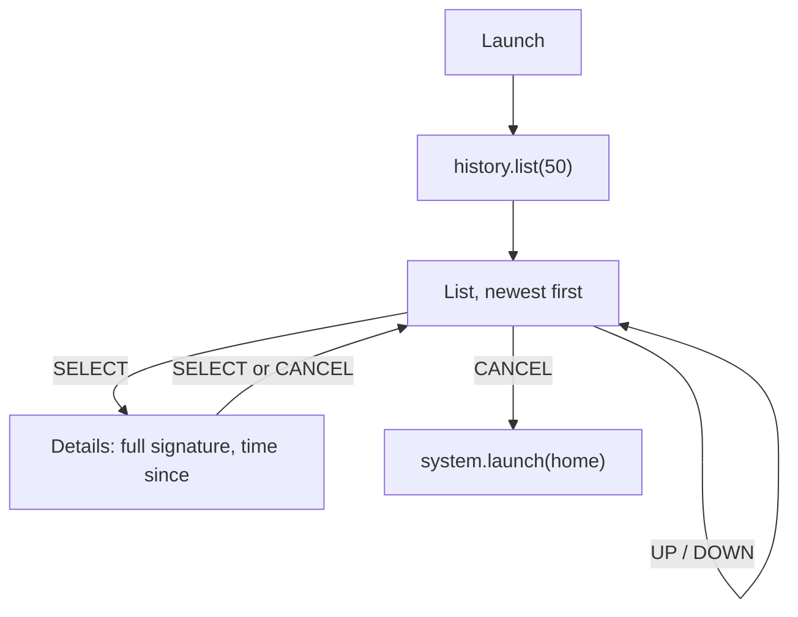

# History app

Purpose: show the payments this badge has made and received, newest first, from a store that the wallet core owns.

Audience: app authors implementing `apps/history`, and demo operators.

Status: design, not yet built on hardware. The app is specified and not written. The reference listing below was syntax-checked with `luac -p` and smoke-tested on a development machine against a mock of the badge API; the mock is not part of the repository. The listing has not run on a badge, and `badge.history` is not yet implemented.

Upstream means Solana OS, `firmware/solana-os/` at commit `812b8c7` of the [upstream repository](https://github.com/spacemandev-git/solana-defcon-badge-26/tree/812b8c7/firmware/solana-os). History is a Lua app [OURS] on the upstream Lua runtime [UPSTREAM `src/lua_sdk/`]; the store behind it is firmware [OURS]. Upstream paths are relative to that directory. Behaviour described here is [OURS] unless tagged otherwise.

## Purpose and requirement

F16 (P2): payment history on the badge.

The history is not kept by any app. It is a firmware store, written by the wallet core at the moment it signs:

| Who | Writes |
|---|---|
| Wallet core | appends an `out` record with status `signed` for **every** transaction it signs |
| [Pay](pay.md) | advances that record to `submitted`, then `confirmed` or `failed` (`history.mark`) |
| [Request](request.md) | adds an `in` record when a payment is confirmed on chain (`history.add`) |
| Wallet core (stretch feature) | sets the receipt flag on an `out` record when a valid co-signed receipt arrives ([receipts.md](receipts.md)) |
| History | reads only (`history.list`) |

Consequence: an app cannot pay without leaving a record, and every signed payment appears even if the app that made it crashed after signing.

## Permissions

`apps/history/app.ini`:

```ini
name=History
permissions=wallet,system
min_api=2
```

| Permission | Used for |
|---|---|
| `wallet` | `history.list` |
| `system` | `system.launch("home")`: CANCEL on the list returns to Home |

History holds no `sign`, `net` or `radio` permission. It cannot ask for a signature, reach the network or use the radio.

## Screens

Two screens: list and details. [OURS] The mockups use the 40-column grid described in [home.md](home.md#screens).

List, newest first. Each row: direction, amount, counterparty name or short address, a tick if the counterparty was verified at the time, status.

```
+----------------------------------------+
| History                             87%|
| > out 10.00 MHacks Merch [v] confirmed |
|   in   2.50 4vJD..BW97       confirmed |
|   out  1.00 DhEb..W511       signed    |
|                                        |
|SELECT details   up/down move   CANCEL..|
+----------------------------------------+
```

The list footer is `SELECT details   up/down move   CANCEL back`: 44 characters, 264 px at size 1. The 40-column frame cannot show it in full; `..` marks where it was cut for the drawing only.

Details (SELECT on a row): the full transaction signature on two lines, and the time since the payment. The footer is `CANCEL back`.

```
+----------------------------------------+
| History                             87%|
| out  10.00 HACK                        |  size 2
| MHacks Merch                           |
| [v] verified                           |
| Gn2GQYmcQkatE2594ov2ELKkYWZHwARG7FiA.. |  counterparty key, 44 characters at size 1
| confirmed            412 s ago         |
| 5VERv8NMvzbJMEkV8xnrLkEaWRtSz9CosKDY.. |  signature, first 44 characters (example value)
| ..                                     |  signature, remaining characters
| CANCEL back                            |
+----------------------------------------+
```

The status line reads `confirmed            412 s ago` for a record written since the last reboot and `confirmed            earlier` for an older one: the badge has no real-time clock, and an uptime from before a reboot cannot be compared with the current uptime. When the record carries a verified co-signed receipt (stretch feature, [receipts.md](receipts.md)), `co-signed` replaces `confirmed`, on the list row and on the details screen.

A base58 transaction signature is up to 88 characters. At size 1 a character is 6 px wide, so 44 characters (264 px) fit on a line and the signature takes two lines. The mockup's 40-column frame cannot show a full 44-character line; `..` marks where it was cut for the drawing only.

`[v]` is a tick drawn with two lines, because the font is ASCII only.

| Key | List | Details |
|---|---|---|
| UP / DOWN | move; the list scrolls | — |
| SELECT | open details | back to the list |
| CANCEL | return to Home | back to the list |

The first row of each mockup is drawn by the app itself; it imitates the shell's status bar, which has no binding. History's header shows the title and the battery level only: the app has neither `net` nor `radio`, so it cannot read the radio state.

## Flow



The list is read once at launch. A payment made afterwards appears the next time History is opened; only one app runs at a time, so nothing can change the store while History is in front except the firmware's own writes.

## The record

Storage is firmware-owned: `/wallet/history.bin`, a ring of 50 records of 160 bytes each (8000 bytes). Apps cannot read the file; `badge.storage` is confined to the app's own directory.

A record is little-endian with fixed offsets:

| Offset | Bytes | Stored field | Seen by Lua as | Meaning |
|---|---|---|---|---|
| 0 | 1 | `dir` | `dir`: `"out"` (0) or `"in"` (1) | direction |
| 1 | 1 | `status` | `status`: `"signed"` (0), `"submitted"` (1), `"confirmed"` (2), `"failed"` (3) | how far the payment got |
| 2 | 1 | `flags` | bit 0 `verified`: boolean; bit 1: `sig` is present; bit 2 `receipt`: boolean | counterparty was verified at the time; the record has a signature; a valid co-signed receipt was received |
| 3 | 1 | `name_len` | length of `name` | 0..32 |
| 4 | 32 | `peer` | `peer`: base58 | counterparty public key |
| 36 | 32 | `name` | `name`: string | counterparty name at the time, zero padded |
| 68 | 8 | `amount` (u64) | `amount`: raw string | raw units |
| 76 | 64 | `sig` | `sig`: base58 string, or `nil` | transaction signature |
| 140 | 4 | `uptime_s` (u32) | `uptime_s`: integer | badge uptime when recorded |
| 144 | 2 | `boot_count` (u16) | `this_boot`: boolean | which boot the record was written in; `this_boot` is true when it equals the current boot's count |
| 146 | 4 | `seq` (u32) | not exposed | 1-based record number, never reused; 0 marks an empty slot |
| 150 | 10 | reserved | — | zero |

The slot of a record is `(seq − 1) % 50`. The newest record is the one with the highest `seq`, found by scanning the 50 slots at boot. `boot_count` is the NVS value `wallet`/`boots` (u16), which `history_begin()` increments at every boot.

The declarations are in [`history.h`](../reference/code/sdk-headers/wallet/history.h); the same layout, with the file's place among the wallet's files, is in [config-limits-audit.md](../wallet-core/config-limits-audit.md).

Time: the badge has no real-time clock, so a record carries uptime, not a date. "Time since" is the current uptime minus `uptime_s`, and it is meaningful only for a record written in the current boot. `history.list` therefore gives each entry a `this_boot` flag. History shows `<n> s ago` only when `this_boot` is true, and `earlier` otherwise.

## API calls

| Call | When | Blocks |
|---|---|---|
| `history.list(50)` | once at launch | no |
| `wallet.info()` | once, for the symbol | no |
| `wallet.format(raw)` | each row | no |
| `sol.short(key)` | rows without a name | no |
| `badge.millis()` | details | no |
| `system.launch("home")` | CANCEL on the list | no (deferred) |
| `gfx.*`, `battery.percent()` | each draw | no |

All are in [api-reference.md](../app-platform/api-reference.md#badgehistory).

## Error states

| Condition | What happens |
|---|---|
| The app lacks `wallet` | `history.list` returns `nil, "denied"`; the listing shows an empty list |
| No payments yet | an empty list |
| Record from an earlier boot (`this_boot` is false) | `earlier` in place of the time since |
| More than 50 payments | the oldest records are overwritten |

## Reference listing

`apps/history/main.lua`, complete: a reference listing, run only against a host mock. Pixel positions are the listing's own choice [OURS].

```lua
-- apps/history/main.lua
local g, wallet, history = badge.gfx, badge.wallet, badge.history

local info = wallet.info()
local items = history.list(50) or {}        -- newest first; nil, "denied" without the wallet permission
local cursor, top, detail = 1, 1, false
local VISIBLE = 12
local HEADER = g.color(0x16, 0x12, 0x24)

local function header(title)                -- no binding exposes the shell's status bar
  g.fill_rect(0, 0, 320, 22, HEADER)
  g.text(title, 8, 7, g.WHITE, 1)
  g.text_right(math.floor(badge.battery.percent()) .. "%", 312, 7, g.MUTED, 1)
end

local function tick(x, y, c)                -- the font is ASCII only
  g.line(x, y + 4, x + 3, y + 7, c)
  g.line(x + 3, y + 7, x + 8, y, c)
end

local function who(e)                       -- counterparty name, or short address
  if e.name and e.name ~= "" then return e.name end
  return e.peer and badge.sol.short(e.peer) or "-"
end

local function status(e)                    -- a verified receipt turns "confirmed" into "co-signed"
  return (e.receipt and e.status == "confirmed") and "co-signed" or e.status
end

local function leave()                      -- back to Home; the launcher if Home is not installed
  if not pcall(badge.system.launch, "home") then badge.system.exit() end
end

function on_button(key, pressed)
  if not pressed then return end
  if detail then
    if key == "b" or key == "a" then detail = false end
  elseif key == "b" then
    leave()
  elseif key == "up" and cursor > 1 then
    cursor = cursor - 1
    if cursor < top then top = cursor end
  elseif key == "down" and cursor < #items then
    cursor = cursor + 1
    if cursor >= top + VISIBLE then top = cursor - VISIBLE + 1 end
  elseif key == "a" and items[cursor] then
    detail = true
  end
end

function on_draw()
  g.clear()
  header("History")
  if detail then
    local e = items[cursor]
    local since = badge.millis() // 1000 - e.uptime_s      -- comparable only when the record is from this boot
    g.text(e.dir .. "  " .. wallet.format(e.amount) .. " " .. info.symbol, 8, 34, g.WHITE, 2)
    g.text(who(e), 8, 60, g.WHITE, 1)
    if e.verified then tick(8, 76, g.SOLANA_GREEN) g.text("verified", 22, 76, g.SOLANA_GREEN, 1) end
    g.text(e.peer or "", 8, 92, g.MUTED, 1)
    g.text(status(e), 8, 112, g.WHITE, 1)
    g.text(e.this_boot and (since .. " s ago") or "earlier", 160, 112, g.MUTED, 1)
    if e.sig then
      g.text(e.sig:sub(1, 44), 8, 136, g.MUTED, 1)          -- a base58 signature is up to 88 characters
      g.text(e.sig:sub(45), 8, 148, g.MUTED, 1)
    end
    g.text("CANCEL back", 8, 228, g.MUTED, 1)
    return
  end
  for row = 0, VISIBLE - 1 do
    local i = top + row
    local e = items[i]
    if not e then break end
    local y = 30 + row * 16
    local c = i == cursor and g.WHITE or g.MUTED
    g.text((i == cursor and "> " or "  ") .. e.dir, 8, y, c, 1)
    g.text_right(wallet.format(e.amount), 112, y, c, 1)
    g.text(who(e):sub(1, 16), 122, y, c, 1)
    if e.verified then tick(226, y, g.SOLANA_GREEN) end
    g.text(status(e), 242, y, c, 1)
  end
  g.text("SELECT details   up/down move   CANCEL back", 8, 228, g.MUTED, 1)
end
```

## Acceptance checks

| Check | Pass when |
|---|---|
| T-F16 | after several payments and a power cycle, History lists them |
| Crash safety | every signed payment appears even if the app that made it crashed after signing (stop Pay with hold-CANCEL right after the approval screen; the record is there with status `signed`) |
| T-F7 | after a completed payment, History is updated on both badges: `out` … `confirmed` on the payer, `in` … `confirmed` on the payee |
| CANCEL | details → list → Home (T-NFR-cancel) |

Procedures are in [acceptance.md](../testing/acceptance.md).

## Requirements covered

- F16: payment history on the badge.
- Guarantee "every signature leaves a record": the wallet core writes the record, not the app.

## Open items

- [UNVERIFIED] The listing has not run on a badge; it was smoke-tested on a host against a mock. Fallback: fix on first push.
