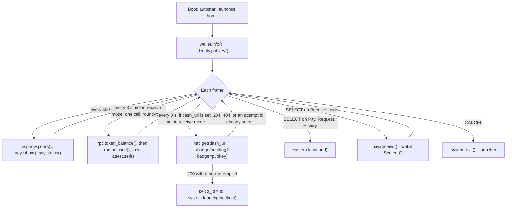

# Home app

Purpose: the badge's first screen. It shows who this badge is and what it holds, and it is the way into Pay, Request, History and receive mode.

Audience: app authors implementing `apps/home`, and demo operators who need to know what the screen should say.

Status: design, not yet built on hardware. The app is specified and not written. The reference listing below was syntax-checked with `luac -p` and smoke-tested on a development machine against a mock of the badge API; the mock is not part of the repository. The listing has not run on a badge, and the wallet modules it calls are not yet implemented.

Upstream means Solana OS, `firmware/solana-os/` at commit `812b8c7` of the [upstream repository](https://github.com/spacemandev-git/solana-defcon-badge-26/tree/812b8c7/firmware/solana-os). Home is a Lua app [OURS] on the upstream Lua runtime [UPSTREAM `src/lua_sdk/`]. Upstream paths are relative to that directory. Behaviour described here is [OURS] unless tagged otherwise.

## Purpose and requirement

Requirement F4 (P0): a Home app that shows the HACK and SOL balance, the badge name and the short address.

Home also carries three things that need a foreground app:

- the menu that launches Pay, Request and History;
- the switch for receive mode (the badge answers presence checks without requesting a payment);
- when a dashboard URL is configured, the poll that launches Checkout for the compromised-laptop demo (badge side of F12).

Home is the autostart app: on first boot the firmware sets the autostart setting to `home` if it is unset [OURS].

## Permissions

`apps/home/app.ini`:

```ini
name=Home
permissions=sign,net,radio,system
min_api=2
```

| Permission | Used for |
|---|---|
| `sign` | `pay.receive` (shows the wallet's receive-mode screen) |
| `net` | `rpc.token_balance`, `rpc.balance`, `attest.self`, `http.get`, `wifi.connected` |
| `radio` | `espnow.peers`, `espnow.enabled`, `pay.inbox`, `pay.status`, `pay.receive`, `pay.cancel` |
| `system` | `system.launch` |

Home never calls `identity.sign`. It holds `sign` only for receive mode.

## Screens

One screen. Mockups in the app documents use a 40-column grid in which one cell is about 8 px, the same convention as the wallet screens in [screens.md](../wallet-core/screens.md). Size-1 text is 6 px per character, so a real row holds up to 53 characters.

```
+----------------------------------------+
| Home                       WiFi NOW 87%|
| MHacks Merch   [v] verified            |  attested name, else device name + status
| Gn2G..Ecxq     key: software           |
|                                        |
|   1000.00 HACK                         |  size 3
|   0.0500 SOL                           |  size 2
|                                        |
| > Pay              2 badges nearby     |
|   Request                              |
|   History                              |
|   Receive mode     off                 |
| ! badge-51A0 asks 10.00 HACK           |  when pay.inbox() is not empty
| SELECT open  up/down move  CANCEL menu |
+----------------------------------------+
```

| Element | Source |
|---|---|
| Name | `attest.self().name` when the status is `verified`; otherwise `badge.device_name` |
| Status | `attest.self().status`, written with the wallet's identity-line strings: `verified`, `UNVERIFIED`, `NAME MISMATCH`, `REVOKED`, `EXPIRED`, `NOT CHECKED`. `[v]` is a tick drawn with two lines (the font is ASCII only) and appears only with `verified` |
| Short address | `sol.short(identity.pubkey())` |
| `key:` | `identity.source()`: `key: secure element`, `key: software` or `key: none` |
| HACK balance | `wallet.format(rpc.token_balance())`, size 3 |
| SOL balance | `rpc.balance()` is lamports as a string; shown with 4 decimals, size 2 |
| `2 badges nearby` | number of entries in `espnow.peers()` |
| `Receive mode  off` / `on` | `pay.status().state == "receive"` |
| `! <name> asks <amount> HACK` | first entry of `pay.inbox()` (strongest signal); a notice, shown only when the inbox is not empty |
| Footer | `SELECT open  up/down move  CANCEL menu` |

Keys:

| Key | Action |
|---|---|
| UP / DOWN | move the cursor over the four rows |
| SELECT on Pay, Request, History | `system.launch("pay")`, `"request"`, `"history"` |
| SELECT on Receive mode | off → `pay.receive()` (the wallet's [Screen G](../wallet-core/screens.md#screen-g) asks for confirmation); on → `pay.cancel()` |
| CANCEL | `system.exit()`: opens the launcher |

Receive mode lasts only while Home is in front. A payment session closes when the app that opened it stops, so launching Pay from Home ends receive mode [OURS: a session must not outlive the screen that explained it].

The first row of the mockup is drawn by the app itself; it imitates the shell's status bar, which has no binding. Each app draws its own 22-px header: the title at x=8, y=7, and right-aligned radio and battery text from `wifi.connected()`, `espnow.enabled()` and `battery.percent()`, as far as its permissions allow.

While receive mode is on, the balances are drawn greyed with `stale`: Home makes no network call during a session (see [Flow](#flow)).

## Flow



Refresh rule: one RPC call per 3 s, round-robin over token balance, SOL balance and own attestation, so no frame stalls for more than one timeout. Each value is therefore refreshed every 9 s; the badge's own attestation is served from the cache when the cache entry is younger than its 30 s lifetime.

Dashboard poll: if `wallet.info().dash_url` is not empty, Home polls `GET {dash_url}/badge/pending?badge=<pubkey>` every 3 s with a 1500 ms timeout. Status 204 means nothing is pending; 404 means the badge's key is not in the dashboard's badge list. On status 200 Home decodes the body with `json.decode` and compares the attempt's `id` with the id it stored under its own key/value key `co_id`. Only a new id launches `checkout`; Home then stores it. The listener returns the same pending attempt on every poll until it is resolved, so without this memory Home would relaunch Checkout for an attempt that Checkout has already handled. Checkout keeps its own record of handled attempts (its key `last`); the two stores are separate because an app can read only its own keys. The protocol is in [checkout.md](checkout.md) and [dashboard.md](../integration/dashboard.md).

Receive mode: Home makes no network call while receive mode is on. A payee must not block its main loop while a session is open, because a blocked loop answers presence checks late ([timing](../protocol/payment-protocol.md#timing)). The balances stay on screen, greyed, with `stale`; the RPC round-robin and the dashboard poll resume when the session ends.

Coming back: Pay, Request, History and Checkout return to Home with `system.launch("home")` when the user leaves their top screen, so Home is the hub and the launcher is one CANCEL further out.

## API calls

| Call | When | Blocks |
|---|---|---|
| `wallet.info()` | once at load | no |
| `identity.pubkey()`, `identity.source()` | at load, each draw | no |
| `rpc.token_balance()` | every 9 s | up to 4 s |
| `rpc.balance()` | every 9 s | up to 4 s |
| `attest.self()` | every 9 s | up to 4 s when it fetches |
| `espnow.peers()`, `pay.inbox()`, `pay.status()` | every 500 ms | no |
| `http.get(url, 1500)` | every 3 s when `dash_url` is set | up to 1.5 s |
| `json.decode(body)` | dashboard poll returned 200 | no |
| `storage.kv.get("co_id")`, `storage.kv.set("co_id", id)` | dashboard poll returned 200 | no |
| `system.launch(id)` | SELECT on a row; dashboard poll returned 200 with a new attempt id | no (deferred) |
| `pay.receive()` | SELECT on Receive mode | until the user decides on Screen G |
| `pay.cancel()` | SELECT on Receive mode when it is on | no |
| `system.exit()` | CANCEL | no (deferred) |
| `wallet.format`, `sol.short`, `gfx.*`, `battery.percent`, `wifi.connected`, `espnow.enabled` | each draw | no |

All are in [api-reference.md](../app-platform/api-reference.md).

## Error states

| Condition | What the screen shows |
|---|---|
| `no_network` from an RPC call | `No Wi-Fi: Settings > Wi-Fi` in place of the balances |
| `not_ready` (mint not configured, or no identity) | `Wallet not configured` in place of the balances |
| any other RPC error (`timeout`, `io`, `rpc`, `parse`) | the last value, greyed, with `stale` |
| receive mode is on | the last values, greyed, with `stale`; no network call is made |
| this badge has no HACK token account yet | `0.00 HACK`: a missing token account is a balance of zero, not an error |
| own attestation could not be checked | status `NOT CHECKED` (the attestation result is `unknown`) |
| `system.launch` of an app that is not installed | the Lua error text (`no such app: <id>`) on one line |
| `pay.receive` returns `rejected` | nothing; receive mode stays off |
| `pay.receive` returns another error | the error name on one line |

Devnet may rate-limit four badges polling at once [UNVERIFIED; fallback: Home already makes at most one RPC call per 3 s; back off further on HTTP 429].

## Reference listing

`apps/home/main.lua`, complete: a reference listing, run only against a host mock. Pixel positions are the listing's own choice [OURS]; the strings are fixed by the design.

```lua
-- apps/home/main.lua
local g, id, wallet, rpc, attest, pay =
  badge.gfx, badge.identity, badge.wallet, badge.rpc, badge.attest, badge.pay

local POLL_MS = 3000
local ROWS    = { "Pay", "Request", "History", "Receive mode" }
local TARGET  = { "pay", "request", "history" }          -- app ids behind the first three rows
local STATUS  = { verified = "verified", unverified = "UNVERIFIED", mismatch = "NAME MISMATCH",
                  revoked = "REVOKED", expired = "EXPIRED", unknown = "NOT CHECKED" }
local KEY     = { se050 = "secure element", software = "software", none = "none" }
local HEADER  = g.color(0x16, 0x12, 0x24)

local info, me = wallet.info(), id.pubkey()
local hack, sol, who = nil, nil, nil                      -- last good values
local stale, note = false, nil
local banner = (not info.ready) and "Wallet not configured" or nil
local step, next_rpc, next_dash, next_scan = 1, 0, 1500, 0
local cursor, peers, inbox, session = 1, 0, {}, "idle"

local function header(title)                              -- no binding exposes the shell's status bar
  local right = (badge.wifi.connected() and "WiFi " or "wifi ")
    .. (badge.espnow.enabled() and "NOW " or "") .. math.floor(badge.battery.percent()) .. "%"
  g.fill_rect(0, 0, 320, 22, HEADER)
  g.text(title, 8, 7, g.WHITE, 1)
  g.text_right(right, 312, 7, g.MUTED, 1)
end

local function tick(x, y, c)                              -- the font is ASCII only
  g.line(x, y + 6, x + 4, y + 10, c)
  g.line(x + 4, y + 10, x + 11, y + 1, c)
end

local function refresh()                                  -- one RPC call per call, round-robin
  local value, err
  if step == 1 then
    value, err = rpc.token_balance()
    if value then hack = wallet.format(value) end
  elseif step == 2 then
    value, err = rpc.balance()
    if value then sol = wallet.format(value, 9):sub(1, -6) end   -- lamports: 9 decimals, show 4
  else
    value, err = attest.self()
    if value then who = value end
  end
  step = step % 3 + 1
  if value then
    stale, banner = false, nil
  elseif err == "no_network" then
    banner = "No Wi-Fi: Settings > Wi-Fi"
  elseif err == "not_ready" then
    banner = "Wallet not configured"
  else
    stale = true                                          -- keep the last value, greyed
  end
end

local function poll_dashboard()
  local status, body = badge.http.get(info.dash_url .. "/badge/pending?badge=" .. me, 1500)
  if status ~= 200 then return end                        -- 204 nothing pending; 404 key not in the badge list
  local a = badge.json.decode(body)
  if not a or a.id == badge.storage.kv.get("co_id") then return end   -- Checkout was already launched for this attempt
  local ok, err = pcall(badge.system.launch, "checkout")
  if ok then badge.storage.kv.set("co_id", a.id) else note = err end
end

function on_update(dt)
  local now = badge.millis()
  if now >= next_scan then
    next_scan = now + 500
    peers, inbox, session = #badge.espnow.peers(), pay.inbox(), pay.status().state
  end
  if session == "receive" or not me then return end       -- a payee must not block while a session is open
  if now >= next_rpc then
    next_rpc = now + POLL_MS
    refresh()
  elseif info.dash_url ~= "" and now >= next_dash then
    next_dash = now + POLL_MS
    poll_dashboard()
  end
end

function on_button(key, pressed)
  if not pressed then return end
  if key == "up" then
    cursor = cursor > 1 and cursor - 1 or #ROWS
  elseif key == "down" then
    cursor = cursor < #ROWS and cursor + 1 or 1
  elseif key == "b" then
    badge.system.exit()                                   -- CANCEL opens the launcher
  elseif key == "a" then
    note = nil
    if TARGET[cursor] then
      local ok, err = pcall(badge.system.launch, TARGET[cursor])
      if not ok then note = err end
    elseif session == "receive" then
      pay.cancel()
      session = "idle"
    else
      local ok, err = pay.receive()                       -- wallet screen G; blocks until the user decides
      if ok then session = "receive" elseif err ~= "rejected" then note = err end
    end
  end
end

function on_draw()
  g.clear()
  header("Home")

  local verified = who ~= nil and who.status == "verified"
  local name = verified and who.name or badge.device_name
  g.text(name, 8, 30, g.WHITE, #name <= 16 and 2 or 1)
  if who then
    if verified then tick(212, 31, g.SOLANA_GREEN) end
    g.text(STATUS[who.status] or who.status, 228, 34, verified and g.SOLANA_GREEN or g.ORANGE, 1)
  end
  g.text(me and badge.sol.short(me) or "no identity", 8, 52, g.MUTED, 1)
  g.text("key: " .. (KEY[id.source()] or "?"), 120, 52, g.MUTED, 1)

  if banner then
    g.text(banner, 24, 84, g.ORANGE, 1)
  else
    local old = stale or session == "receive"             -- no refresh while receive mode is on
    local c = old and g.MUTED or g.WHITE
    g.text((hack or "--") .. " " .. info.symbol, 24, 70, c, 3)
    g.text((sol or "--") .. " SOL", 24, 100, c, 2)
    if old then g.text("stale", 272, 78, g.ORANGE, 1) end
  end

  for i, label in ipairs(ROWS) do
    local y = 126 + (i - 1) * 16
    g.text((i == cursor and "> " or "  ") .. label, 8, y, i == cursor and g.WHITE or g.MUTED, 1)
  end
  g.text(peers .. " badges nearby", 160, 126, g.MUTED, 1)
  g.text(session == "receive" and "on" or "off", 160, 174, g.MUTED, 1)

  local r = inbox[1]                                      -- strongest signal first
  if r then
    g.text("! " .. r.name .. " asks " .. wallet.format(r.amount) .. " " .. info.symbol, 8, 196, g.ORANGE, 1)
  end
  if note then g.text(note, 8, 210, g.RED, 1) end
  g.text("SELECT open  up/down move  CANCEL menu", 8, 228, g.MUTED, 1)
end
```

## Acceptance checks

| Check | Pass when |
|---|---|
| T-F4 | on a badge booted on the hotspot, Home shows correct HACK and SOL within 10 s |
| Name and status | they match the dashboard's Badges page for this badge |
| Short address | it matches Settings → Identity |
| Menu | SELECT on each of Pay, Request, History opens that app |
| CANCEL | opens the launcher; holding CANCEL 1.5 s also leaves (T-NFR-cancel) |
| Pre-event checklist | "Confirm a badge reaches devnet RPC through a phone hotspot": balances appear and the serial log shows no `[rpc]` errors |

Procedures are in [acceptance.md](../testing/acceptance.md).

## Requirements covered

- F4: HACK and SOL balance, badge name, short address.
- F6, F9 (in part): receive mode switch, and the notice that a nearby badge is asking for payment.
- F12 (badge side, in part): the dashboard poll that launches Checkout.
- NFR "judge UX": the footer names SELECT and CANCEL; CANCEL always leaves.
- NFR "honesty": the `key:` line says where the key lives.

## Open items

- [UNVERIFIED] The listing has not run on a badge; it was smoke-tested on a host against a mock. Fallback: fix on first push.
- [UNVERIFIED] RPC latency through the hotspot and devnet rate limits with four badges polling. Fallback: lengthen the 3 s interval; configure another RPC URL.
- [UNVERIFIED] Whether the phone hotspot lets the badge reach the laptop's listener (client isolation). Fallback: the dashboard's manual "Mark rejected" button.
