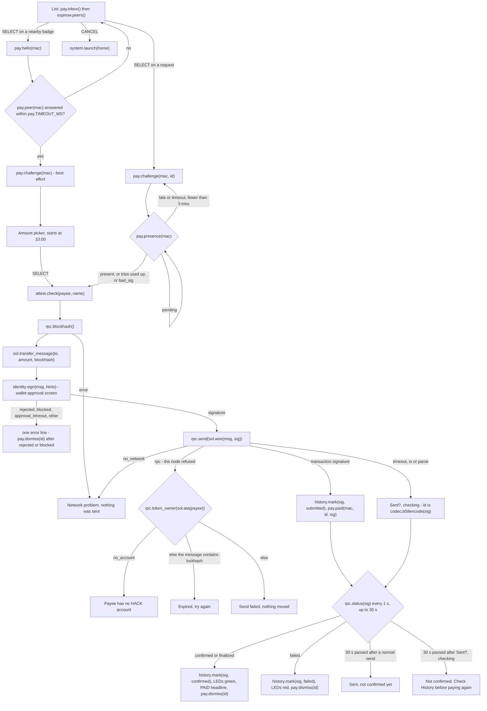

# Pay app

Purpose: the payer's app. It lists payment requests and nearby badges, runs the presence and identity checks, asks the wallet for a signature, submits the transaction and waits for confirmation.

Audience: app authors implementing `apps/pay`, and demo operators who need to know each screen and each failure line.

Status: design, not yet built on hardware. The app is specified and not written. The reference listing below was syntax-checked with `luac -p` and smoke-tested on a development machine against a mock of the badge API; the mock is not part of the repository. The listing has not run on a badge, and the wallet modules it calls are not yet implemented.

Upstream means Solana OS, `firmware/solana-os/` at commit `812b8c7` of the [upstream repository](https://github.com/spacemandev-git/solana-defcon-badge-26/tree/812b8c7/firmware/solana-os). Pay is a Lua app [OURS]; peer discovery uses the upstream ESP-NOW peer table [UPSTREAM `src/lua_sdk/lib_espnow.cpp:84-123`]. Upstream paths are relative to that directory. Behaviour described here is [OURS] unless tagged otherwise.

## Purpose and requirement

- F5 (P0): pick a nearby badge, strongest signal first, and choose an amount with the D-pad.
- F7 (P0): submit to devnet, poll for confirmation, flash the LEDs (payer side).
- It is also where F8 to F11 become visible to the payer: a signed request is listed, a presence check runs, and the wallet's approval screen shows the identity and presence result.

Pay decides nothing about trust. It gathers inputs and passes hints; the wallet core decodes the transaction, checks identity and presence in its own tables, and draws its own screen. If Pay were replaced by a hostile app, the approval screen would still tell the truth.

## Permissions

`apps/pay/app.ini`:

```ini
name=Pay
permissions=sign,net,radio,wallet,system
min_api=2
```

| Permission | Used for |
|---|---|
| `sign` | `identity.sign` |
| `net` | `attest.check`, `rpc.blockhash`, `rpc.send`, `rpc.status`, `rpc.token_owner`, `wifi.connected` |
| `radio` | `espnow.peers`, `espnow.enabled`, `pay.inbox`, `pay.hello`, `pay.peer`, `pay.challenge`, `pay.presence`, `pay.paid`, `pay.dismiss` |
| `wallet` | `history.mark` |
| `system` | `system.launch("home")` |

Pay holds `system` for one call: CANCEL on its first screen returns to Home with `system.launch("home")`. If Home is not installed the listing falls back to `system.exit()`, which opens the launcher.

## Screens

Four screens: (1) list, (2) amount picker, (3) progress, (4) result. The mockups use the 40-column grid described in [home.md](home.md#screens).

List and amount picker:

```
+----------------------------------------+   +----------------------------------------+
| Pay                        WiFi NOW 87%|   | Pay                        WiFi NOW 87%|
| REQUESTS                               |   |  to badge-51A0                         |
| > MHacks Merch    10.00 HACK    |||||  |   |                                        |
| NEARBY                                 |   |        10.00 HACK                      |
|   badge-51A0                    ||||   |   |                                        |
|   badge-9C03                    ||     |   |  up/down 1.00     left/right 10.00     |
|                                        |   |  limit 100.00                          |
| SELECT choose  up/down  CANCEL back    |   | SELECT continue          CANCEL back   |
+----------------------------------------+   +----------------------------------------+
```

List:

- `REQUESTS`: pending payment requests from `pay.inbox()`, strongest signal first. Only requests whose signature verified, that are for the configured token, within their lifetime and not already answered are in the inbox.
- `NEARBY`: badges from `espnow.peers()`, strongest signal first, with signal bars. A badge that already appears under `REQUESTS` is not repeated.
- Signal bars use the shell's thresholds [UPSTREAM `shell.cpp:214-221`]: −50 dBm or better five bars, −60 four, −70 three, −80 two, −90 one, weaker none. Whether these steps tell badges apart at table distance is unmeasured [UNVERIFIED; fallback: show the RSSI number instead].
- UP / DOWN move, SELECT chooses, CANCEL returns to Home.

Amount picker (only for a payment the payer starts; a request carries its own amount). It starts at `10.00`.

| Key | Change |
|---|---|
| UP / DOWN | ± 1.00 |
| LEFT / RIGHT | ± 10.00 |
| Range | 0.01 to `cap` (100.00 by default) |
| SELECT | continue |
| CANCEL | back to the list |

Progress and failure. Six lines, each ticked as it completes; a failure is the same screen with one more line. [OURS]

```
+----------------------------------------+   +----------------------------------------+
| Pay                        WiFi NOW 87%|   | Pay                        WiFi NOW 87%|
| 10.00 HACK to MHacks Merch             |   | 10.00 HACK to MHacks Merch             |
|                                        |   |                                        |
| [v] Badge is present                   |   | [v] Badge is present                   |
| [v] Identity checked                   |   | [v] Identity checked                   |
| [v] Transaction built                  |   | [v] Transaction built                  |
| [ ] Approved on badge                  |   | [x] Approved on badge                  |
| [ ] Sent                               |   | [ ] Sent                               |
| [ ] Confirmed                          |   | [ ] Confirmed                          |
|                                        |   | You cancelled                          |
| CANCEL back                            |   | CANCEL back                            |
+----------------------------------------+   +----------------------------------------+
```

Success. The headline is `PAID 10.00 HACK`, the second line is `to <name or short address>`, and the six ticked lines stay below. [OURS]

```
+----------------------------------------+
| Pay                        WiFi NOW 87%|
| PAID 10.00 HACK                        |  size 2, green
| to MHacks Merch                        |
| [v] Badge is present                   |
| [v] Identity checked                   |
| [v] Transaction built                  |
| [v] Approved on badge                  |
| [v] Sent                               |
| [v] Confirmed                          |
|                                        |
| CANCEL back                            |
+----------------------------------------+
```

`[v]`, `[x]` and `[ ]` stand for a tick, a cross and no glyph yet; the glyphs are drawn with lines because the font is ASCII only.

Between "Transaction built" and "Approved on badge" the wallet core owns the screen. Which wallet screen appears depends on what firmware found:

| Firmware result | Wallet screen | Gesture |
|---|---|---|
| verified payee, presence proven | [Screen A](../wallet-core/screens.md#screen-a), green | press SELECT |
| unverified payee, or presence not checked | [Screen B](../wallet-core/screens.md#screen-b), amber | hold SELECT 2 s |
| name mismatch, revoked, not present, or the app's amount differs from the transaction | [Screen C](../wallet-core/screens.md#screen-c), red | signing blocked; CANCEL closes |
| amount above `cap` | [Screen D](../wallet-core/screens.md#screen-d) follows | hold SELECT 2 s |
| the bytes are not a HACK transfer from this badge | [Screen E](../wallet-core/screens.md#screen-e) | CANCEL closes |
| identity cache is stale | [Screen H](../wallet-core/screens.md#screen-h) first | wait, or CANCEL |

The first row of each mockup is drawn by the app itself; it imitates the shell's status bar, which has no binding.

## Flow



Flow for a request, in words:

1. `pay.challenge(mac, id)`, then wait on `pay.presence(mac)`. Retry with a new nonce on `late` or `timeout`, up to 3 attempts.
2. `attest.check(payee, name)`.
3. `rpc.blockhash()`.
4. `sol.transfer_message{to = payee, amount, blockhash}`.
5. `identity.sign(msg, {recipient = payee, claimed_name = name, claimed_amount = amount, request_id = id})`.
6. `rpc.send(sol.wire(msg, sig))`. If the node refuses, classify the refusal (below) and stop.
7. `history.mark(sig, "submitted")`, then `pay.paid(mac, id, sig)`.
8. Poll `rpc.status(sig)` every 1 s for 30 s.
9. `history.mark(sig, "confirmed")` or `"failed"`, LEDs, `pay.dismiss(id)`. On success the headline becomes `PAID <amount> HACK`.

Classifying a refused send. `rpc.send` does not interpret the node's preflight error; it returns `nil, "rpc", <node message, first 96 characters>`. Pay classifies only **after** a failed send, so a payment that goes through pays for no extra call:

1. `rpc.token_owner(sol.ata(payee))` returns `nil, "no_account"` → `Payee has no HACK account`.
2. Otherwise the message contains `lockhash` (this matches "Blockhash not found" with either case of the first letter) → `Expired, try again`. [UNVERIFIED: the node's exact wording; the fallback is line 3]
3. Otherwise → `Send failed, nothing moved`.

A send that got no answer. A `timeout` or `io` from `rpc.send` may have reached the node. Pay keeps the transaction id, which is `codec.b58encode(sig)`, shows `Sent?, checking`, and polls `rpc.status` for 30 s. Confirmed → the success screen. Otherwise → `Not confirmed. Check History before paying again`; the wallet's own `signed` record is in History either way. The listing treats `parse` (an answer that could not be read) the same way [OURS]. In this case the PAID hint to the payee is held back until the chain confirms.

Flow for a nearby badge: `pay.hello(mac)` → `pay.peer(mac)` → `pay.challenge(mac)` (best effort) → amount picker → the same from `attest.check`. There is no request id, so the hints carry none.

Things the flow relies on:

- **One blocking step per frame.** Each network call may take 4 s and a callback may extend its budget by at most 12 s. The listing runs one step per `on_update`, which also lets the progress screen redraw between steps.
- **The presence result does not gate the app.** If the proof is late, missing or wrong, Pay shows the state next to the first line and carries on to the wallet. Pay never blocks a payment itself; the wallet's red screen does. The wallet looks the payee up in its own presence table and shows `NOT PRESENT` in red, with signing blocked. This is what makes the failure visible on the wallet screen and not only in the app.
- **A peer that is not in receive mode does not answer the challenge.** No proof means the wallet shows `presence not checked` (amber) for a payer-initiated payment. With a request id, a missing proof is `NOT PRESENT` (red).
- **`request_id` binds the payment to the request.** The wallet requires the transaction's amount and recipient to equal the request's; otherwise it shows `does not match the request`.
- **The wallet records the payment itself.** It appends an `out`/`signed` history record when it signs. Pay only advances the status, so a payment is in History even if Pay crashes after signing.
- **`pay.paid` is a courtesy.** It tells the payee which transaction to look up. The payee confirms on chain and never trusts it alone.
- LED colours: success `(20, 241, 149)`, failure `(255, 69, 69)`.

Protocol details: [payer state machine](../protocol/payment-protocol.md#payer-state-machine), [sequences](../protocol/payment-protocol.md#sequences). Transaction bytes and RPC bodies: [transaction-building.md](../protocol/transaction-building.md).

## API calls

| Call | Step | Blocks |
|---|---|---|
| `pay.inbox()`, `espnow.peers()` | list, every 500 ms | no |
| `pay.challenge(mac, id)` / `pay.challenge(mac)` | presence | no |
| `pay.presence(mac)` | presence, each frame | no |
| `pay.hello(mac)`, `pay.peer(mac)` | nearby badge | no |
| `attest.check(payee, name)` | identity | up to 4 s when it fetches |
| `rpc.blockhash()` | build | up to 4 s |
| `sol.transfer_message{to=, amount=, blockhash=}` | build | no |
| `identity.sign(msg, hints)` | approval | until the user decides, at most 60 s |
| `sol.wire(msg, sig)`, `rpc.send(wire)` | send | up to 4 s |
| `sol.ata(payee)`, `rpc.token_owner(token_account)` | only after the node refused the send | up to 4 s |
| `codec.b58encode(sig)` | only after a send that got no answer | no |
| `history.mark(sig, status)` | after send, after confirmation | no |
| `pay.paid(mac, id, sig)` | after send | no |
| `rpc.status(sig)` | confirmation, every 1 s for 30 s | up to 4 s |
| `pay.dismiss(id)` | end of a request | no |
| `led.take()`, `led.pulse(r, g, b, ms)` | start, result | no |
| `system.launch("home")` | CANCEL on the list | no (deferred) |
| `wallet.info()`, `wallet.format(raw)`, `gfx.*`, `battery.percent()`, `wifi.connected()`, `espnow.enabled()` | throughout | no |

All are in [api-reference.md](../app-platform/api-reference.md). `sig` in `history.mark`, `pay.paid` and `rpc.status` is the base58 transaction signature that `rpc.send` returned; the 64 raw bytes from `identity.sign` go into `sol.wire`, and through `codec.b58encode` they give the same base58 signature when `rpc.send` returned none.

## Error states

Each is shown as one line plus `CANCEL back`.

| Condition | Line | Money moved? |
|---|---|---|
| presence `late`, `timeout` or `bad_sig` | the state name beside "Badge is present"; the flow continues and the wallet shows red `NOT PRESENT` | no |
| nearby badge did not answer `pay.hello` | `timeout`, back on the list | no |
| `rpc.blockhash` fails | `Network problem, nothing was sent` | no |
| `rejected` | `You cancelled` | no |
| `blocked` | `Blocked by the wallet` | no |
| `approval_timeout` | `No answer in 60 s, nothing was signed` | no |
| any other signing error | `Not signed: <error name>` | no |
| `rpc.send` returns `no_network` | `Network problem, nothing was sent` | no |
| `rpc.send` returns `rpc`, and the payee's token account does not exist | `Payee has no HACK account` | no |
| `rpc.send` returns `rpc`, and the node's message contains `lockhash` | `Expired, try again` | no |
| `rpc.send` returns `rpc`, anything else | `Send failed, nothing moved` | no |
| `rpc.send` returns `timeout` or `io` | `Sent?, checking`; then the success screen, or after 30 s `Not confirmed. Check History before paying again` | unknown until confirmed |
| sent, but not confirmed within 30 s | `Sent, not confirmed yet` | unknown; check History later |
| transaction failed on chain | `failed`, LEDs red | no |

After any of these, CANCEL returns to the list. A rejected, blocked or completed request is dismissed, so it is not listed again; a request that failed on the network, was refused by the node, or was not signed in time stays listed and can be retried.

The per-function error lists behind this table are in [api-reference.md](../app-platform/api-reference.md#badgepay).

## Reference listing

`apps/pay/main.lua`, complete: a reference listing, run only against a host mock. Pixel positions are the listing's own choice [OURS].

```lua
-- apps/pay/main.lua
local g, pay, rpc, sol, id, attest, wallet, history =
  badge.gfx, badge.pay, badge.rpc, badge.sol, badge.identity, badge.attest, badge.wallet, badge.history

local info = wallet.info()
local UNIT = 1
for _ = 1, info.decimals do UNIT = UNIT * 10 end                       -- raw units in 1.00
local CAP = #info.cap <= 9 and math.tointeger(tonumber(info.cap)) or 999999999   -- picker bound, fits 32 bits

local LINES = { "Badge is present", "Identity checked", "Transaction built",
                "Approved on badge", "Sent", "Confirmed" }
local TEXT  = { rejected = "You cancelled", blocked = "Blocked by the wallet",
                approval_timeout = "No answer in 60 s, nothing was signed" }
local MAYBE = { timeout = true, io = true, parse = true }              -- rpc.send errors after which the node may hold the transaction
local HEADER = g.color(0x16, 0x12, 0x24)

local screen = "list"            -- list | hello | amount | progress
local rows, nreq, cursor, next_scan = {}, 0, 1, 0
local t = nil                    -- the payment in hand: mac, id, payee, name, amount, msg, sig, txid
local amount = 10 * UNIT         -- picker value in raw units; a Lua integer because it is bounded by CAP
local mark, result, done, paid, note = {}, nil, false, false, nil
local steps, at = {}, 0

local function header(title)                                           -- no binding exposes the shell's status bar
  local right = (badge.wifi.connected() and "WiFi " or "wifi ")
    .. (badge.espnow.enabled() and "NOW " or "") .. math.floor(badge.battery.percent()) .. "%"
  g.fill_rect(0, 0, 320, 22, HEADER)
  g.text(title, 8, 7, g.WHITE, 1)
  g.text_right(right, 312, 7, g.MUTED, 1)
end

local function bars(rssi)                                              -- the shell's thresholds: -50, -60, -70, -80, -90 dBm
  local n = rssi >= -50 and 5 or rssi >= -60 and 4 or rssi >= -70 and 3 or rssi >= -80 and 2 or rssi >= -90 and 1 or 0
  return string.rep("|", n)
end

local function leave()                                                 -- back to Home; the launcher if Home is not installed
  if not pcall(badge.system.launch, "home") then badge.system.exit() end
end

local function scan()                                                  -- requests first, then peers, strongest first
  local seen = {}
  rows = {}
  for _, r in ipairs(pay.inbox()) do
    seen[r.mac] = true
    rows[#rows + 1] = { id = r.id, mac = r.mac, payee = r.payee, name = r.name, amount = r.amount, rssi = r.rssi }
  end
  nreq = #rows
  for _, p in ipairs(badge.espnow.peers()) do
    if not seen[p.mac] then rows[#rows + 1] = { mac = p.mac, name = p.name, rssi = p.rssi } end
  end
  cursor = math.max(1, math.min(cursor, #rows))
end

-- End of a flow. `terminal` moves the request to the replay ring so it is not listed again.
local function stop(text, terminal)
  steps, at, result, done = {}, 0, text, true
  if terminal and t.id then pay.dismiss(t.id) end
  return false
end

-- Steps: one per frame. Return true to advance, false to run again next frame.
local function s_presence()
  local state = pay.presence(t.mac)
  if state == "pending" then return false end
  if state == "present" then mark[1] = true return true end
  if not t.id then return true end                                     -- peer path: best effort, stays unticked
  if state ~= "bad_sig" and t.tries < 3 then                           -- none, late, timeout: new nonce
    t.tries = t.tries + 1
    pay.challenge(t.mac, t.id)
    return false
  end
  mark[1], t.presence = false, state                                   -- carry on: the wallet's screen decides
  return true
end

local function s_identity()
  local a = attest.check(t.payee, t.name)                              -- advisory; the wallet checks again
  mark[2] = a ~= nil
  return true
end

local function s_build()
  local bh = rpc.blockhash()
  if not bh then return stop("Network problem, nothing was sent") end
  local msg, err = sol.transfer_message{ to = t.payee, amount = t.amount, blockhash = bh }
  if not msg then return stop(err) end
  t.msg, mark[3] = msg, true
  return true
end

local function s_sign()                                                -- blocks on the wallet's approval screen
  local sig, err = id.sign(t.msg, { recipient = t.payee, claimed_name = t.name,
                                    claimed_amount = t.amount, request_id = t.id })
  if not sig then
    mark[4] = false
    return stop(TEXT[err] or ("Not signed: " .. err), err == "rejected" or err == "blocked")
  end
  t.sig, mark[4] = sig, true
  return true
end

local function s_send()
  local txid, err, message = rpc.send(sol.wire(t.msg, t.sig))
  if txid then
    t.txid, mark[5] = txid, true
    history.mark(txid, "submitted")
    if t.id then pay.paid(t.mac, t.id, txid) end
  elseif MAYBE[err] then                                               -- no answer: the node may still have it
    t.txid, t.unsure, result = badge.codec.b58encode(t.sig), true, "Sent?, checking"
  elseif err == "rpc" then                                             -- the node refused; s_why finds the reason
    t.refused, mark[5] = message or "", false
  else
    mark[5] = false
    return stop("Network problem, nothing was sent")
  end
  t.until_ms, t.next_poll = badge.millis() + 30000, 0
  return true
end

local function s_why()                                                 -- classify a refusal; one more call, only on failure
  if not t.refused then return true end
  local owner, err = rpc.token_owner(sol.ata(t.payee))
  if not owner and err == "no_account" then return stop("Payee has no HACK account") end
  if t.refused:find("lockhash", 1, true) then return stop("Expired, try again") end
  return stop("Send failed, nothing moved")
end

local function s_confirm()                                             -- poll every 1 s for 30 s
  local now = badge.millis()
  if now < t.next_poll then return false end
  t.next_poll = now + 1000
  local s = rpc.status(t.txid)
  if s == "confirmed" or s == "finalized" then
    if t.unsure and t.id then pay.paid(t.mac, t.id, t.txid) end        -- the hint was held back until the chain answered
    history.mark(t.txid, "confirmed")
    mark[5], mark[6], paid = true, true, true
    badge.led.pulse(20, 241, 149, 900)
    return stop(nil, true)
  elseif s == "failed" then
    history.mark(t.txid, "failed")
    mark[5], mark[6] = true, false
    badge.led.pulse(255, 69, 69, 900)
    return stop(s, true)
  elseif now >= t.until_ms then
    if t.unsure then return stop("Not confirmed. Check History before paying again") end
    return stop("Sent, not confirmed yet", true)
  end
  return false
end

local function begin()                                                 -- t.payee, t.name, t.amount are set
  screen, mark, result, done, paid = "progress", {}, nil, false, false
  steps, at = { s_presence, s_identity, s_build, s_sign, s_send, s_why, s_confirm }, 1
end

function on_start() badge.led.take() end

function on_update(dt)
  local now = badge.millis()
  if screen == "list" and now >= next_scan then
    next_scan = now + 500
    scan()
  elseif screen == "hello" then
    local p = pay.peer(t.mac)
    if p then
      t.payee, t.name = p.pubkey, p.name
      pay.challenge(t.mac)                                             -- best effort; answered only in receive mode
      screen = "amount"
    elseif now >= t.until_ms then
      screen, note = "list", "timeout"                                 -- the peer did not answer
    end
  elseif screen == "progress" then
    local step = steps[at]
    if step and step() then at = at + 1 end
  end
end

function on_button(key, pressed)
  if not pressed then return end
  if screen == "list" then
    if key == "up" and cursor > 1 then cursor = cursor - 1
    elseif key == "down" and cursor < #rows then cursor = cursor + 1
    elseif key == "b" then leave()
    elseif key == "a" and rows[cursor] then
      local r = rows[cursor]
      note = nil
      t = { mac = r.mac, id = r.id, payee = r.payee, name = r.name, amount = r.amount, tries = 0 }
      if r.id then
        begin()                                                        -- a request: amount and payee come from it
      else
        pay.hello(r.mac)                                               -- a peer: ask who it is first
        t.until_ms, screen = badge.millis() + pay.TIMEOUT_MS, "hello"
      end
    end
  elseif screen == "amount" then
    if key == "up" then amount = amount + UNIT
    elseif key == "down" then amount = amount - UNIT
    elseif key == "right" then amount = amount + 10 * UNIT
    elseif key == "left" then amount = amount - 10 * UNIT
    elseif key == "b" then screen = "list"
    elseif key == "a" then
      t.amount = tostring(amount)                                      -- amounts cross the API as strings
      begin()
    end
    amount = math.max(1, math.min(CAP, amount))
  elseif key == "b" then                                               -- hello or progress
    if not done and t.id and screen == "progress" then pay.dismiss(t.id) end
    steps, at, screen = {}, 0, "list"
  end
end

local function glyph(x, y, state)                                      -- tick, cross, or nothing yet
  if state == true then
    g.line(x, y + 4, x + 3, y + 7, g.SOLANA_GREEN)
    g.line(x + 3, y + 7, x + 8, y, g.SOLANA_GREEN)
  elseif state == false then
    g.line(x, y, x + 7, y + 7, g.RED)
    g.line(x, y + 7, x + 7, y, g.RED)
  end
end

function on_draw()
  g.clear()
  header("Pay")
  if screen == "list" then
    local y = 30
    for i, r in ipairs(rows) do
      if i == 1 and nreq > 0 then g.text("REQUESTS", 8, y, g.MUTED, 1) y = y + 14 end
      if i == nreq + 1 then g.text("NEARBY", 8, y, g.MUTED, 1) y = y + 14 end
      local c = i == cursor and g.WHITE or g.MUTED
      g.text((i == cursor and "> " or "  ") .. r.name, 8, y, c, 1)
      if r.id then g.text(wallet.format(r.amount) .. " " .. info.symbol, 160, y, c, 1) end
      g.text(bars(r.rssi), 272, y, c, 1)
      y = y + 14
    end
    if note then g.text(note, 8, 212, g.ORANGE, 1) end
    g.text("SELECT choose  up/down  CANCEL back", 8, 228, g.MUTED, 1)
  elseif screen == "hello" then
    g.text(" to " .. t.name, 8, 34, g.WHITE, 1)
    g.text("CANCEL back", 8, 228, g.MUTED, 1)
  elseif screen == "amount" then
    g.text(" to " .. t.name, 8, 34, g.WHITE, 1)
    g.text_center(wallet.format(tostring(amount)) .. " " .. info.symbol, 160, 70, g.WHITE, 3)
    g.text("up/down " .. wallet.format(tostring(UNIT)), 16, 130, g.MUTED, 1)
    g.text("left/right " .. wallet.format(tostring(10 * UNIT)), 160, 130, g.MUTED, 1)
    g.text("limit " .. wallet.format(info.cap), 16, 146, g.MUTED, 1)
    g.text("SELECT continue", 8, 228, g.MUTED, 1)
    g.text_right("CANCEL back", 312, 228, g.MUTED, 1)
  else
    local sum = wallet.format(t.amount or "0") .. " " .. info.symbol
    local who = t.name ~= "" and t.name or sol.short(t.payee)
    if paid then
      g.text("PAID " .. sum, 8, 28, g.SOLANA_GREEN, 2)
      g.text("to " .. who, 8, 48, g.WHITE, 1)
    else
      g.text(sum .. " to " .. who, 8, 34, g.WHITE, 1)
    end
    for i, label in ipairs(LINES) do
      local y = 66 + (i - 1) * 18
      glyph(8, y, mark[i])
      g.text(label, 28, y, mark[i] == nil and g.MUTED or g.WHITE, 1)
    end
    if t.presence then g.text(t.presence, 160, 66, g.RED, 1) end        -- late, timeout or bad_sig
    if result then g.text(result, 8, 184, g.ORANGE, 1) end
    g.text("CANCEL back", 8, 228, g.MUTED, 1)
  end
end
```

## Acceptance checks

| Check | Pass when |
|---|---|
| Demo step 1 | a judge pays the verified merchant's request with no help beyond the on-screen hints |
| T-F5 | with two other badges at different distances, the list order follows distance; the amount moves with the D-pad and stops at `cap` |
| T-F7 | after a payment both badges flash green, the dashboard feed shows it, and History is updated on both |
| T-F9 | a normal request shows `present`; a request whose payee app has been closed shows `NOT PRESENT` on the wallet screen |
| T-F11 | attested, unattested and name-mismatched payees give green, amber and red wallet screens |
| Visible on the wallet | an amber or red state is visible on the wallet screen, not only in the app |
| CANCEL | after CANCEL the app returns to the list, and from the list to Home; T-NFR-cancel holds on every screen |

Procedures are in [acceptance.md](../testing/acceptance.md); the impostor and replay flows are in [attack-scripts.md](../testing/attack-scripts.md).

## Requirements covered

- F5: nearby badges strongest first; amount with the D-pad, capped.
- F7: submit, poll, LEDs (payer side).
- F8, F9, F10, F11 as seen by the payer: only verified requests are listed, presence is challenged, and the wallet screen shows the result.
- F16 (in part): status updates on the history record.
- NFR "judge UX": every screen names SELECT or CANCEL; amounts are capped; any flow abandons cleanly.

## Open items

- [UNVERIFIED] The listing has not run on a badge; it was smoke-tested on a host against a mock. Fallback: fix on first push.
- [UNVERIFIED] Presence deadline (400 ms default) and whether three attempts are enough at table distance. Fallback: raise `deadline_ms` (800 ms with a secure-element key, 2500 ms without the fast Ed25519 backend).
- [UNVERIFIED] Request to approval screen under 2 s, and SELECT to confirmed under 5 s. Fallback: report measured values honestly; see [measurements.md](../testing/measurements.md).
- [UNVERIFIED] RSSI as a proxy for "nearest". Fallback: none; it is a hint for ordering.
- [UNVERIFIED] Signal-bar thresholds (−50, −60, −70, −80, −90 dBm) at table distance. Fallback: show the RSSI number instead.
- [UNVERIFIED] The exact wording of the node's preflight error for an expired blockhash. Fallback: Pay matches `lockhash`; any other wording gets the generic line `Send failed, nothing moved`.
