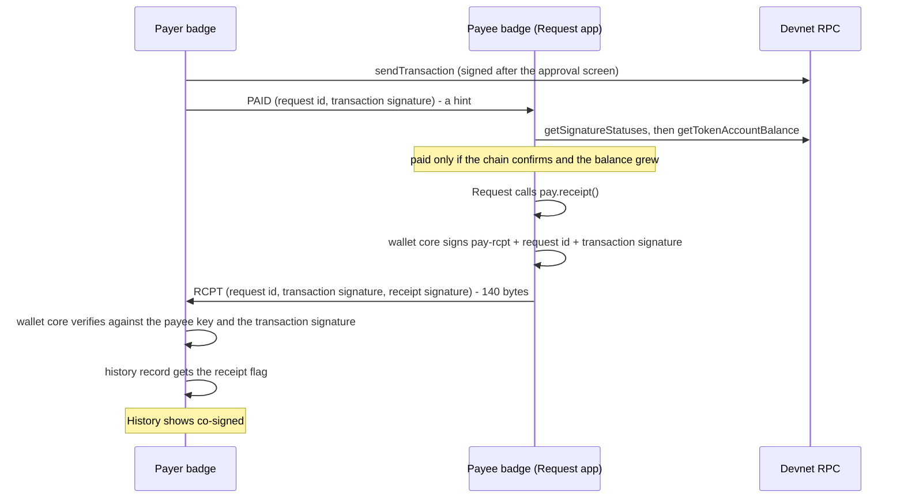

# Receipts (stretch)

Purpose: describe co-signed receipts, a stretch feature in which the payee's badge signs a statement that a specific transaction paid a specific request, and the payer's badge stores it.

Audience: app authors and firmware engineers who pick this feature up after everything else works; demo operators who want to know whether it is in the build.

Status: design, not yet built on hardware, and **not started**. This is requirement F19 at priority P3. Work on it begins only when everything through priority P2 is done. The wire format and its codec are host-tested. The API call (`pay.receipt()`, `badge_pay_receipt`), the history flag and the screen text are specified; none of them is implemented.

Upstream means Solana OS, `firmware/solana-os/` at commit `812b8c7` of the [upstream repository](https://github.com/spacemandev-git/solana-defcon-badge-26/tree/812b8c7/firmware/solana-os). Nothing upstream relates to receipts; everything here is [OURS]. Upstream paths are relative to that directory.

## Purpose and requirement

F19 (P3): co-signed receipts.

A payment on chain already proves that the payer's key moved tokens to the payee's token account. It does not prove that the payee acknowledged the payment as settling a particular request. A receipt adds that: the payee signs `(request id, transaction signature)`.

The co-signed receipt is a pair:

| Half | Signed by | Over |
|---|---|---|
| The transaction signature | the payer's badge, after its approval screen | the transfer message |
| The receipt signature | the payee's badge | `"pay-rcpt:"` ‖ request id (8 bytes) ‖ transaction signature (64 bytes) = 81 bytes |

There is no separate receipts app. The feature is one call added to [Request](request.md), one check added to the payer's wallet core, and one word added to [History](history.md).

## Permissions

No new permission. `pay.receipt` needs `radio`, like the rest of `badge.pay`, and it works only for the app that opened the session. Request already holds `sign,net,radio,wallet,system`.

The receipt signature needs no button press of its own. It is authorised by the SELECT press that opened the request on the wallet's [Screen F](../wallet-core/screens.md#screen-f), and it is limited to that session: at most one receipt per session, for that request id only. This is one of the three fixed message formats the wallet core signs without a per-signature press; see [message signing](../wallet-core/signing-gate.md#message-signing). A receipt signature cannot be used as a transaction signature: the signed bytes start with `pay-rcpt:` and the transaction decoder rejects them.

## Screens

No new screen. History marks a payment that has a verified receipt with the word `co-signed`, which takes the place of `confirmed` on the list row and on the details screen. [OURS]

The row below is History's row from [history.md](history.md#screens) with that word.

```
+----------------------------------------+
| History                             87%|
| > out 10.00 MHacks Merch [v] co-signed |
|   out  1.00 DhEb..W511       confirmed |
|                                        |
|SELECT details   up/down move   CANCEL..|
+----------------------------------------+
```

Nothing is shown on the payee's badge beyond Request's existing `PAID 10.00 HACK`.

## Flow



Steps:

1. The payee confirms the payment on chain exactly as in [request.md](request.md#flow). The receipt is sent only after that.
2. Request calls `pay.receipt()`. The call takes no argument: the firmware stored, in the session, the MAC address the PAID hint came from, and sends the receipt there. The call requires the session to be in state `paid`, so Request makes it before `pay.cancel()`.
3. The payee's wallet core signs the 81 bytes and sends one RCPT frame to the payer.
4. The payer's wallet core verifies the receipt against the payee's key and the transaction signature of the matching history record. On success it sets flag bit 2 (`receipt`) of that record.
5. `history.list()` then returns `receipt = true` for that entry, and the payer's History shows `co-signed` in place of `confirmed`.

The frame (ESP-NOW application frame, unicast payee → payer, 140 bytes): header (4) · request id (8) at offset 4 · transaction signature (64) at offset 12 · receipt signature (64) at offset 76. The codec is `pay_rcpt_encode` / `pay_rcpt_decode` in [`pay_proto.c`](../reference/code/pay_proto.c), host-tested. See [messages](../protocol/payment-protocol.md#messages).

## API calls

| Call | Where | Notes |
|---|---|---|
| `pay.receipt()` | Request, after on-chain confirmation | signs and sends RCPT to the badge the PAID hint came from. Permission `radio`; only the app that opened the session; session state `paid`; at most one per session. Returns `true`, or `nil, err` |
| `pay.status()` | Request | to know the session is `paid` and to get the transaction signature |
| `history.list()` | History | the entry of a payment with a verified receipt has `receipt = true` |

The C form is `badge_err_t badge_pay_receipt(void);` in `badge_api.h`; the wallet-core function behind both is `wallet_pay_receipt()`. See [badge.pay](../app-platform/api-reference.md#badgepay) and [badge.history](../app-platform/api-reference.md#badgehistory).

Where the flag lives: byte 2 of the 160-byte history record is a flag byte; bit 2 is `receipt` ([the record](history.md#the-record)). In C the entry is `badge_history_t.receipt`.

The reference listing of Request makes the call only when the binding exists (`if tx and pay.receipt then pay.receipt() end`), so the same file runs on a build without this feature.

## Error states

| Condition | Result |
|---|---|
| the app lacks `radio` | `denied` |
| `pay.receipt` called with no session, or before the session is `paid` | `no_session` (code 31). A session closes when the app that opened it stops, so no other app can find one to send a receipt for |
| a second `pay.receipt` in the same session | `rate_limited`; no second receipt is signed |
| the key did not produce a valid signature | `sign_failed` |
| ESP-NOW is off, or the radio refused the frame | `io` |
| RCPT frame lost on the radio | the payment is unaffected; History shows the ordinary status. There is no retry in the design |
| RCPT that does not verify against the payee's key and the transaction signature | not accepted by the payer's wallet core; no `co-signed` |
| the payer has left the Pay app | the receipt is still handled: payment-protocol frames are verified in firmware before any app sees them |

A missing receipt never changes whether a payment happened. The chain decides that.

## Acceptance checks

| Check | Pass when |
|---|---|
| T-F19 | after a completed request payment with this feature built, the payer's History shows `co-signed` for it |
| Domain separation (host test, already passing) | the 81 signed bytes are rejected by the transaction decoder (`test_pay.c`) |
| No extra prompt | no screen appears on the payee's badge when the receipt is signed, and at most one receipt is signed per request |

Procedures are in [acceptance.md](../testing/acceptance.md); the host tests are in [host-tests.md](../testing/host-tests.md).

## Requirements covered

- F19: co-signed receipts (stretch; not started).

## Open items

- [UNVERIFIED] Nothing of this feature exists beyond the host-tested frame codec. Fallback: the feature is left out; no other requirement depends on it.
- [UNVERIFIED] Delivery of a single 140-byte unicast ESP-NOW frame without retry. Fallback: none in the design; a lost receipt leaves the ordinary history status.
