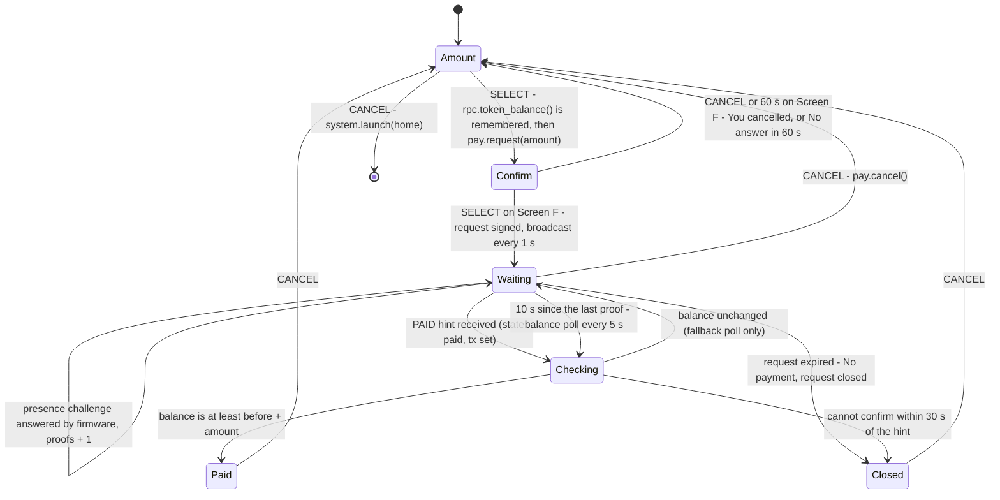

# Request app

Purpose: the payee's app. It asks for an amount, has the wallet sign and broadcast a payment request, answers presence checks while it waits, and confirms the payment on chain.

Audience: app authors implementing `apps/request`, and demo operators running the merchant badge.

Status: design, not yet built on hardware. The app is specified and not written. The reference listing below was syntax-checked with `luac -p` and smoke-tested on a development machine against a mock of the badge API; the mock is not part of the repository. The listing has not run on a badge, and the wallet modules it calls are not yet implemented.

Upstream means Solana OS, `firmware/solana-os/` at commit `812b8c7` of the [upstream repository](https://github.com/spacemandev-git/solana-defcon-badge-26/tree/812b8c7/firmware/solana-os). Request is a Lua app [OURS] on the upstream Lua runtime [UPSTREAM `src/lua_sdk/`]. Upstream paths are relative to that directory. Behaviour described here is [OURS] unless tagged otherwise.

## Purpose and requirement

- F6 (P0): broadcast "pay me X HACK" to the nearest badge.
- F7 (P0): confirm on devnet and flash the LEDs (payee side).
- F8, F9 as seen by the payee: the request is signed by this badge's key after a confirmation screen, and while the request is open the firmware answers presence challenges.

The request is a broadcast. "To the nearest badge" is implemented on the receiving side: every badge sorts the requests it hears by signal strength and drops weak ones. See [payment protocol rules](../protocol/payment-protocol.md#rules).

The app does not sign, verify or answer anything itself. `pay.request` hands the whole exchange to firmware: the confirmation screen, the signature, the rebroadcast every second, and the answers to presence challenges. The app watches `pay.status()` and confirms the money on chain.

## Permissions

`apps/request/app.ini`:

```ini
name=Request
permissions=sign,net,radio,wallet,system
min_api=2
```

| Permission | Used for |
|---|---|
| `sign` | `pay.request` (the request is signed with the badge key after the wallet's confirmation screen) |
| `net` | `rpc.token_balance`, `rpc.status`, `attest.self`, `wifi.connected` |
| `radio` | `pay.request`, `pay.status`, `pay.cancel`, `pay.receipt` (stretch), `espnow.enabled` |
| `wallet` | `history.add` |
| `system` | `system.launch("home")`: CANCEL on the amount picker returns to Home |

## Screens

Amount picker (the same control as in [Pay](pay.md#screens)) → the wallet's [Screen F](../wallet-core/screens.md#screen-f) → waiting → paid or expired. The mockups use the 40-column grid described in [home.md](home.md#screens).

Amount picker. The control and its strings are those of Pay's picker; it starts at `10.00`. [OURS]

```
+----------------------------------------+
| Request                    WiFi NOW 87%|
|                                        |
|        10.00 HACK                      |
|                                        |
|  up/down 1.00     left/right 10.00     |
|  limit 100.00                          |
| SELECT continue          CANCEL back   |
+----------------------------------------+
```

| Key | Change |
|---|---|
| UP / DOWN | ± 1.00 |
| LEFT / RIGHT | ± 10.00 |
| Range | 0.01 to `cap` (100.00 by default) |
| SELECT | continue to the wallet's confirmation screen |
| CANCEL | return to Home |

Confirmation: firmware draws Screen F (`REQUEST PAYMENT`, purple band, `ASK 10.00 HACK`, `AS <own name>`, own attestation status, `valid for 120 s`). SELECT broadcasts; CANCEL goes back. The app is suspended while it is up.

Lifetime: `pay.request(amount [, ttl_s])` takes a lifetime of at most 120 s, which is also the default the app uses. A larger `ttl_s` is clamped to 120 by the API, and Screen F shows the clamped value.

Waiting:

```
+----------------------------------------+
| Request                    WiFi NOW 87%|
|   Asking for 10.00 HACK                |
|   as MHacks Merch                      |
|                                        |
|   waiting  1:47                        |
|   presence checks answered: 1          |
|   payer: 4vJD..BW97                    |
|                                        |
| CANCEL stop                            |
+----------------------------------------+
```

| Element | Source |
|---|---|
| `Asking for 10.00 HACK` | the amount passed to `pay.request` |
| `as MHacks Merch` | own attested name when `attest.self()` is `verified`, else the device name |
| `waiting  1:47` | `pay.status().remaining_ms` |
| `presence checks answered: 1` | `pay.status().proofs` |
| `payer: 4vJD..BW97` | `sol.short(pay.status().payer)`, once a badge has challenged |

Result. One line and `CANCEL back`. [OURS]

```
+----------------------------------------+   +----------------------------------------+
| Request                    WiFi NOW 87%|   | Request                    WiFi NOW 87%|
|                                        |   |                                        |
|        PAID 10.00 HACK                 |   |   No payment, request closed           |
|                                        |   |                                        |
| CANCEL back                            |   | CANCEL back                            |
+----------------------------------------+   +----------------------------------------+
```

The first row of each mockup is drawn by the app itself; it imitates the shell's status bar, which has no binding.

## Flow



In words:

1. Remember `before = rpc.token_balance()`. This happens **before** the session opens. If the balance cannot be read, no session is opened and the picker shows `Cannot read balance, try again`.
2. `pay.request(amount)`. Firmware shows Screen F; on SELECT it signs the request and opens the session.
3. Loop on `pay.status()`.
4. While `state == "open"` and no PAID hint has arrived, make **no network call**, with one exception: once 10 s have passed since the last presence proof, poll the balance every 5 s.
5. On a PAID hint (`state == "paid"`, `tx` set): poll `rpc.status(tx)` until it is confirmed, then read `rpc.token_balance()`.
6. Paid if and only if the balance is at least `before + amount`.
7. LEDs green three times, `history.add{dir = "in", …}`, screen `PAID 10.00 HACK`, then `pay.cancel()`. In a build with the receipts stretch feature, `pay.receipt()` is called after the PAID hint has been confirmed and before `pay.cancel()`; see [receipts.md](receipts.md).

Why the rules are what they are:

- **No network call while open.** A blocking HTTP call can last 4 s. During it the main loop does not run, the firmware cannot answer a presence challenge, and the payer's badge shows `NOT PRESENT`. See [timing](../protocol/payment-protocol.md#timing).
- **The exception after 10 s.** If the PAID hint is lost, the balance poll still finds the payment. Waiting 10 s after the last proof keeps the poll away from the moment a payer is actively checking presence.
- **The PAID hint is never trusted alone.** It is an unsigned frame naming a transaction. Anyone can send one. The app treats the request as paid only when the chain says the transaction is confirmed and the token balance has grown by the amount asked.
- **Balance arithmetic uses strings.** Balances are `u64` on chain and Lua numbers are 32-bit; the listing uses the `dec` helper from [lua-apps.md](../app-platform/lua-apps.md#the-32-bit-number-rule) for `before + amount` and the comparison.
- **The session belongs to the app.** `pay.cancel()`, CANCEL, expiry, or the app stopping all close it, and the broadcast stops.
- LED colour: success `(20, 241, 149)`.

Protocol details: [payee state machine](../protocol/payment-protocol.md#payee-state-machine), [messages](../protocol/payment-protocol.md#messages), [sequences](../protocol/payment-protocol.md#sequences).

## API calls

| Call | When | Blocks |
|---|---|---|
| `attest.self()` | before opening, to learn the name the request carries | up to 4 s when it fetches |
| `rpc.token_balance()` | before opening; after confirmation; fallback poll | up to 4 s |
| `pay.request(amount)` | SELECT on the picker | until the user decides on Screen F, at most 60 s |
| `pay.status()` | every frame while waiting | no |
| `rpc.status(tx)` | every 1 s after a PAID hint | up to 4 s |
| `attest.cached(payer)` | when recording the payment | never |
| `history.add{dir="in", peer=, name=, amount=, sig=, verified=}` | when paid | no |
| `pay.receipt()` | stretch: once, when a PAID hint has been confirmed on chain | no |
| `pay.cancel()` | paid, expired, failed, CANCEL | no |
| `system.launch("home")` | CANCEL on the amount picker | no (deferred) |
| `led.take()`, `led.pulse(20, 241, 149, 400)` | start; three pulses when paid | no |
| `wallet.info()`, `wallet.format(raw)`, `sol.short(key)`, `gfx.*`, `battery.percent()`, `wifi.connected()`, `espnow.enabled()` | throughout | no |

All are in [api-reference.md](../app-platform/api-reference.md).

## Error states

| Condition | What the screen shows |
|---|---|
| `pay.request` returns `rejected` (CANCEL on Screen F) | `You cancelled` on the picker |
| `pay.request` returns `busy` (another session or prompt is active) | `Another request is open` on the picker |
| `pay.request` returns `approval_timeout` | `No answer in 60 s, nothing was signed` on the picker |
| `pay.request` returns `over_limit` | `Amount above the maximum` on the picker |
| `pay.request` returns any other error (`denied`, `not_ready`, `no_display`, `rate_limited`, `sign_failed`, `bad_arg`) | the error name on the picker |
| balance cannot be read before opening | `Cannot read balance, try again` on the picker; no request is opened |
| request expired with no payment | `No payment, request closed` |
| PAID hint names a transaction that failed on chain | `No payment, request closed` |
| PAID hint received but the payment cannot be confirmed within 30 s (RPC errors, or the balance did not grow) | `Cannot confirm, check History later` |
| CANCEL while waiting | the broadcast stops; back on the picker |

The picker stops at `cap`, and `cap` never exceeds `max`, so `over_limit` is not reachable from this app's picker; the line covers a caller that passes a larger amount. The errors `pay.request` can return are listed in [api-reference.md](../app-platform/api-reference.md#badgepay).

## Reference listing

`apps/request/main.lua`, complete: a reference listing, run only against a host mock. It needs `dec.lua` from [lua-apps.md](../app-platform/lua-apps.md#the-32-bit-number-rule) in the same directory. Pixel positions are the listing's own choice [OURS].

```lua
-- apps/request/main.lua
local g, pay, rpc, attest, wallet, history =
  badge.gfx, badge.pay, badge.rpc, badge.attest, badge.wallet, badge.history
local dec = require("dec")                                 -- decimal-string compare and add; see lua-apps.md

local info = wallet.info()
local UNIT = 1
for _ = 1, info.decimals do UNIT = UNIT * 10 end           -- raw units in 1.00
local CAP = #info.cap <= 9 and math.tointeger(tonumber(info.cap)) or 999999999
local HEADER = g.color(0x16, 0x12, 0x24)
local TEXT = { rejected = "You cancelled", busy = "Another request is open",
               approval_timeout = "No answer in 60 s, nothing was signed", over_limit = "Amount above the maximum" }

local screen = "amount"          -- amount | waiting | done
local amount = 10 * UNIT         -- picker value, raw units, bounded by CAP
local asked, want = nil, nil     -- raw strings: the amount requested, and the balance that proves payment
local my_name = badge.device_name
local st = { state = "idle", proofs = 0, remaining_ms = 0 }
local last_proofs, last_proof_ms, next_poll, give_up = 0, 0, 0, nil
local pulses, next_pulse = 0, 0
local line = nil

local function header(title)                               -- no binding exposes the shell's status bar
  local right = (badge.wifi.connected() and "WiFi " or "wifi ")
    .. (badge.espnow.enabled() and "NOW " or "") .. math.floor(badge.battery.percent()) .. "%"
  g.fill_rect(0, 0, 320, 22, HEADER)
  g.text(title, 8, 7, g.WHITE, 1)
  g.text_right(right, 312, 7, g.MUTED, 1)
end

local function leave()                                     -- back to Home; the launcher if Home is not installed
  if not pcall(badge.system.launch, "home") then badge.system.exit() end
end

local function close(text)                                 -- ends the session and the broadcast
  pay.cancel()
  screen, line = "done", text
end

local function open()
  line = nil
  local a = attest.self()                                  -- network calls are allowed here: no session is open yet
  if a and a.status == "verified" then my_name = a.name end
  local before = rpc.token_balance()
  if not before then line = "Cannot read balance, try again" return end   -- no session is opened
  asked = tostring(amount)                                 -- amounts cross the API as strings
  local id, err = pay.request(asked)                       -- wallet screen F; blocks until the user decides
  if not id then line = TEXT[err] or err return end
  want = dec.add(before, asked)
  screen, last_proofs, last_proof_ms, next_poll, give_up = "waiting", 0, 0, 0, nil
end

-- Paid if and only if the balance has grown by the amount asked. Returns true when settled.
local function settle(payer, tx)
  local raw = rpc.token_balance()
  if not raw or dec.cmp(raw, want) < 0 then return false end
  local a = payer and attest.cached(payer)                 -- never blocks
  history.add{ dir = "in", peer = payer, name = a and a.name or "", amount = asked, sig = tx,
               verified = a ~= nil and a.status == "verified" }
  if tx and pay.receipt then pay.receipt() end             -- stretch feature F19: co-signed receipt to the payer
  pulses, next_pulse = 3, 0                                -- LEDs green three times
  close("PAID " .. wallet.format(asked) .. " " .. info.symbol)
  return true
end

function on_start() badge.led.take() end

function on_update(dt)
  local now = badge.millis()
  if pulses > 0 and now >= next_pulse then
    badge.led.pulse(20, 241, 149, 400)
    pulses, next_pulse = pulses - 1, now + 600
  end
  if screen ~= "waiting" then return end

  st = pay.status()
  if st.proofs ~= last_proofs then last_proofs, last_proof_ms = st.proofs, now end

  if st.state == "expired" then
    close("No payment, request closed")
  elseif st.state == "paid" and st.tx then                 -- a PAID hint: a claim, never trusted alone
    give_up = give_up or now + 30000
    if now >= next_poll then
      next_poll = now + 1000
      local s = rpc.status(st.tx)
      if s == "confirmed" or s == "finalized" then
        settle(st.payer, st.tx)
      elseif s == "failed" then
        close("No payment, request closed")
      end
    end
    if screen == "waiting" and now >= give_up then close("Cannot confirm, check History later") end
  elseif st.state == "open" and st.proofs > 0 and now - last_proof_ms >= 10000 and now >= next_poll then
    next_poll = now + 5000                                 -- the only network call while the session is open
    settle(st.payer, nil)
  end
end

function on_button(key, pressed)
  if not pressed then return end
  if screen == "amount" then
    if key == "up" then amount = amount + UNIT
    elseif key == "down" then amount = amount - UNIT
    elseif key == "right" then amount = amount + 10 * UNIT
    elseif key == "left" then amount = amount - 10 * UNIT
    elseif key == "b" then leave()
    elseif key == "a" then open()
    end
    amount = math.max(1, math.min(CAP, amount))
  elseif key == "b" then
    if screen == "waiting" then pay.cancel() end           -- stops the broadcast
    screen = "amount"
  end
end

function on_draw()
  g.clear()
  header("Request")
  if screen == "amount" then
    g.text_center(wallet.format(tostring(amount)) .. " " .. info.symbol, 160, 70, g.WHITE, 3)
    g.text("up/down " .. wallet.format(tostring(UNIT)), 16, 130, g.MUTED, 1)
    g.text("left/right " .. wallet.format(tostring(10 * UNIT)), 160, 130, g.MUTED, 1)
    g.text("limit " .. wallet.format(info.cap), 16, 146, g.MUTED, 1)
    if line then g.text(line, 16, 176, g.ORANGE, 1) end
    g.text("SELECT continue", 8, 228, g.MUTED, 1)
    g.text_right("CANCEL back", 312, 228, g.MUTED, 1)
  elseif screen == "waiting" then
    local s = st.remaining_ms // 1000
    g.text("Asking for " .. wallet.format(asked) .. " " .. info.symbol, 24, 40, g.WHITE, 2)
    g.text("as " .. my_name, 24, 62, g.WHITE, 1)
    g.text(string.format("waiting  %d:%02d", s // 60, s % 60), 24, 96, g.WHITE, 2)
    g.text("presence checks answered: " .. st.proofs, 24, 122, g.MUTED, 1)
    if st.payer then g.text("payer: " .. badge.sol.short(st.payer), 24, 138, g.MUTED, 1) end
    g.text("CANCEL stop", 8, 228, g.MUTED, 1)
  else
    g.text_center(line or "", 160, 100, g.WHITE, 2)
    g.text("CANCEL back", 8, 228, g.MUTED, 1)
  end
end
```

## Acceptance checks

| Check | Pass when |
|---|---|
| T-F6 | a request for 10.00 on the merchant badge appears in a second badge's Pay list within 2 s |
| Broadcast start | the broadcast starts within 1 s of SELECT on Screen F |
| T-F7 | LEDs flash on both badges after confirmation; History is updated on both |
| T-F8 | a request with one flipped byte, rebroadcast by another badge, is not listed on the payer |
| T-F9 | while Request is open the payer sees `present`; with Request closed, `NOT PRESENT` |
| CANCEL | CANCEL stops the broadcast within 1 s; CANCEL on the picker returns to Home; T-NFR-cancel holds on every screen |

Procedures are in [acceptance.md](../testing/acceptance.md).

## Requirements covered

- F6: request an amount from nearby badges.
- F7: confirmation and LEDs on the payee.
- F8, F9 as seen by the payee: a signed request and answered presence challenges, both done by firmware behind `pay.request`.
- F16 (in part): `history.add` for incoming payments.
- NFR "judge UX": SELECT and CANCEL named on every screen; amounts capped.

## Open items

- [UNVERIFIED] The listing has not run on a badge; it was smoke-tested on a host against a mock. Fallback: fix on first push.
- [UNVERIFIED] Whether the payee's main loop answers a challenge inside the presence deadline while the app draws every frame. Fallback: raise `deadline_ms`; see [measurements.md](../testing/measurements.md).
- [UNVERIFIED] How long after confirmation the token balance read reflects the payment. Fallback: the listing keeps polling for 30 s.
