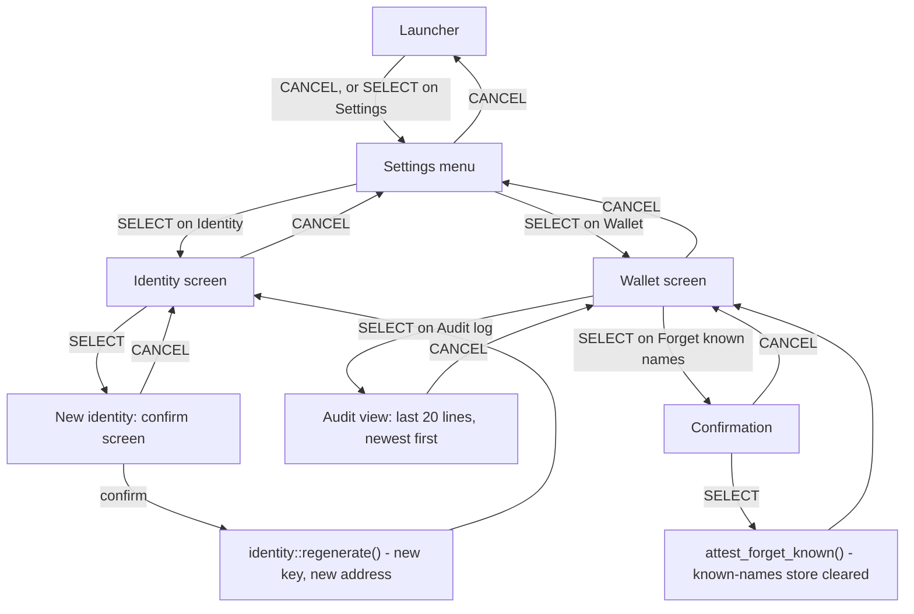

# Settings: Identity and Wallet screens

Purpose: the two Settings screens that report, on the badge itself, which key the badge has, where that key lives, and how the wallet is configured.

Audience: firmware engineers changing `src/ui/shell.cpp`, and demo operators who read these screens during setup.

Status: design, not yet built on hardware. The Identity screen exists upstream and was read in source; the added line and the whole Wallet screen are specified and not written. Nothing has run on a badge.

Upstream means Solana OS, `firmware/solana-os/` at commit `812b8c7` of the [upstream repository](https://github.com/spacemandev-git/solana-defcon-badge-26/tree/812b8c7/firmware/solana-os). Upstream paths below are relative to that directory.

## Purpose and requirement

These are not apps. They are screens of the shell, written in C++ inside the firmware, and they run only when no app is running [UPSTREAM `solana-os.ino:279-283`]. They are documented with the apps because they are what an operator opens next to them.

| Requirement | How these screens serve it |
|---|---|
| NFR "honesty": Settings shows whether the key lives in the secure element or in software | Settings → Identity, line `key lives in` [UPSTREAM]; Settings → Wallet, first row `Key` [OURS] |
| F17 (P3): key held in the SE050 | the same line is the on-badge evidence of which path is in use |
| F14 (P2): spending cap | Settings → Wallet shows the second-confirmation threshold and the maximum |
| F10, F15: registry and revocation | Settings → Wallet shows which registry credential the badge checks against, and holds the "Forget known names" action |
| Pre-event checklist: "Settings → Identity reports secure element or software" | read on each badge after flashing |

## Permissions

None. The shell is firmware and part of the trusted computing base; the permission system applies to apps. No app can open, draw over or alter these screens: an app and the shell never run at the same time.

Neither screen shows or exports the private key. The public key is public.

## Screens

Reach both from the launcher: CANCEL (or the Settings row) opens Settings; UP and DOWN move; SELECT opens a row; CANCEL goes back [UPSTREAM `src/ui/shell.cpp:237-347`]. The Settings menu gains one row, `Wallet` [OURS].

Shell layout facts used below [UPSTREAM `src/ui/shell.cpp:99-104`, `src/hal/display.cpp:201-222`]: status bar 22 px plus a 2 px rule, list starting at y = 30, rows 22 px high, footer bar 18 px. Eight list rows fit on a screen. The mockups use the 40-column grid described in [home.md](home.md#screens).

### Settings → Identity

[UPSTREAM screen, `src/ui/shell.cpp:699-746`] plus one line [OURS].

```
+----------------------------------------+
| Identity                   WiFi NOW 87%|
| +------------------------------------+ |
| | BADGE ID                           | |
| |            Gn2GQYmc                | |  size 3; green when ready
| +------------------------------------+ |
| key lives in                  software |  green: secure element; amber: software
| software key                           |  status line
| token account  2awX..6wrr              |  added line
| public key                             |
| Gn2GQYmcQkatE2594ov2ELKkYWZHwARG       |  first 32 characters
| 7FiAoPWSEcxq                           |  remaining characters
| | New identity    changes the badge ID||
| SELECT new identity   CANCEL back      |
+----------------------------------------+
```

| Element | Source | Tag |
|---|---|---|
| `BADGE ID` and the 8-character id | `identity::badgeId()`: the first 8 base58 characters of the public key; `--------` when there is no identity | [UPSTREAM] |
| `key lives in` + `secure element` or `software` | `identity::sourceName()`; green only for the secure element, amber for software | [UPSTREAM `shell.cpp:715-720`] |
| status line | `identity::status()` | [UPSTREAM] |
| `token account  2awX..6wrr` | the badge's token account for the configured mint, short form; from `wallet_get_info()`. It sits directly under the status line | [OURS] |
| `public key` and the full key | `identity::publicKeyBase58()`, wrapped at 32 characters | [UPSTREAM] |
| `New identity` | regenerates the key after a confirmation screen | [UPSTREAM `shell.cpp:748-804`] |

What "software" means, stated as plainly as the screen states it: the 32-byte key seed is stored unencrypted in the badge's flash (NVS namespace `badgeid`). Anyone holding the badge and a USB cable can read it. Flash encryption and secure boot are not enabled. See [keys-and-se050.md](../wallet-core/keys-and-se050.md).

`New identity` creates a different key. The badge then has a different address: it must be added to the dashboard's badge list, funded again and attested again.

### Settings → Wallet

[OURS] Twelve rows, in this order. All are read-only except the last two, which open a view and a confirmation.

```
+----------------------------------------+
| Wallet                     WiFi NOW 87%|
| Key                           software |
| Token               HACK  <mint short> |
| Token account               2awX..6wrr |
| Second confirm above            100.00 |
| Maximum                        1000.00 |
| Registry                    GvGH..C3UP |
| RPC   api.devnet.solana.com not pinned |
| Presence deadline               400 ms |
|SELECT open   up/down move   CANCEL back|
+----------------------------------------+
```

| # | Row | Shows | Source |
|---|---|---|---|
| 1 | `Key  secure element`, `Key  software` or `Key  none` | where the key lives. The value is drawn in `theme::GREEN` for `secure element`, `theme::WARN` for `software`, `theme::ERR` for `none` | `wallet_info_t.key_source`: 1 → `secure element`, 2 → `software`, 0 → `none` |
| 2 | `Token  HACK  <mint short>` | symbol and short mint address | `symbol`, `mint` |
| 3 | `Token account  <short>` | this badge's token account | `token_account`, derived from the public key and the mint |
| 4 | `Second confirm above  100.00` | above this amount the wallet asks a second time | `cap` |
| 5 | `Maximum  1000.00` | above this amount the wallet refuses | `max` |
| 6 | `Registry  <credential short>` | the attestation credential this badge checks against | `cred`, `registry_set` |
| 7 | `RPC  <host>  pinned` or `not pinned` | RPC host, and whether a CA certificate for it is installed | `rpc_url`, `tls_pinned` |
| 8 | `Presence deadline  400 ms` | how fast a presence proof must arrive | `deadline_ms` |
| 9 | `Red blocks signing  on` or `off` | whether a red approval screen disables signing | `block_red` |
| 10 | `Clock  synced` or `not synced` | whether the system clock was set from the network (needed to evaluate attestation expiry) | `clock_synced` |
| 11 | `Audit log >` | SELECT opens the audit view | `audit_tail()` |
| 12 | `Forget known names` | SELECT opens the confirmation; confirming clears the known-names store | `attest_known_count()`, `attest_forget_known()` |

Every source in rows 1 to 10 is a field of the structure that `wallet_get_info()` fills.

Twelve rows do not fit the eight a shell list shows, so the list scrolls; the mockup shows the first eight. The footer is `SELECT open   up/down move   CANCEL back`.

When the mint is not configured, row 2 reads `Token  not configured` with the value in `theme::WARN`, and row 3 reads `Token account  -`. When the registry credential is not configured, row 6 reads `Registry  not configured`.

Row 1 repeats what Settings → Identity says on its `key lives in` line, in the same words and colours: green only for the secure element, amber for a software key ([keys-and-se050.md](../wallet-core/keys-and-se050.md)). The acceptance check T-NFR-honesty compares the two screens, `/api/identity` and the dashboard's Badges page.

Nothing on this screen can be edited on the badge. The values are set by the team through compile-time defaults, the push API or the serial console, and every change is written to the audit log; see [configure.md](../guides/configure.md) and [config-limits-audit.md](../wallet-core/config-limits-audit.md). Judges cannot change the cap or the maximum.

`RPC … not pinned`: without the certificate, an attacker on the hotspot could forge an "attested" answer. The approval screen then carries the line `RPC TLS not pinned` ([transport trust](../identity/attestation.md#transport-trust)).

### Audit view

[OURS] SELECT on `Audit log >`. Title `Audit log`. The view shows the last 20 lines of the audit log, newest first. Each record takes two size-1 lines, four records fit on a page, and UP and DOWN scroll by one record. The footer is `up/down scroll   CANCEL back`.

```
+----------------------------------------+
| Audit log                  WiFi NOW 87%|
| #42 TX blocked 500.00 HACK             |
|   checkout  FZEA..ei3K  mismatch not_ch|  second line theme::MUTED, cut at 52 characters
| #41 TX ok 10.00 HACK                   |
|   pay  Gn2G..Ecxq  verified present    |
|                                        |  two more records fit below
| up/down scroll   CANCEL back           |
+----------------------------------------+
```

| Line | Format | Notes |
|---|---|---|
| 1 | `#<seq> <event> <result> <amount> <SYM>` | the amount is formatted with the configured decimals; amount and symbol are omitted when the audit line's amount is `-` |
| 2 | `<app_id>  <subject short or key name>  <identity> <presence>` | `theme::MUTED`, cut at 52 characters. `subject` is the audit line's `subject` field: a public key or token account is shown in its short form, a configuration key name as it is |

The fields are those of the audit line: `seq`, `event`, `result`, `amount_raw`, `app_id`, `subject`, `identity`, `presence` ([line format](../wallet-core/config-limits-audit.md)). The mockup's 40-column frame cuts the second line of record 42 earlier than the screen does.

### Forget known names

[OURS] SELECT on `Forget known names` opens a confirmation. Title `Forget known names`, an amber rule under the status bar, four lines of text, footer `SELECT forget   CANCEL back`. `<n>` is the number of stored names.

```
+----------------------------------------+
| Forget known names         WiFi NOW 87%|
|########################################|  amber rule
| This badge will forget which badges    |
| it has seen verified (3 stored).       |
| A revoked badge will then show as      |
| UNVERIFIED instead of REVOKED.         |
|                                        |
| SELECT forget   CANCEL back            |
+----------------------------------------+
```

The known-names store is how the badge tells a revoked key from one that was never verified, and how it notices a second badge claiming a name it has already seen as verified ([known names](../identity/attestation.md#known-names)). Clearing it between demo step 1 (pay the verified merchant) and demo step 2 (the impostor) changes the impostor's screen from red `NAME MISMATCH` to amber `UNVERIFIED`. Never use this action between seeding the judge badges and the demo.

## Flow



## API calls

These screens call firmware functions directly, not the badge API.

| Call | Used for | Tag |
|---|---|---|
| `identity::ready()`, `identity::badgeId()`, `identity::source()`, `identity::sourceName()`, `identity::status()`, `identity::publicKeyBase58()` | Identity screen | [UPSTREAM `src/identity/identity.h:44-84`] |
| `identity::regenerate()` | New identity | [UPSTREAM] |
| `void wallet_get_info(wallet_info_t *out)` | rows 1 to 10 of the Wallet screen and the token-account line of the Identity screen | [OURS] `src/wallet/wallet.h` |
| `size_t audit_tail(char *out, size_t cap, size_t max_lines)` | the audit view: the newest 20 lines | [OURS] `src/wallet/audit.h` |
| `size_t attest_known_count(void)` | the count in the confirmation text | [OURS] `src/wallet/attest.h` |
| `void attest_forget_known(void)` | Forget known names, after SELECT on the confirmation | [OURS] `src/wallet/attest.h` |
| `display::statusBar(title)`, `display::text`, `display::textRight` | drawing | [UPSTREAM `src/hal/display.h`] |

`wallet_info_t` carries `ready`, `pubkey`, `key_source`, `mint`, `token_account`, `decimals`, `symbol`, `cap`, `max`, `deadline_ms`, `block_red`, `tls_pinned`, `clock_synced`, `attest_ttl_s`, `rssi_min`, `registry_set`, `cred`, `schema`, `rpc_url` and `dash_url`. `audit_tail` copies the newest lines oldest first; the view reverses them. The headers are in [api.md](../wallet-core/api.md), [config-limits-audit.md](../wallet-core/config-limits-audit.md) and [attestation.md](../identity/attestation.md).

The same facts are available off the badge: `GET /api/identity` returns `pubkey`, `source`, `key_location` and `token_account`; `GET /api/wallet/config` returns the configuration; `GET /api/wallet/audit` returns the audit log. All three need the pairing code. See [dashboard.md](../integration/dashboard.md) and [configure.md](../guides/configure.md).

## Error states

| Condition | What the screen shows |
|---|---|
| No identity (key generation failed) | Identity: `--------` as the badge id; the status line says why |
| Secure element did not answer and the badge fell back | Identity: `software` in amber. The boot log has `[id] SE050 refused at <stage>, sw <xxxx>` |
| No key (`key_source` 0) | Wallet: `Key  none` in red |
| Mint not configured | Wallet: `Token  not configured` in amber and `Token account  -`. The wallet is not ready: signing returns `not_ready`, Home shows `Wallet not configured` |
| Registry credential not configured | Wallet: `Registry  not configured`; identity checks return `not_ready` to apps |
| No CA certificate for the RPC host | `not pinned` |
| Clock not set (no network time) | `not synced`; attestation expiry is not evaluated |

## Acceptance checks

| Check | Pass when |
|---|---|
| Pre-event checklist | on each of the four badges, Settings → Identity shows a badge id and `secure element` or `software`, and the value is recorded in the dashboard's badge list |
| T-NFR-honesty | Settings → Identity (line `key lives in`), Settings → Wallet (first row `Key`), `/api/identity` and the dashboard's Badges page agree on where the key lives |
| Setup | after configuration, Settings → Wallet shows the mint and the registry credential that the dashboard's `/api/status` reports |
| T-F14 | `Second confirm above` and `Maximum` match the amounts at which the second confirmation screen and the refusal appear |
| Short address | the address on Home matches the public key on Settings → Identity |
| CANCEL | leaves every screen (T-NFR-cancel) |

Procedures are in [acceptance.md](../testing/acceptance.md) and [pre-event-checklist.md](../guides/pre-event-checklist.md).

## Requirements covered

- NFR "honesty": the key location is reported on the badge, on both screens.
- F14: the cap and maximum are visible on the badge.
- F17: the on-badge evidence of the key path in use.
- F10, F15: registry identity and the known-names action.

## Open items

- [UNVERIFIED] The secure-element path has not run on real hardware, upstream or here; which value `key lives in` shows on these badges is unknown until they are flashed. Fallback: software keys, reported as `software`.
- [UNVERIFIED] Which CA root the devnet RPC host chains to on the day, which decides `pinned`. Fallback: unpinned, shown as `not pinned`.
- [UNVERIFIED] Network time through the phone hotspot, which decides `Clock`. Fallback: expiry is not evaluated.
