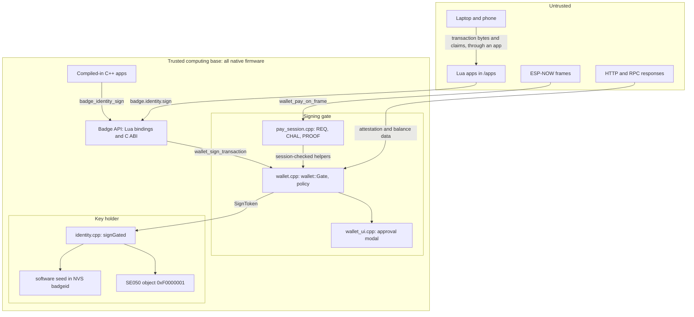

# Architecture overview

The layers of the badge firmware, which of them may touch the signing key, and the design decisions everything else in these documents follows from.

- Audience: firmware engineers.
- Status: design, not yet built on hardware.
- Base: Solana OS, directory `firmware/solana-os/` at commit `812b8c7` of the [upstream repository](https://github.com/spacemandev-git/solana-defcon-badge-26/tree/812b8c7aca5c366d18c0b040fafd2999f7204d84/firmware/solana-os). Paths in this document are relative to that directory in our fork.

Tags used on every claim:

- **[UPSTREAM]** exists in Solana OS at commit `812b8c7`; the path is given.
- **[OURS]** our design decision; the reason is given. "host-tested" next to it means the reference C code in [`../reference/code/`](../reference/code/) passed its tests on a development computer.
- **[UNVERIFIED]** must be measured or confirmed on a badge; a fallback is given.

Nothing in this design has run on a badge yet. Terms such as ATA, PDA, SAS, hint and TCB are defined in the [glossary](../reference/glossary.md).

## Layers

The firmware is Solana OS with two additions: a **wallet core** below the app runtimes, and a **badge API** through which both Lua apps and compiled-in C++ apps reach it.

```
+----------------------------------------------------------------------------------+
| APPS                                                                             |
|  Lua apps  /apps/<id>/main.lua            C++ apps  src/native_apps/<id>/*.cpp   |
|  (untrusted, sandboxed)                   (trusted, compiled in)                 |
+-------------------------+----------------------------+---------------------------+
| Lua runtime [UPSTREAM]  | Native runtime [OURS]      |   Shell [UPSTREAM]        |
| lua_sdk/lua_runtime     | app_host/native_runtime    |   ui/shell (+ Wallet rows)|
+-------------------------+----------------------------+---------------------------+
| BADGE API (one contract)  Lua bindings lua_sdk/lib_*.cpp  |  C ABI app_host/badge_api.h
+----------------------------------------------------------------------------------+
| WALLET CORE [OURS]  src/wallet/                                                  |
|  wallet (gate, policy)  wallet_ui (modal screens)  sol_* (decode, PDA, base58)   |
|  pay_proto + pay_session (REQ/CHAL/PROOF)  attest (SAS)  rpc  audit  history     |
+----------------------------------------------------------------------------------+
| OS SERVICES [UPSTREAM]  identity  settings  app_store  net_route  wifi_mgr       |
|  espnow_mgr  ble_mgr  push_server  cert_store  badge_log                         |
+----------------------------------------------------------------------------------+
| HAL [UPSTREAM]  display  buttons  leds  power  mic  badge_i2c  se050_t1/apdu     |
+----------------------------------------------------------------------------------+
| ESP32-S3-WROOM-1-N16R8 · ILI9341 320x240 · TCA9534 buttons · 2x WS2812B · SE050C2|
+----------------------------------------------------------------------------------+
```

| Layer | What it does | Where it is documented |
|---|---|---|
| Apps | Home, Pay, Request, History, Checkout and the Tip Jar example. Lua apps are pushed to the badge at run time; C++ apps are compiled into the image. | [App platform overview](../app-platform/overview.md) |
| Runtimes and shell | The Lua VM and its sandbox [UPSTREAM `src/lua_sdk/lua_runtime.cpp`]; a native runtime with the same lifecycle [OURS]; the launcher and Settings screens [UPSTREAM `src/ui/shell.cpp`], which gain a Wallet screen [OURS]. | [Upstream baseline](upstream-baseline.md), [Runtime and boot](runtime-and-boot.md) |
| Badge API | One set of function names in three spellings: `badge.x.y` (Lua), `badge_x_y` (C), `badge::x::y` (C++). Our additions are implemented once and bound twice. [OURS] | [API reference](../app-platform/api-reference.md) |
| Wallet core | Decodes a transaction, applies policy, draws the approval screen, and is the only code that can ask the key holder for a signature. Also the payment-protocol codec and sessions, the attestation check, the RPC client, the audit log and the history store. [OURS] | [Wallet C API](../wallet-core/api.md), [Signing gate](../wallet-core/signing-gate.md) |
| OS services | Identity (the keypair), settings, the app catalogue, HTTP routing, Wi-Fi, ESP-NOW, BLE, the push server, CA certificates, logging. [UPSTREAM `src/identity/`, `src/net/`, `src/apps/`] | [Upstream baseline](upstream-baseline.md) |
| HAL and board | Display, buttons, LEDs, battery, microphones, I²C, and the SE050 secure element transport. [UPSTREAM `src/hal/`] | [Upstream baseline](upstream-baseline.md) |

## Trust zones

| Zone | Contents | May touch the key? |
|---|---|---|
| **Key holder** | `identity.cpp` (software seed in RAM/NVS) and the SE050 | yes |
| **Signing gate** | `wallet/wallet.cpp`, `wallet/wallet_ui.cpp`, `wallet/pay_session.cpp` | only by calling `identity::signGated(const SignToken&, …)`; `SignToken` can be constructed only by `wallet::Gate` (see [Key gate](../wallet-core/signing-gate.md#key-gate)) |
| **Trusted computing base** | all native firmware, including compiled-in C++ apps | not by contract; technically reachable, because it shares the address space (see [Security model](../security/security-model.md#non-goals-and-residual-risks)) |
| **Untrusted** | Lua apps, everything received by radio, HTTP responses, the laptop, the phone | never; can only call `badge.identity.sign` and wait |



Three points about this picture:

1. The boundary that is **enforced** is the one around Lua. A Lua app runs in a VM with no binding that reaches the key, and source-only loading means it cannot bring native code. [UPSTREAM `src/lua_sdk/lua_runtime.cpp:243-249`, `src/lua/linit.c`]
2. The boundary around the signing gate inside native code is a **compile-time convention** (a passkey type, an include rule and a grep rule). It stops mistakes. It does not stop hostile native code, because the ESP32-S3 has no MMU and every native function shares one address space. That is why compiled-in C++ apps are counted as part of the trusted computing base. [OURS]
3. Data from the untrusted zone reaches the approval screen only after firmware has checked it: transaction bytes are decoded by the wallet core, radio frames are verified by `pay_session.cpp`, attestation accounts are fetched by `attest.cpp` and checked field by field by `attest_parse.c`. What an app says about a payment is a **hint**; a hint can lower the trust level shown, never raise it. [OURS]

## The signing rule

> An app can ask for a signature. Only the wallet core can produce one. A transaction signature is produced only after the wallet core's own approval screen and a SELECT press on that screen. Message signatures exist only in three fixed, domain-separated formats built by the wallet core.

The three message formats are the signed payment request (`pay-req:`), the proof of presence (`pay-proof:`) and the receipt (`pay-rcpt:`). Their bytes and the argument that none of them can be mistaken for a transaction are in [Message signing](../wallet-core/signing-gate.md#message-signing). A fourth format, the upstream app-store registration string, exists only in builds with `WALLET_ENABLE_BROKER 1` and is off by default.

Why the rule is built this way:

- **Why below the app layer.** The attacker in this project includes a malicious or compromised app. If the app drew the approval screen, the app could draw a false one. So the screen, the button handling and the call into the key holder all live in firmware, and the app is suspended on the same task while they run. An app that is not executing cannot draw, dim the backlight, read buttons or dismiss the prompt. [OURS]
- **Why "every transaction", not "every signature".** A proof of presence must be answered within a few hundred milliseconds, so it cannot wait for a button. Instead the SELECT press that opens a request or receive session names what it authorises: proofs for one request id, for a bounded time, at most eight of them. This is narrower than the product requirement "every signature requires a physical button press", and the documents say so wherever it matters. [OURS]
- **Why fixed formats.** A general "sign these bytes" call would let an app obtain a signature over bytes that are also a valid transaction. Fixed prefixes plus the strict transaction decoder make the two sets of bytes disjoint; this is host-tested in `test_pay.c`. [OURS] host-tested

## Decisions

Each decision has an identifier that other documents cite.

| # | Decision | Status and reason |
|---|---|---|
| D1 | The build stays an **Arduino sketch built with `arduino-cli`**; our code is added as folders under `src/`. CMake is used only for host unit tests. | [UPSTREAM] build (`README.md:50-96`); [OURS] layout. `arduino-cli` compiles everything under `src/` recursively, so no build files change. |
| D2 | The signing rule is enforced by a **blocking modal inside the firmware call**: `wallet_sign_transaction()` draws the approval screen and pumps buttons itself; the calling app (Lua or C++) is suspended on the same task until it returns. | [OURS] An app that is not executing cannot draw or skip; no scheduler changes are needed. |
| D3 | Everything shown on the approval screen comes from firmware: decoded transaction bytes, firmware-derived token accounts, firmware-fetched attestation, firmware-verified presence. Apps supply **hints** only; a hint can lower the trust level shown, never raise it. | [OURS] The screen is the only thing the user can trust, so nothing an app says may improve it. |
| D4 | The decoder is strict: exactly one instruction, SPL Token `TransferChecked`, classic Token program, 5 account keys, 1 signer. ComputeBudget, Memo, ATA-create, Token-2022 and everything else are "Unknown instruction" and blocked. | [OURS] host-tested. Requirement F3; priority-fee instructions can drain SOL; this is not a general wallet. See [Transaction decoder](../wallet-core/transaction-decoder.md). |
| D5 | `identity.sign()` signs a transaction **message**, not a wire transaction. | [OURS] The first byte `0x01` is ambiguous between the two (one required signature in a message header, one signature in a wire transaction). |
| D6 | Amounts cross every API as **decimal strings of raw base units**. | [UPSTREAM] constraint: Lua is built with 32-bit integers and `float` numbers (`src/lua/luaconf.h:125`), so a `u64` cannot cross as a number. |
| D7 | Fast Ed25519: vendor **Monocypher 4.0.2** for verification and for software-key signing. Signatures are byte-identical to TweetNaCl's. | [OURS] host-tested for equivalence. Upstream says TweetNaCl costs about a second per signature (`src/identity/TWEETNACL-README:15-22`). On-device speed is [UNVERIFIED]; fallback `WALLET_ED25519_BACKEND 0`. See [Keys and the SE050](../wallet-core/keys-and-se050.md). |
| D8 | C++ apps are **compiled into the firmware image** and listed in an explicit registry table. They are trusted code and part of the TCB. | [OURS] No MMU and no loader: a loaded native blob would have full privileges anyway. One table is one review point. |
| D9 | One host API ("badge API") with identical names in Lua (`badge.x.y`), C (`badge_x_y`) and the C++ SDK (`badge::x::y`). Our additions are implemented once in C/C++ and bound twice. | [OURS] One contract to document and test. |
| D10 | Payment-protocol frames are parsed, verified and answered **in firmware**, before any app sees them. | [OURS] Proof latency, and D3: presence shown on the approval screen must not depend on what an app parsed. |
| D11 | The upstream broker client (app store) is **compiled out** by default (`WALLET_ENABLE_BROKER 0`). | [OURS] It signs without a button press [UPSTREAM `src/net/broker_client.cpp:508-513`] and can raise install prompts during judging. |
| D12 | Red states disable signing (`block_red = 1`). | [OURS] The product flow says a bad signature, slow reply or missing attestation "blocks the payment before anything is signed". Fallback: `block_red = 0` turns red into hold-SELECT-3-s. |

Working name: these documents say "the OS" or "Badge OS". The product name is open. Firmware constant `WALLET_VERSION "0.1.0"`; `SOLANA_OS_API_VERSION` is raised from 1 [UPSTREAM `src/config.h:20`] to **2** [OURS: bindings were added].

## PRD open questions, resolved

| Question | Decision | Fallback |
|---|---|---|
| SAS or custom registry? | **SAS**, exactly as the dashboard uses it: credential "MHacks Verified", schema `badge-identity` v1, one String field `name`, nonce = badge public key. [OURS: the dashboard is already built on it; PDA derivation (`test_sol.c`) and account parsing (`test_attest.c`) are host-tested] See [Attestation](../identity/attestation.md). | A signed allowlist baked into firmware (`wallet_defaults.h`: array of `{pubkey, name}`), same screen states, no revocation. |
| Transaction submission path | **The badge submits directly over Wi-Fi** (phone hotspot) with JSON-RPC `sendTransaction`. [OURS: no extra device in the loop; `net_route` already picks Wi-Fi first, UPSTREAM `src/net/net_route.cpp:116-144`] See [Transaction building](../protocol/transaction-building.md). | The phone BLE bridge works with no code change (`net_route`), but only for submission and balance reads; identity checks over the bridge are shown as "not checked" ([Transport trust](../identity/attestation.md#transport-trust)). |
| Spending cap value; can judges change it? | `cap` = **100.00 HACK** (raw `10000`): above it a second confirmation is required. `max` = **1000.00 HACK** (raw `100000`): above it the wallet refuses. Judges cannot change either on the badge; both are configuration pushed by the team. [OURS: the 10.00 HACK demo purchase is below the cap; the 500.00 HACK attack is above the cap and still reaches the screen] See [Config, limits and audit](../wallet-core/config-limits-audit.md). | Set `cap` = `max` to disable the second confirmation. |
| REQ/CHAL/PROOF field encoding | **Binary, fixed-size, little-endian.** [OURS: Lua strings are byte-safe; 155/60/108 bytes fit the frame budgets with room to grow; base64 would add a third and put a decoder in the radio path] See [Payment protocol](../protocol/payment-protocol.md#messages). | None needed. |
| PROOF deadline | Config `deadline_ms`, default **400 ms**, measured radio-to-radio on the payer. The PRD target of 250 ms is [UNVERIFIED] and is not reachable with an SE050 key (about 261 ms per signature, cited, not measured). | 800 ms if any badge signs with the SE050; 2500 ms if the fast Ed25519 backend is not shipped. |
| Attack-console transport | **Wi-Fi HTTP polling** of the dashboard's badge listener. [OURS: the listener exists; BLE would need a sender nobody has written] Dashboard `.env`: `BADGE_LISTEN_HOST=<laptop hotspot IP>`, `BADGE_LISTEN_PORT=8788`. See [Dashboard integration](../integration/dashboard.md). | The dashboard's manual "Mark rejected" button stays usable. |
| Attack transaction version | The decoder accepts **legacy and v0 without address lookup tables**. Dashboard `.env`: `ATTACK_TX_VERSION=legacy`. [OURS: legacy is what the badge builds itself; accepting v0 costs four lines] | — |
| Product name | open | — |

## Requirements covered

This document introduces the structure that all requirements rely on. It is the primary reference for none; it supports:

- F1, F2 (the signing rule and where it is enforced; detail in [Signing gate](../wallet-core/signing-gate.md)).
- F3 (decision D4; detail in [Transaction decoder](../wallet-core/transaction-decoder.md)).
- Non-functional "Security: no signing path exists outside the firmware approval screen" (trust zones, D2, D11).
- The PRD open questions (table above).

## Open items

- [UNVERIFIED] On-device Ed25519 speed for Monocypher, TweetNaCl and the SE050 (D7). Fallback: `WALLET_ED25519_BACKEND 0` and a longer `deadline_ms`.
- [UNVERIFIED] PROOF deadline of 400 ms and the PRD target of 250 ms. Fallback: 800 ms with an SE050 signer, 2500 ms with TweetNaCl.
- [UNVERIFIED] Nothing has been compiled with `arduino-cli` or flashed. First step of the [implementation plan](../roadmap/implementation-plan.md) is to build and flash upstream unmodified.
- Product name: open.
