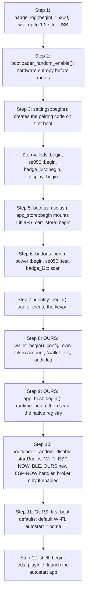
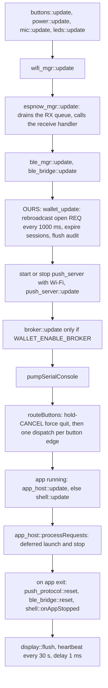

# Runtime and boot

How the firmware runs: one application task, its memory budget, the boot sequence, the main loop, and the complete list of changes we make to upstream files.

- Audience: firmware engineers.
- Status: design, not yet built on hardware.
- Base: Solana OS, directory `firmware/solana-os/` at commit `812b8c7` of the [upstream repository](https://github.com/spacemandev-git/solana-defcon-badge-26/tree/812b8c7aca5c366d18c0b040fafd2999f7204d84/firmware/solana-os). All paths are relative to that directory in our fork.

Tags: **[UPSTREAM]** exists at that commit (path given); **[OURS]** our decision (reason given); **[UNVERIFIED]** needs a badge (fallback given). Upstream facts are collected in [Upstream baseline](upstream-baseline.md); the layers are in [Architecture overview](overview.md).

## Task model

- There is one application task. The Arduino `loopTask` runs the main loop, the shell, the Lua VM, native apps, the wallet's approval modal and all HTTP. [UPSTREAM: the firmware creates no task; no match for `xTaskCreate` under `src/`]
- The Wi-Fi and BLE stacks run in their own tasks. Their callbacks only enqueue; the main loop drains. [UPSTREAM `src/net/espnow_mgr.cpp:40-53`]
- We add **no tasks**. [OURS: the Lua state, LittleFS and the canvas are not thread-safe, and a blocking modal on the single task is what makes the signing rule enforceable]
- The loop task stack is raised from the Arduino default of 8192 bytes to 16 KB by placing this line at file scope in `solana-os.ino`:

```cpp
SET_LOOP_TASK_STACK_SIZE(16 * 1024);
```

  [OURS: a TLS session, the Lua VM and Ed25519 on one 8 KB stack is unmeasured] [UNVERIFIED: the size actually needed; fallback 24 KB. Measure with `uxTaskGetStackHighWaterMark(NULL)`, see [Measurements](../testing/measurements.md).]

A consequence used throughout the design: code that blocks on the loop task stops everything else on it. The approval modal relies on this (the app cannot run while it is up). The payment protocol has to respect it (a payee blocked in an HTTP call cannot answer a challenge in time).

## Memory budget

| Region | Use | Size | Status |
|---|---|---|---|
| PSRAM (8 MB) | framebuffer | 150 KB | [UPSTREAM `src/hal/display.h:1-36`] |
| PSRAM | Lua heap cap per app | 1 MiB | [UPSTREAM `src/config.h:192`] |
| PSRAM | native app heap cap (`badge_alloc`) | 1 MiB | [OURS: same ceiling as Lua] |
| Internal RAM, static | upstream firmware | about 72 KB | [UPSTREAM `README.md:95`] |
| Internal RAM, static | wallet tables: inbox 4×192 B, presence 8×72 B, attestation cache 16×104 B, replay ring 32×8 B, transaction buffer 256 B, RPC response buffer 8 KB | < 16 KB | [OURS] |
| Internal heap, transient | one TLS session during an RPC call | about 40 KB | [UNVERIFIED]; measure free heap during a payment |
| Flash, app slot | 0x330000 = 3,342,336 B available; the upstream image is 1,849,888 B; Monocypher + wallet + SDK are estimated at +120 KB | fits | [UPSTREAM] sizes (`partitions.csv:11-17`, `app/src/lib/data/firmware.json`); [UNVERIFIED] the increase |
| NVS (20 KB) | namespace `wallet`, about 600 B | fits | [OURS] |
| LittleFS (9.5 MB) | `/wallet/`: audit ≤ 128 KB, history 8 KB, known names 2 KB | fits | [OURS] |

The RPC response buffer is one static 8 KB buffer in `rpc.cpp` (`static char sBody[8192]`, internal RAM) that holds every RPC response; a longer response is `too_long`. Request bodies are built in a 1 KB stack buffer. [OURS] See [Transaction building](../protocol/transaction-building.md).

## Boot sequence

`setup()` in `solana-os.ino`. Steps 1–7 are upstream and unchanged [UPSTREAM `solana-os.ino:148-235`]; our changes are marked.



| Step | Call | Notes |
|---|---|---|
| 1 | `badge_log::begin(115200)`, `badge_log::waitForUsb(1200)` | [UPSTREAM] |
| 2 | `bootloader_random_enable()` | True hardware entropy before the radios are up, so the identity seed and the pairing code are not drawn from a boot-seeded PRNG. [UPSTREAM `solana-os.ino:154-160`] |
| 3 | `settings::begin()` | Creates the 6-digit pairing code on first boot. [UPSTREAM] |
| 4 | `leds::begin()`, `se050::begin()` (drives the enable line), `badge_i2c::begin()`, `display::begin()` | A failed display leaves the badge running headless. [UPSTREAM `solana-os.ino:177-181`] |
| 5 | `boot::run()`, `app_store::begin()`, `cert_store::begin()` | Mounts LittleFS, formats it on first boot. [UPSTREAM] |
| 6 | `buttons::begin()`, `power::begin()`, `se050::test()`, `badge_i2c::scan()` | [UPSTREAM] |
| 7 | `identity::begin()` | SE050 first with a 12 s budget, then software. [UPSTREAM `src/identity/identity.cpp:230-268`] See [Keys and the SE050](../wallet-core/keys-and-se050.md). |
| 8 | **`boot::progress("Wallet", "config, token account", 60); wallet_begin();`** | [OURS] Loads the configuration, derives the badge's own token account, opens the `/wallet/` files, starts the audit log. **Never fatal**: on failure `wallet_ready()` is false and signing returns `not_ready`. |
| 9 | **`app_host::begin();`** | [OURS] Replaces `runtime::begin()`; it calls `runtime::begin()` and then scans the native app registry. |
| 10 | `bootloader_random_disable()`, `startRadios()` | As upstream, **minus `broker::begin()` unless `WALLET_ENABLE_BROKER`**, and with the new ESP-NOW handler ([below](#the-esp-now-receive-handler)). ESP-NOW is on at boot by default on channel 1 and BLE is off [UPSTREAM `src/settings.cpp:123-129`]. |
| 11 | **First-boot defaults** | [OURS] If no Wi-Fi network is saved and `WALLET_DEFAULT_WIFI_SSID` is non-empty, save it and connect. If `autostart` is unset, set it to `home`. This lets four badges be flashed with one image and no per-badge provisioning. |
| 12 | `shell::begin()`, `leds::playIdle()`, launch `settings::autostartApp()` if it is installed | [UPSTREAM `solana-os.ino:223-232`] |

Step 8 runs after `identity::begin()` because the token account is derived from the badge's public key, and before the runtimes because apps may ask for `wallet_get_info()` in `on_start`.

## Main loop

`loop()` in `solana-os.ino` [UPSTREAM `solana-os.ino:237-311`]. The order each tick, with our changes marked:



Changes against upstream:

- `broker::update()` is removed unless `WALLET_ENABLE_BROKER`. [OURS, decision D11]
- **`wallet_update()`** runs after the radio updates. It rebroadcasts an open payment request every 1000 ms, expires sessions and flushes the audit log. [OURS]
- **`app_host::`** takes the place of `runtime::` for everything the sketch, the shell and the push code call, so that Lua and native apps go through one lifecycle. [OURS]

`app_host` exposes the same names and signatures as `runtime::` for those calls (`src/app_host/app_host.h`):

```cpp
namespace app_host {
bool begin();                                   // runtime::begin() + scan of BADGE_NATIVE_APPS
bool running();
const String &currentApp();
const String &lastApp();
const String &lastError();
void clearError();
void requestLaunch(const String &appId);        // Lua or native, by id
void requestStop();
bool processRequests();
bool update();
void dispatchButton(uint8_t key, bool pressed);
void dispatchEspnow(const uint8_t *mac, const uint8_t *data, size_t length, int8_t rssi);
void dispatchBle(const String &line);
uint32_t caps();                                // BADGE_CAP_* of the running app, 0 when none
bool allowed(uint32_t cap);
size_t count();                                 // Lua apps then native apps
bool at(size_t index, app_store::Info &out, bool &isNative);
bool isNative(const String &appId);
}
```

Every `runtime::` call in `solana-os.ino`, `src/ui/shell.cpp`, `src/net/push_server.cpp` and `src/net/push_protocol.cpp` becomes the `app_host::` call of the same name: the hold-CANCEL force quit calls `app_host::requestStop()`, the heartbeat prints `app_host::currentApp()`, and the autostart calls `app_host::requestLaunch()` [UPSTREAM call sites `solana-os.ino:72-82, 116, 231, 241, 279-296`; `src/ui/shell.cpp:296, 1284-1292, 1392-1393`; `src/net/push_server.cpp:480, 598, 604`; `src/net/push_protocol.cpp:442, 448`]. The Lua bindings keep calling `runtime::`.

Two upstream call sites use a function that has no `app_host` counterpart: the delete handlers stop a running app at once with `runtime::stop()` [UPSTREAM `src/net/push_server.cpp:587`, `src/net/push_protocol.cpp:431`]. They become `app_host::requestStop(); app_host::processRequests();`. [OURS: both handlers run on the main loop between frames, which is where `processRequests()` performs a stop, so the effect is the same and `app_host` needs no immediate `stop()`]

**While a wallet modal is on screen the main loop is not running at all.** The modal has its own pump ([Approval modal](../wallet-core/signing-gate.md#approval-modal)): no shell, no app callbacks, no push server, no serial console. Wi-Fi and BLE keep running in their own tasks; received ESP-NOW frames wait in the 8-entry queue and are dropped when it fills [UPSTREAM `src/net/espnow_mgr.cpp:128-138`].

## Upstream patches

The complete list of changes to files that exist upstream. Everything else we add is new files ([Source tree after our changes](#source-tree-after-our-changes)).

| # | File | Change | Why |
|---|---|---|---|
| P1 | `src/lua_sdk/lua_runtime.cpp` | Delete `espnow_mgr::clearReceiveHandler();` from `stop()`. | Upstream bug: the handler is installed once at boot and never re-installed, so ESP-NOW dies after the first app exits. |
| P2 | `src/net/espnow_mgr.{h,cpp}` | Add `uint32_t rxMs` to `QueuedPacket`, set to `millis()` in `onDataReceived`; add `uint32_t lastRxMs();`, valid during the handler call. | The proof-of-presence deadline is measured at the radio, not after main-loop latency ([Timing](../protocol/payment-protocol.md#timing)). |
| P3 | `src/lua_sdk/lua_runtime.{h,cpp}` | Add `void pauseDeadline(); void resumeDeadline();`. The hook returns immediately while paused; resume adds the paused duration to the deadline and does not count against the 12 s extension cap. | The approval modal can last 60 s; an SE050 signature exceeds 250 ms. |
| P4 | `src/identity/identity.h` | Remove `sign` and `signBase64` (both overloads). Add `src/identity/identity_private.h` with `class SignToken` (private user-provided constructor `SignToken() {}` so that the class is not an aggregate under any C++ standard, copy deleted, `friend class wallet::Gate`) and `bool signGated(const SignToken&, const uint8_t*, size_t, uint8_t[64]);`. | The compile-time gate ([Key gate](../wallet-core/signing-gate.md#key-gate)). |
| P5 | `src/identity/identity.cpp` | The software branch signs with Monocypher when `WALLET_ED25519_BACKEND == 1`; the self-test verifies likewise. | Decision D7 ([Keys and the SE050](../wallet-core/keys-and-se050.md#monocypher-backend)). |
| P6 | `src/hal/se050_apdu.h` | `MAX_SIGN_MESSAGE_BYTES` 180 → **242**. | A transfer message is 214–216 bytes. [UNVERIFIED on silicon] |
| P7 | `solana-os.ino` | `SET_LOOP_TASK_STACK_SIZE`, `wallet_begin`/`wallet_update`, `app_host::*` in place of every `runtime::` call, the new ESP-NOW handler, broker behind `#if WALLET_ENABLE_BROKER`, the optional `local_config.h` include and the first-boot defaults. | [Task model](#task-model), [Boot sequence](#boot-sequence), [Main loop](#main-loop). |
| P8 | `src/net/broker_client.cpp` | When enabled, sign through `wallet_sign_domain(WALLET_DOMAIN_BROKER, …)`. | No ungated signing path. |
| P9 | `src/lua_sdk/lua_bindings.{h,cpp}` | Declare and call `openWallet(L)`; `api_version` 2. | New modules. |
| P10 | `src/ui/shell.cpp` | The launcher lists the `app_host` catalogue (Lua + native) and its `runtime::` calls become `app_host::`; Settings gains a "Wallet" row and screen; the Identity screen gains the token account line. | Apps, and honesty about the key ([Settings](../apps/settings.md)). |
| P11 | `src/net/push_server.cpp`, `src/net/push_protocol.cpp` | Routes `GET/POST /api/wallet/config`, `GET /api/wallet/audit`; `/api/identity` gains `"token_account"` and `"key_location"`; the line protocol gains `SETWALLET`. The `runtime::` calls in both files become `app_host::` ([Main loop](#main-loop)). | Configuration and dashboard export ([Config, limits and audit](../wallet-core/config-limits-audit.md), [Dashboard integration](../integration/dashboard.md)). |
| P12 | `src/apps/app_store.{h,cpp}` | Parse `permissions=` and `min_api=` from `app.ini` into `Info`. | Permissions ([App platform overview](../app-platform/overview.md)). |
| P13 | `src/lua_sdk/lib_net.cpp`, `lib_espnow.cpp`, `lib_ble.cpp`, `lib_system.cpp` | One permission guard line at the top of each binding. | Permissions. |
| P14 | `src/identity/identity.cpp` | In `create()`: under `#if WALLET_FORCE_SOFTWARE_KEY`, skip `createOnSecureElement(deadline)` and go straight to `createInSoftware()`. | The SE050 fallback ([Keys and the SE050](../wallet-core/keys-and-se050.md#wallet_force_software_key)). |

The list is P1–P14. The code for P1–P3 and for the ESP-NOW handler follows. The diffs are written against the upstream source at the pinned commit and are **not compiled**. The other patches are specified in the documents linked from the table.

### P1: keep the ESP-NOW handler across app stops

`src/lua_sdk/lua_runtime.cpp`, in `runtime::stop()` [UPSTREAM lines 287-291]:

```diff
   // Radio handlers hold std::function objects that capture the Lua state.
   // Clearing them before lua_close() is what keeps a late ESP-NOW packet from
   // reaching a freed VM.
-  espnow_mgr::clearReceiveHandler();
   ble_mgr::clearLineHandler();
```

Why this is safe: the handler installed at boot does not capture the Lua state. It checks whether an app is running before dispatching (`if (app_host::running()) …`), and `runtime::stop()` only runs on the main loop between frames, the same place the receive queue is drained. A late frame therefore sees "no app running" and is not delivered. [OURS]

Why it is needed: upstream installs the handler once in `startRadios()` (`solana-os.ino:134-137`) and nothing re-installs it, so after the first app stops, `on_espnow` never fires again. Home → Pay → Home would lose all payment frames. The acceptance check is T-APP2 in [Acceptance](../testing/acceptance.md).

### P2: receive timestamp on ESP-NOW frames

`src/net/espnow_mgr.h`, next to `onReceive`:

```cpp
// millis() at which the frame now being handed to the receive handler arrived
// in the Wi-Fi task. Valid only during the handler call; 0 outside it.
uint32_t lastRxMs();
```

`src/net/espnow_mgr.cpp`:

```diff
 struct QueuedPacket {
   uint8_t mac[6];
   uint8_t data[ESPNOW_MAX_PAYLOAD];
   uint16_t length;
   int8_t rssi;
+  uint32_t rxMs;   // millis() in the Wi-Fi task, taken before the queue lock
 };
 constexpr size_t QUEUE_LEN = 8;
 QueuedPacket sQueue[QUEUE_LEN];
 volatile size_t sQueueHead = 0;  // next write
 volatile size_t sQueueTail = 0;  // next read
 portMUX_TYPE sQueueMux = portMUX_INITIALIZER_UNLOCKED;
+uint32_t sLastRxMs = 0;          // main loop only
```

```diff
   if (payloadLen > ESPNOW_MAX_PAYLOAD) return;

+  const uint32_t rxMs = millis();
   portENTER_CRITICAL_ISR(&sQueueMux);
   const size_t next = (sQueueHead + 1) % QUEUE_LEN;
   if (next != sQueueTail) {  // drop rather than overwrite unread packets
     QueuedPacket &slot = sQueue[sQueueHead];
     memcpy(slot.mac, info->src_addr, 6);
     memcpy(slot.data, payload, payloadLen);
     slot.length = (uint16_t)payloadLen;
     slot.rssi = rssi;
+    slot.rxMs = rxMs;
     sQueueHead = next;
   }
   portEXIT_CRITICAL_ISR(&sQueueMux);
```

```diff
     if (empty) break;
-    if (sHandler) sHandler(packet.mac, packet.data, packet.length, packet.rssi);
+    if (sHandler) {
+      sLastRxMs = packet.rxMs;
+      sHandler(packet.mac, packet.data, packet.length, packet.rssi);
+      sLastRxMs = 0;
+    }
   }
 }
```

```cpp
uint32_t lastRxMs() { return sLastRxMs; }
```

Why: upstream records no receive time, so a deadline measured in the handler would include however long the receiver's own main loop took to drain the queue. Stamping in the Wi-Fi-task callback removes the payer's loop latency from the measurement. The handler signature is left unchanged so that nothing else in upstream needs to move. [OURS]

### P3: pause the Lua deadline during wallet prompts

`src/lua_sdk/lua_runtime.h`, next to `extendDeadline`:

```cpp
// Stops the clock on the running callback's budget while firmware holds the
// task for a wallet prompt, and starts it again. The paused time is added to
// the deadline and is NOT counted against LUA_CALLBACK_EXTENSION_CAP_MS.
// Both are no-ops when no callback deadline is armed (shell or native caller).
void pauseDeadline();
void resumeDeadline();
```

`src/lua_sdk/lua_runtime.cpp`:

```diff
 uint32_t sDeadline = 0;
 bool sDeadlineArmed = false;
+bool sDeadlinePaused = false;
+uint32_t sPausedAt = 0;
```

```diff
 void deadlineHook(lua_State *L, lua_Debug *ar) {
   (void)ar;
-  if (!sDeadlineArmed) return;
+  if (!sDeadlineArmed || sDeadlinePaused) return;
   if ((int32_t)(millis() - sDeadline) < 0) return;
```

```diff
 void armDeadline(uint32_t budgetMs) {
   sDeadline = millis() + budgetMs;
   sDeadlineArmed = true;
+  sDeadlinePaused = false;
   sExtensionGranted = 0;
 }
```

```cpp
void pauseDeadline() {
  if (!sDeadlineArmed || sDeadlinePaused) return;
  sDeadlinePaused = true;
  sPausedAt = millis();
}

void resumeDeadline() {
  if (!sDeadlinePaused) return;
  sDeadlinePaused = false;
  sDeadline += millis() - sPausedAt;   // deliberately not added to sExtensionGranted
}
```

Why not `extendDeadline()`: upstream caps extensions at 12000 ms in total per callback (`LUA_CALLBACK_EXTENSION_CAP_MS`, `src/config.h:210`) so that a loop around a blocking binding cannot outrun its own deadline. The approval screen can stay up for 60 s, and the time is spent by the user, not the app. Pausing keeps the app's own 250 ms budget intact on both sides of the prompt: time the app spent before calling `identity.sign` still counts, and it gets no extra time afterwards. [OURS]

### The ESP-NOW receive handler

Replaces `solana-os.ino:134-137` (part of P7):

```cpp
espnow_mgr::onReceive([](const uint8_t *mac, const uint8_t *data, size_t length, int8_t rssi) {
  // Wallet first: verifies REQ, answers CHAL/HELLO, records PROOF timing. Never touches Lua.
  wallet_pay_on_frame(mac, data, length, rssi, espnow_mgr::lastRxMs());
  // Apps still receive every application frame, including payment frames (they are public radio
  // data); the authoritative state is in the wallet's tables, not in what an app parses.
  if (app_host::running()) app_host::dispatchEspnow(mac, data, length, rssi);
});
```

The wallet sees every application frame before any app does, and it does so whether or not an app is running. This is decision D10: presence and request verification feed the approval screen, so they cannot depend on app code. [OURS]

### P7: the remaining edits to `solana-os.ino`

The edits, in file order. The `runtime::` → `app_host::` rename is shown for three call sites (force quit, heartbeat, autostart); the other call sites listed under [Main loop](#main-loop) change the same way.

```diff
 #include "src/ui/boot.h"
 #include "src/ui/shell.h"
+#include "src/app_host/app_host.h"
+#include "src/wallet/wallet.h"
+#include "src/wallet/wallet_defaults.h"   // WALLET_ENABLE_BROKER, WALLET_DEFAULT_*
+
+SET_LOOP_TASK_STACK_SIZE(16 * 1024);
```

```diff
   if (buttons::heldMs(BTN_B) >= APP_ESCAPE_HOLD_MS) {
-    badge_log::tagf("os", "force-quit '%s' (B held)", runtime::currentApp().c_str());
-    runtime::requestStop();
+    badge_log::tagf("os", "force-quit '%s' (B held)", app_host::currentApp().c_str());
+    app_host::requestStop();
     return;
   }
```

```diff
-                  runtime::running() ? runtime::currentApp().c_str() : "launcher");
+                  app_host::running() ? app_host::currentApp().c_str() : "launcher");
```

```diff
-  broker::begin();
+#if WALLET_ENABLE_BROKER
+  broker::begin();
+#endif
 }
```

```diff
   boot::progress("Identity", "ed25519 keypair", 55);
   identity::begin();

+  boot::progress("Wallet", "config, token account", 60);
+  wallet_begin();
+
   boot::progress("Runtime", "starting Lua", 65);
-  runtime::begin();
+  app_host::begin();
```

```diff
     badge_log::tagf("os", "autostarting '%s'", autostart.c_str());
-    runtime::requestLaunch(autostart);
+    app_host::requestLaunch(autostart);
```

```diff
   ble_bridge::update();

+  wallet_update();
+
   // The HTTP server only makes sense once there is an address to reach it on,
```

```diff
-  broker::update();
+#if WALLET_ENABLE_BROKER
+  broker::update();
+#endif
```

The default Wi-Fi network comes from an optional, gitignored file. At the top of `solana-os.ino`, before the other includes:

```cpp
#if __has_include("local_config.h")
#include "local_config.h"          // gitignored; defines the two macros below
#endif
#ifndef WALLET_DEFAULT_WIFI_SSID
#define WALLET_DEFAULT_WIFI_SSID ""
#endif
#ifndef WALLET_DEFAULT_WIFI_PASS
#define WALLET_DEFAULT_WIFI_PASS ""
#endif
```

`local_config.h` sits next to `solana-os.ino`; a committed `local_config.example.h` shows the two `#define`s. When the file is absent the build succeeds with empty defaults and the first-boot Wi-Fi step is skipped. [UNVERIFIED: `__has_include` under the installed core's compiler; fallback: commit an empty `local_config.h` and drop the `#if`]

First-boot defaults (boot step 11), placed after `startRadios()`:

```cpp
// in setup(), after startRadios():
if (settings::wifiSsid().length() == 0 && WALLET_DEFAULT_WIFI_SSID[0] != '\0') {
  wifi_mgr::connect(WALLET_DEFAULT_WIFI_SSID, WALLET_DEFAULT_WIFI_PASS, true);   // save = true
}
if (settings::autostartApp().length() == 0) {
  settings::setAutostartApp("home");
}
```

`settings::wifiSsid()`, `wifi_mgr::connect(ssid, password, save)`, `settings::autostartApp()` and `settings::setAutostartApp()` exist upstream (`src/settings.h:37-80`, `src/net/wifi_mgr.h:54`).

## Source tree after our changes

```
firmware/solana-os/
  solana-os.ino                         [MODIFIED P7]
  local_config.h                        [NEW, gitignored, optional] WALLET_DEFAULT_WIFI_SSID / _PASS
  local_config.example.h                [NEW] shows the two #defines
  src/config.h                          [MODIFIED] API version 2
  src/wallet/
    sol.h sol_b58.c sol_curve.c sol_pda.c sol_tx.c sol_sha256.c     pure C99   host-tested
    pay_proto.h pay_proto.c                                         pure C99   host-tested
    attest_parse.c                                                  pure C99   host-tested
    wallet.h                            public C API (extern "C")
    wallet.cpp                          gate, policy, rate limit, state machine
    wallet_internal.h                   the two session-checked sign helpers, shared inside src/wallet/ only
    wallet_ui.h wallet_ui.cpp           modal screens
    wallet_config.h wallet_config.cpp   NVS namespace "wallet"
    wallet_defaults.h                   compile-time defaults (mint, credential, schema, RPC URL)
    wallet_crypto.h wallet_crypto.cpp   verify(), random bytes (no access to the key)
    pay_session.h pay_session.cpp       payee session, inbox, pending challenges, presence table, replay ring
    attest.h attest.cpp                 SAS fetch, cache, known-names store (field checks are in attest_parse.c)
    rpc.h rpc.cpp                       JSON-RPC client (pinned TLS when a CA is installed)
    audit.h audit.cpp                   append-only log
    history.h history.cpp               payment history ring
    vendor/monocypher.{c,h} vendor/monocypher-ed25519.{c,h} vendor/jsmn.h
  src/identity/identity_private.h       [NEW P4]
  src/app_host/
    badge_api.h                         the C ABI
    badge_api.cpp                       implementations over HAL/services/wallet, with permission checks
    app_host.h app_host.cpp             unified catalogue + lifecycle (Lua or native)
    native_runtime.h native_runtime.cpp
  src/sdk/badge_sdk.hpp                 C++ SDK (header only)
  src/native_apps/registry.cpp          explicit table of compiled-in apps
  src/native_apps/tipjar/tipjar.cpp     worked example
  src/lua_sdk/lib_wallet.cpp            [NEW] Lua bindings for all our modules
  apps/home apps/pay apps/request apps/history apps/checkout apps/tipjar   Lua apps
  test/host/CMakeLists.txt test/host/*.c test/host/vectors.mjs test/host/vectors-to-h.mjs   host tests (outside src/, not compiled by arduino-cli)
```

What exists today: the pure-C files `sol_*.c`, `sol.h`, `pay_proto.{h,c}`, `attest_parse.c` and their three test suites (`test_sol.c`, `test_pay.c`, `test_attest.c`) are written and host-tested; the nine headers of `src/wallet/` (`wallet.h`, `sol.h`, `pay_proto.h`, `pay_session.h`, `attest.h`, `audit.h`, `history.h`, `wallet_crypto.h`, `wallet_internal.h`), `identity_private.h`, `badge_api.h`, `badge_sdk.hpp` and the two native-app listings pass a syntax-only compile and have never been linked or run. All of them are in [`../reference/code/`](../reference/code/). Everything else in the tree (`wallet.cpp`, `wallet_ui.cpp`, `attest.cpp`, `rpc.cpp`, `pay_session.cpp`, the native runtime, the Lua bindings, the Lua apps) is specified in these documents and **not yet written**.

Compile-time switches referred to above live in `src/wallet/wallet_defaults.h` (`WALLET_ENABLE_BROKER`, `WALLET_ED25519_BACKEND`, `WALLET_FORCE_SOFTWARE_KEY`, `WALLET_DEFAULT_*`) and in the gitignored `local_config.h` (`WALLET_DEFAULT_WIFI_SSID`, `WALLET_DEFAULT_WIFI_PASS`); the full table is in [Build and flash](../guides/build-and-flash.md).

## Requirements covered

- F2 (the approval screen cannot be skipped): the single-task model and the statement that the main loop does not run during a modal.
- F9 (nonce handshake): patch P2 provides the radio-time receive stamp the deadline needs.
- F17 (SE050): patch P6 is listed here; detail in [Keys and the SE050](../wallet-core/keys-and-se050.md).
- Non-functional "Sandbox fit: signing extends the Lua watchdog deadline": patch P3.
- Platform check T-APP2 (ESP-NOW works in every app launched): patch P1.

## Open items

- [UNVERIFIED] Loop-task stack need (set to 16 KB). Fallback: 24 KB.
- [UNVERIFIED] Transient heap for one TLS session (about 40 KB) and total headroom with the Lua VM running. Fallback: shorten RPC bodies, one connection at a time; measure before the event.
- [UNVERIFIED] Flash size increase (estimated +120 KB). There is about 1.4 MB of headroom in the 3.19 MB slot.
- [UNVERIFIED] That the reference C files compile unchanged under the Arduino core. They are plain C99; fix warnings as they appear.
- [UNVERIFIED] 242-byte SE050 messages (P6). Fallback: software key, see [Keys and the SE050](../wallet-core/keys-and-se050.md#fallback).
- [UNVERIFIED] `__has_include("local_config.h")` under the installed core's compiler (item U20 of the [register](../README.md#open-items)). Fallback: commit an empty `local_config.h` and drop the `#if`.
- [UNVERIFIED] None of the patch diffs in this document has been compiled.
