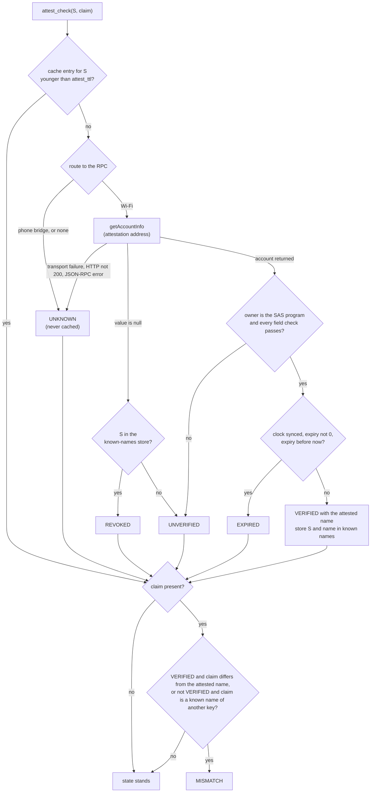

# Identity and attestation check

How the badge decides whether a public key is a verified identity: it derives the address of a Solana Attestation Service (SAS) account for that key, fetches it, checks every field, and reports one of six states.

- Audience: firmware engineers implementing `src/wallet/attest.cpp`, and operators who need to know when a badge shows red.
- Status: design, not yet built on hardware.
- Base: Solana OS, directory `firmware/solana-os/` at commit `812b8c7` of the [upstream repository](https://github.com/spacemandev-git/solana-defcon-badge-26/tree/812b8c7aca5c366d18c0b040fafd2999f7204d84/firmware/solana-os).

Tags: **[UPSTREAM]** exists in Solana OS at that commit, with the path. **[OURS]** is our design decision; "host-tested" next to it means the reference C code in [`../reference/code/`](../reference/code/) passed its tests on a development computer ([host tests](../testing/host-tests.md)). **[UNVERIFIED]** must be measured or confirmed on a badge or on devnet; a fallback is given.

Nothing in this document has run on a badge. The address derivation is written and host-tested against `sas-lib`. The account parser ([`attest_parse.c`](../reference/code/attest_parse.c)) is written and host-tested against an account built with `sas-lib`'s encoder. The fetch, the cache and the known-names store (`attest.cpp`) are specified here and not written; their declarations are in [`attest.h`](../reference/code/sdk-headers/wallet/attest.h). No attestation account has been read from devnet by this code; the account bytes used below were built with `sas-lib`'s own encoder.

## What is checked

For a subject public key `S` (the wallet that would receive a payment):

> Does the SAS program hold an attestation account for `S` under **our** credential and **our** schema, and what name does it carry?

The registry is the one the dashboard manages ([dashboard API](../../dashboard/API.md)): credential "MHacks Verified", schema `badge-identity` version 1 with one string field `name`, and one attestation per badge whose nonce is the badge's public key. Issuing creates the account. Revoking closes it, so "no account" means "not verified". [OURS: the dashboard is already built on SAS]

The result is one of six states. The numeric values are those of `wallet_identity_t` in `src/wallet/wallet.h`; Lua receives the lower-case string.

| State | Value | Lua string | Meaning | Identity line on the approval screen |
|---|---|---|---|---|
| `WALLET_ID_VERIFIED` | 0 | `verified` | a valid attestation exists for the key | `verified` (green tick) |
| `WALLET_ID_UNVERIFIED` | 1 | `unverified` | no attestation account, or a malformed one | `UNVERIFIED` (amber `!`) |
| `WALLET_ID_MISMATCH` | 2 | `mismatch` | the claimed name conflicts with the chain or with a known name | `NAME MISMATCH` (red cross) |
| `WALLET_ID_REVOKED` | 3 | `revoked` | this badge saw the key verified before, and the account is gone | `REVOKED` (red cross) |
| `WALLET_ID_EXPIRED` | 4 | `expired` | the attestation is past its expiry and the clock is trustworthy | `EXPIRED` (amber `!`) |
| `WALLET_ID_UNKNOWN` | 5 | `unknown` | could not check: offline, RPC error, or an untrusted route | `NOT CHECKED` (amber `!`) |

How these combine with presence into green, amber and red is in [signing gate, Severity and gestures](../wallet-core/signing-gate.md#severity-and-gestures). The screens are in [screens](../wallet-core/screens.md#screen-a).

## Derivation

The attestation account lives at a program-derived address. The badge computes it locally; it never asks anyone where the account is. [OURS, host-tested against `sas-lib` and the dashboard's `server/src/registry.js`]

```
attestation = find_program_address(
    seeds      = [ "attestation" (11 ASCII bytes), credential (32), schema (32), S (32) ],
    program_id = 22zoJMtdu4tQc2PzL74ZUT7FrwgB1Udec8DdW4yw4BdG )

find_program_address: for bump = 255 down to 0:
    h = SHA-256( seed_1 ‖ … ‖ seed_n ‖ [bump] ‖ program_id ‖ "ProgramDerivedAddress" )
    if h is NOT a point on edwards25519: return h
```

- `credential` and `schema` are the 32-byte addresses in config keys `cred` and `schema` (NVS namespace `wallet`). The dashboard prints them in `GET /api/status` under `registry.credential` and `registry.schema`.
- The badge does not derive those two. For reference they are `find_program_address(["credential", authority, "MHacks Verified"])` and `find_program_address(["schema", credential, "badge-identity", [0x01]])` under the same program. They depend on the authority keypair of the laptop that runs the dashboard, so they are configuration, not constants.
- "Not a point on the curve" is the whole reason a curve test is needed: a program-derived address must not be a valid Ed25519 public key. `sol_is_on_curve()` returns the same answer as `curve25519-dalek`'s point decompression, which is what Solana uses.

The C API, from [`sol.h`](../reference/code/sol.h) (lines 28 to 45):

```c
/* ---- ed25519 curve membership (for program-derived addresses) ------------ */
/* 1 if the 32 bytes decompress to a point on edwards25519, else 0.
   Same answer as curve25519-dalek CompressedEdwardsY::decompress().is_some(). */
int sol_is_on_curve(const uint8_t p[32]);

/* ---- program-derived addresses ------------------------------------------- */
/* find_program_address: tries bump 255..0, returns 0 and fills out/bump on success. */
int sol_find_pda(const sol_slice_t *seeds, size_t seed_count, const uint8_t program_id[32],
                 uint8_t out[32], uint8_t *bump);
/* Associated token account for (owner, mint) under the classic Token program. */
int sol_ata(const uint8_t owner[32], const uint8_t mint[32], uint8_t out[32]);
/* SAS attestation PDA: seeds "attestation", credential, schema, nonce(subject pubkey). */
int sol_sas_attestation_pda(const uint8_t credential[32], const uint8_t schema[32],
                            const uint8_t subject[32], uint8_t out[32]);

extern const uint8_t SOL_TOKEN_PROGRAM_ID[32];   /* TokenkegQfeZyiNwAJbNbGKPFXCWuBvf9Ss623VQ5DA */
extern const uint8_t SOL_ATA_PROGRAM_ID[32];     /* ATokenGPvbdGVxr1b2hvZbsiqW5xWH25efTNsLJA8knL */
extern const uint8_t SOL_SAS_PROGRAM_ID[32];     /* 22zoJMtdu4tQc2PzL74ZUT7FrwgB1Udec8DdW4yw4BdG */
```

Test vector (in `vectors.h`, checked by `test_sol.c`, lines 27 to 29):

| Input | Value |
|---|---|
| authority (for reference) | `FZEAS6Nayu6nMX1RVmoNwoPA4tu1KNM5pvfoXsQzei3K` |
| credential | `GvGHuhBZMp3v7bjtFFsog7L8jKKpDP54tKcvg1RHC3UP` (bump 254) |
| schema | `GE5gFbZ3Cgqx8boTotq8oDAXoxMK3UtDy3jaWX2P7gD2` (bump 255) |
| subject `S` | `Gn2GQYmcQkatE2594ov2ELKkYWZHwARG7FiAoPWSEcxq` (stand-in merchant) |
| **attestation address** | `EfuSfhFaNnNRhMeeBQPWQo2x4TxYKZT39iLn4hTaZiXN` (bump 254) |

The curve test is checked separately on 24 SHA-256 digests with known on-curve and off-curve answers, produced by an independent big-integer implementation in `vectors.mjs` that itself reproduces `sas-lib`'s and `@solana-program/token`'s addresses.

One derivation costs one SHA-256 and one curve test per bump tried (two for this vector). The time on the ESP32-S3 is not measured. [UNVERIFIED; target below 100 ms; fallback: derive once per subject and keep the address in the cache entry]

### Reference code

Both files below are copied into `firmware/solana-os/src/wallet/` unchanged. Pure C99, no heap. On the badge `sol_sha256()` wraps mbedTLS; on the host a portable SHA-256 is compiled in with `-DSOL_HOST_SHA256` ([`sol_sha256.c`](../reference/code/sol_sha256.c)).

[`sol_pda.c`](../reference/code/sol_pda.c):

```c
#include "sol.h"
#include <string.h>

const uint8_t SOL_TOKEN_PROGRAM_ID[32] = {
  0x06,0xdd,0xf6,0xe1,0xd7,0x65,0xa1,0x93,0xd9,0xcb,0xe1,0x46,0xce,0xeb,0x79,0xac,
  0x1c,0xb4,0x85,0xed,0x5f,0x5b,0x37,0x91,0x3a,0x8c,0xf5,0x85,0x7e,0xff,0x00,0xa9};
const uint8_t SOL_ATA_PROGRAM_ID[32] = {
  0x8c,0x97,0x25,0x8f,0x4e,0x24,0x89,0xf1,0xbb,0x3d,0x10,0x29,0x14,0x8e,0x0d,0x83,
  0x0b,0x5a,0x13,0x99,0xda,0xff,0x10,0x84,0x04,0x8e,0x7b,0xd8,0xdb,0xe9,0xf8,0x59};
const uint8_t SOL_SAS_PROGRAM_ID[32] = {
  0x0f,0x5e,0x9e,0xd5,0x37,0x1e,0x2c,0x70,0x89,0x8c,0xa9,0xfd,0x0e,0x77,0xc0,0x06,
  0x5c,0xab,0x5d,0xa0,0x2e,0x56,0x67,0x8b,0x27,0x13,0x38,0x2a,0xf3,0x74,0x59,0xb7};

int sol_find_pda(const sol_slice_t *seeds, size_t seed_count, const uint8_t program_id[32],
                 uint8_t out[32], uint8_t *bump) {
  static const char MARKER[] = "ProgramDerivedAddress";
  sol_slice_t parts[8 + 3];
  uint8_t b;
  int i;
  size_t k;
  if (seed_count > 8) return -1;
  for (k = 0; k < seed_count; k++) { if (seeds[k].n > 32) return -1; parts[k] = seeds[k]; }
  parts[seed_count].p = &b;                       parts[seed_count].n = 1;
  parts[seed_count + 1].p = program_id;           parts[seed_count + 1].n = 32;
  parts[seed_count + 2].p = (const uint8_t *)MARKER; parts[seed_count + 2].n = sizeof MARKER - 1;
  for (i = 255; i >= 0; i--) {
    b = (uint8_t)i;
    sol_sha256(parts, seed_count + 3, out);
    if (!sol_is_on_curve(out)) { if (bump) *bump = b; return 0; }
  }
  return -1;
}

int sol_ata(const uint8_t owner[32], const uint8_t mint[32], uint8_t out[32]) {
  sol_slice_t seeds[3];
  seeds[0].p = owner;                seeds[0].n = 32;
  seeds[1].p = SOL_TOKEN_PROGRAM_ID; seeds[1].n = 32;
  seeds[2].p = mint;                 seeds[2].n = 32;
  return sol_find_pda(seeds, 3, SOL_ATA_PROGRAM_ID, out, NULL);
}

int sol_sas_attestation_pda(const uint8_t credential[32], const uint8_t schema[32],
                            const uint8_t subject[32], uint8_t out[32]) {
  sol_slice_t seeds[4];
  seeds[0].p = (const uint8_t *)"attestation"; seeds[0].n = 11;
  seeds[1].p = credential; seeds[1].n = 32;
  seeds[2].p = schema;     seeds[2].n = 32;
  seeds[3].p = subject;    seeds[3].n = 32;
  return sol_find_pda(seeds, 4, SOL_SAS_PROGRAM_ID, out, NULL);
}
```

[`sol_curve.c`](../reference/code/sol_curve.c). The field arithmetic is TweetNaCl's (public domain). It is copied because upstream's `tweetnacl.c` keeps those functions file-static and must not be edited. [UPSTREAM `firmware/solana-os/src/identity/TWEETNACL-README`]

```c
/* Curve membership for PDA derivation. Field arithmetic is TweetNaCl's (public domain),
   copied here because tweetnacl.c keeps it file-static and must not be edited. */
#include "sol.h"
typedef int64_t gf[16];
static const gf GF1 = {1};
static const gf GF_D = {0x78a3, 0x1359, 0x4dca, 0x75eb, 0xd8ab, 0x4141, 0x0a4d, 0x0070,
                        0xe898, 0x7779, 0x4079, 0x8cc7, 0xfe73, 0x2b6f, 0x6cee, 0x5203};
static const gf GF_I = {0xa0b0, 0x4a0e, 0x1b27, 0xc4ee, 0xe478, 0xad2f, 0x1806, 0x2f43,
                        0xd7a7, 0x3dfb, 0x0099, 0x2b4d, 0xdf0b, 0x4fc1, 0x2480, 0x2b83};

static void car(gf o) {
  int i; int64_t c;
  for (i = 0; i < 16; i++) {
    o[i] += (1LL << 16);
    c = o[i] >> 16;
    o[(i + 1) * (i < 15)] += c - 1 + 37 * (c - 1) * (i == 15);
    o[i] -= c * 65536;
  }
}
static void sel(gf p, gf q, int b) {
  int64_t t, c = ~(int64_t)(b - 1); int i;
  for (i = 0; i < 16; i++) { t = c & (p[i] ^ q[i]); p[i] ^= t; q[i] ^= t; }
}
static void pack(uint8_t *o, const gf n) {
  int i, j, b; gf m, t;
  for (i = 0; i < 16; i++) t[i] = n[i];
  car(t); car(t); car(t);
  for (j = 0; j < 2; j++) {
    m[0] = t[0] - 0xffed;
    for (i = 1; i < 15; i++) { m[i] = t[i] - 0xffff - ((m[i - 1] >> 16) & 1); m[i - 1] &= 0xffff; }
    m[15] = t[15] - 0x7fff - ((m[14] >> 16) & 1);
    b = (int)((m[15] >> 16) & 1);
    m[14] &= 0xffff;
    sel(t, m, 1 - b);
  }
  for (i = 0; i < 16; i++) { o[2 * i] = (uint8_t)(t[i] & 0xff); o[2 * i + 1] = (uint8_t)(t[i] >> 8); }
}
static int neq(const gf a, const gf b) {
  uint8_t c[32], d[32]; unsigned x = 0; int i;
  pack(c, a); pack(d, b);
  for (i = 0; i < 32; i++) x |= (unsigned)(c[i] ^ d[i]);
  return x != 0;
}
static void unpack(gf o, const uint8_t *n) {
  int i;
  for (i = 0; i < 16; i++) o[i] = n[2 * i] + ((int64_t)n[2 * i + 1] << 8);
  o[15] &= 0x7fff;
}
static void add(gf o, const gf a, const gf b) { int i; for (i = 0; i < 16; i++) o[i] = a[i] + b[i]; }
static void sub(gf o, const gf a, const gf b) { int i; for (i = 0; i < 16; i++) o[i] = a[i] - b[i]; }
static void mul(gf o, const gf a, const gf b) {
  int64_t t[31]; int i, j;
  for (i = 0; i < 31; i++) t[i] = 0;
  for (i = 0; i < 16; i++) for (j = 0; j < 16; j++) t[i + j] += a[i] * b[j];
  for (i = 0; i < 15; i++) t[i] += 38 * t[i + 16];
  for (i = 0; i < 16; i++) o[i] = t[i];
  car(o); car(o);
}
static void pow2523(gf o, const gf in) {
  gf c; int a;
  for (a = 0; a < 16; a++) c[a] = in[a];
  for (a = 250; a >= 0; a--) { mul(c, c, c); if (a != 1) mul(c, c, in); }
  for (a = 0; a < 16; a++) o[a] = c[a];
}

int sol_is_on_curve(const uint8_t p[32]) {
  gf y, num, den, den2, den4, den6, t, x, chk;
  unpack(y, p);                       /* y, sign bit dropped */
  mul(num, y, y);                     /* y^2 */
  mul(den, num, GF_D);                /* d*y^2 */
  sub(num, num, GF1);                 /* u = y^2 - 1 */
  add(den, GF1, den);                 /* v = d*y^2 + 1 */
  mul(den2, den, den); mul(den4, den2, den2); mul(den6, den4, den2);
  mul(t, den6, num); mul(t, t, den);
  pow2523(t, t);
  mul(t, t, num); mul(t, t, den); mul(t, t, den); mul(x, t, den);   /* candidate x */
  mul(chk, x, x); mul(chk, chk, den);
  if (neq(chk, num)) mul(x, x, GF_I);
  mul(chk, x, x); mul(chk, chk, den);
  return neq(chk, num) ? 0 : 1;       /* v*x^2 == u  <=>  point exists */
}
```

## Fetch

One HTTP POST to config `rpc_url` with `Content-Type: application/json`, through the wallet's RPC client ([transaction building, RPC client](../protocol/transaction-building.md#rpc-client)). Timeout 4000 ms.

```json
{"jsonrpc":"2.0","id":1,"method":"getAccountInfo","params":["<attestation address, base58>",{"encoding":"base64","commitment":"confirmed"}]}
```

The response has `result.value` equal to `null` when there is no account, or:

```json
{"data":["<base64>","base64"],"owner":"<base58>","lamports":…,"space":…}
```

Steps:

1. Take `result.value`. `null` means no account.
2. Take `owner`. It must be the SAS program id `22zoJMtdu4tQc2PzL74ZUT7FrwgB1Udec8DdW4yw4BdG`.
3. Base64-decode `data[0]`. A valid account is 178 to 209 bytes (240 to 280 base64 characters).
4. Check the bytes against the layout below.

## Account layout

`D` is the value of `data_len`. All integers are little-endian. Source of the layout: the SAS program's `attestation.rs` and `sas-lib` 1.0.10, confirmed by decoding the test vector with `sas-lib`'s own decoder.

| Offset | Size | Type | Field | Check |
|---|---|---|---|---|
| 0 | 1 | u8 | discriminator | `== 2` (Attestation; Credential is 0, Schema is 1) |
| 1 | 32 | bytes | nonce | `== S` |
| 33 | 32 | bytes | credential | `== cred` (config) |
| 65 | 32 | bytes | schema | `== schema` (config) |
| 97 | 4 | u32 LE | `data_len` `D` | `5 <= D <= 36`; total account length `== 173 + D` |
| 101 | 4 | u32 LE | `name_len` `N` | `N == D - 4` and `1 <= N <= 32` |
| 105 | N | ASCII | name | printable ASCII `0x20..0x7E`, no leading or trailing space, no two consecutive spaces |
| 101 + D | 32 | bytes | signer | not checked (the program enforced it at creation) |
| 133 + D | 8 | i64 LE | expiry | seconds since 1970; 0 means never. See [Decision](#decision) |
| 141 + D | 32 | bytes | token_account | ignored |

1 + 32 + 32 + 32 + 4 + D + 32 + 8 + 32 = 173 + D. The data is one Borsh string (4-byte length, then the bytes), so `D = 4 + N` and the account is `177 + N` bytes.

Checking the nonce, credential and schema inside the account is not redundant with deriving the address from them: together with the owner check it means a forged RPC answer has to be a complete, consistent account, and a parser bug in one place does not silently accept another credential's attestation.

Test vector `V_ACCT` in `vectors.h`: the account for name `MHacks Merch`, 189 bytes.

```
offset  bytes
0       02                                                                discriminator = 2
1       ea67df107eddb995d02c641549ff5dd48158ea41ef40bc3738ac3bdd0eb5bdca  nonce = Gn2G…Ecxq
33      ec8460806cc3043797632b99cf35fe5c0379ecc008202dc8ba194417fd4f64b4  credential GvGH…C3UP
65      e239247692aaf2ebb698bf007122ec324d2bff0bd7a627cbf045644dbf23ee25  schema GE5g…7gD2
97      10 00 00 00                                                       data_len D = 16
101     0c 00 00 00                                                       name_len N = 12
105     4d 48 61 63 6b 73 20 4d 65 72 63 68                               "MHacks Merch"
117     d84515fd2b53a65ca8b4b7db093c4d3fd0e314fb41d944b93830ac25be996682  signer (FZEA…ei3K)
149     00 24 e9 6a 00 00 00 00                                           expiry = 1793664000
157     00 (32 times)                                                     token_account
```

`test_sol.c` (line 77) checks the offsets of the discriminator, nonce, `data_len`, `name_len` and name on this vector. The full parser has its own suite.

### Parser

`attest_parse()` implements the table. It is reference code: [`attest_parse.c`](../reference/code/attest_parse.c), declared in [`attest.h`](../reference/code/sdk-headers/wallet/attest.h) and copied into `firmware/solana-os/src/wallet/` unchanged. It takes the decoded account bytes, the subject, and the configured credential and schema; it returns 0 and fills the name (a buffer of `ATTEST_NAME_MAX + 1` = 33 bytes) and the expiry, or -1 if any check fails. The owner check (step 2 of [Fetch](#fetch)) and the expiry decision are the caller's. [OURS, host-tested]

```c
/* attest_parse(): field checks for one SAS attestation account under the configured credential and schema.
   Pure C99, no heap. Declared in attest.h. Account layout (little-endian):
     0 discriminator (2) | 1 nonce[32] | 33 credential[32] | 65 schema[32] | 97 data_len D (u32)
     101 name_len N (u32, == D - 4) | 105 name[N] | 101+D signer[32] | 133+D expiry (i64) | 141+D token_account[32]
   Total length 173 + D. */
#include <string.h>
#include "attest.h"

static uint32_t rd_u32le(const uint8_t *p) {
  return (uint32_t)p[0] | (uint32_t)p[1] << 8 | (uint32_t)p[2] << 16 | (uint32_t)p[3] << 24;
}

int attest_parse(const uint8_t *acct, size_t len, const uint8_t subject[32], const uint8_t cred[32],
                 const uint8_t schema[32], char name_out[ATTEST_NAME_MAX + 1], int64_t *expiry_out) {
  uint32_t d, n, i;
  uint64_t e = 0;
  if (len < 105) return -1;                                   /* must reach both length fields */
  if (acct[0] != 2) return -1;                                /* discriminator: Attestation */
  if (memcmp(acct + 1, subject, 32) != 0) return -1;          /* nonce == subject public key */
  if (memcmp(acct + 33, cred, 32) != 0) return -1;            /* our credential */
  if (memcmp(acct + 65, schema, 32) != 0) return -1;          /* our schema */
  d = rd_u32le(acct + 97);
  if (d < 5 || d > 36 || len != 173 + (size_t)d) return -1;   /* data_len and total length agree */
  n = rd_u32le(acct + 101);
  if (n != d - 4 || n < 1 || n > ATTEST_NAME_MAX) return -1;  /* one Borsh string, nothing else */
  if (acct[105] == ' ' || acct[105 + n - 1] == ' ') return -1;
  for (i = 0; i < n; i++) {
    const uint8_t ch = acct[105 + i];
    if (ch < 0x20 || ch > 0x7E) return -1;                    /* printable ASCII only */
    if (ch == ' ' && i + 1 < n && acct[106 + i] == ' ') return -1;   /* no two consecutive spaces */
  }
  memcpy(name_out, acct + 105, n);
  name_out[n] = '\0';
  for (i = 0; i < 8; i++) e |= (uint64_t)acct[133 + d + i] << (8 * i);   /* i64 LE, 0 = never */
  *expiry_out = (int64_t)e;
  return 0;
}
```

The suite is [`test_attest.c`](../reference/code/test_attest.c), 21 `CHECK` statements at lines 15 to 48; it prints `all attest tests passed` ([host tests](../testing/host-tests.md#test_attestc)):

- the 189-byte vector `V_ACCT` yields `MHacks Merch` and expiry 1793664000;
- refused: a wrong discriminator (0 and 1), another subject in the nonce, another credential, another schema, a `data_len` that disagrees with the length, a `name_len` that is not `data_len - 4` (two values), a control byte, DEL and a non-ASCII byte in the name, a leading space, a trailing space, two consecutive spaces, three wrong lengths (one byte short, one byte long, 104 bytes), and the right account asked about another subject;
- an expiry of 0 is returned as 0 (never);
- a 1-character and a 32-character name are accepted, and 33 characters are refused.

## Decision

`attest_check(S, claim)` produces the state in this order. `claim` is the name the counterparty used for itself, from a REQ, an IAM or the app's signing hint; it may be absent.

1. Transport failure, HTTP status other than 200, a JSON-RPC error, or the route is the phone bridge: **UNKNOWN**.
2. `value == null`: **REVOKED** if `S` is in the known-names store, otherwise **UNVERIFIED**.
3. `owner` is not the SAS program id, or any check in the layout table fails: **UNVERIFIED** (logged as `[attest] malformed`).
4. The clock is synced (`clock_synced`: the SNTP sync callback has fired and `time(nullptr) > 1750000000`, see [Clock](#clock)), `expiry != 0` and `expiry < now`: **EXPIRED**. If the clock is not synced the expiry is not evaluated. [OURS: the dashboard also treats an expired attestation as verified; see the note above `expiryOf` in `dashboard/server/src/registry.js`]
5. Otherwise **VERIFIED** with the attested name. Write `{S, name}` to the known-names store.
6. Compare with the claim, byte for byte:
   - VERIFIED, a claim is present, and `claim != attested name`: **MISMATCH**.
   - Not VERIFIED, and the claim equals a name the known-names store holds for a **different** key: **MISMATCH** (someone is using a name this badge has seen verified for another key).
   - Otherwise the state from steps 1 to 5 stands.



Steps 1 to 5 depend only on `S`, so their result is what the cache stores. Step 6 depends on the claim and is evaluated on every call.

What the approval screen draws from the result ([Screen A to C](../wallet-core/screens.md#screen-a)):

- Row 2 (the recipient name) shows the **attested** name only when the state is VERIFIED. In every other state it shows the literal `unverified badge`, or `token account` when the recipient wallet is unknown. A claimed name is never drawn in that row. [OURS: never present an impostor as verified]
- A claim appears only in a detail line, chosen by the state: `claims: <name>` when the state is MISMATCH; `calls itself: <name>` when a claim exists and the state is UNVERIFIED, REVOKED, EXPIRED or UNKNOWN. No claim line is drawn when the state is VERIFIED, because the attested name is already in row 2.
- For a MISMATCH against the known-names store the screen adds `<name> is verified for <short address>`, naming the key that really holds the name.

### What a revocation looks like

1. The admin revokes on the dashboard's Registry page. The dashboard sends `CloseAttestation`; the account is closed.
2. Any badge whose cache entry for that key is older than `attest_ttl` (default 30 s) fetches again at its next payment attempt and gets `value == null`.
3. If that badge had seen the key verified before (it is in the known-names store): **REVOKED**, red. If it had not: **UNVERIFIED**, amber, the same as a key that was never verified.

So "revoked" is a statement about this badge's memory, not about chain history. The badge does not look for a closed account's past. The demo makes sure the memory is there: see [Known names](#known-names).

## Cache

- RAM only, 16 entries `{subject, status, name, expiry, fetched_ms, flags}`, least-recently-used eviction. [OURS]
- An entry is fresh for `attest_ttl` seconds (config, default 30).
- The signing gate re-fetches a stale entry before it shows the approval screen ([policy checks](../wallet-core/signing-gate.md#policy-checks), check 13). During the fetch it shows [Screen H](../wallet-core/screens.md#screen-h) (`Checking identity...`); CANCEL works and the fetch gives up after 4 s.
- A revocation therefore shows at the next payment attempt at most 30 s after it lands on chain. This is what "within one refresh" (F15) means here, and it bounds "cached for the session" (F10) to 30 s.
- Within the 30 s a second payment to the same key makes no RPC call for the attestation.
- Home refreshes the badge's own attestation every 30 s (`attest.self()`).
- UNKNOWN is never cached, so the next call tries again.
- Changing config `mint`, `cred`, `schema` or `rpc_url` clears the cache.

## Known names

File `/wallet/known.bin` on LittleFS: 16 fixed records of 72 bytes, least-recently-seen eviction. It survives reboots. [OURS]

| Offset | Size | Field |
|---|---|---|
| 0 | 32 | `pubkey` |
| 32 | 1 | `name_len` |
| 33 | 32 | `name` |
| 65 | 4 | `last_seen_uptime_s` |
| 69 | 3 | reserved |

It has two jobs:

- Tell **REVOKED** from never verified: a key in the store whose account is gone was verified before.
- Catch a second badge claiming a name this badge has already seen verified for another key (the impostor demo).

A record is written every time a key is found VERIFIED, whoever asked: the signing gate's own check before an approval screen, or an app's `attest.check`. The store is not reachable from Lua (`badge.storage` is confined to `/apps/<id>/` [UPSTREAM `firmware/solana-os/src/lua_sdk/lua_runtime.cpp:404-410`]). Firmware reads it with `attest_known_lookup()` and `attest_known_by_name()` (exact byte comparison), counts it with `attest_known_count()` and clears it with `attest_forget_known()` ([`attest.h`](#attesth)). The user clears it from Settings → Wallet → "Forget known names". Flashing a filesystem image (`write_flash 0x670000`) erases it too.

Red `NAME MISMATCH` and `REVOKED` need the payer's badge to have seen the real merchant verified once. The pre-event seeding step and the demo order guarantee that. A badge that has never seen the merchant shows amber `UNVERIFIED` — still never `verified`.

The seeding step is done once on every judge badge before the event ([pre-event checklist](../guides/pre-event-checklist.md#10-seed-known-names-on-each-judge-badge), item 10; the same step is setup step 6 in [attack scripts](../testing/attack-scripts.md#before-any-flow)): with the merchant attested and requesting 10.00, open Pay on the judge badge, select the request, wait for the green Screen A showing `MHacks Merch` and `verified`, and press CANCEL. The attestation check that produced the green screen wrote the merchant to `/wallet/known.bin`. Between seeding and the demo, never use "Forget known names" and never flash a filesystem image.

## Transport trust

The attestation comes from one RPC endpoint. How far it can be trusted depends on the route. [OURS]

| Route | TLS | Result |
|---|---|---|
| Wi-Fi, CA named `rpc-ca` installed in `cert_store` | validated (`WiFiClientSecure::setCACert`, the same pattern as upstream's broker client, `firmware/solana-os/src/net/broker_client.cpp:332-357`) | normal |
| Wi-Fi, no `rpc-ca` | not validated (`setInsecure`) | normal, plus the detail line `RPC TLS not pinned` and flag `ATTEST_F_TLS_UNPINNED` (`BADGE_ATTEST_F_TLS_UNPINNED` in the badge API) |
| Phone bridge | terminated on the phone [UPSTREAM `firmware/solana-os/README.md:897-920`] | identity is **UNKNOWN** with the detail line `checked via phone` and flag `ATTEST_F_VIA_BRIDGE`; balances and `sendTransaction` still work |

Upstream's `badge.http` over Wi-Fi does not validate certificates at all [UPSTREAM `firmware/solana-os/src/net/net_route.cpp:34-40`], which is why the wallet has its own client.

Install the CA once per badge. It is the root certificate that signs the RPC host's certificate, in PEM:

```bash
# show the chain the RPC host presents; save the root as rpc-ca.pem
openssl s_client -showcerts -connect api.devnet.solana.com:443 </dev/null

# upload it under the name the wallet looks for
cd firmware/solana-os
tools/badge-push.py --host <badge-ip> --token <pairing code> cert rpc-ca.pem --name rpc-ca
```

`--name rpc-ca` is required: without it the tool stores the certificate under the lower-cased file name, `rpc-ca.pem`, and the wallet would not find it. [UPSTREAM `firmware/solana-os/tools/badge-push.py:389`]

Which root `api.devnet.solana.com` chains to on the day is not known in advance. [UNVERIFIED; fetch it on the day; without a pin the screen says so]

What the pin does and does not give:

- Without the pin, an attacker on the hotspot can forge "verified" or hide a revocation.
- With the pin, the RPC operator still can. No light-client proof is attempted.
- A signed transaction cannot be altered by the transport on any route, only dropped.

Whether a pinned TLS handshake checks certificate validity dates while the badge clock is unset is not known; upstream's pinned broker client makes no provision for it. [UNVERIFIED] The rule that covers both answers: [OURS]

1. The RPC client waits up to 5 s after Wi-Fi connects for the first SNTP sync before its first pinned request.
2. If pinned handshakes still fail with a date error, remove the certificate and run unpinned:

   ```bash
   tools/badge-push.py --host <badge-ip> --token <pairing code> rmcert rpc-ca
   ```

   The screen then says `RPC TLS not pinned`.

## Clock

The badge has no real-time clock. [UPSTREAM `firmware/solana-os/README.md`, "The clock problem"]

- `configTime(0, 0, "pool.ntp.org", "time.google.com")` is called once when Wi-Fi first connects. [OURS]
- `clock_synced` is set by the SNTP sync callback (`sntp_set_time_sync_notification_cb`) and additionally requires `time(nullptr) > 1750000000` (`ATTEST_CLOCK_SYNCED_AFTER`). It is not inferred from the time alone. It gates the expiry check (step 4 of the decision). Settings → Wallet shows `Clock  synced|not synced`. [OURS]
- The reason for the callback: upstream seeds the clock from the firmware build date when the badge connects to a WPA2-Enterprise network [UPSTREAM `firmware/solana-os/src/net/wifi_mgr.cpp:45-73`, called at `:200`]. A build date passes the threshold test without any time server having answered; with the callback flag, the seeding cannot set `clock_synced`. On a phone hotspot (WPA2-Personal) that path is not taken at all.
- Whether the installed Arduino core exposes the SNTP sync callback is not confirmed. [UNVERIFIED; fallback: use the time threshold alone and note that the WPA2-Enterprise path can then read "synced"]
- Whether SNTP gets through a phone hotspot is not known. [UNVERIFIED; without it the expiry is not evaluated, which matches the dashboard's behaviour]
- The RPC client waits up to 5 s after Wi-Fi connects for the first sync before its first pinned request ([Transport trust](#transport-trust)).

Attestations issued by the dashboard expire 30 days after issue, longer than the event, so the expiry check is not expected to fire.

## Name rule

Three places apply a name rule. They differ slightly.

| Where | Rule | Source |
|---|---|---|
| Dashboard, when issuing | trimmed, 1 to 32 characters, printable ASCII (`/^[\x20-\x7E]+$/`) | `dashboard/server/src/http.js`, `validate.name` |
| Badge, attested name (this document) | 1 to 32 bytes, printable ASCII `0x20..0x7E`, no leading or trailing space, **no two consecutive spaces** | [Account layout](#account-layout) |
| Badge, claimed name in REQ and IAM | 1 to 32 bytes, printable ASCII, no leading or trailing space | `pay_name_ok()` in [`pay_proto.c`](../reference/code/pay_proto.c) |

Consequences:

- A name issued with two consecutive spaces is accepted by the dashboard and rejected by the badge as malformed, so the badge shows that key as `UNVERIFIED`. Do not issue such names.
- Comparison between a claim and an attested name is byte for byte. `MHacks Merch` and `mhacks merch` are different names.
- ASCII still has look-alikes (`I`/`l`/`1`, `O`/`0`, `rn`/`m`). The badge shows a name only when it is attested, always shows the short address under it, and flags an exact duplicate on a different key. What remains is an admin issuing two look-alike names to two keys.
- The built-in font is ASCII only [UPSTREAM `firmware/solana-os/src/hal/display.cpp:160-185`], which is why non-ASCII names are refused rather than drawn wrongly.

## API

Apps reach the check through `badge.attest` (permission `net`); see the [API reference](../app-platform/api-reference.md#badgeattest).

| Lua | Returns | Notes |
|---|---|---|
| `attest.check(pubkey [, claimed_name [, force]])` | `{status, name, expiry, age_ms, cached, flags}` | blocks for a fetch when the cache entry is stale or `force` is set; `status` is one of the six strings above |
| `attest.self([force])` | same table | the badge's own key |
| `attest.cached(pubkey)` | table or `nil` | never blocks; `nil` alone when nothing is cached |

`attest.check` and `attest.self` return `nil, err` only for `denied`, `bad_arg` and `not_ready` (credential or schema not configured). A network failure is not an error: it is a result table with `status = "unknown"`. `attest.cached` can fail only with `denied`. In Lua `expiry` is an integer number of seconds, 0 for never; a value above 2147483647 is reported as 2147483647.

The C ABI, from `src/app_host/badge_api.h` ([listing](../reference/code/sdk-headers/app_host/badge_api.h)):

```c
/* ---- attest (CAP_NET) ---- */
typedef enum { BADGE_ATTEST_VERIFIED = 0, BADGE_ATTEST_UNVERIFIED = 1, BADGE_ATTEST_MISMATCH = 2, BADGE_ATTEST_REVOKED = 3,
               BADGE_ATTEST_EXPIRED = 4, BADGE_ATTEST_UNKNOWN = 5 } badge_attest_status_t;   /* == wallet_identity_t */
typedef struct { uint8_t status;   /* badge_attest_status_t */
                 char name[33]; int64_t expiry; uint32_t age_ms; uint8_t flags; } badge_attest_t;
#define BADGE_ATTEST_F_CACHED 0x01
#define BADGE_ATTEST_F_TLS_UNPINNED 0x02
#define BADGE_ATTEST_F_VIA_BRIDGE 0x04
/* denied, bad_arg, not_ready (cred/schema unset). A network failure is BADGE_OK with status BADGE_ATTEST_UNKNOWN. */
badge_err_t badge_attest_check(const uint8_t subject[32], const char *claimed_name, bool force, badge_attest_t *out);
badge_err_t badge_attest_self(bool force, badge_attest_t *out);
bool        badge_attest_cached(const uint8_t subject[32], badge_attest_t *out);
```

`badge_attest_t.status` and `attest_result_t.status` carry the `wallet_identity_t` values: 0 verified, 1 unverified, 2 mismatch, 3 revoked, 4 expired, 5 unknown. The C names are `BADGE_ATTEST_VERIFIED` to `BADGE_ATTEST_UNKNOWN` (`badge_attest_status_t`).

An app's own call to `attest.check` is for its own display. The approval screen never uses it: the signing gate runs the check itself, for the recipient it resolved from the transaction bytes.

### attest.h

Inside the firmware the check is `src/wallet/attest.h`: the parser, `attest_check`, `attest_self`, `attest_cached`, the result struct, the flags and the known-names functions. The listing ([`sdk-headers/wallet/attest.h`](../reference/code/sdk-headers/wallet/attest.h)) is syntax-checked as C99 and C++17; `attest_parse()` is the only function in it that is implemented and tested. [OURS]

```c
/* src/wallet/attest.h - Solana Attestation Service check: fetch, parse, cache, known names.
   attest_parse() is pure C99 (attest_parse.c, host-tested); the rest is attest.cpp. Main loop only. */
#ifndef ATTEST_H
#define ATTEST_H
#include <stdbool.h>
#include <stddef.h>
#include <stdint.h>
#include "wallet.h"
#ifdef __cplusplus
extern "C" {
#endif

#define ATTEST_NAME_MAX          32
#define ATTEST_CACHE_ENTRIES     16
#define ATTEST_KNOWN_ENTRIES     16
#define ATTEST_KNOWN_RECORD_LEN  72     /* pubkey[32] name_len[1] name[32] last_seen_uptime_s[4 LE] reserved[3] */
#define ATTEST_RPC_TIMEOUT_MS  4000
#define ATTEST_CLOCK_SYNCED_AFTER 1750000000   /* time() above this means the clock was set */

#define ATTEST_F_CACHED        0x01     /* answered from the RAM cache, no network call */
#define ATTEST_F_TLS_UNPINNED  0x02     /* fetched over TLS without the rpc-ca pin */
#define ATTEST_F_VIA_BRIDGE    0x04     /* only route was the phone bridge; status is UNKNOWN */
#define ATTEST_F_NAME_KNOWN_ELSEWHERE 0x08   /* MISMATCH because the claim is a known name of another key */

typedef struct {
  wallet_identity_t status;             /* numeric values are the wallet_identity_t values, 0..5 */
  char     name[ATTEST_NAME_MAX + 1];   /* attested name when status is VERIFIED or MISMATCH-with-attestation, else "" */
  int64_t  expiry;                      /* seconds since 1970, 0 = never or not attested */
  uint32_t age_ms;                      /* since the fetch that produced this result */
  uint8_t  flags;                       /* ATTEST_F_* */
  uint8_t  other_key[32];               /* with ATTEST_F_NAME_KNOWN_ELSEWHERE: the key that holds the claimed name */
} attest_result_t;

/* Field checks for one attestation account under the configured credential and schema (pure, no I/O).
   Checks: length, discriminator 2, nonce == subject, credential, schema, data_len/name_len consistency,
   name 1..32 printable ASCII without leading/trailing/double spaces.
   Returns 0 and fills name_out (NUL-terminated) and *expiry_out; -1 if any check fails. */
int attest_parse(const uint8_t *acct, size_t len, const uint8_t subject[32], const uint8_t cred[32],
                 const uint8_t schema[32], char name_out[ATTEST_NAME_MAX + 1], int64_t *expiry_out);

void attest_begin(void);                /* loads /wallet/known.bin */
void attest_clear_cache(void);          /* on config change of mint, cred, schema or rpc_url */

/* Blocking (<= ATTEST_RPC_TIMEOUT_MS) unless a fresh cache entry exists and force is false.
   claimed_name may be NULL. BADGE_OK with out->status set (network failure gives WALLET_ID_UNKNOWN,
   never an error). BADGE_ERR_BAD_ARG for NULL subject/out; BADGE_ERR_NOT_READY when cred or schema
   is not configured. */
badge_err_t attest_check(const uint8_t subject[32], const char *claimed_name, bool force, attest_result_t *out);
/* The badge's own key, no claim. */
badge_err_t attest_self(bool force, attest_result_t *out);
/* Never blocks. False when there is no cache entry (fresh or stale) for subject. */
bool attest_cached(const uint8_t subject[32], attest_result_t *out);

/* Known-names store (/wallet/known.bin). */
bool   attest_known_lookup(const uint8_t subject[32], char name_out[ATTEST_NAME_MAX + 1]);
bool   attest_known_by_name(const char *name, uint8_t key_out[32]);   /* exact byte comparison */
size_t attest_known_count(void);
void   attest_forget_known(void);       /* Settings > Wallet > Forget known names */

#ifdef __cplusplus
}
#endif
#endif
```

The badge API functions forward to these: `badge_attest_check` to `attest_check`, `badge_attest_self` to `attest_self`, `badge_attest_cached` to `attest_cached`. Screens F and G read the badge's own state with `attest_cached(own key)`, which makes no network call; when nothing is cached they show `NOT CHECKED`.

## Fallback if SAS is not usable

For the PRD risk "SAS integration takes too long": a signed allowlist baked into the firmware, an array of `{pubkey, name}` in `wallet_defaults.h`. The states and screens stay the same; there is no revocation. [OURS]

## Requirements covered

| Id | Requirement | Where |
|---|---|---|
| F10 | Payee key has a valid, unrevoked "MHacks Verified" attestation; result cached | [Derivation](#derivation), [Fetch](#fetch), [Account layout](#account-layout), [Decision](#decision), [Cache](#cache) |
| F11 | Approval screen shows verified, unverified (amber) or mismatch (red) | [What is checked](#what-is-checked), [Decision](#decision) |
| F15 | Revocation reflected on badges within one refresh | [What a revocation looks like](#what-a-revocation-looks-like), [Cache](#cache), [Known names](#known-names) |
| Goal 2 | An impostor is never presented as verified | [Decision](#decision), [Known names](#known-names) |

## Open items

| Item | Status | Fallback or how to resolve |
|---|---|---|
| No attestation account has been read from devnet by this code; the dashboard's SAS transactions have only been simulated | [UNVERIFIED] | issue one on the Registry page, fetch it with `getAccountInfo`, compare with the layout |
| Derivation time on the ESP32-S3 | [UNVERIFIED] | measure; keep the derived address in the cache entry |
| HTTPS call time to the RPC through a hotspot (the 4 s identity timeout depends on it) | [UNVERIFIED] | measure; the screen shows `NOT CHECKED` on timeout |
| Which CA root to pin for the RPC host | [UNVERIFIED] | fetch on the day; unpinned is shown on screen |
| Whether a pinned TLS handshake checks certificate validity dates while the badge clock is unset (U18) | [UNVERIFIED] | wait up to 5 s for SNTP before the first pinned request; if it still fails, remove `rpc-ca` and run unpinned (shown on screen) |
| SNTP through the hotspot | [UNVERIFIED] | expiry is not evaluated without it |
| SNTP sync callback availability in the Arduino core, `sntp_set_time_sync_notification_cb` (U23) | [UNVERIFIED] | fall back to the time threshold alone and note that the WPA2-Enterprise path can then read "synced" |
| `attest.cpp` (fetch, cache, known names) is not written; `attest.h` is syntax-checked only | specified here | `attest_parse.c` is host-tested and is copied unchanged |
