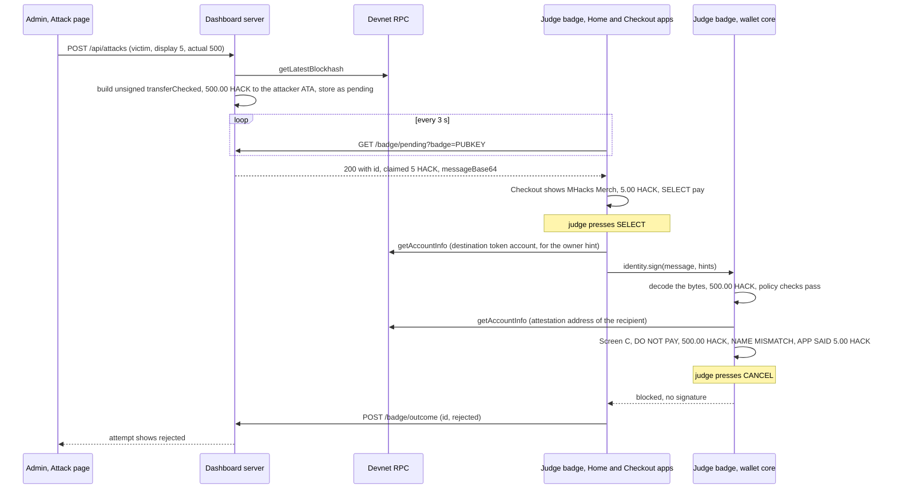

# Dashboard integration

What the badge firmware and the laptop dashboard need from each other: the values each side must be given, the one HTTP exchange between them (the attack demo), and how every open `BADGE-GAP` in the dashboard is closed.

- Audience: whoever sets up and runs the demo; firmware engineers implementing the Checkout app and the push-server routes.
- Status: design, not yet built on hardware.
- Base: Solana OS, directory `firmware/solana-os/` at commit `812b8c7` of the [upstream repository](https://github.com/spacemandev-git/solana-defcon-badge-26/tree/812b8c7aca5c366d18c0b040fafd2999f7204d84/firmware/solana-os). The dashboard is the code in [`dashboard/`](../../../dashboard/) of this repository, documented in [`docs/dashboard/`](../../dashboard/).

Tags: **[UPSTREAM]** exists in Solana OS at that commit, with the path. **[OURS]** is our design decision. **[UNVERIFIED]** must be confirmed on a badge or on devnet; a fallback is given. Statements about the dashboard are quoted from its source as of 2026-10-03 and name the file and function.

Nothing in this document has run on a badge. On the dashboard side the badge listener's answers (`204`, `400`, `404`, and `200` and `409` with a hand-inserted attempt holding dummy bytes) have been exercised with `curl`. A real attempt has not been built or served, because that needs the mint, and nothing has been sent on devnet with the project's own mint ([dashboard runbook, "What is verified"](../../dashboard/RUNBOOK.md#what-is-verified)).

## What crosses between badge and dashboard

| Flow | Path | Direct contact? |
|---|---|---|
| Payments appear in the dashboard feed | badge → devnet → dashboard (it watches the chain for `transferChecked` of the HACK mint) | no |
| Verification status reaches the badge | dashboard → devnet (SAS attestation account) → badge (`getAccountInfo`) | no |
| Badge public key and key location reach the dashboard | operator copies them from the badge into `badges.json` | by hand, once |
| Mint, registry addresses and RPC URL reach the badge | operator copies them from `/api/status` into the badge's wallet config | by hand, once |
| Tampered transaction for the attack demo | badge polls the dashboard's **badge listener** over hotspot Wi-Fi | yes, HTTP on port 8788 |

The badge listener is the only place the two talk to each other, and only the Checkout demo uses it.

## Closing each BADGE-GAP

The dashboard marks every dependency on badge hardware or firmware with `BADGE-GAP(<id>)`; the list is [`docs/dashboard/BADGE-GAPS.md`](../../dashboard/BADGE-GAPS.md). There are seven ids. Each one is closed as follows.

| Gap id | Badge-side deliverable | Dashboard-side value to set |
|---|---|---|
| `badge-pubkeys` | The public key is shown on Settings → Identity and returned by `GET /api/identity` as `pubkey`. [UPSTREAM `firmware/solana-os/src/net/push_server.cpp:772-782`] No new firmware is needed. | File [`dashboard/server/config/badges.json`](../../../dashboard/server/config/badges.json): `badges[n].pubkey` = the base58 key, `badges[n].standIn` = `false`. Restart the server. |
| `key-location` | The same screen and endpoint report where the key lives: upstream field `source` is `secure element`, `software` or `none`. [UPSTREAM] Our push-server patch adds `"key_location":"se050"\|"software"` so the value can be pasted as is. [OURS] | Same file: `badges[n].keyLocation` = `"se050"` or `"software"`. |
| `token-accounts` | The badge always keeps HACK in, and pays from, its associated token account `ATA(pubkey, mint)` ([transaction building, ATA derivation](../protocol/transaction-building.md#ata-derivation)). `/api/identity` gains `"token_account"` for cross-checking. [OURS] | Same file: leave `badges[n].tokenAccount` as `null`. The dashboard then derives the same address. |
| `hack-mint` | Wallet config key `mint` holds the mint address and `decimals` the mint's decimals. The wallet is not ready until `mint` is set. [OURS] | File `dashboard/.env`: `HACK_MINT=<mint address>`. `npm run devnet:setup` creates the mint and writes this line. Restart the server. The badge's `mint` and `decimals` must equal `/api/status` → `token.mint` and `token.decimals`. |
| `attack-delivery` | The Home app polls `GET {dash_url}/badge/pending?badge=<pubkey>` every 3 s over hotspot Wi-Fi and launches the Checkout app when an attempt it has not launched for is pending. Config key `dash_url`; empty disables polling. [OURS] | File `dashboard/.env`: `BADGE_LISTEN_HOST=<laptop hotspot IP>` and `BADGE_LISTEN_PORT=8788`. Restart the server. Badge config: `dash_url=http://<laptop hotspot IP>:8788`. |
| `attack-payload` | The decoder accepts legacy messages and v0 messages without address-table lookups. [OURS, host-tested on both] | File `dashboard/.env`: `ATTACK_TX_VERSION=legacy` (the version the badge builds itself). `0` also works. Restart the server. |
| `attack-outcome` | For every result that is not a signature (`rejected`, `blocked`, `approval_timeout`, any blocked-screen code) the Checkout app sends `POST {dash_url}/badge/outcome` with body `{"id":"<uuid>","outcome":"rejected"}` and `Content-Type: application/json`. It never reports `signed`; the dashboard sees that on chain. [OURS] | Nothing to configure. Follow-up in the dashboard, not in the firmware: remove the unconditional `attack_outcome_manual` entry at the end of `computeGaps()` in `dashboard/server/src/config.js` once badges report outcomes. |

Dashboard facts behind the table, from its source:

- `loadBadges()` in `server/src/config.js` accepts `keyLocation` values `se050`, `software` and `unknown` only, requires unique `id` (1 to 99) and unique `pubkey`, and is read once at start. There is no watch mode: restart the server after editing `badges.json` or `.env`.
- `POST /api/attacks` in `server/src/http.js` uses `badge.tokenAccount ?? ataOf(victim, mint)` as the source account, so `null` means "the ATA".
- `ATTACK_TX_VERSION` is read as `'0'` or, for any other value, `'legacy'` (`server/src/config.js`).
- The listener is started only when `BADGE_LISTEN_HOST` is non-empty (`startHttp()` in `server/src/http.js`).

## Export commands

Run on the laptop, once per badge. The badge must be on the same hotspot. Its IP address and 6-digit pairing code are on Settings → Push. [UPSTREAM]

### 1. Read the badge's identity

```bash
BADGE=172.20.10.3     # the badge's IP, from Settings > Push
CODE=123456           # the badge's pairing code, from Settings > Push

curl -s -H "X-Badge-Token: $CODE" "http://$BADGE/api/identity"
# {"ready":true,"badge_id":"4vJDQvQx","pubkey":"4vJDQvQxRrfLYpjFWXFsVTMsw7cayvWB46pnzdn2BW97","source":"software",
#  "status":"software key","key_location":"software","token_account":"…"}
```

`ready`, `badge_id`, `pubkey`, `source` and `status` are upstream fields. [UPSTREAM `firmware/solana-os/src/net/push_server.cpp:772-782`] `key_location` and `token_account` are added by our patch to `push_server.cpp`. [OURS] The key shown is the dashboard's stand-in for Judge A; a real badge prints its own.

Turn the answer into the `badges.json` fields (needs `jq`). It also works against unpatched upstream firmware, where it maps `source` instead:

```bash
curl -s -H "X-Badge-Token: $CODE" "http://$BADGE/api/identity" \
  | jq '{pubkey, keyLocation: (.key_location // ({"secure element":"se050","software":"software"}[.source] // "unknown")), tokenAccount: null, standIn: false}'
# {
#   "pubkey": "4vJDQvQxRrfLYpjFWXFsVTMsw7cayvWB46pnzdn2BW97",
#   "keyLocation": "software",
#   "tokenAccount": null,
#   "standIn": false
# }
```

### 2. Put it in `badges.json`

Edit `dashboard/server/config/badges.json`, in the slot this badge takes over. Keep `id` and `label`:

```json
{ "id": 3, "label": "Judge A", "pubkey": "<pubkey from step 1>", "keyLocation": "software", "tokenAccount": null, "standIn": false }
```

Label the badge physically to match (`Merchant (team)`, `Impostor (team)`, `Judge A`, `Judge B`).

### 3. Fund the badge and create the registry

```bash
cd dashboard
npm run devnet:setup      # re-run until it prints "Done."
npm run server            # restart so it reads badges.json and HACK_MINT
```

From `dashboard/scripts/devnet-setup.mjs`: for every configured badge it sends 0.05 SOL if the badge holds less than 0.02, creates the associated token account if it is missing, and mints 1000 HACK if the badge holds less than 100. It creates the mint when `HACK_MINT` is empty and writes it to `.env`, creates the attacker's token account, creates the credential and schema, and issues "MHacks Merch" to badge 1 if badge 1 has no attestation. If badge 1 was a stand-in before, revoke the stand-in's attestation on the Registry page.

### 4. Push the wallet config to the badge

The values come from the running dashboard:

```bash
STATUS=$(curl -s http://127.0.0.1:8787/api/status)
CONFIG=$(echo "$STATUS" | jq -c '{mint: .token.mint, decimals: .token.decimals, cred: .registry.credential, schema: .registry.schema,
  rpc_url: .rpc.url, dash_url: ((.badgeListener.url // "") | sub("/badge/pending$"; ""))}')
echo "$CONFIG"
# {"mint":"<HACK mint>","decimals":2,"cred":"GvGHuhBZMp3v7bjtFFsog7L8jKKpDP54tKcvg1RHC3UP",
#  "schema":"GE5gFbZ3Cgqx8boTotq8oDAXoxMK3UtDy3jaWX2P7gD2","rpc_url":"https://api.devnet.solana.com","dash_url":"http://172.20.10.2:8788"}

curl -s -H "X-Badge-Token: $CODE" -H "Content-Type: application/json" -X POST "http://$BADGE/api/wallet/config" -d "$CONFIG"
curl -s -H "X-Badge-Token: $CODE" "http://$BADGE/api/wallet/config"       # read back
```

`POST /api/wallet/config` and `GET /api/wallet/config` are routes our patch adds to the badge's push server; they need the pairing code. [OURS] The POST is all-or-nothing: if any key is unknown or any value invalid, nothing is applied and the answer is HTTP 400 `{"error":"bad_config","key":"<first offending key>","message":"<reason>"}`. On success the answer is HTTP 200 with the same body as the GET: every config key plus the read-only fields `token_account` and `ready`. Every change writes a `CONFIG` line to the badge's audit log ([config, limits and audit](../wallet-core/config-limits-audit.md)). The same keys can be baked into the firmware as compile-time defaults instead ([configure guide](../guides/configure.md)).

Check before pushing:

- `mint` must not be `null`. If it is, `devnet:setup` has not finished or the server was not restarted.
- `dash_url` is empty when the listener is closed. Set `BADGE_LISTEN_HOST` first (next step) if the attack demo is wanted.
- `/api/status` returns only the origin of `RPC_URL` (`new URL(env.RPC_URL).origin` in `server/src/index.js`), so that an API key is never echoed. If the dashboard's `RPC_URL` carries a key in its path or query, copy the full value from `dashboard/.env` into `rpc_url` by hand.
- The credential and schema addresses shown above are the ones for the authority keypair on the development laptop. They depend on the authority key, so take them from the laptop that runs the demo.

### 5. Open the badge listener (attack demo only)

```bash
ipconfig getifaddr en0          # macOS: the laptop's IP on the hotspot, when Wi-Fi is en0
```

In `dashboard/.env`:

```
BADGE_LISTEN_HOST=172.20.10.2
BADGE_LISTEN_PORT=8788
ATTACK_TX_VERSION=legacy
```

Restart the server. Prefer the real hotspot IP. `BADGE_LISTEN_HOST=0.0.0.0` also opens the listener; the URL shown on the Attack page and in `/api/status` (`badgeListener.url`) is then built from the laptop's first non-internal IPv4 address, which can be the wrong interface when several are up (`startHttp()` in `server/src/http.js`). Check that `badgeListener.url` shows the hotspot address before pushing `dash_url`. Then, from another device on the hotspot:

```bash
curl -i "http://172.20.10.2:8788/badge/pending?badge=4vJDQvQxRrfLYpjFWXFsVTMsw7cayvWB46pnzdn2BW97"
# HTTP/1.1 204 No Content        reachable, nothing pending
```

`404` with `unknown_badge` means the key is not in `badges.json`. No answer at all means the hotspot isolates its clients. [UNVERIFIED: that a phone hotspot lets the badge and the laptop reach each other; fallback: the Attack page's manual **Mark rejected** button, offered on pending and on expired attempts, and the demo is narrated from the laptop]

### 6. Confirm the gaps are closed

```bash
curl -s http://127.0.0.1:8787/api/status | jq -r '.gaps[] | "\(.severity)\t\(.code)\t\(.badgeGap // "-")"'
# info    attack_outcome_manual   attack-outcome
```

With four real badges, the listener open, a mint set, the authority funded and the registry created (`devnet:setup` or the first issue does that), that one line is all that remains (it is unconditional in the dashboard today). `key_location_unknown` appears if a badge was left at `"unknown"`.

## Checkout protocol

The Checkout app is the honest merchant app that the compromised laptop lies to. It shows what the laptop claims, then asks the wallet to sign what the laptop sent. The wallet shows what the bytes say.

### The listener, as implemented

From `handleBadge()` in `dashboard/server/src/http.js`. The listener is a second HTTP server with two routes and no Host, Origin or Content-Type checks. The same routes are documented on the dashboard side in [`docs/dashboard/API.md`](../../dashboard/API.md#badge-listener).

It is unauthenticated. Anyone on the hotspot who knows a badge's public key can fetch that badge's pending attempt, and anyone who knows an attempt id can mark it rejected. That is acceptable for the demo: the attempt is the attacker's own data, and marking it rejected cannot move funds.

`GET /badge/pending?badge=<base58 pubkey>`

| Status | Body | Meaning | Badge behaviour |
|---|---|---|---|
| `204` | none | nothing pending | keep polling |
| `200` | JSON below | the newest attempt for this badge that is still `pending` and was created in the last 90 s | launch Checkout |
| `400` | `{"error":{"code":"invalid_pubkey",…}}` | `badge` is missing or not an address | treat as nothing pending |
| `404` | `{"error":{"code":"unknown_badge",…}}` | the key is not in `badges.json` | treat as nothing pending |

```json
{ "id": "<uuid>",
  "claimed": { "merchant": "MHacks Merch", "amount": 5, "symbol": "HACK" },
  "txBase64": "<unsigned wire transaction>", "messageBase64": "<message bytes>",
  "txVersion": "legacy", "txBytes": 279 }
```

- `claimed.merchant` is fixed to `"MHacks Merch"`. `claimed.amount` is the attempt's display amount as a JSON number in UI units (`5`, not `500`).
- `messageBase64` is the transaction message, the bytes to sign. `txBase64` is the same message behind one zeroed signature slot. The badge uses `messageBase64`.
- The same attempt is returned on every poll until it is resolved or 90 s old (`pendingForBadge` in `server/src/db.js`). Only the first poll stamps `deliveredAt`, and only that poll makes the dashboard send its browsers an `attack` event (one frame per delivery); later polls return the same body and change nothing. The app must remember which id it has handled.

`POST /badge/outcome` with body `{"id":"<uuid>","outcome":"rejected"}`

| Status | Body | Meaning |
|---|---|---|
| `200` | `{"ok":true}` | the attempt is now `rejected` |
| `400` | `invalid_param` or `bad_json` | `id` is not a UUID, `outcome` is not `"rejected"`, or the body is not a JSON object |
| `404` | `not_found` | no such attempt |
| `409` | `conflict` | the attempt is not pending any more (already rejected, or signed) |

Only `pending` → `rejected` is possible. An attempt the Attack page shows as `expired` is still stored as `pending`, so it can still be rejected, by the badge or with **Mark rejected**. `signed` is never accepted from a client: the dashboard sets it when it sees a transfer on chain with the same victim, attacker and raw amount (`matchAttack` in `server/src/db.js`).

### The transaction the dashboard builds

From `buildTamperedTx()` in `dashboard/server/src/solana.js`: one SPL Token `transferChecked` and nothing else; source = the victim's token account (`badges.json` `tokenAccount` or the derived ATA); destination = the ATA of `ATTACKER_PUBKEY`, or of the registry authority when that is empty; authority and fee payer = the victim badge; a blockhash fetched at build time; legacy or v0 per `ATTACK_TX_VERSION`. The server never signs or submits it.

This is a message the badge's decoder accepts. That is the point of the demo: the transaction is well-formed and the wallet would sign it for an honest amount. The lie is only in what the checkout shows.

### The app's core logic

`apps/checkout/main.lua`, permissions `sign,net,system`. [OURS; not written beyond this listing]

```lua
-- apps/checkout/main.lua (core logic)
local info = badge.wallet.info()
local base, me = info.dash_url, badge.identity.pubkey()
local handled = badge.storage.kv.get("last") or ""        -- the listener returns the same attempt until it resolves

local function poll()
  local status, body = badge.http.get(base .. "/badge/pending?badge=" .. me, 1500)
  if status ~= 200 then return nil end                     -- 204 = nothing pending; 404 = badge not in badges.json
  local a = badge.json.decode(body)
  if not a or a.id == handled then return nil end
  return a                                                 -- {id, claimed={merchant, amount, symbol}, messageBase64, txVersion, ...}
end

local function pay(a)
  handled = a.id; badge.storage.kv.set("last", a.id)
  local msg = badge.codec.b64decode(a.messageBase64)
  local d = badge.identity.decode(msg)                     -- preview only; the wallet decodes again
  local owner = d and badge.rpc.token_owner(d.destination) -- a hint the wallet verifies by derivation
  local claimed = badge.wallet.parse(tostring(a.claimed.amount))
  local sig, err = badge.identity.sign(msg, { recipient = owner, claimed_name = a.claimed.merchant, claimed_amount = claimed })
  if sig then
    return badge.rpc.send(badge.sol.wire(msg, sig))        -- the dashboard marks it 'signed' from chain
  end
  badge.http.post(base .. "/badge/outcome", '{"id":"' .. a.id .. '","outcome":"rejected"}', "application/json", 1500)
  return nil, err
end
```

Notes:

- The Home app does the same poll every 3 s while `dash_url` is set, with a 1500 ms timeout, and not while receive mode is on. On a `200` it decodes the body, compares `id` with its own kv key `co_id`, and launches `checkout` only for a new id, which it then stores. Checkout keeps its own `last` key, polls again itself and shows the claim: `MHacks Merch`, `5.00 HACK`, `SELECT pay` / `CANCEL cancel` ([Checkout app](../apps/checkout.md)). When the user leaves Checkout it returns to Home with `badge.system.launch("home")`, which is why it holds the `system` permission.
- `a.claimed.amount` arrives as a JSON number (`5`). `tostring` then `wallet.parse` turns it into the raw string `"500"`, which is what `claimed_amount` expects. A fractional claim such as `5.5` arrives from `badge.json.decode` as the string `"5.5"` and takes the same path.
- The message from the dashboard is used byte for byte. The badge never rebuilds it.
- `badge.rpc.token_owner` reads the destination token account to learn its owner. That is a hint: the wallet accepts it only if `ATA(owner, mint)` equals the destination in the message. If the attacker's token account does not exist yet, the call fails, no recipient hint is passed, and the screen shows the bare token account; the amount lie is still shown.
- An attempt older than 90 s is no longer returned by the listener and its blockhash is stale. Build the charge right before handing the badge over.
- Checkout posts `rejected` for every result that is not a signature: `rejected` (CANCEL on a screen that could have been approved), `blocked` (the red screen, however it was closed), `approval_timeout`, and any blocked-screen code. CANCEL on the Checkout screen itself, before the wallet is asked, posts `rejected` too.

## Demo walk-through

The compromised-laptop demo (PRD demo step 3), end to end. Example values: display 5, actual 500, victim Judge A.

1. The admin opens the Attack page, picks the judge's badge, "Checkout shows" 5, "Transaction really moves" 500, and clicks **Charge 5 HACK**. `POST /api/attacks` builds an unsigned `transferChecked` of 500.00 HACK from the judge's ATA to the attacker's ATA.
2. The judge's badge (Home) polls, gets `200`, and launches Checkout: `MHacks Merch`, `5.00 HACK`, `SELECT pay`.
3. The judge presses SELECT. The wallet decodes the bytes: payer, mint and source pass. The recipient is resolved to the attacker's wallet through the verified hint. It has no attestation, and the claim "MHacks Merch" collides with the name this badge saw verified for the real merchant (in the pre-event seeding step and again in demo step 1), so identity is `NAME MISMATCH`. The claimed amount 5.00 differs from 500.00, so the screen adds `APP SAID 5.00 HACK`. The wallet shows [Screen C](../wallet-core/screens.md#screen-c): red, title `DO NOT PAY`, **PAY 500.00 HACK**, footer `BLOCKED` / `CANCEL to close`.
4. The judge presses CANCEL. The wallet returns `blocked`, because signing was never possible on this screen. Checkout posts `{"id":…,"outcome":"rejected"}`, and the Attack page shows `rejected`.
5. Variant, only with config `block_red = 0`: a judge who holds SELECT for 3 s gets a second screen ([Screen D](../wallet-core/screens.md#screen-d)), because 500.00 is above the cap of 100.00. If that is confirmed too, the transfer lands and the dashboard shows `signed`. The default config does not allow this.



What each side shows at each point:

| Moment | Attack page | Badge |
|---|---|---|
| After **Charge** | `5 HACK ≠ 500 HACK`, the destination, byte size, message version; outcome `pending` | Home |
| First poll after that | `deliveredAt` is set | Checkout: `5.00 HACK` |
| After SELECT | unchanged | wallet Screen C: `500.00 HACK`, red |
| After CANCEL | outcome `rejected` | Checkout |
| No decision for 90 s | outcome shown as `expired` (still stored as pending); **Mark rejected** is still offered | the attempt is no longer served |
| Signed anyway (`block_red = 0`) | outcome `signed`, set from chain | LEDs, History |

Red `NAME MISMATCH` and `REVOKED` need the payer's badge to have seen the real merchant verified once. The pre-event seeding step and the demo order guarantee that. A badge that has never seen the merchant shows amber `UNVERIFIED` — still never `verified`.

For this step that means:

1. Every judge badge is seeded before the event ([pre-event checklist](../guides/pre-event-checklist.md#10-seed-known-names-on-each-judge-badge)).
2. Demo step 1 (pay the verified merchant) always comes before the impostor, compromised-laptop and revocation steps, on the same judge badge.
3. Between seeding and the demo, nobody uses Settings → Wallet → Forget known names or flashes a filesystem image (`write_flash 0x670000`); both erase the store.

On a badge that was not seeded, the identity line in step 3 is `UNVERIFIED` instead of `NAME MISMATCH`. The screen is still red, because the amount line `APP SAID 5.00 HACK` is red by itself.

The operator script, with the exact screen and the reset between runs, is in [attack scripts](../testing/attack-scripts.md#flow-3-compromised-laptop-alters-the-amount).

## Values that must match

| Dashboard | Badge config key | If they differ |
|---|---|---|
| `HACK_MINT` (`/api/status` → `token.mint`) | `mint` | requests from other badges are never listed (the mint tag differs); dashboard-built transactions are blocked as `Unknown token` or `Not your token account`; Home shows the wrong balance |
| `/api/status` → `token.decimals` | `decimals` | transactions are blocked as `Wrong token decimals`; amounts display wrongly |
| `/api/status` → `registry.credential` | `cred` | no key is ever `verified` |
| `/api/status` → `registry.schema` | `schema` | no key is ever `verified` |
| `RPC_URL` cluster | `rpc_url` (same cluster) | balances, attestations and payments are looked up on another chain |
| `BADGE_LISTEN_HOST`:`BADGE_LISTEN_PORT` | `dash_url` = `http://<host>:<port>` | Checkout never appears |
| `server/config/badges.json` → `pubkey` | the badge's own key | `/badge/pending` returns `404`; the badge has no card on the Badges page |
| `server/config/badges.json` → `keyLocation` | Settings → Identity ("key lives in") | the Badges page misreports the key location (honesty requirement) |

Read the badge's side on Settings → Wallet or `GET /api/wallet/config`; read the dashboard's side with `curl -s http://127.0.0.1:8787/api/status`.

## Requirements covered

| Id | Requirement | Where |
|---|---|---|
| F12 | Compromised-laptop tool that builds a tampered transaction (badge side) | [Checkout protocol](#checkout-protocol), [Demo walk-through](#demo-walk-through) |
| F13 | Dashboard: feed, attestation status, issue and revoke | exists in `dashboard/`; what it needs from the badge is in [Closing each BADGE-GAP](#closing-each-badge-gap) |
| F15 | Revocation reflected on badges | the dashboard closes the account; the badge side is [attestation](../identity/attestation.md#decision) |
| NFR honesty | Key location reported truthfully | `key-location` row and [Export commands](#export-commands) |

## Open items

| Item | Status | Fallback or how to resolve |
|---|---|---|
| The hotspot lets the badge and the laptop reach each other | [UNVERIFIED] | check with the `curl -i` above from a second device; otherwise use **Mark rejected** on the Attack page |
| `POST /api/attacks` success path, `/badge/pending` serving a real attempt and `signed` detection have not run on devnet (the dashboard exercised them against a stand-in chain only) | not run on the dashboard side | first run after `devnet:setup` succeeds |
| `/api/identity` additions and the `/api/wallet/config` routes are specified, not written | [OURS], not built | until then: read the key from Settings → Identity and use the `jq` mapping of `source` |
| The `attack_outcome_manual` line stays in `/api/status` | dashboard follow-up | remove the entry in `computeGaps()` |
| Devnet reachability from a badge through the hotspot | [UNVERIFIED] | pre-event check; Home shows balances when it works |
| `NAME MISMATCH` in demo step 3 depends on the judge badge's known-names store | procedure, not firmware | the seeding step of the [pre-event checklist](../guides/pre-event-checklist.md#10-seed-known-names-on-each-judge-badge); unseeded, the line is `UNVERIFIED` and the screen is still red |
