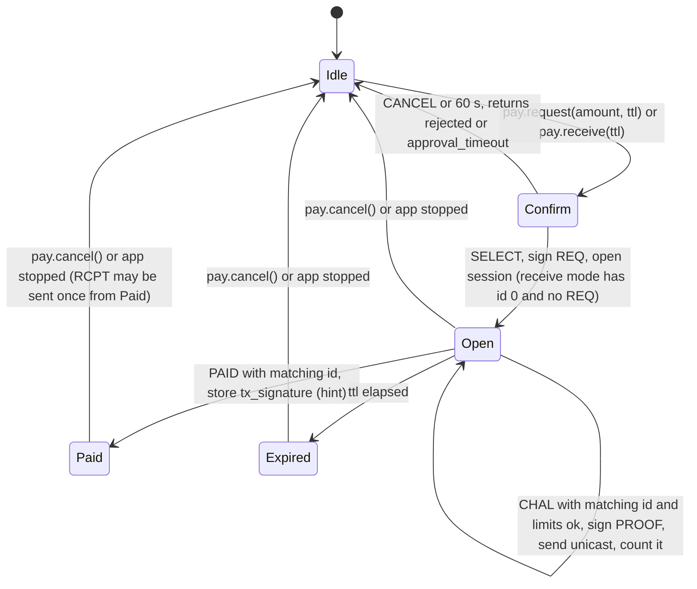
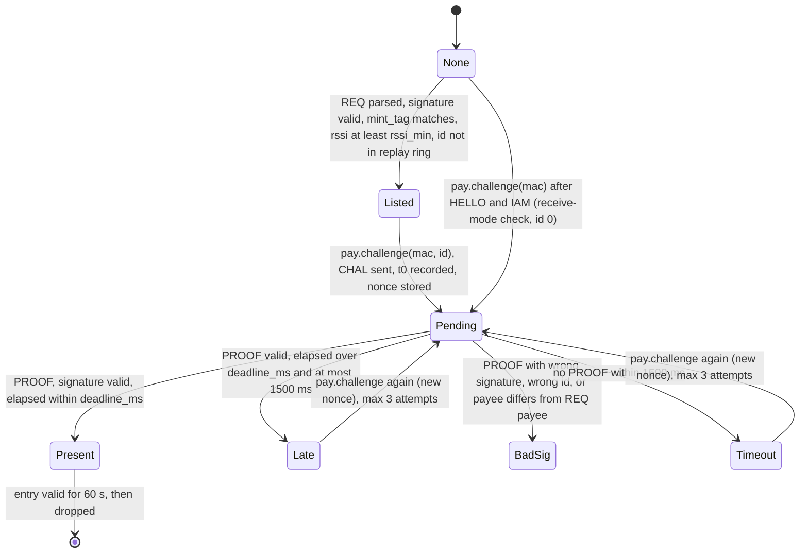
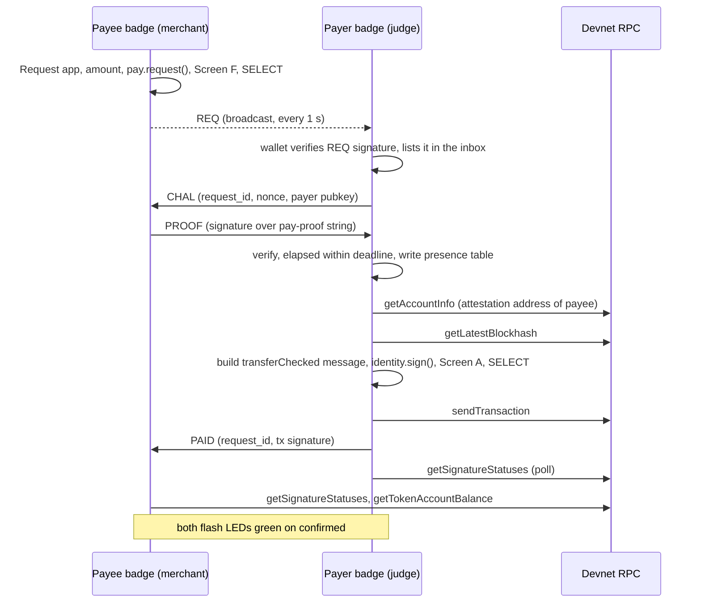
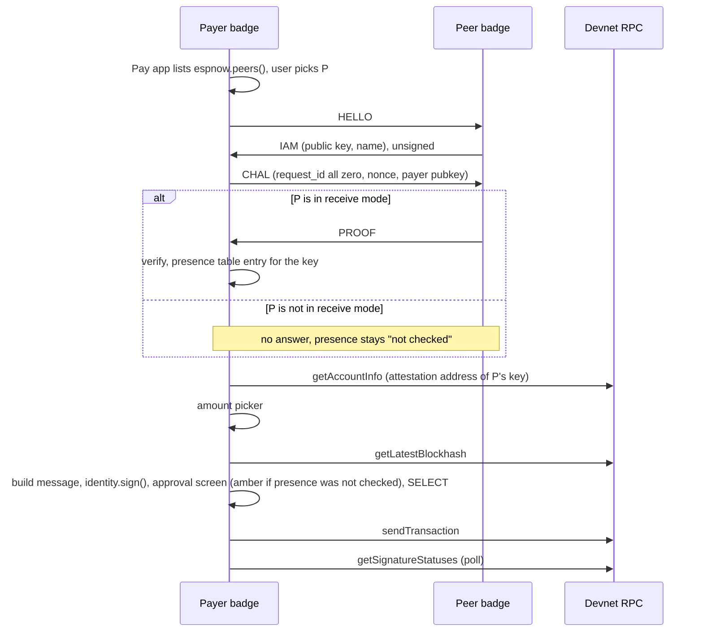
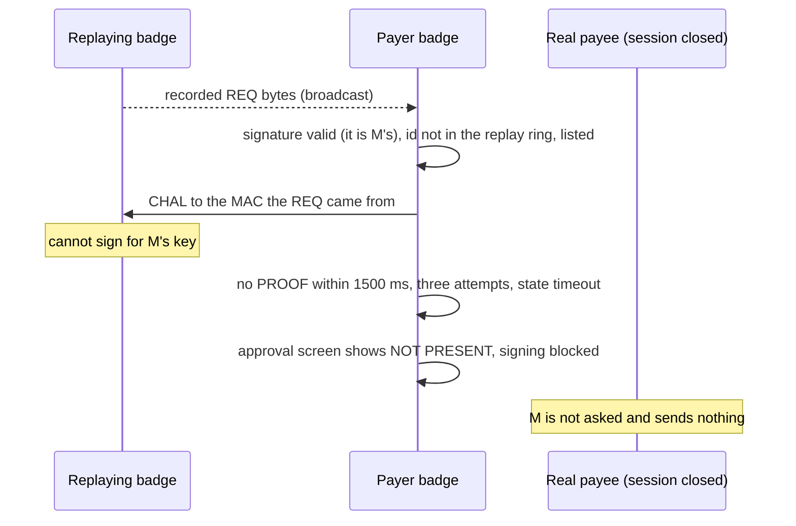

# Payment protocol

The badge-to-badge messages that authenticate a payment request and prove the requester is nearby: REQ, CHAL, PROOF, and the helper messages HELLO, IAM, PAID and RCPT.

- Audience: firmware engineers implementing `src/wallet/pay_session.cpp` and anyone who needs the byte layouts.
- Status: design, not yet built on hardware.
- Base: Solana OS, directory `firmware/solana-os/` at commit `812b8c7` of the [upstream repository](https://github.com/spacemandev-git/solana-defcon-badge-26/tree/812b8c7aca5c366d18c0b040fafd2999f7204d84/firmware/solana-os).

Tags: **[UPSTREAM]** exists in Solana OS at that commit, with the path. **[OURS]** is our design decision; "host-tested" next to it means the reference C code in [`../reference/code/`](../reference/code/) passed its tests on a development computer ([host tests](../testing/host-tests.md)). **[UNVERIFIED]** must be measured or confirmed on a badge; a fallback is given.

Nothing in this document has run on a badge. The codec ([`pay_proto.h`](../reference/code/pay_proto.h), [`pay_proto.c`](../reference/code/pay_proto.c)) is written and host-tested. The session logic (`pay_session.cpp`) is specified here and not written; its header, [`pay_session.h`](../reference/code/sdk-headers/wallet/pay_session.h), is a syntax-checked listing ([Session declarations](#session-declarations)).

## What the protocol answers

| Question | Mechanism | Requirement |
|---|---|---|
| Did the key named in the request really ask for this amount? | REQ carries an Ed25519 signature by the payee key | F8 |
| Is the holder of that key near the payer right now? | CHAL carries a fresh nonce; PROOF is a signature over it that must come back within a deadline | F9 |
| Which key does a nearby badge have, when it has not sent a request? | HELLO / IAM (unsigned hint) | F5 |
| Which transaction should the payee look up? | PAID (unsigned hint) | F7 |
| Did the payee acknowledge the payment? | RCPT (stretch) | F19 |

The payment itself is a Solana transaction sent to the RPC endpoint over Wi-Fi ([transaction building](transaction-building.md)). No transaction ever crosses ESP-NOW. Whether the payee key is a verified identity is a separate check against the on-chain registry ([attestation](../identity/attestation.md)).

All frames are parsed, verified and answered in firmware, before any app sees them [OURS: a PROOF has to leave within a few hundred milliseconds, and the approval screen may only show facts the firmware established itself]. Apps drive the protocol through `badge.pay.*` ([API reference](../app-platform/api-reference.md#badgepay)) and read results from the wallet's tables.

## Carrier

- Every message is one ESP-NOW application frame as Solana OS defines it: magic `S B D G`, type byte `0x02`, then the payload. [UPSTREAM `firmware/solana-os/src/net/espnow_mgr.cpp:13-19`] The layouts below are the payload.
- The payload limit is 240 bytes. [UPSTREAM `firmware/solana-os/src/config.h:147`]
- Frames are neither encrypted nor authenticated at the radio layer. [UPSTREAM] Authenticity comes only from the signatures in the payload. MAC addresses are used for routing and are not trusted for identity.
- ESP-NOW follows the Wi-Fi channel, so all badges must be on one channel; in practice they all join one phone hotspot. [UPSTREAM `firmware/solana-os/README.md`, "Radio notes"]
- `send()` and `broadcast()` report only that the radio accepted the frame; delivery is not confirmed. [UPSTREAM `firmware/solana-os/src/net/espnow_mgr.cpp`] Every step therefore has a timeout.
- Received frames are queued in the Wi-Fi task (8 entries, dropped when full) and handed to one handler by `espnow_mgr::update()` on the main loop. [UPSTREAM `firmware/solana-os/src/net/espnow_mgr.cpp:40-53`]
- All multi-byte integers are little-endian. [OURS, host-tested]

The handler installed at boot gives every application frame to the wallet first, then to the running app [OURS]:

```cpp
// solana-os.ino, replaces the upstream handler at solana-os.ino:134-137
espnow_mgr::onReceive([](const uint8_t *mac, const uint8_t *data, size_t length, int8_t rssi) {
  // Wallet first: verifies REQ, answers CHAL/HELLO, records PROOF timing. Never touches Lua.
  wallet_pay_on_frame(mac, data, length, rssi, espnow_mgr::lastRxMs());
  // Apps still receive every application frame, including payment frames (they are public radio
  // data); the authoritative state is in the wallet's tables, not in what an app parses.
  if (app_host::running()) app_host::dispatchEspnow(mac, data, length, rssi);
});
```

Two upstream patches make this work [OURS]:

- `espnow_mgr` gains `uint32_t rxMs` in its queued packet, set to `millis()` in the Wi-Fi-task receive callback, and `uint32_t lastRxMs();`, valid during the handler call. Upstream records no receive time. It is needed for the PROOF deadline ([Timing](#timing)).
- `espnow_mgr::clearReceiveHandler();` is deleted from `runtime::stop()`. Upstream installs the handler once at boot and clears it when any app stops (`firmware/solana-os/src/lua_sdk/lua_runtime.cpp:290`), so without the patch the wallet stops receiving frames after the first app exits.

The entry point is declared in `src/wallet/wallet.h`:

```c
void        wallet_pay_on_frame(const uint8_t mac[6], const uint8_t *data, size_t len, int8_t rssi, uint32_t rx_ms);
```

## Messages

| Type | Name | Direction | Addressing | Bytes | Signed by | Purpose |
|---|---|---|---|---|---|---|
| `0x01` | REQ | payee → everyone | broadcast, repeated every 1000 ms | 155 | payee key | "pay this key this amount" |
| `0x02` | CHAL | payer → payee | unicast | 60 | no | fresh nonce to be signed |
| `0x03` | PROOF | payee → payer | unicast | 108 | payee key | signature over the nonce |
| `0x04` | HELLO | payer → peer | unicast | 4 | no | "which key are you?" |
| `0x05` | IAM | peer → payer | unicast | 69 | no (hint) | public key and name |
| `0x06` | PAID | payer → payee | unicast | 76 | no (hint) | transaction signature to look up |
| `0x07` | RCPT | payee → payer | unicast | 140 | payee key | receipt for a transaction (F19, stretch) |

All layouts are [OURS], host-tested (encode, decode, round trip, negative cases). Constants are in [`pay_proto.h`](../reference/code/pay_proto.h).

### Common header (4 bytes)

| Offset | Size | Field | Value |
|---|---|---|---|
| 0 | 1 | magic0 | `0x48` (`'H'`), `PAY_MAGIC0` |
| 1 | 1 | magic1 | `0x50` (`'P'`), `PAY_MAGIC1` |
| 2 | 1 | version | `0x01`, `PAY_VERSION`; any other value means the frame is ignored |
| 3 | 1 | type | `0x01` REQ, `0x02` CHAL, `0x03` PROOF, `0x04` HELLO, `0x05` IAM, `0x06` PAID, `0x07` RCPT |

`pay_peek()` returns the type for a well-formed header and 0 otherwise. A frame whose length is not exactly the size for its type is ignored: every decoder checks the length before anything else.

### REQ, 155 bytes

Payee to broadcast. PRD budget: at most 240 bytes.

| Offset | Size | Type | Field | Meaning and rule |
|---|---|---|---|---|
| 0 | 4 | bytes | header | type `0x01` |
| 4 | 32 | bytes | `payee_pubkey` | Ed25519 public key of the requester; this is its Solana address |
| 36 | 8 | u64 LE | `amount` | raw base units; must be greater than 0 |
| 44 | 4 | bytes | `mint_tag` | first 4 bytes of the mint public key (the PRD's "token mint id") |
| 48 | 8 | bytes | `request_id` | 8 random bytes from the hardware RNG |
| 56 | 2 | u16 LE | `ttl_s` | seconds the request stays open; must be greater than 0 (the PRD's "expiry") |
| 58 | 1 | u8 | `name_len` | 1 to 32 |
| 59 | 32 | ASCII | `name` | the name the requester claims; `name_len` bytes of printable ASCII `0x20..0x7E` with no leading or trailing space, then zero bytes up to 32 |
| 91 | 64 | bytes | `signature` | Ed25519 by `payee_pubkey` over the 99 bytes defined under [Signed bytes](#signed-bytes) |

4 + 32 + 8 + 4 + 8 + 2 + 1 + 32 + 64 = 155 = `PAY_REQ_LEN`.

### CHAL, 60 bytes

Payer to payee, unicast. PRD budget: at most 64 bytes.

| Offset | Size | Type | Field | Meaning and rule |
|---|---|---|---|---|
| 0 | 4 | bytes | header | type `0x02` |
| 4 | 8 | bytes | `request_id` | the id of the REQ being checked; all zero for a receive-mode check |
| 12 | 16 | bytes | `nonce` | fresh from `esp_fill_random` with the radio on; never reused |
| 28 | 32 | bytes | `payer_pubkey` | public key of the challenger; the payee signs it into the PROOF |

4 + 8 + 16 + 32 = 60 = `PAY_CHAL_LEN`.

### PROOF, 108 bytes

Payee to payer, unicast. PRD budget: at most 128 bytes.

| Offset | Size | Type | Field | Meaning and rule |
|---|---|---|---|---|
| 0 | 4 | bytes | header | type `0x03` |
| 4 | 8 | bytes | `request_id` | echoed from the CHAL |
| 12 | 32 | bytes | `payee_pubkey` | the key that signed; lets a receive-mode check learn the key |
| 44 | 64 | bytes | `signature` | Ed25519 by `payee_pubkey` over the 66 bytes defined under [Signed bytes](#signed-bytes) |

4 + 8 + 32 + 64 = 108 = `PAY_PROOF_LEN`. The nonce and the payer key are not repeated in the frame; the payer already holds both and rebuilds the signed bytes from its own copy.

### HELLO, 4 bytes

Payer to peer, unicast. The header only, type `0x04`. `PAY_HELLO_LEN` = 4.

### IAM, 69 bytes

Peer to payer, unicast, unsigned. Sent by firmware in reply to HELLO; no key is used.

| Offset | Size | Type | Field | Meaning and rule |
|---|---|---|---|---|
| 0 | 4 | bytes | header | type `0x05` |
| 4 | 32 | bytes | `pubkey` | the sender's public key, as claimed |
| 36 | 1 | u8 | `name_len` | 1 to 32 |
| 37 | 32 | ASCII | `name` | same rule and padding as the REQ name |

4 + 32 + 1 + 32 = 69 = `PAY_IAM_LEN`. IAM is a hint. A key learned from IAM is shown as `presence not checked` until a PROOF arrives, and its identity still comes from the registry.

### PAID, 76 bytes

Payer to payee, unicast, unsigned.

| Offset | Size | Type | Field | Meaning and rule |
|---|---|---|---|---|
| 0 | 4 | bytes | header | type `0x06` |
| 4 | 8 | bytes | `request_id` | the request that was paid |
| 12 | 64 | bytes | `tx_signature` | signature of the submitted transaction |

4 + 8 + 64 = 76 = `PAY_PAID_LEN`. The payee never trusts PAID. It only tells the payee which signature to look up on chain.

### RCPT, 140 bytes (F19, stretch)

Payee to payer, unicast.

| Offset | Size | Type | Field | Meaning and rule |
|---|---|---|---|---|
| 0 | 4 | bytes | header | type `0x07` |
| 4 | 8 | bytes | `request_id` | the request that was paid |
| 12 | 64 | bytes | `tx_signature` | the transaction being acknowledged |
| 76 | 64 | bytes | `signature` | Ed25519 by the payee key over the 81 bytes defined under [Signed bytes](#signed-bytes) |

4 + 8 + 64 + 64 = 140 = `PAY_RCPT_LEN`. The co-signed receipt is the pair: the transaction signature (by the payer) and the RCPT signature (by the payee).

### Field rules enforced by the codec

These are what `pay_*_decode()` rejects (return value -1), host-tested in [`test_pay.c`](../reference/code/test_pay.c):

- Wrong total length, wrong magic, wrong version, or wrong type for the decoder.
- REQ: `amount == 0` or `ttl_s == 0`.
- REQ and IAM names: `name_len` outside 1..32; a byte outside `0x20..0x7E`; a leading or trailing space; any non-zero byte in the padding after `name_len`.

The name rule here (`pay_name_ok()`) allows two consecutive spaces. The attestation parser is stricter and rejects them ([attestation, Name rule](../identity/attestation.md#name-rule)). The difference is harmless: a name from a frame is a claim and is never shown as the recipient name.

Encoders write exactly `PAY_*_LEN` bytes and do not validate. The caller fills valid fields.

### Signed bytes

The wallet core signs exactly these byte strings for the protocol ([signing gate, Message signing](../wallet-core/signing-gate.md#message-signing)). Each starts with an ASCII domain prefix. The helper functions that build them are in `pay_proto.c`.

**REQ**: `pay_req_signed_bytes(req_wire, out)`, 99 bytes = `PAY_REQ_SIGNED_LEN`.

| Offset | Size | Content |
|---|---|---|
| 0 | 8 | `"pay-req:"` = `70 61 79 2d 72 65 71 3a` (`PAY_DOMAIN_REQ`, no terminator) |
| 8 | 91 | REQ wire bytes `[0, 91)`: header, `payee_pubkey`, `amount`, `mint_tag`, `request_id`, `ttl_s`, `name_len`, `name` with padding |

The signature covers the header, so the version and type are signed too. The payee builds the frame with a zero signature, signs these 99 bytes, writes the signature at offset 91 and broadcasts. The verifier takes the received 155 bytes, rebuilds the 99 bytes from them, and verifies with the key at offset 4.

**PROOF**: `pay_proof_signed_bytes(id, nonce, payer, out)`, 66 bytes = `PAY_PROOF_SIGNED_LEN`.

| Offset | Size | Content |
|---|---|---|
| 0 | 10 | `"pay-proof:"` = `70 61 79 2d 70 72 6f 6f 66 3a` (`PAY_DOMAIN_PROOF`) |
| 10 | 8 | `request_id` from the CHAL |
| 18 | 16 | `nonce` from the CHAL |
| 34 | 32 | `payer_pubkey` from the CHAL |

The payee builds these from the CHAL it received. The payer builds them from its own pending entry (its nonce) and its own public key, never from anything in the PROOF frame, and verifies with `payee_pubkey` from the PROOF.

**RCPT**: `pay_rcpt_signed_bytes(id, tx_sig, out)`, 81 bytes = `PAY_RCPT_SIGNED_LEN`.

| Offset | Size | Content |
|---|---|---|
| 0 | 9 | `"pay-rcpt:"` = `70 61 79 2d 72 63 70 74 3a` (`PAY_DOMAIN_RCPT`) |
| 9 | 8 | `request_id` |
| 17 | 64 | `tx_signature` |

### Worked example

Produced on a development computer by the reference codec and Monocypher, with the inputs [`test_pay.c`](../reference/code/test_pay.c) uses: seed bytes `01 02 … 20` (payee public key `79b5562e…ad049664`), amount 1000 (10.00 HACK), mint tag `06 9b 88 57`, request id `11 22 33 44 55 66 77 88`, `ttl_s` 120, name `MHacks Merch`. Ed25519 signatures are deterministic, so another implementation must reproduce these bytes exactly.

REQ frame (155 bytes):

```
offset  bytes
0       48 50 01 01                                        header: 'H' 'P', version 1, type REQ
4       79 b5 56 2e 8f e6 54 f9 40 78 b1 12 e8 a9 8b a7
        90 1f 85 3a e6 95 be d7 e0 e3 91 0b ad 04 96 64    payee_pubkey
36      e8 03 00 00 00 00 00 00                            amount = 1000
44      06 9b 88 57                                        mint_tag
48      11 22 33 44 55 66 77 88                            request_id
56      78 00                                              ttl_s = 120
58      0c                                                 name_len = 12
59      4d 48 61 63 6b 73 20 4d 65 72 63 68                "MHacks Merch"
71      00 (20 times)                                      name padding
91      51 4b ff 52 6a dc df dd 3c 0c 93 18 c5 52 87 8a
        71 ce 10 f2 da a7 9c 75 d4 6b 1c fa 47 64 68 25
        e9 bb 33 1e 2d 5c 2d 0a fc ac ee 59 aa 31 af eb
        36 40 c2 45 60 31 d7 d8 fa bc 98 2c fc 39 c2 0b    signature over "pay-req:" + bytes [0, 91)
```

CHAL for that request with nonce `f0 f1 … ff` and payer key `a0 a1 … bf` (60 bytes):

```
48 50 01 02 11 22 33 44 55 66 77 88 f0 f1 f2 f3 f4 f5 f6 f7 f8 f9 fa fb fc fd fe ff
a0 a1 a2 a3 a4 a5 a6 a7 a8 a9 aa ab ac ad ae af b0 b1 b2 b3 b4 b5 b6 b7 b8 b9 ba bb bc bd be bf
```

PROOF signed bytes (66 bytes) and the PROOF frame (108 bytes):

```
signed  70 61 79 2d 70 72 6f 6f 66 3a                      "pay-proof:"
        11 22 33 44 55 66 77 88                            request_id
        f0 f1 f2 f3 f4 f5 f6 f7 f8 f9 fa fb fc fd fe ff    nonce
        a0 a1 … bf                                         payer_pubkey (32 bytes)

frame   48 50 01 03                                        header, type PROOF
        11 22 33 44 55 66 77 88                            request_id
        79 b5 56 2e … ad 04 96 64                          payee_pubkey (32 bytes, as in the REQ)
        1e 54 00 22 30 fa bb 98 a3 ec 91 19 7d 33 0e bb
        4b b7 1b d7 50 79 b5 c5 df 38 98 8f 92 d2 56 28
        b0 03 4c f4 e3 06 e1 12 5f 4f 0f 79 46 3c c1 23
        18 79 13 23 36 59 58 f9 8e 58 c6 c4 40 d4 cc 0e    signature
```

### Sizes against the budgets

| Item | Bytes | Limit | Source of the limit |
|---|---|---|---|
| REQ | 155 | 240 | PRD budget and the ESP-NOW payload limit |
| CHAL | 60 | 64 | PRD budget |
| PROOF | 108 | 128 | PRD budget |
| RCPT | 140 | 240 | ESP-NOW payload limit |
| Longest signed string (REQ) | 99 | 180 | unmodified SE050 sign limit [UPSTREAM `firmware/solana-os/src/hal/se050_apdu.h:69`] |

`test_pay.c` asserts all of these. Every protocol signature fits the secure element's limit even without the patch that raises it for transactions.

### Differences from the PRD's message table

| PRD | This protocol | Why |
|---|---|---|
| REQ has an "expiry" | `ttl_s`, a relative lifetime in seconds | Badges have no real-time clock [UPSTREAM `firmware/solana-os/README.md`, "The clock problem"], so two badges cannot compare absolute times |
| REQ has a "token mint id" | `mint_tag`, the first 4 bytes of the mint | A filter, not a security check: the full mint in the transaction is checked by the signing gate before anything is signed |
| REQ has no name | `name` (claimed) | Lets the payer compare the claim with the registry and show a mismatch |
| CHAL has request id and nonce | adds `payer_pubkey` | The PRD's PROOF signs the payer key, so the payee has to learn it |
| PROOF has request id and signature | adds `payee_pubkey` | A receive-mode check has no REQ to take the key from |
| Encoding left open | binary, fixed size | Lua strings are byte-safe; base64 would add a third to every frame and put a decoder in the radio path |
| PROOF deadline "under 250 ms" | config key `deadline_ms`, default 400 ms, unmeasured | See [Timing](#timing) |

## Payee state machine

One session exists at a time, held in firmware (`pay_session.cpp`). [OURS]



| State | Entered by | What the firmware does | `pay.status().state` |
|---|---|---|---|
| Idle | boot, cancel, app stop | nothing; HELLO is still answered | `idle` |
| Confirm | `wallet_pay_request()` / `wallet_pay_receive()` | shows [Screen F](../wallet-core/screens.md#screen-f) or [Screen G](../wallet-core/screens.md#screen-g); blocks the caller | not observable (the caller is blocked) |
| Open | SELECT on that screen | request mode: builds and signs the REQ, broadcasts it every 1000 ms from `wallet_update()`; both modes: answers matching CHALs | `open`, or `receive` for a receive-mode session |
| Paid | PAID with the session's id | stores the transaction signature for the app; no longer broadcasts or answers CHAL; may send one RCPT | `paid` |
| Expired | `ttl_s` seconds after Open | stops broadcasting and stops answering CHAL | `expired` |

The C entry points, from `src/wallet/wallet.h` ([listing](../reference/code/sdk-headers/wallet/wallet.h)):

```c
#define WALLET_PAY_REQ_TTL_MAX_S      120   /* a larger ttl_s is clamped to this */
#define WALLET_PAY_RECEIVE_TTL_MAX_S  600   /* a larger ttl_s is clamped to this */
/* Confirm screen, signs REQ, opens the session and starts broadcasting.
   bad_arg: amount == 0 or ttl_s == 0.  over_limit: amount > max.  busy: a session is already open.
   Also: denied, not_ready, no_display, rate_limited, rejected, approval_timeout, sign_failed. */
badge_err_t wallet_pay_request(uint64_t amount, uint16_t ttl_s, uint8_t id_out[8]);
/* Confirm screen, opens a receive session (request id zero).  bad_arg: ttl_s == 0.  busy: a session is open.
   Also: denied, not_ready, no_display, rate_limited, rejected, approval_timeout. */
badge_err_t wallet_pay_receive(uint16_t ttl_s);
/* F19: signs and sends RCPT to the MAC the PAID hint came from. Once per session.
   no_session: no session in state paid.  rate_limited: already sent.  Also: sign_failed, io. */
badge_err_t wallet_pay_receipt(void);
void        wallet_pay_cancel(void);
```

Rules:

- One session at a time. Opening a second returns `busy` ([error codes](../reference/error-codes.md#badge_err_t)).
- `pay.request(amount [, ttl_s])` defaults to 120 s; `pay.receive([ttl_s])` defaults to 600 s. Both need permission `sign`.
- The lifetime is clamped in the API: a `ttl_s` above 120 for `pay.request` becomes 120 (`WALLET_PAY_REQ_TTL_MAX_S`), and above 600 for `pay.receive` becomes 600 (`WALLET_PAY_RECEIVE_TTL_MAX_S`). A `ttl_s` of 0 returns `bad_arg`. Screen F shows the clamped value. [OURS: a payer keeps a request for `ttl_s` seconds, so a request must not ask to live longer than a payer will list it]
- `pay.request` returns `bad_arg` for an amount of 0 and `over_limit` for an amount above `max`.
- The session closes when the app that opened it stops: `app_host` calls `wallet_pay_cancel()` from its stop path. [OURS: a session must not outlive the screen that explained it]
- In request mode the session id is 8 fresh random bytes and the REQ is signed once, when the session opens. The same 155 bytes are rebroadcast until the session leaves Open.
- In receive mode the session id is all zero and no REQ is sent. The badge only answers CHALs whose `request_id` is all zero.
- The REQ `name` field follows the same rule as the IAM name: the badge's own attested name if its cached own attestation is VERIFIED, otherwise `settings::deviceName()`. The name is read from the attestation cache; no network call is made at request time. Screen F shows the same name under `AS`. [OURS]

### Frames handled on the payee

**CHAL.** Answered only if all of these hold; otherwise the frame is dropped silently:

1. `pay_chal_decode()` succeeds (exactly 60 bytes, valid header).
2. A session is Open.
3. `chal.request_id` equals the session id (all zero in receive mode).
4. The limits allow it: at most 8 PROOFs per session, at least 200 ms since the previous PROOF, at most 3 per payer MAC ([rate limits](../wallet-core/signing-gate.md#rate-limits)).

A build with `PAY_MEASURE 1` does not enforce the two counts, nor the payer's limit of 3 attempts; the 200 ms gap stays. That build exists for measurement [M1](../testing/measurements.md#m1) and is never used for the demo. [OURS]

Then:

1. `pay_session.cpp` calls `wallet_internal_sign_proof(id, nonce, payer, sig_out)` (declared in `wallet_internal.h`). That function re-checks the session and asks the signing gate to sign `pay_proof_signed_bytes(id, nonce, payer)`. `pay_session.cpp` never touches the key itself ([key gate](../wallet-core/signing-gate.md#key-gate)).
2. `pay_proof_encode()` with the session id, the badge's own public key and the signature.
3. Unicast to the MAC the CHAL came from.
4. Increment the session's proof count and remember the payer key (reported by `pay.status()` as `proofs` and `payer`).

**HELLO.** Answered with IAM whenever the badge has an identity; no session is needed. The name is the badge's own attested name if its cached own attestation is VERIFIED, otherwise `settings::deviceName()`. At most 5 IAM replies per second; further HELLOs are ignored.

**PAID.** If a session is Open and `paid.request_id` equals the session id: store `tx_signature` and the MAC the frame came from, move to Paid. Otherwise ignore. The stored signature is a hint for the app (`pay.status().tx`); the app confirms on chain before it shows anything as paid ([Request app](../apps/request.md)).

**RCPT (stretch).** In state Paid, `pay.receipt()` (C: `wallet_pay_receipt()`) signs `pay_rcpt_signed_bytes(id, tx_sig)` through `wallet_internal_sign_receipt(id, tx_sig, sig_out)` and sends one RCPT to the MAC the PAID hint came from, which the session stored. The call takes no argument, needs permission `radio`, and must come from the app that opened the session. At most one per session: a second call returns `rate_limited`, and a call outside Paid returns `no_session`.

### Why a PROOF needs no button press

A PROOF has to leave the payee within the deadline (default 400 ms, unmeasured). A person cannot press a button that fast, so the press happens earlier: SELECT on Screen F or G authorises PROOFs for that one session. The authorisation is bounded to one request id, the session's TTL, 8 PROOFs in total and 3 per payer MAC. What is signed is the fixed 66-byte string above, which states only "this key answered this nonce from this payer for this request". It cannot be read as a transaction ([domain separation](#rules)). [OURS]

The residual risk is stated in the [security model](../security/security-model.md): in receive mode the badge signs a PROOF for anyone who asks with request id zero, up to the limits.

## Payer state machine

The payer keeps one state per counterparty MAC. [OURS]



`pay.presence(mac)` reports the state as `none`, `pending`, `present`, `late`, `bad_sig` or `timeout`, with the elapsed time in milliseconds.

The payer's tables, all RAM only:

| Table | Capacity | Entry | Lifetime |
|---|---|---|---|
| Inbox | 4 | a verified REQ with the MAC of its first receipt, RSSI and age; one per payee key, newest replaces | `ttl_s` seconds from first receipt (at most 120, because the API clamps `ttl_s`) |
| Pending challenges | 4, one per counterparty MAC | `{mac, id, nonce, t0}` | erased on the first PROOF from that MAC or after 1500 ms |
| Presence table | 8 | `{payee_pubkey, mac, request_id, verified_at_ms, elapsed_ms}` | 60 s |
| Replay ring | 32 | request ids that reached a terminal state (paid, rejected, dismissed, expired) | until overwritten or reboot |
| Peers | 8, one per MAC | last IAM: `{pubkey, name}` | 60 s |

The session, the tables and their limits are declared in `src/wallet/pay_session.h`, listed in full under [Session declarations](#session-declarations).

An inbox entry keeps the MAC of its first receipt. A byte-identical REQ from that MAC refreshes the entry's RSSI and age; the same bytes from any other MAC are ignored. A challenge for a listed request therefore always goes to the first sender of that request. [OURS: a replaying badge cannot move a live entry to its own MAC]

When a REQ from a fifth payee arrives while four entries from other payees are live, the weakest entry decides: if the new REQ's RSSI is higher than that of the weakest inbox entry, that entry is evicted and the new one is stored; otherwise the new REQ is dropped. An evicted entry's id is not added to the replay ring, so the request is listed again if it is heard later. [OURS: the nearest requests win; eviction is not a terminal state]

### Frames handled on the payer

**REQ.** Checked in this order; the first failure drops the frame:

1. `pay_req_decode()` succeeds: exact length, header, `amount > 0`, `ttl_s > 0`, name rule.
2. `mint_tag` equals the first 4 bytes of the configured mint.
3. If the 155 bytes equal an entry already in the inbox, stop: when the frame comes from the MAC that entry holds, refresh its RSSI and age; from any other MAC, ignore the frame. The signature is verified once per distinct REQ, not once per rebroadcast.
4. The signature verifies: rebuild the 99 bytes with `pay_req_signed_bytes()` and verify with `payee_pubkey`. A failure is counted and logged by `pay_session.cpp` as `[pay] req bad_sig from <mac>`, with the MAC in lower case (`aa:bb:cc:dd:ee:ff`).
5. `amount <= max` (config).
6. `request_id` is not in the replay ring.
7. Store the REQ in the inbox. It replaces an entry of the same payee key; with four entries from other payees, the eviction rule above applies.

`rssi_min` is applied when the inbox is listed, not on receipt: `pay.inbox()` returns the entries strongest RSSI first, without those whose RSSI is below `rssi_min`.

**PROOF.** Accepted only from a MAC with a pending challenge; anything else is ignored.

1. `pay_proof_decode()` succeeds (exactly 108 bytes).
2. Take the pending entry for the source MAC and erase it. The nonce is now spent whatever the outcome.
3. `proof.request_id` equals the pending id.
4. If the challenge was for a listed REQ, `proof.payee_pubkey` equals that REQ's `payee_pubkey`.
5. The signature verifies over `pay_proof_signed_bytes(pending.id, pending.nonce, own public key)` with `proof.payee_pubkey`.
6. `elapsed = rx_ms - t0`.

Steps 3 to 5 failing gives BadSig. All passing with `elapsed <= deadline_ms` gives Present and writes a presence-table entry. All passing with a larger `elapsed` gives Late. Each PROOF is logged for measurement ([M1](../testing/measurements.md#m1)): `[pay] proof ok elapsed=<n>ms` for Present, `[pay] proof late elapsed=<n>ms` for Late, `[pay] proof bad_sig` for BadSig.

**IAM.** `pay_iam_decode()`, then store `{pubkey, name}` for the source MAC for 60 s (`pay.peer(mac)`).

**RCPT (stretch).** Verify the signature over `pay_rcpt_signed_bytes()` against the payee key and the transaction signature of the matching history record, then set the receipt flag (bit 2 of `flags`) on that record ([history store](../wallet-core/config-limits-audit.md#history-store)). Lua sees the field `receipt = true` in `history.list()`, and History shows `co-signed` in place of `confirmed` ([receipts](../apps/receipts.md)).

### How the result reaches the approval screen

The presence table is read by the signing gate, not by the app ([policy checks](../wallet-core/signing-gate.md#policy-checks), check 14):

- A presence-table entry for the recipient key, at most 60 s old, gives `present`.
- No attempt for that recipient gives `presence not checked` (amber).
- A failed, late or badly signed handshake gives `NOT PRESENT` (red). A late PROOF adds the detail line `proof late: <n> ms`.
- If the app passes `request_id` in the signing hints, the inbox entry with that id must exist, have a valid signature, name the same payee as the transaction's recipient and the same amount as the transaction. Otherwise the screen shows `NOT PRESENT` with the line `does not match the request`.

So an app cannot claim presence. It can only ask for a challenge and let the firmware record what came back.

## Timing

- `t0` is `millis()` taken immediately before `esp_now_send()` of the CHAL on the payer.
- `t1` is the `rx_ms` stamped in the Wi-Fi-task receive callback when the PROOF arrives. The payer's own main-loop latency is therefore not counted.
- `elapsed = t1 - t0` contains: air time both ways, the payee's main-loop latency until `espnow_mgr::update()` drains the CHAL, and the payee's signing time.
- Present if and only if the signature verifies and `elapsed <= deadline_ms`.
- `PAY_PROOF_TIMEOUT_MS` is 1500. Up to 3 attempts per counterparty, each with a new nonce. Lua sees the two values as `pay.DEADLINE_MS` and `pay.TIMEOUT_MS`.

`deadline_ms` is config (NVS namespace `wallet`), default **400 ms**. That default is not measured: nothing has run on a badge, and neither the ESP-NOW round trip nor the signing time on the ESP32-S3 is known. [UNVERIFIED]

| Situation | `deadline_ms` to use | Basis |
|---|---|---|
| Software key signed with Monocypher on every badge | 400 (default) | estimate, unmeasured |
| Any badge signs with the SE050 | 800 | the PRD cites about 261 ms for an SE050 Ed25519 signature (wolfSSL benchmark), plus transport; unmeasured here |
| The fast Ed25519 backend is not shipped (TweetNaCl) | 2500 | upstream describes about a second per signature [UPSTREAM `firmware/solana-os/src/identity/TWEETNACL-README:15-22`]; unmeasured here |
| PRD target | 250 | not reachable with an SE050 key; unmeasured for a software key |

Set the real value after measuring: run 50 challenges on a `PAY_MEASURE 1` build, take the 99th percentile of `elapsed`, multiply by 1.3 ([M1](../testing/measurements.md#m1)). All badges must use a deadline that fits the slowest signer among them.

Things that delay the payee's answer, because the payee handles CHAL on its main loop:

- A blocking HTTP call in the running app (up to 4 s for an RPC call). The Request app therefore makes no network call while its session is open, until it has seen a PAID hint or 10 s have passed since the last PROOF. [OURS: a blocking call would turn every CHAL into "not present"]
- A wallet approval screen on the payee. While it is up the main loop does not run, so CHALs wait in the queue.
- A slow frame of the running app. A Lua callback may take up to 250 ms [UPSTREAM `firmware/solana-os/src/config.h:195`].

The deadline makes relaying harder; it does not make it impossible. A relay that forwards CHAL and PROOF inside the deadline passes. It cannot redirect the money: the payment goes to the key that signed the REQ.

## Rules

| Rule | Detail | Why |
|---|---|---|
| Domain separation | Every signed protocol string starts with `pay-req:`, `pay-proof:` or `pay-rcpt:` | A protocol signature must never be usable as a transaction signature, or the reverse. See below |
| Nonce | 16 bytes, single use. The payer keeps one pending `{mac, id, nonce, t0}` per counterparty and erases it on the first PROOF or on timeout. A PROOF that matches no pending entry is ignored | A recorded PROOF answers one nonce only. Erasing on first use means a second PROOF for the same nonce, however obtained, is worthless |
| PROOF binds the payer | The signed bytes include `payer_pubkey` | A PROOF obtained by one badge cannot satisfy another badge's challenge |
| Request id reuse | The payer keeps a ring of the last 32 request ids that reached a terminal state (paid, rejected, dismissed, expired). A REQ with one of those ids is not listed | The PRD rule "a reused request id is rejected". The ring is RAM only: after a reboot a replayed REQ is listed again and then fails at PROOF |
| Relative TTL | `ttl_s` counts seconds; the payer keeps an entry `ttl_s` seconds from first receipt. The API clamps `ttl_s` to 120 for a request | No shared clock exists. Because the lifetime is relative, it does not stop a replay by itself; the replay ring and the PROOF do |
| Inbox | Up to 4 verified REQs, one per payee key (newest replaces), sorted by RSSI descending. An entry keeps the MAC of its first receipt; RSSI and age update on every rebroadcast from that MAC. A fifth payee replaces the weakest entry only if its RSSI is higher | Bounded memory; one badge cannot fill the list |
| REQ acceptance | exact length; header; `amount > 0`; `ttl_s > 0`; name rule; `mint_tag` equals the first 4 bytes of the configured mint; signature valid; `amount <= max`; id not in the replay ring. A byte-identical rebroadcast only refreshes RSSI and age (same MAC) or is ignored (other MAC) | Unsigned or foreign requests never reach the user; signature checks are not repeated every second |
| Binding to the transaction | At signing time the wallet requires `tx.amount == req.amount` and `recipient == req.payee` when `hint.request_id` is given | An app cannot show one request and pay another |
| Presence table | 8 entries `{payee_pubkey, mac, request_id, verified_at_ms, elapsed_ms}`, valid 60 s | A presence result is only meaningful for a short time |
| Sender address | CHAL is sent to the MAC the REQ came from; PROOF is accepted only from the MAC the CHAL was sent to | Routing only. A spoofed MAC can make a challenge fail; it cannot make one succeed, because success needs the payee's signature |
| PROOF limits | at most 8 per session, at least 200 ms apart, at most 3 per payer MAC | Bounds what one SELECT press authorises |
| REQ rebroadcast | every 1000 ms while Open | A payer that starts listening late still sees the request |

### Why a protocol signature can never be a transaction signature

Host-tested in `test_pay.c` (lines 43 to 45):

1. The wallet signs a transaction only after `sol_tx_decode_transfer()` accepts the exact bytes. None of the three prefixed strings is accepted.
2. Read as a legacy Solana message, a string that starts `pay-` has header bytes `0x70 0x61 0x79`, which means 112 required signatures, and its fourth byte `0x2d` means 45 account keys. Solana rejects a message whose required signatures exceed its account keys, and 45 keys would need 1440 bytes; these strings are at most 99. Bit 7 of `0x70` is clear, so it is not a versioned message either.
3. In the other direction, a real transaction message starts with `0x01` or `0x80`, never with `p`, so a transaction can never be accepted as the body of a REQ, PROOF or RCPT signature.

The full argument, including the upstream broker registration string, is in [signing gate, Message signing](../wallet-core/signing-gate.md#message-signing).

## Discovery

- Who is nearby: Solana OS broadcasts a presence beacon every second from every badge, and `badge.espnow.peers()` returns the peer table sorted strongest RSSI first. [UPSTREAM `firmware/solana-os/src/lua_sdk/lib_espnow.cpp:84-123`] The Pay app lists peers in that order (F5).
- Which request to answer: `badge.pay.inbox()` is sorted the same way and filtered by `rssi_min`. "Request to the nearest badge" (F6) is therefore implemented on the receiving side; the REQ itself is a broadcast, as the PRD's protocol table says.
- RSSI orders the list. It is not a security property. `rssi_min` defaults to -75. [UNVERIFIED: usable threshold at table distance; set it to -100 to disable the filter]
- All badges must be on one Wi-Fi channel: join one phone hotspot. [UPSTREAM `firmware/solana-os/README.md`, "Radio notes"]

## Sequences

Request-initiated payment (demo step 1). M is the merchant badge, J the judge's badge.



The same flow in API calls on the payer: `pay.inbox()` → `pay.challenge(mac, id)` → `pay.presence(mac)` (retry up to 3 times) → `attest.check(payee, name)` → `rpc.blockhash()` → `sol.transfer_message{...}` → `identity.sign(msg, {recipient, claimed_name, claimed_amount, request_id})` → `rpc.send(sol.wire(msg, sig))` → `pay.paid(mac, id, sig)` → `rpc.status(sig)` → `pay.dismiss(id)`. See the [Pay app](../apps/pay.md).

Payer-initiated payment (F5, "pick a nearby badge"). P is the peer being paid.



A replayed request. I is a badge that recorded M's REQ earlier; M's session is closed.



Two variations give the same result. If J heard M's own broadcast first and that entry is still live, the entry keeps M's MAC, the copy from I is ignored, and the CHAL goes to M, which no longer has a session and does not answer. If J had already seen that request id reach a terminal state (paid, cancelled, dismissed or expired), the replayed REQ is not listed at all. The attack flows as operator scripts, including the impostor, the tampered checkout and the revoked badge, are in [attack scripts](../testing/attack-scripts.md).

## Abort and error paths

| Condition | Detected by | Result on the payer |
|---|---|---|
| REQ signature invalid | wallet, on receipt | never listed; the log shows `[pay] req bad_sig from <mac>` |
| REQ for another token | wallet, on receipt (`mint_tag`) | never listed |
| No PROOF, late PROOF or wrong PROOF | presence table | approval screen red, `NOT PRESENT`, signing blocked |
| No attestation for the payee key | attestation check | amber `UNVERIFIED` |
| Claimed name belongs to another key | attestation check | red `NAME MISMATCH` |
| Attestation closed after it had been seen | attestation check | red `REVOKED` |
| RPC unreachable | attestation check, RPC client | amber `NOT CHECKED`; the app cannot fetch a blockhash, so no payment is built |
| User presses CANCEL anywhere | app or wallet | the flow ends; the request id goes to the replay ring |
| Destination token account missing | `rpc.send` returns `rpc`; Pay then finds that `rpc.token_owner(sol.ata(payee))` returns `no_account` | Pay shows `Payee has no HACK account`; nothing moved |
| Blockhash expired before send | `rpc.send` returns `rpc` with a node message containing `lockhash` | Pay shows `Expired, try again`; nothing moved |
| Any other send the node refuses | `rpc.send` returns `rpc` | Pay shows `Send failed, nothing moved` |

Pay classifies a refused send in that order, after the send has failed ([transaction building, Error mapping](transaction-building.md#error-mapping)).

Whether red blocks signing depends on config `block_red` (default 1, blocked). The severity table is in [signing gate, Severity and gestures](../wallet-core/signing-gate.md#severity-and-gestures).

## Fallback ladder

For the PRD risk "nonce handshake unfinished". [OURS]

1. Full protocol: signed REQ, CHAL/PROOF, attestation.
2. Handshake unfinished: build with `PAY_ENABLE_PRESENCE 0`. No CHAL is sent and presence is `NOT_CHECKED` (amber) everywhere. The impostor demo still works because it rests on the attestation; the replay demo is dropped.
3. Signatures unfinished: build with `PAY_VERIFY_REQ 0`. REQs are listed with `sig_ok = false`; identity is still checked for the claimed key; screens are amber at best.

## Session declarations

`src/wallet/pay_session.h` declares the payee session, the payer's tables and the limits used in this document. It is a listing ([`sdk-headers/wallet/pay_session.h`](../reference/code/sdk-headers/wallet/pay_session.h)), syntax-checked as C99 and C++17 and never linked or run; `pay_session.cpp` is not written. [OURS]

```c
/* src/wallet/pay_session.h - payee session, payer inbox, pending challenges, presence table, replay ring.
   Main loop only. All tables are RAM; nothing here survives a reboot. */
#ifndef PAY_SESSION_H
#define PAY_SESSION_H
#include <stdbool.h>
#include <stddef.h>
#include <stdint.h>
#include "pay_proto.h"
#include "wallet.h"
#ifdef __cplusplus
extern "C" {
#endif

#define PAY_INBOX_MAX            4      /* verified REQs, one per payee key */
#define PAY_PENDING_MAX          4      /* challenges awaiting a PROOF, one per counterparty MAC */
#define PAY_PRESENCE_MAX         8      /* verified presence entries */
#define PAY_PEERS_MAX            8      /* IAM answers */
#define PAY_REPLAY_MAX          32      /* request ids that reached a terminal state */
#define PAY_REBROADCAST_MS    1000
#define PAY_PROOF_TIMEOUT_MS  1500
#define PAY_CHALLENGE_ATTEMPTS   3
#define PAY_PRESENCE_TTL_MS  60000
#define PAY_PEER_TTL_MS      60000
#define PAY_PROOFS_PER_SESSION   8
#define PAY_PROOFS_PER_MAC       3
#define PAY_PROOF_MIN_GAP_MS   200
#define PAY_IAM_PER_SECOND       5
/* Build switch PAY_MEASURE (default 0, wallet_defaults.h): when 1, PAY_PROOFS_PER_SESSION, PAY_PROOFS_PER_MAC and
   PAY_CHALLENGE_ATTEMPTS are not enforced (PAY_PROOF_MIN_GAP_MS still is). For measuring the PROOF round trip only. */

typedef enum { PAY_SESSION_IDLE = 0, PAY_SESSION_OPEN, PAY_SESSION_RECEIVE, PAY_SESSION_PAID,
               PAY_SESSION_EXPIRED } pay_session_state_t;        /* == badge_pay_state_t */

typedef struct {
  pay_session_state_t state;
  uint8_t  id[PAY_ID_LEN];              /* all zero in receive mode */
  uint64_t amount;                      /* 0 in receive mode */
  uint32_t opened_ms, ttl_ms;
  uint8_t  proofs;                      /* PROOFs signed in this session */
  uint32_t last_proof_ms;
  bool     has_payer;                   /* last challenger */
  uint8_t  payer[32];
  uint8_t  payer_mac[6];
  bool     has_tx;                      /* PAID hint received */
  uint8_t  tx_sig[64];
  uint8_t  paid_mac[6];                 /* MAC the PAID hint came from; RCPT goes there */
  bool     rcpt_sent;
  char     owner_app[33];               /* app id that opened the session; closed when that app stops */
  uint8_t  req_wire[PAY_REQ_LEN];       /* the signed REQ being rebroadcast (unused in receive mode) */
} pay_session_t;

typedef struct {
  pay_req_t req;                        /* decoded */
  uint8_t   wire[PAY_REQ_LEN];          /* exact bytes, for the byte-identical rebroadcast check */
  uint8_t   mac[6];                     /* MAC of first receipt; never changed afterwards */
  int8_t    rssi;                       /* of the latest frame from that MAC */
  uint32_t  first_ms, last_ms;
  bool      sig_ok;                     /* always true unless built with PAY_VERIFY_REQ 0 */
} pay_inbox_entry_t;

typedef enum { PAY_PRESENCE_NONE = 0, PAY_PRESENCE_PENDING, PAY_PRESENCE_PRESENT, PAY_PRESENCE_LATE,
               PAY_PRESENCE_BAD_SIG, PAY_PRESENCE_TIMEOUT } pay_presence_state_t;   /* == badge_presence_t */

/* ---- lifecycle ---- */
void pay_session_begin(void);
void pay_session_update(uint32_t now_ms);     /* rebroadcast REQ, expire session/inbox/peers/presence, time out challenges */
void pay_session_on_frame(const uint8_t mac[6], const uint8_t *data, size_t len, int8_t rssi, uint32_t rx_ms);

/* ---- payee side (called by wallet.cpp after the confirm screen) ---- */
badge_err_t pay_session_open_request(const uint8_t req_wire[PAY_REQ_LEN], const char *owner_app);   /* busy if not idle */
badge_err_t pay_session_open_receive(uint16_t ttl_s, const char *owner_app);
void        pay_session_close(void);
void        pay_session_get(pay_session_t *out);
void        pay_session_note_proof(const uint8_t payer[32], const uint8_t payer_mac[6], uint32_t now_ms);
void        pay_session_note_receipt_sent(void);

/* ---- payer side ---- */
size_t      pay_inbox_list(pay_inbox_entry_t *out, size_t max, int8_t rssi_min);   /* strongest first */
bool        pay_inbox_find(const uint8_t id[PAY_ID_LEN], pay_inbox_entry_t *out);
void        pay_inbox_dismiss(const uint8_t id[PAY_ID_LEN]);                       /* removes the entry, adds id to the replay ring */
bool        pay_replay_contains(const uint8_t id[PAY_ID_LEN]);
badge_err_t pay_send_hello(const uint8_t mac[6]);
bool        pay_peer_get(const uint8_t mac[6], pay_iam_t *out, uint32_t *age_ms);
badge_err_t pay_send_challenge(const uint8_t mac[6], const uint8_t *id_or_null);   /* rate_limited after PAY_CHALLENGE_ATTEMPTS */
pay_presence_state_t pay_presence_by_mac(const uint8_t mac[6], uint32_t *elapsed_ms);
/* For the signing gate: newest result for a payee key. id_or_null narrows it to one request. */
pay_presence_state_t pay_presence_by_payee(const uint8_t payee[32], const uint8_t *id_or_null,
                                           uint32_t *age_ms, uint32_t *elapsed_ms);
badge_err_t pay_send_paid(const uint8_t mac[6], const uint8_t id[PAY_ID_LEN], const uint8_t tx_sig[64]);

#ifdef __cplusplus
}
#endif
#endif
```

`pay_session.cpp` holds no key. The two places where it needs a signature go through `wallet_internal_sign_proof()` and `wallet_internal_sign_receipt()` ([`wallet_internal.h`](../reference/code/sdk-headers/wallet/wallet_internal.h)), and it verifies with `wallet_crypto_verify()` ([`wallet_crypto.h`](../reference/code/sdk-headers/wallet/wallet_crypto.h)); both are described in [signing gate, Key gate](../wallet-core/signing-gate.md#key-gate).

## Reference codec

Both files are copied into `firmware/solana-os/src/wallet/` unchanged. They are pure C99 with no heap and no Arduino dependency. Signing and verification are supplied by the caller. [OURS, host-tested by [`test_pay.c`](../reference/code/test_pay.c)]

[`pay_proto.h`](../reference/code/pay_proto.h):

```c
/* pay_proto.h - wire codec for the badge-to-badge payment messages (ESP-NOW application payloads).
   Pure C99, no heap. All integers little-endian. Signing and verification are supplied by the caller. */
#ifndef PAY_PROTO_H
#define PAY_PROTO_H
#include <stddef.h>
#include <stdint.h>
#ifdef __cplusplus
extern "C" {
#endif

#define PAY_MAGIC0 0x48 /* 'H' */
#define PAY_MAGIC1 0x50 /* 'P' */
#define PAY_VERSION 0x01

typedef enum {
  PAY_T_REQ = 0x01, PAY_T_CHAL = 0x02, PAY_T_PROOF = 0x03, PAY_T_HELLO = 0x04,
  PAY_T_IAM = 0x05, PAY_T_PAID = 0x06, PAY_T_RCPT = 0x07
} pay_type_t;

#define PAY_HDR_LEN     4
#define PAY_REQ_LEN   155
#define PAY_CHAL_LEN   60
#define PAY_PROOF_LEN 108
#define PAY_HELLO_LEN   4
#define PAY_IAM_LEN    69
#define PAY_PAID_LEN   76
#define PAY_RCPT_LEN  140
#define PAY_ID_LEN      8
#define PAY_NONCE_LEN  16
#define PAY_NAME_MAX   32

/* Domain-separation prefixes. The byte string that is signed is prefix || fields. */
#define PAY_DOMAIN_REQ   "pay-req:"     /* 8 bytes  */
#define PAY_DOMAIN_PROOF "pay-proof:"   /* 10 bytes */
#define PAY_DOMAIN_RCPT  "pay-rcpt:"    /* 9 bytes  */
#define PAY_REQ_SIGNED_LEN   (8 + 91)   /* 99  */
#define PAY_PROOF_SIGNED_LEN (10 + 56)  /* 66  */
#define PAY_RCPT_SIGNED_LEN  (9 + 72)   /* 81  */

typedef struct {
  uint8_t  payee[32];
  uint64_t amount;                 /* raw base units */
  uint8_t  mint_tag[4];            /* first 4 bytes of the mint public key */
  uint8_t  id[PAY_ID_LEN];
  uint16_t ttl_s;
  uint8_t  name_len;               /* 1..32 */
  char     name[PAY_NAME_MAX + 1]; /* NUL-terminated copy */
  uint8_t  sig[64];
} pay_req_t;

typedef struct { uint8_t id[PAY_ID_LEN]; uint8_t nonce[PAY_NONCE_LEN]; uint8_t payer[32]; } pay_chal_t;
typedef struct { uint8_t id[PAY_ID_LEN]; uint8_t payee[32]; uint8_t sig[64]; } pay_proof_t;
typedef struct { uint8_t pubkey[32]; uint8_t name_len; char name[PAY_NAME_MAX + 1]; } pay_iam_t;
typedef struct { uint8_t id[PAY_ID_LEN]; uint8_t tx_sig[64]; } pay_paid_t;
typedef struct { uint8_t id[PAY_ID_LEN]; uint8_t tx_sig[64]; uint8_t sig[64]; } pay_rcpt_t;

/* Returns the message type if buf is a well-formed header of this protocol version, else 0. */
int pay_peek(const uint8_t *buf, size_t len);

/* 1 if name is 1..32 bytes of printable ASCII (0x20..0x7E) with no leading/trailing space. */
int pay_name_ok(const char *name, size_t len);

/* Encoders write exactly PAY_*_LEN bytes. pay_req_encode leaves the signature field as given in r->sig. */
void pay_req_encode(const pay_req_t *r, uint8_t out[PAY_REQ_LEN]);
void pay_chal_encode(const pay_chal_t *c, uint8_t out[PAY_CHAL_LEN]);
void pay_proof_encode(const pay_proof_t *p, uint8_t out[PAY_PROOF_LEN]);
void pay_hello_encode(uint8_t out[PAY_HELLO_LEN]);
void pay_iam_encode(const pay_iam_t *m, uint8_t out[PAY_IAM_LEN]);
void pay_paid_encode(const pay_paid_t *m, uint8_t out[PAY_PAID_LEN]);
void pay_rcpt_encode(const pay_rcpt_t *m, uint8_t out[PAY_RCPT_LEN]);

/* Decoders return 0 on success, -1 on wrong length, header, or field rule. */
int pay_req_decode(const uint8_t *buf, size_t len, pay_req_t *r);
int pay_chal_decode(const uint8_t *buf, size_t len, pay_chal_t *c);
int pay_proof_decode(const uint8_t *buf, size_t len, pay_proof_t *p);
int pay_iam_decode(const uint8_t *buf, size_t len, pay_iam_t *m);
int pay_paid_decode(const uint8_t *buf, size_t len, pay_paid_t *m);
int pay_rcpt_decode(const uint8_t *buf, size_t len, pay_rcpt_t *m);

/* The exact bytes that are signed / verified. */
void pay_req_signed_bytes(const uint8_t req_wire[PAY_REQ_LEN], uint8_t out[PAY_REQ_SIGNED_LEN]);
void pay_proof_signed_bytes(const uint8_t id[PAY_ID_LEN], const uint8_t nonce[PAY_NONCE_LEN],
                            const uint8_t payer[32], uint8_t out[PAY_PROOF_SIGNED_LEN]);
void pay_rcpt_signed_bytes(const uint8_t id[PAY_ID_LEN], const uint8_t tx_sig[64],
                           uint8_t out[PAY_RCPT_SIGNED_LEN]);

#ifdef __cplusplus
}
#endif
#endif
```

[`pay_proto.c`](../reference/code/pay_proto.c):

```c
#include "pay_proto.h"
#include <string.h>

static void hdr(uint8_t *o, uint8_t type) { o[0] = PAY_MAGIC0; o[1] = PAY_MAGIC1; o[2] = PAY_VERSION; o[3] = type; }
static int hdr_ok(const uint8_t *b, size_t len, size_t want, uint8_t type) {
  return len == want && b[0] == PAY_MAGIC0 && b[1] == PAY_MAGIC1 && b[2] == PAY_VERSION && b[3] == type;
}
int pay_peek(const uint8_t *b, size_t len) {
  if (len < PAY_HDR_LEN || b[0] != PAY_MAGIC0 || b[1] != PAY_MAGIC1 || b[2] != PAY_VERSION) return 0;
  return (b[3] >= PAY_T_REQ && b[3] <= PAY_T_RCPT) ? b[3] : 0;
}
int pay_name_ok(const char *name, size_t len) {
  size_t i;
  if (len < 1 || len > PAY_NAME_MAX) return 0;
  if (name[0] == ' ' || name[len - 1] == ' ') return 0;
  for (i = 0; i < len; i++) if ((unsigned char)name[i] < 0x20 || (unsigned char)name[i] > 0x7E) return 0;
  return 1;
}
static int name_decode(const uint8_t *len_byte, char out[PAY_NAME_MAX + 1], uint8_t *out_len) {
  const uint8_t n = len_byte[0]; size_t i;
  if (!pay_name_ok((const char *)len_byte + 1, n)) return -1;
  for (i = n; i < PAY_NAME_MAX; i++) if (len_byte[1 + i] != 0) return -1;   /* padding must be zero */
  memcpy(out, len_byte + 1, n); out[n] = '\0'; *out_len = n;
  return 0;
}
static void name_encode(uint8_t *len_byte, const char *name, uint8_t n) {
  len_byte[0] = n; memset(len_byte + 1, 0, PAY_NAME_MAX); memcpy(len_byte + 1, name, n);
}

void pay_req_encode(const pay_req_t *r, uint8_t o[PAY_REQ_LEN]) {
  int i;
  hdr(o, PAY_T_REQ);
  memcpy(o + 4, r->payee, 32);
  for (i = 0; i < 8; i++) o[36 + i] = (uint8_t)(r->amount >> (8 * i));
  memcpy(o + 44, r->mint_tag, 4);
  memcpy(o + 48, r->id, 8);
  o[56] = (uint8_t)r->ttl_s; o[57] = (uint8_t)(r->ttl_s >> 8);
  name_encode(o + 58, r->name, r->name_len);
  memcpy(o + 91, r->sig, 64);
}
int pay_req_decode(const uint8_t *b, size_t len, pay_req_t *r) {
  int i;
  if (!hdr_ok(b, len, PAY_REQ_LEN, PAY_T_REQ)) return -1;
  memcpy(r->payee, b + 4, 32);
  r->amount = 0; for (i = 0; i < 8; i++) r->amount |= (uint64_t)b[36 + i] << (8 * i);
  memcpy(r->mint_tag, b + 44, 4);
  memcpy(r->id, b + 48, 8);
  r->ttl_s = (uint16_t)(b[56] | (b[57] << 8));
  if (name_decode(b + 58, r->name, &r->name_len)) return -1;
  memcpy(r->sig, b + 91, 64);
  if (r->amount == 0 || r->ttl_s == 0) return -1;
  return 0;
}
void pay_req_signed_bytes(const uint8_t w[PAY_REQ_LEN], uint8_t out[PAY_REQ_SIGNED_LEN]) {
  memcpy(out, PAY_DOMAIN_REQ, 8); memcpy(out + 8, w, 91);
}

void pay_chal_encode(const pay_chal_t *c, uint8_t o[PAY_CHAL_LEN]) {
  hdr(o, PAY_T_CHAL); memcpy(o + 4, c->id, 8); memcpy(o + 12, c->nonce, 16); memcpy(o + 28, c->payer, 32);
}
int pay_chal_decode(const uint8_t *b, size_t len, pay_chal_t *c) {
  if (!hdr_ok(b, len, PAY_CHAL_LEN, PAY_T_CHAL)) return -1;
  memcpy(c->id, b + 4, 8); memcpy(c->nonce, b + 12, 16); memcpy(c->payer, b + 28, 32); return 0;
}
void pay_proof_encode(const pay_proof_t *p, uint8_t o[PAY_PROOF_LEN]) {
  hdr(o, PAY_T_PROOF); memcpy(o + 4, p->id, 8); memcpy(o + 12, p->payee, 32); memcpy(o + 44, p->sig, 64);
}
int pay_proof_decode(const uint8_t *b, size_t len, pay_proof_t *p) {
  if (!hdr_ok(b, len, PAY_PROOF_LEN, PAY_T_PROOF)) return -1;
  memcpy(p->id, b + 4, 8); memcpy(p->payee, b + 12, 32); memcpy(p->sig, b + 44, 64); return 0;
}
void pay_proof_signed_bytes(const uint8_t id[8], const uint8_t nonce[16], const uint8_t payer[32],
                            uint8_t out[PAY_PROOF_SIGNED_LEN]) {
  memcpy(out, PAY_DOMAIN_PROOF, 10); memcpy(out + 10, id, 8); memcpy(out + 18, nonce, 16); memcpy(out + 34, payer, 32);
}
void pay_hello_encode(uint8_t o[PAY_HELLO_LEN]) { hdr(o, PAY_T_HELLO); }
void pay_iam_encode(const pay_iam_t *m, uint8_t o[PAY_IAM_LEN]) {
  hdr(o, PAY_T_IAM); memcpy(o + 4, m->pubkey, 32); name_encode(o + 36, m->name, m->name_len);
}
int pay_iam_decode(const uint8_t *b, size_t len, pay_iam_t *m) {
  if (!hdr_ok(b, len, PAY_IAM_LEN, PAY_T_IAM)) return -1;
  memcpy(m->pubkey, b + 4, 32); return name_decode(b + 36, m->name, &m->name_len);
}
void pay_paid_encode(const pay_paid_t *m, uint8_t o[PAY_PAID_LEN]) {
  hdr(o, PAY_T_PAID); memcpy(o + 4, m->id, 8); memcpy(o + 12, m->tx_sig, 64);
}
int pay_paid_decode(const uint8_t *b, size_t len, pay_paid_t *m) {
  if (!hdr_ok(b, len, PAY_PAID_LEN, PAY_T_PAID)) return -1;
  memcpy(m->id, b + 4, 8); memcpy(m->tx_sig, b + 12, 64); return 0;
}
void pay_rcpt_encode(const pay_rcpt_t *m, uint8_t o[PAY_RCPT_LEN]) {
  hdr(o, PAY_T_RCPT); memcpy(o + 4, m->id, 8); memcpy(o + 12, m->tx_sig, 64); memcpy(o + 76, m->sig, 64);
}
int pay_rcpt_decode(const uint8_t *b, size_t len, pay_rcpt_t *m) {
  if (!hdr_ok(b, len, PAY_RCPT_LEN, PAY_T_RCPT)) return -1;
  memcpy(m->id, b + 4, 8); memcpy(m->tx_sig, b + 12, 64); memcpy(m->sig, b + 76, 64); return 0;
}
void pay_rcpt_signed_bytes(const uint8_t id[8], const uint8_t tx_sig[64], uint8_t out[PAY_RCPT_SIGNED_LEN]) {
  memcpy(out, PAY_DOMAIN_RCPT, 9); memcpy(out + 9, id, 8); memcpy(out + 17, tx_sig, 64);
}
```

## Requirements covered

| Id | Requirement | Where |
|---|---|---|
| F8 | Payment requests signed by the payee badge key | [REQ](#req-155-bytes), [Signed bytes](#signed-bytes), [Frames handled on the payer](#frames-handled-on-the-payer) |
| F9 | Nonce handshake proving the payee is present | [CHAL](#chal-60-bytes), [PROOF](#proof-108-bytes), [Timing](#timing), [Rules](#rules) |
| F5 | Pick a nearby badge, strongest signal first (radio half) | [Discovery](#discovery), payer-initiated sequence |
| F6 | Broadcast "pay me X HACK" to the nearest badge (radio half) | [Payee state machine](#payee-state-machine), [Discovery](#discovery) |
| F7 | Both badges learn the payment confirmed (radio half) | [PAID](#paid-76-bytes) |
| F19 | Co-signed receipts (stretch) | [RCPT](#rcpt-140-bytes-f19-stretch) |
| NFR | Request to approval screen under 2 s | [Timing](#timing); the figure is unmeasured |

## Open items

| Item | Status | Fallback or how to resolve |
|---|---|---|
| PROOF deadline `deadline_ms` = 400 ms; PRD target 250 ms | [UNVERIFIED], unmeasured default | measure the round trip; 800 ms with an SE050 key; 2500 ms with TweetNaCl |
| Ed25519 sign and verify time on the ESP32-S3 per backend | [UNVERIFIED] | measure; choose the backend and the deadline |
| ESP-NOW unicast round-trip time and loss between two badges | [UNVERIFIED] | measure; up to 3 challenge attempts already tolerate loss |
| `rssi_min` = -75 | [UNVERIFIED] | tune at the table; -100 disables the filter |
| The codec compiles unchanged under the Arduino core | [UNVERIFIED] | it is plain C99; fix warnings as they appear |
| `pay_session.h` compiles unchanged under the Arduino core | [UNVERIFIED], syntax-checked on the host only | fix warnings as they appear |
| Exact wording of the node's preflight error for an expired blockhash (the `lockhash` match) | [UNVERIFIED] | the generic line `Send failed, nothing moved` |
