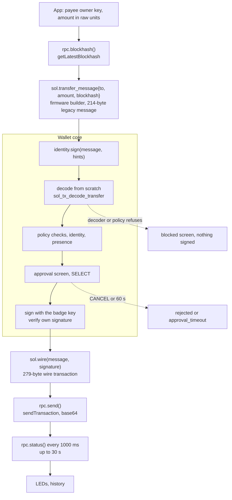

# Building and submitting the transaction

How a payment goes from "pay this key this amount" to a confirmed HACK transfer on devnet: who builds the bytes, what the bytes are, how they are submitted, and how confirmation is reported.

- Audience: firmware engineers implementing `src/wallet/rpc.cpp` and the `badge.sol` / `badge.rpc` bindings; app authors who submit payments.
- Status: design, not yet built on hardware.
- Base: Solana OS, directory `firmware/solana-os/` at commit `812b8c7` of the [upstream repository](https://github.com/spacemandev-git/solana-defcon-badge-26/tree/812b8c7aca5c366d18c0b040fafd2999f7204d84/firmware/solana-os).

Tags: **[UPSTREAM]** exists in Solana OS at that commit, with the path. **[OURS]** is our design decision; "host-tested" next to it means the reference C code in [`../reference/code/`](../reference/code/) passed its tests on a development computer ([host tests](../testing/host-tests.md)). **[UNVERIFIED]** must be measured or confirmed on a badge or on devnet; a fallback is given.

Nothing in this document has run on a badge, and no transaction built by this code has been sent to devnet. The message builder, the associated-token-account derivation and the amount formatting are written and host-tested. The RPC client is specified here and not written. Upstream has no Solana RPC code, no transaction code and no base58 decoder. [UPSTREAM: none of these exist under `firmware/solana-os/src/`]

## Who builds what

1. The **app** (Lua or C++) gathers the inputs and calls `sol.transfer_message{to, amount, blockhash}`. The builder lives in firmware because 32-bit Lua has no 64-bit integers, no SHA-256 and no curve arithmetic. It is a convenience in the untrusted path: its output is treated like any other bytes.
2. The **wallet core** decodes those bytes from scratch, applies its policy checks, shows what the bytes say on its own screen, and signs after SELECT ([signing gate](../wallet-core/signing-gate.md#state-machine)).
3. The **app** wraps the signature and the message into a wire transaction and submits it.

A wrong or malicious builder can therefore only produce something the approval screen shows truthfully or the decoder refuses. The same holds when the message comes from somewhere else entirely, such as the dashboard's attack console ([dashboard integration](../integration/dashboard.md)). [OURS]



## Inputs

| Input | Source |
|---|---|
| Fee payer and transfer authority | this badge's public key. The badge holds devnet SOL for fees; every badge is funded before the event |
| Mint, decimals | config keys `mint`, `decimals` (NVS namespace `wallet`); they must equal the dashboard's `HACK_MINT` and the mint's decimals ([matching values](../integration/dashboard.md#values-that-must-match)) |
| Source token account | `ATA(own public key, mint)`, derived once at boot and cached in `wallet_info_t.token_account` (Lua: `wallet.info().token_account`, base58) |
| Destination token account | `ATA(payee public key, mint)`, derived on demand. The account must already exist on chain; the dashboard's `npm run devnet:setup` creates one for every configured badge |
| Recent blockhash | `rpc.blockhash()` immediately before building; valid for roughly 60 to 90 s |
| Amount | raw base units, from the request or the amount picker. 10.00 HACK is raw `1000` with 2 decimals |

Amounts cross every API as decimal strings of raw units in Lua and as `uint64_t` in C, because Lua numbers are 32-bit. [UPSTREAM `firmware/solana-os/src/lua/luaconf.h:125`]

## ATA derivation

The token account for an owner is its associated token account (ATA) under the classic Token program:

```
ATA(owner, mint) = find_program_address(
    seeds      = [ owner (32), TokenkegQfeZyiNwAJbNbGKPFXCWuBvf9Ss623VQ5DA (32), mint (32) ],
    program_id = ATokenGPvbdGVxr1b2hvZbsiqW5xWH25efTNsLJA8knL )
```

`find_program_address` and the curve test it needs are described in [attestation, Derivation](../identity/attestation.md#derivation). The implementation is `sol_ata()` in [`sol_pda.c`](../reference/code/sol_pda.c): [OURS, host-tested against `@solana-program/token`]

```c
/* Associated token account for (owner, mint) under the classic Token program. */
int sol_ata(const uint8_t owner[32], const uint8_t mint[32], uint8_t out[32]);
```

It returns 0 on success.

Test vectors (the mint `So11111111111111111111111111111111111111112` is used only as a 32-byte value):

| Owner | ATA | Bump |
|---|---|---|
| `Gn2GQYmcQkatE2594ov2ELKkYWZHwARG7FiAoPWSEcxq` (stand-in merchant) | `2awXKo3YDig8kVtqRkpFhf7zf8LZaNj2TAQnGztr6wrr` | 255 |
| `4vJDQvQxRrfLYpjFWXFsVTMsw7cayvWB46pnzdn2BW97` (stand-in Judge A) | `CzgpferEuVfRjG9FfmZizQvYryWh7QPRQU5tfzrZB8CT` | 250 |

Consequences:

- No RPC call is needed to learn anyone's token account. The badge always pays from and to ATAs. This closes the dashboard's `token-accounts` gap: leave `tokenAccount` as `null` in `badges.json`.
- The signing gate uses the same derivation in the other direction: a recipient is shown as a wallet only if `ATA(hint.recipient, mint)` equals the destination in the message; otherwise the screen shows the bare token account in amber ([policy checks](../wallet-core/signing-gate.md#policy-checks), check 12).
- Each derivation costs at least one SHA-256 and one curve check; a bump of 250 costs six. The time on the ESP32-S3 is not measured. [UNVERIFIED; target below 100 ms; fallback: cache the ATA per payee]

## Bytes

### Message

The badge builds a legacy message with exactly one instruction, SPL Token `TransferChecked`. It is 214 bytes. `sol_tx_build_transfer()` in [`sol_tx.c`](../reference/code/sol_tx.c): [OURS, host-tested]

```c
/* Builds a legacy message for one TransferChecked (214 bytes).
   Account order: payer; the two token accounts in ascending raw-byte order; then mint and Token program
   in ascending raw-byte order. Guaranteed: the result is a valid Solana message and
   sol_tx_decode_transfer() accepts it and returns the same fields that were passed in.
   NOT guaranteed: byte equality with a message built by @solana/kit for the same inputs. kit orders
   keys inside each role class with a base58 text collation, which can differ from raw-byte order; the
   two are equal for vector V_LEGACY and differ for V_ALT_LEGACY (test_sol.c checks both). The order
   inside a role class has no effect on chain, and the decoder reads accounts through the instruction's
   indices, so it accepts either order.
   Returns the length, or 0 if cap < 214 or source == destination. */
size_t sol_tx_build_transfer(const uint8_t payer[32], const uint8_t source[32],
                             const uint8_t destination[32], const uint8_t mint[32],
                             const uint8_t blockhash[32], uint64_t amount, uint8_t decimals,
                             uint8_t *out, size_t cap);
```

| Offset | Size | Field | Value |
|---|---|---|---|
| 0 | 1 | `num_required_signatures` | `1` |
| 1 | 1 | `num_readonly_signed` | `0` |
| 2 | 1 | `num_readonly_unsigned` | `2` |
| 3 | 1 | account key count | `5` (compact-u16, one byte) |
| 4 | 32 | key 0 | payer = transfer authority (signer, writable) |
| 36 | 32 | key 1 | the lower of source and destination token account, compared as bytes (writable) |
| 68 | 32 | key 2 | the higher of the two (writable) |
| 100 | 32 | key 3 | the lower of mint and Token program id (read-only) |
| 132 | 32 | key 4 | the higher of the two (read-only) |
| 164 | 32 | recent blockhash | from `getLatestBlockhash` |
| 196 | 1 | instruction count | `1` |
| 197 | 1 | program id index | index of the Token program (3 or 4) |
| 198 | 1 | instruction account count | `4` |
| 199 | 4 | account indices | source, mint, destination, authority (authority is always `0`) |
| 203 | 1 | data length | `10` |
| 204 | 1 | instruction tag | `12` = `TransferChecked` |
| 205 | 8 | amount | u64 little-endian, raw units |
| 213 | 1 | decimals | the configured decimals |

The committed test vector: payer `4vJD…BW97`, source `Czgp…B8CT`, destination `2awX…6wrr`, mint `So11…1112`, blockhash 32 bytes of `0x01`, amount 1000, decimals 2.

```
offset  bytes
0       01 00 02                                                          header
3       05                                                                5 account keys
4       3a3a4ebee4030b1b4949ed6aa3624b516b804240ff7218c85db753e62b38152a  [0] payer
36      178d80b67636ac4539a4c92fb3285cb17684ef97a9bdb5c354bf16b5f4e22b5b  [1] destination token account
68      b237b06243eef6f166d1711be30efc49dd0ca7fb8611385f062a6889529dbc04  [2] source token account
100     069b8857feab8184fb687f634618c035dac439dc1aeb3b5598a0f00000000001  [3] mint
132     06ddf6e1d765a193d9cbe146ceeb79ac1cb485ed5f5b37913a8cf5857eff00a9  [4] Token program
164     0101010101010101010101010101010101010101010101010101010101010101  recent blockhash
196     01                                                                1 instruction
197     04                                                                program id index
198     04                                                                4 account indices
199     02 03 01 00                                                       source, mint, destination, authority
203     0a                                                                data length 10
204     0c                                                                12 = TransferChecked
205     e8 03 00 00 00 00 00 00                                           amount = 1000
213     02                                                                decimals
```

`sol_tx_build_transfer` orders the two token accounts, and the mint and Token program, by raw bytes. The result is always a valid message that the decoder accepts and that decodes to the inputs. It equals `@solana/kit`'s bytes when kit's base58-text order coincides with raw-byte order (vector `V_LEGACY`, the one above) and differs otherwise (vector `V_ALT_LEGACY`: same transfer, different key order, both decode to the same fields). Order inside a role class has no effect on chain, because the instruction refers to accounts by index. [OURS, host-tested: `test_sol.c` lines 36–49]

The second vector uses owner `CiGJCnuJg23Xb6Tn6eBecnqghAZmHzKbZWBNu6VDQxj7` and mint `Fr761VXmBpKsvLb7MB7j1pZ9H8Jtxa1Ua4fyVDossphm` with the same payer, blockhash and amount. Kit's key order after the payer is `F8X8…Jr4` (destination), `ZXz7…h7o` (source), `Fr76…phm` (mint), `Token…5DA`; the builder puts the source before the destination and the Token program before the mint. It is `tx.legacy_alt_order` in [`vectors.json`](../reference/code/vectors.json).

No message in the builder's order has been sent to devnet where it differs from kit's. [UNVERIFIED; resolved by the first payment on devnet. Fallback: none should be needed; if a difference is ever found, the decoder already accepts kit's order, so only the builder's two comparisons change]

For the same reason a decoder must use the indices and never fixed positions. The decoder rules are in [transaction decoder](../wallet-core/transaction-decoder.md).

The message contains nothing else: no ComputeBudget instruction, no Memo, no account creation. The decoder refuses all of those, including in messages the badge did not build.

### Wire transaction

`sol.wire(message, signature)` produces the bytes that are submitted:

| Offset | Size | Field |
|---|---|---|
| 0 | 1 | signature count, `0x01` |
| 1 | 64 | Ed25519 signature by the payer over the message bytes |
| 65 | 214 | the message, unchanged |

1 + 64 + 214 = 279 bytes. Base64 of 279 bytes is 372 characters, which is what `sendTransaction` carries.

A v0 message (first byte `0x80`, then the same 214 bytes, then one `0x00` byte for "no address-table lookups") is 216 bytes and its wire form is 281 bytes. The badge never builds v0; the decoder accepts it so that a dashboard-built attack transaction can use either version.

### Limits and fees

- A 214-byte message exceeds upstream's secure-element sign limit of 180 bytes [UPSTREAM `firmware/solana-os/src/hal/se050_apdu.h:69`]. The limit is raised to 242 by a patch. [UNVERIFIED on silicon; fallback: software key, see [keys and SE050](../wallet-core/keys-and-se050.md)]
- The fee is one signature, 5000 lamports at the time of writing. [UNVERIFIED current value; it does not affect correctness, each badge is funded with 0.05 SOL]
- One signing call has a budget of 60 s for everything it shows (identity check, approval screen, large-payment confirmation), because a blockhash lives roughly 60 to 90 s; a longer prompt would sign a dead transaction.

## RPC client

`src/wallet/rpc.cpp`, reached from apps as `badge.rpc.*` (permission `net`). [OURS; not written]

### Transport

- On Wi-Fi the client uses its own `WiFiClientSecure`, pinned to the CA named `rpc-ca` when one is installed, and `HTTPClient` with `setReuse(true)` so the TLS session is kept between calls. [UNVERIFIED that the connection is reused across calls; fallback: accept one handshake per call and lengthen polling intervals] The trust consequences of pinned, unpinned and bridged transport are in [attestation, Transport trust](../identity/attestation.md#transport-trust).
- Without Wi-Fi it falls back to the phone bridge through `net_route::request`. [UPSTREAM `firmware/solana-os/src/net/net_route.cpp:116-144`]
- Every call is one HTTP POST to config `rpc_url` (default `https://api.devnet.solana.com`) with `Content-Type: application/json`.
- Timeout 4000 ms per call.
- One static 8 KB buffer in `rpc.cpp` (`static char sBody[8192]`, internal RAM) holds every RPC response; a longer response is `too_long`. The response is parsed in place with `jsmn` (64 tokens). Request bodies are built in a 1 KB stack buffer. [OURS: one fixed buffer, no heap use per call]
- After Wi-Fi connects, the client waits up to 5 s for the first SNTP sync before its first pinned request, because a pinned handshake may check certificate dates against the badge clock ([attestation, Clock](../identity/attestation.md#clock)). [UNVERIFIED whether it does; fallback there]
- Before blocking, the client calls `runtime::extendDeadline(timeout + 500)` so the Lua watchdog does not kill the calling app. [UPSTREAM mechanism, `firmware/solana-os/src/lua_sdk/lua_runtime.cpp:198-206`] Extensions are capped at 12 s in total per callback [UPSTREAM `firmware/solana-os/src/config.h:210`], so two calls that each run to their timeout fit in one callback and three do not. Spread calls across frames.

### Request bodies

```json
{"jsonrpc":"2.0","id":1,"method":"getBalance","params":["<pubkey>",{"commitment":"confirmed"}]}
{"jsonrpc":"2.0","id":1,"method":"getTokenAccountBalance","params":["<token account>",{"commitment":"confirmed"}]}
{"jsonrpc":"2.0","id":1,"method":"getLatestBlockhash","params":[{"commitment":"confirmed"}]}
{"jsonrpc":"2.0","id":1,"method":"sendTransaction","params":["<base64 wire tx>",{"encoding":"base64","skipPreflight":false,"preflightCommitment":"confirmed","maxRetries":3}]}
{"jsonrpc":"2.0","id":1,"method":"getSignatureStatuses","params":[["<signature>"],{"searchTransactionHistory":false}]}
{"jsonrpc":"2.0","id":1,"method":"getAccountInfo","params":["<address>",{"encoding":"base64","commitment":"confirmed"}]}
```

Addresses and signatures in parameters are base58. The longest body is `sendTransaction`: 372 base64 characters plus about 160 characters of JSON.

### Result extraction

| Lua call | C call | JSON-RPC method | Value taken from the response |
|---|---|---|---|
| `rpc.balance([pubkey])` | `badge_rpc_balance` | `getBalance` | `result.value`, an integer of lamports. Parsed from the JSON text straight into `uint64_t`, never through a float. Lua receives a decimal string |
| `rpc.token_balance([owner])` | `badge_rpc_token_balance` | `getTokenAccountBalance` on `ATA(owner, mint)` | `result.value.amount` (string of raw units) and `result.value.decimals`. A token account that does not exist is a balance of zero, not an error: the client turns the node's "could not find account" error for this method into `"0", <configured decimals>` in Lua and `BADGE_OK` with `*raw = 0` in C |
| `rpc.blockhash()` | `badge_rpc_blockhash` | `getLatestBlockhash` | `result.value.blockhash` (base58, 32 bytes) |
| `rpc.send(wire)` | `badge_rpc_send` | `sendTransaction` | `result`, the transaction signature (base58). On a JSON-RPC error: `nil, "rpc", <node message, first 96 characters>`. Preflight errors are not classified here |
| `rpc.status(signature)` | `badge_rpc_status` | `getSignatureStatuses` | `result.value[0]`: `null` gives `pending`; `.err` not null gives `failed`; otherwise `.confirmationStatus` (`processed`, `confirmed` or `finalized`) |
| `rpc.token_owner(token_account)` | `badge_rpc_token_owner` | `getAccountInfo` (base64) | bytes 32..64 of the token account are the owner, bytes 0..32 the mint. `value: null` gives `no_account` |
| `rpc.call(method, params_json)` | `badge_rpc_call` | any | the `result` value as JSON text |

The complete function tables are in the [API reference](../app-platform/api-reference.md#badgerpc).

### Error mapping

| Condition | Error ([`badge_err_t`](../reference/error-codes.md#badge_err_t)) | Lua string |
|---|---|---|
| No Wi-Fi and no bridge | `BADGE_ERR_NO_NETWORK` | `no_network` |
| HTTP or transport failure | `BADGE_ERR_IO` | `io` |
| No answer within 4000 ms | `BADGE_ERR_TIMEOUT` | `timeout` |
| The response has an `error` object | `BADGE_ERR_RPC` | `rpc` |
| The response does not have the expected shape | `BADGE_ERR_PARSE` | `parse` |
| The response is longer than the 8 KB buffer | `BADGE_ERR_TOO_LONG` | `too_long` |
| `getAccountInfo` answers `value: null` (returned only by `rpc.token_owner`) | `BADGE_ERR_NO_ACCOUNT` | `no_account` |

`rpc.send` does not classify preflight errors; it returns `nil, "rpc", <node message>`. Pay classifies after a failed send, so the happy path pays no extra call: [OURS]

1. `rpc.token_owner(sol.ata(payee))` returns `nil, "no_account"`: Pay shows `Payee has no HACK account`.
2. Otherwise, the message contains `lockhash` (this matches "Blockhash not found" with either case of the first letter): Pay shows `Expired, try again`. [UNVERIFIED: the exact wording of the node's message; fallback: line 3]
3. Otherwise: Pay shows `Send failed, nothing moved`.

A `timeout`, `io` or `parse` from `rpc.send` is different, because the transaction may have reached the node. Pay keeps the transaction id (`codec.b58encode(sig)`), shows `Sent?, checking` and polls `rpc.status` for 30 s ([Pay app](../apps/pay.md)).

Devnet rate limits with four badges polling are unknown. [UNVERIFIED; fallback: Home polls one call per 3 s; back off on HTTP 429; use a second RPC URL]

## Confirmation and LEDs

Payer (F7):

1. After `rpc.send` returns a signature, mark the history record `submitted` and send the PAID hint to the payee ([payment protocol, PAID](payment-protocol.md#paid-76-bytes)).
2. Poll `rpc.status(signature)` every 1000 ms for at most 30 s.
3. `confirmed` or `finalized` is success: mark the record `confirmed`, pulse the LEDs green `(20, 241, 149)`.
4. `failed`: mark `failed`, pulse red `(255, 69, 69)`.
5. Still `pending` or `processed` after 30 s: show "Sent, not confirmed yet". The transaction may still land; History shows `submitted`.

Payee: it does not trust the PAID hint. After the hint it polls `rpc.status` for that signature until confirmed, then reads `rpc.token_balance()`; the request counts as paid only if the balance is at least the balance before the request plus the amount ([Request app](../apps/request.md)).

Both sides use `led.pulse`, whose decay is driven by the OS. [UPSTREAM `firmware/solana-os/src/lua_sdk/lib_led.cpp:89-97`]

The dashboard needs nothing from the badge for a payment. It watches the chain for `transferChecked` instructions of the HACK mint and shows them in its feed.

Latency targets from the PRD, SELECT to confirmed on the dashboard under 5 s, are not measured. [UNVERIFIED; see [measurements](../testing/measurements.md)]

## Worked example in Lua

One payment as a state machine, one blocking step per frame. Needs `permissions=sign,net,wallet` in `app.ini`. `payee` is the recipient's owner key in base58, `amount` a decimal string of raw units (`"1000"` for 10.00 HACK).

```lua
local P = { step = "idle" }

local function start(payee, amount, name, request_id)
  P = { step = "blockhash", payee = payee, amount = amount, name = name, request_id = request_id }
end

local function fail(err, detail)
  P.step, P.err, P.detail = "failed", err, detail
end

-- Call once per on_update. Each branch makes at most one blocking call.
local function advance()
  if P.step == "blockhash" then
    local bh, err = badge.rpc.blockhash()
    if not bh then return fail(err) end
    local msg, err2 = badge.sol.transfer_message{ to = P.payee, amount = P.amount, blockhash = bh }
    if not msg then return fail(err2) end
    P.msg, P.step = msg, "sign"

  elseif P.step == "sign" then
    -- Blocks on the firmware approval screen. The hints can only lower the trust level shown.
    local sig, err, detail = badge.identity.sign(P.msg, {
      recipient = P.payee, claimed_name = P.name, claimed_amount = P.amount, request_id = P.request_id })
    if not sig then return fail(err, detail) end       -- "rejected", "blocked", "approval_timeout", ...
    P.wire, P.step = badge.sol.wire(P.msg, sig), "send"

  elseif P.step == "send" then
    local txsig, err, message = badge.rpc.send(P.wire)
    if not txsig then return fail(err, message) end
    badge.history.mark(txsig, "submitted")
    P.txsig, P.step = txsig, "confirm"
    P.next_poll, P.give_up = badge.millis() + 1000, badge.millis() + 30000

  elseif P.step == "confirm" and badge.millis() >= P.next_poll then
    local status = badge.rpc.status(P.txsig)           -- nil on a network error: poll again
    if status == "confirmed" or status == "finalized" then
      badge.history.mark(P.txsig, "confirmed")
      badge.led.pulse(20, 241, 149, 400)
      P.step = "done"
    elseif status == "failed" then
      badge.history.mark(P.txsig, "failed")
      badge.led.pulse(255, 69, 69, 400)
      fail("failed")
    elseif badge.millis() >= P.give_up then
      fail("timeout", "Sent, not confirmed yet")
    else
      P.next_poll = badge.millis() + 1000
    end
  end
end

function on_update(dt)
  advance()
end
```

The wallet core appends an `out` / `signed` history record itself when it signs, so the record exists even if the app stops before `history.mark`.

## Worked example in C

The same payment with the C ABI (`src/app_host/badge_api.h`, copy in [`../reference/code/sdk-headers/app_host/badge_api.h`](../reference/code/sdk-headers/app_host/badge_api.h)). Syntax-checked against that header with `cc -std=c99 -fsyntax-only`; not linked and not run.

```c
#include <stdio.h>
#include "badge_api.h"

/* Builds, signs and submits one HACK transfer from this badge to `payee` (owner key, 32 bytes).
   Blocks on two RPC calls and on the approval screen. Call it from on_button, not every frame.
   Returns BADGE_OK and the 64-byte transaction signature, or the first error. */
badge_err_t pay_once(const uint8_t payee[32], uint64_t amount_raw, uint8_t tx_sig_out[64]) {
  uint8_t blockhash[32], message[256], signature[64], wire[1 + 64 + 256];
  char claimed[24], errmsg[97];
  badge_sign_hint_t hint;
  size_t message_len, wire_len;
  badge_err_t e;

  e = badge_rpc_blockhash(blockhash);                       /* getLatestBlockhash */
  if (e != BADGE_OK) return e;

  message_len = badge_sol_transfer_message(payee, amount_raw, blockhash, message, sizeof message);
  if (message_len == 0) return BADGE_ERR_BAD_ARG;           /* wallet not configured, or payee is this badge */

  snprintf(claimed, sizeof claimed, "%llu", (unsigned long long)amount_raw);
  hint.recipient = payee;                                   /* the wallet proves this by deriving the ATA */
  hint.claimed_name = NULL;
  hint.claimed_amount = claimed;                            /* raw units, as shown to the user by this app */
  hint.request_id = NULL;

  e = badge_identity_sign(message, message_len, &hint, signature);   /* approval screen; needs BADGE_CAP_SIGN */
  if (e != BADGE_OK) return e;                              /* rejected, blocked, approval_timeout, ... */

  wire_len = badge_sol_wire(message, message_len, signature, wire, sizeof wire);
  if (wire_len == 0) return BADGE_ERR_TOO_LONG;

  e = badge_rpc_send(wire, wire_len, tx_sig_out, errmsg, sizeof errmsg);   /* sendTransaction */
  if (e != BADGE_OK) badge_log("send failed: %s", errmsg);
  return e;
}

/* Call once per second from on_update after pay_once() succeeded. Returns 1 when finished. */
int pay_poll(const uint8_t tx_sig[64], int *confirmed) {
  badge_tx_status_t status;
  if (badge_rpc_status(tx_sig, &status) != BADGE_OK) return 0;      /* network hiccup: try again next second */
  if (status == BADGE_TX_CONFIRMED || status == BADGE_TX_FINALIZED) { *confirmed = 1; badge_led_pulse(20, 241, 149, 400); return 1; }
  if (status == BADGE_TX_FAILED) { *confirmed = 0; badge_led_pulse(255, 69, 69, 400); return 1; }
  return 0;                                                          /* pending or processed */
}
```

## Requirements covered

| Id | Requirement | Where |
|---|---|---|
| F7 | Submit to devnet, poll confirmation, flash LEDs on both badges | [RPC client](#rpc-client), [Confirmation and LEDs](#confirmation-and-leds) |
| F4 | Home shows HACK and SOL balance | [Result extraction](#result-extraction) (`rpc.balance`, `rpc.token_balance`) |
| F1 | `identity.sign(tx)` signs a transaction message | [Who builds what](#who-builds-what), [Bytes](#bytes) |
| F3 | Only `transferChecked` is built and accepted | [Message](#message) |
| NFR | SELECT to confirmed on the dashboard under 5 s | [Confirmation and LEDs](#confirmation-and-leds); unmeasured |

## Open items

| Item | Status | Fallback or how to resolve |
|---|---|---|
| Nothing has been sent to devnet from this code | [UNVERIFIED] | first payment during bring-up |
| Builder account order differs from `@solana/kit` for some key sets (vector `V_ALT_LEGACY`) | [UNVERIFIED] on devnet; host-tested: the decoder accepts both orders | first payment on devnet |
| HTTPS call time through a phone hotspot; connection reuse with `setReuse(true)` | [UNVERIFIED] | measure; lengthen polling; second RPC URL |
| ATA derivation time on the ESP32-S3 | [UNVERIFIED] | measure; cache the ATA per payee |
| SE050 signing of a 214-byte message (limit raised to 242) | [UNVERIFIED] | software key |
| Current base fee (5000 lamports per signature) | [UNVERIFIED] | irrelevant to correctness; badges hold 0.05 SOL |
| Devnet rate limits with four badges | [UNVERIFIED] | one call per 3 s on Home; back off on HTTP 429 |
| Free heap with one TLS session (about 40 KB estimated) | [UNVERIFIED] | measure; see [measurements](../testing/measurements.md) |
| Exact wording of the node's preflight error for an expired blockhash (U19) | [UNVERIFIED] | Pay matches `lockhash`; otherwise the generic line `Send failed, nothing moved` |
| Whether a pinned TLS handshake checks certificate dates while the badge clock is unset (U18) | [UNVERIFIED] | wait up to 5 s for SNTP before the first pinned request; if it still fails, remove `rpc-ca` and run unpinned (shown on screen) |
