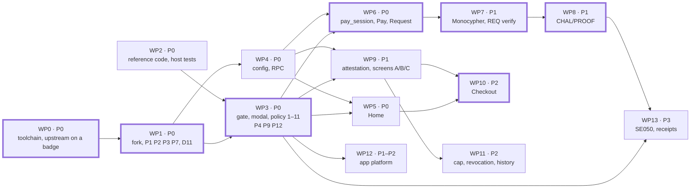

# Implementation plan

The order of work for the 24-hour build: work packages with dependencies and a "done when" each, the critical path, the hour plan with the marks at which a fallback is taken, the patch assignments, and the fallback ladder tied to the PRD's risk table.

Audience: the team.

Status: design, not yet built on hardware.

No work package has started on hardware. What exists today is the host-tested reference code in [`../reference/code/`](../reference/code/) (the input to WP2), the header listings under `sdk-headers/` there, and this documentation. The plan is owner-agnostic: it says what depends on what, not who does it. Upstream is `firmware/solana-os/` at commit `812b8c7` of the [upstream repository](https://github.com/spacemandev-git/solana-defcon-badge-26/tree/812b8c7aca5c366d18c0b040fafd2999f7204d84/firmware/solana-os).

## Priorities

Priorities are the PRD's: P0 must ship for a demo; P1 carries the differentiation; P2 makes it competitive; P3 is stretch.

| Priority | Requirements | Work packages | What the demo has when this level is complete |
|---|---|---|---|
| P0 | F1–F7 | WP0–WP6 | a judge pays another badge on devnet through the firmware approval screen; unknown instructions are blocked; no identity states yet |
| P1 | F8–F11 | WP7, WP8, WP9 | signed requests, proof of presence, verified / unverified / mismatch on the screen; the impostor and replay attacks are caught |
| P2 | F12–F16 | WP10, WP11 | the compromised-laptop attack, the spending cap, revocation, history |
| P1–P2, parallel | app platform | WP12 | C++ apps and permissions; Tip Jar in both languages |
| P3 | F17, F19 | WP13 | the key in the SE050 proven on silicon; co-signed receipts |

F13 (dashboard) is already built and documented in [`../../dashboard/`](../../dashboard/RUNBOOK.md). F18 (voice readout) is out of scope for the OS.

A package is finished when its "done when" tests pass on badges, not when its code is written.

## Work packages

| WP | Priority | Work | Depends on | Done when |
|---|---|---|---|---|
| WP0 | P0 | Toolchain; build and flash upstream unmodified on one badge; record key and source; join hotspot; ESP-NOW radar between two badges | — | the expected log lines are seen ([build guide](../guides/build-and-flash.md#build-upstream-first)); `/api/identity` answers |
| WP1 | P0 | Fork into the repo; patches P1, P2, P3, P7 (stack, handler, `local_config.h`), D11 | WP0 | builds; `on_espnow` works in the second app launched (T-APP2) |
| WP2 | P0 | Copy the reference `sol_*`, `pay_proto.*` and `attest_parse.c` files and the headers into `src/wallet/`; host tests in `test/host/` | — (parallel to WP0) | `ctest` green: `test_sol`, `test_pay`, `test_attest` |
| WP3 | P0 | Gate + modal + blocked screen + policy steps 1–11; patches P4 (passkey), P9 (Lua bindings) and P12 (manifest permissions); Lua `identity.*`, `sol.*`, `codec.*`, `wallet.*`; audit to `badge_log` | WP1, WP2 | T-F1, T-F1b, T-F2, T-F2b, T-F2c, T-F3; M7 recorded |
| WP4 | P0 | `wallet_config` + `/api/wallet/config`, `SETWALLET` and the `/api/identity` fields (patch P11, first part); `rpc.cpp` + Lua `rpc.*` | WP1 | Home-less test app prints balances; config round-trips; M5 recorded |
| WP5 | P0 | Home app (F4) | WP3, WP4 | T-F4 |
| WP6 | P0 | `pay_session` with REQ (signed), HELLO/IAM, PAID; Lua `pay.*`; Pay and Request apps; submit, confirm, LEDs (F5–F7) | WP3, WP4 | T-F5, T-F6, T-F7; demo step 1 without identity states |
| WP7 | P1 | Monocypher (P5), REQ verification on receipt (F8), timing logs M2 | WP6 | T-F8; M2 recorded |
| WP8 | P1 | CHAL/PROOF, presence table, deadline (F9) | WP7 | T-F9; M1 recorded; `deadline_ms` set |
| WP9 | P1 | `attest.cpp`, known-names store, gate steps 12–15, screens A/B/C states (F10, F11) | WP4, WP3 | T-F10, T-F11, T-F11c; attack flow 1 |
| WP10 | P2 | Checkout app, `json.*`, outcome POST, Home polling (badge side of F12) | WP5, WP9 | attack flow 3; dashboard gaps closed; M3, M4, M6 recorded |
| WP11 | P2 | Cap and max (F14); revocation path and refresh (F15); history store + app (F16); Settings → Wallet and the token-account line (patch P10, second part); `/api/wallet/audit` (patch P11, second part); `rpc-ca` pin; SNTP | WP9 | T-F14, T-F15, T-F16, T-NFR-honesty; attack flow 4 |
| WP12 | P1–P2, parallel | App platform: `app_host`, the launcher part of patch P10, permission guards (P13), native runtime, SDK, registry, Tip Jar in both languages | WP3 | T-APP1 |
| WP13 | P3 | SE050 on silicon (P6, P14, T-SE1) and upstream PR; receipts (F19) | WP3; WP8 | T-SE1 or documented fallback; T-F19 |
| Freeze | — | Flash four badges, seed known names, rehearse | everything that shipped | T-NFR-cancel (release gate); the four attack flows |

D11 is the decision to compile the upstream app-store broker client out by default (`WALLET_ENABLE_BROKER 0`); see [../architecture/overview.md](../architecture/overview.md). Patch ids P1–P14 are defined in [../architecture/runtime-and-boot.md](../architecture/runtime-and-boot.md#upstream-patches); which package applies each is under [Patches by work package](#patches-by-work-package). Test ids are defined in [../testing/acceptance.md](../testing/acceptance.md), attack flows in [../testing/attack-scripts.md](../testing/attack-scripts.md), measurement ids in [../testing/measurements.md](../testing/measurements.md).

## Dependency graph

Arrows point from a package to the packages that need it. The thick outline marks the critical path.

## Critical path

Critical path: WP0 → WP1 → WP3 → WP6 → WP7 → WP8 → WP10. WP9 starts when WP3 and WP4 are done, runs beside WP6–WP8, and must be finished before WP10. WP2, WP4 and WP12 run in parallel from the start.

Reading the path against the dependency column:

- The path is the order of work on the longest track, not only a chain of dependencies. WP10 depends on WP5 and WP9; it follows WP8 on the path because the same people build both.
- WP9 is off the path and still gates WP10 and WP11. It has its own cut-off (hour 16).
- WP4 is not on the path but gates WP5, WP6 and WP9. Treat it as critical in practice.
- WP2 has no dependency and needs no badge. It can be finished before the event starts; the code and tests already exist in [`../reference/code/`](../reference/code/).

## Hour marks

The build is 24 hours. The plan below is an estimate for three people, one per track; adjust it at kickoff and keep it current. [OURS estimate] At each cut-off the fallback is taken without further discussion if the package is not done.

| WP | Start–end (h) | Track | Cut-off and fallback |
|---|---|---|---|
| WP0 | 0–2 | A | — |
| WP2 | 0–1 | B | — |
| WP4 | 1–5 | B | — |
| WP1 | 2–3 | A | — |
| WP3 | 3–7 | A | h 9: nothing else matters until T-F1–T-F3 pass |
| WP12 | 5–12 | C | h 20: ship Lua apps only. Hours 5–7 cover `app_host`, the native runtime, the SDK and the registry, which do not need the gate; permission guards, Tip Jar and T-APP1 start when WP3 is done at hour 7 [OURS] |
| WP5 | 7–8 | B | — |
| WP6 | 7–11 | A + B | h 13 |
| WP9 | 8–14 | B | h 16: baked allowlist |
| WP7 | 11–12.5 | A | h 14: `WALLET_ED25519_BACKEND 0`, `deadline_ms` 2500 |
| WP8 | 12.5–15 | A | h 18: `PAY_ENABLE_PRESENCE 0` |
| WP10 | 15–17 | A + B | h 19: use "Mark rejected" |
| WP11 | 17–20 | all | h 21: drop F16 first, then F15 |
| WP13 | 20–22 | C | h 22: software key, say so |
| Freeze | 22 | all | flash four badges, seed known names, T-NFR-cancel, the four attack flows, rehearsal until 24 |

The freeze at hour 22, in order:

1. Flash all four badges with the same image, built with `PAY_MEASURE 0` ([flashing four badges](../guides/build-and-flash.md#flashing-four-badges)).
2. Seed known names on each judge badge ([pre-event checklist, item 10](../guides/pre-event-checklist.md#10-seed-known-names-on-each-judge-badge)). Red `NAME MISMATCH` and `REVOKED` need the payer's badge to have seen the real merchant verified once; after seeding, nobody uses "Forget known names" or flashes a filesystem image.
3. Run [T-NFR-cancel](../testing/acceptance.md#t-nfr-cancel). It is the release gate.
4. Run the four attack flows once ([attack scripts](../testing/attack-scripts.md)), in demo order: the honest payment first.
5. Rehearse until hour 24. Whatever passes its tests is what is shown.

Tracking table. The planned finish is the end of the range above.

| WP | Owner | Planned finish (hour) | Cut-off (hour) | Actual finish (hour) | Tests passed |
|---|---|---|---|---|---|
| WP0 | | 2 | | | |
| WP1 | | 3 | | | |
| WP2 | | 1 | | | |
| WP3 | | 7 | 9 | | |
| WP4 | | 5 | | | |
| WP5 | | 8 | | | |
| WP6 | | 11 | 13 | | |
| WP7 | | 12.5 | 14 | | |
| WP8 | | 15 | 18 | | |
| WP9 | | 14 | 16 | | |
| WP10 | | 17 | 19 | | |
| WP11 | | 20 | 21 | | |
| WP12 | | 12 | 20 | | |
| WP13 | | 22 | 22 | | |
| Freeze | | 22 | | | |

## Work package notes

What to read and what each package touches. Nothing here adds scope to the table above.

### WP0

Follow [../guides/build-and-flash.md](../guides/build-and-flash.md#toolchain) through "Build upstream first". Record the core version that builds, each badge's key and key location. This is the first time anything runs on a badge; expect to correct the guide. [UNVERIFIED: the whole toolchain; `arduino-cli` was not installed where this was designed.]

### WP1

Create the fork ([build guide](../guides/build-and-flash.md#our-tree)). Patches: P1 (keep the ESP-NOW receive handler when an app stops), P2 (receive timestamp), P3 (pause and resume the Lua deadline), P7 (loop stack, wallet hooks, new ESP-NOW handler, broker behind a switch, the optional `local_config.h` include and the first-boot defaults). The `app_host::` names that P7 puts in place of `runtime::` calls arrive with `app_host` in WP12; until then those call sites keep `runtime::`. [OURS: `app_host` does not exist before WP12] Reference: [../architecture/runtime-and-boot.md](../architecture/runtime-and-boot.md). Test: [T-APP2](../testing/acceptance.md#t-app2).

### WP2

Copy the reference files and the headers and run the three host suites (`test_sol`, `test_pay`, `test_attest`): [../testing/host-tests.md](../testing/host-tests.md). No badge needed.

### WP3

The signing gate, the approval modal, the blocked screen, policy checks 1 to 11, patch P4 (the key gate), patch P9 (register the new Lua bindings, API version 2), patch P12 (manifest parsing), and the Lua modules `identity`, `sol`, `codec`, `wallet`. P12 is here because the `sign` permission is enforced from the first build. References: [State machine](../wallet-core/signing-gate.md#state-machine), [Policy checks](../wallet-core/signing-gate.md#policy-checks), [Approval modal](../wallet-core/signing-gate.md#approval-modal), [Key gate](../wallet-core/signing-gate.md#key-gate), [Screen E](../wallet-core/screens.md#screen-e), [../wallet-core/transaction-decoder.md](../wallet-core/transaction-decoder.md), [`badge.identity`](../app-platform/api-reference.md#badgeidentity). Tests: [T-F1](../testing/acceptance.md#t-f1), [T-F1b](../testing/acceptance.md#t-f1b), [T-F2](../testing/acceptance.md#t-f2), [T-F2b](../testing/acceptance.md#t-f2b), [T-F2c](../testing/acceptance.md#t-f2c), [T-F3](../testing/acceptance.md#t-f3); record [M7](../testing/measurements.md#m7). Cut-off hour 9: nothing else matters until T-F1 to T-F3 pass.

### WP4

Wallet configuration in NVS; the first part of patch P11 (the `/api/wallet/config` routes, the `SETWALLET` line command, which shares their validation, and the `key_location` and `token_account` fields of `/api/identity`); the JSON-RPC client and the Lua module `rpc`. References: [../wallet-core/config-limits-audit.md](../wallet-core/config-limits-audit.md), [../protocol/transaction-building.md](../protocol/transaction-building.md), [`badge.rpc`](../app-platform/api-reference.md#badgerpc), [../guides/configure.md](../guides/configure.md#wallet-config). Done when a test app prints balances and a config change survives a read-back. Record [M5](../testing/measurements.md#m5).

### WP5

Home: [../apps/home.md](../apps/home.md). Test: [T-F4](../testing/acceptance.md#t-f4).

### WP6

Payment sessions with signed REQ, HELLO/IAM and PAID; the Lua module `pay`; the Pay and Request apps; submit, confirm, LEDs. References: [Messages](../protocol/payment-protocol.md#messages), [Payee state machine](../protocol/payment-protocol.md#payee-state-machine), [Payer state machine](../protocol/payment-protocol.md#payer-state-machine), [Screen F](../wallet-core/screens.md#screen-f), [../apps/pay.md](../apps/pay.md), [../apps/request.md](../apps/request.md). Tests: [T-F5](../testing/acceptance.md#t-f5), [T-F6](../testing/acceptance.md#t-f6), [T-F7](../testing/acceptance.md#t-f7). At the end of WP6 demo step 1 works, without identity states.

### WP7

Monocypher as the Ed25519 backend (patch P5), verification of REQ signatures on receipt, the M2 timing log. References: [../wallet-core/keys-and-se050.md](../wallet-core/keys-and-se050.md), [Rules](../protocol/payment-protocol.md#rules). Test: [T-F8](../testing/acceptance.md#t-f8); record [M2](../testing/measurements.md#m2).

### WP8

CHAL and PROOF, the presence table, the deadline. References: [Timing](../protocol/payment-protocol.md#timing), [Sequences](../protocol/payment-protocol.md#sequences). Test: [T-F9](../testing/acceptance.md#t-f9); record [M1](../testing/measurements.md#m1) on a `PAY_MEASURE 1` build and set `deadline_ms`. Attack flow 2 (replayed request) becomes demonstrable here.

### WP9

The attestation check (`attest.cpp`, around the host-tested `attest_parse.c`), the known-names store, policy checks 12 to 15, and the green, amber and red states of screens A, B and C. References: [Derivation](../identity/attestation.md#derivation), [Account layout](../identity/attestation.md#account-layout), [Decision](../identity/attestation.md#decision), [Cache](../identity/attestation.md#cache), [Known names](../identity/attestation.md#known-names), [Severity and gestures](../wallet-core/signing-gate.md#severity-and-gestures). Tests: [T-F10](../testing/acceptance.md#t-f10), [T-F11](../testing/acceptance.md#t-f11), [T-F11c](../testing/acceptance.md#t-f11c), attack flow 1.

### WP10

The Checkout app, the Lua module `json`, the outcome POST, Home's polling of the dashboard. References: [../apps/checkout.md](../apps/checkout.md), [../integration/dashboard.md](../integration/dashboard.md). Done when attack flow 3 runs and the dashboard's badge gaps are closed. This is the first point at which the whole flow exists, so record [M3](../testing/measurements.md#m3), [M4](../testing/measurements.md#m4) and [M6](../testing/measurements.md#m6) here. Cut-off hour 19: narrate the attack from the laptop and use "Mark rejected".

### WP11

Cap and max, the revocation path, the history store and app, Settings → Wallet and the token-account line on Settings → Identity (the second part of patch P10), the `/api/wallet/audit` route (the second part of patch P11), the `rpc-ca` pin, SNTP. References: [../wallet-core/config-limits-audit.md](../wallet-core/config-limits-audit.md), [Screen D](../wallet-core/screens.md#screen-d), [Transport trust](../identity/attestation.md#transport-trust), [../apps/history.md](../apps/history.md), [../apps/settings.md](../apps/settings.md). Tests: [T-F14](../testing/acceptance.md#t-f14), [T-F15](../testing/acceptance.md#t-f15), [T-F16](../testing/acceptance.md#t-f16), [T-NFR-honesty](../testing/acceptance.md#t-nfr-honesty), attack flow 4. Cut-off hour 21: drop F16 first, then F15.

### WP12

The app platform: unified app host (with it, the `runtime::` → `app_host::` renames of patches P7, P10 and P11), the launcher part of patch P10, the permission guards in the upstream bindings (patch P13), the native runtime, the C++ SDK, the registry, Tip Jar in both languages. References: [../app-platform/overview.md](../app-platform/overview.md), [../app-platform/cpp-apps.md](../app-platform/cpp-apps.md), [../app-platform/examples.md](../app-platform/examples.md). Test: [T-APP1](../testing/acceptance.md#t-app1). Manifest parsing (patch P12) is not here; it is in WP3. Cut-off hour 20: ship Lua apps only.

### WP13

The SE050 on silicon (patch P6, [T-SE1](../testing/acceptance.md#t-se1)), its fallback switch (patch P14, `WALLET_FORCE_SOFTWARE_KEY`) and the upstream pull request; co-signed receipts ([T-F19](../testing/acceptance.md#t-f19)). References: [../wallet-core/keys-and-se050.md](../wallet-core/keys-and-se050.md), [../apps/receipts.md](../apps/receipts.md). Receipts are not started until everything through P2 is done. If T-SE1 fails, the documented fallback (software key) completes the SE050 half of this package. Before sending anything upstream, note that the upstream repository has no licence file; ask the author.

### Patches by work package

| Patch | What | Work package |
|---|---|---|
| P1, P2, P3 | ESP-NOW handler kept across app stops; receive timestamp; Lua deadline pause | WP1 |
| P7 | `solana-os.ino`: loop stack, wallet hooks, new ESP-NOW handler, broker behind a switch, `local_config.h` include, first-boot defaults | WP1; its `runtime::` → `app_host::` renames with WP12 |
| P4 | `identity_private.h` passkey; `sign` removed from `identity.h` | WP3 |
| P9 | register the new Lua modules; API version 2 | WP3 |
| P12 | `app.ini` `permissions=` and `min_api=` parsed into the app record | WP3 (the `sign` permission is enforced from the first build) |
| P11, first part | `/api/wallet/config`, `SETWALLET`, the `/api/identity` fields | WP4 |
| P5 | Monocypher in the software signing branch | WP7 |
| P10, launcher part | the launcher lists Lua and native apps | WP12 |
| P13 | permission guards in the upstream Lua bindings | WP12 |
| P10, second part | Settings → Wallet; the token-account line on Settings → Identity | WP11 |
| P11, second part | `/api/wallet/audit` | WP11 |
| P6 | SE050 sign limit 180 → 242 bytes | WP13 |
| P14 | `identity.cpp` `create()` under `WALLET_FORCE_SOFTWARE_KEY` | WP13 |
| P8 | the broker signs through the wallet | not scheduled; required before `WALLET_ENABLE_BROKER` is ever set to 1 |

Two placements are ours where the patch table and the package list leave a choice [OURS]: `SETWALLET` goes with the config routes in WP4 because it shares their validation, and the `runtime::` → `app_host::` renames inside P7, P10 and P11 go with WP12 because `app_host` does not exist before it.

### Measurements and tests by work package

| Work package | Measurements recorded | Tests beyond the F-requirement tests |
|---|---|---|
| WP1 | | T-APP2 |
| WP3 | M7 | T-F1b, T-F2b, T-F2c |
| WP4 | M5 | |
| WP7 | M2 | |
| WP8 | M1 | |
| WP9 | | T-F11c |
| WP10 | M3, M4, M6 | |
| WP11 | | T-NFR-honesty |
| WP12 | | T-APP1 |
| Freeze | | T-NFR-cancel (release gate) |

## Fallback ladder

Each PRD risk, the trigger that tells us it has happened, and what we do. The last two rows are risks the design adds.

| Risk | PRD likelihood | Trigger | Action |
|---|---|---|---|
| SE050 path fails | Medium | T-SE1 fails or boot log shows fallback; WP13 not done by hour 22 | `WALLET_FORCE_SOFTWARE_KEY 1` (patch P14); all badges report `software`; remove the secure-element claim |
| Venue Wi-Fi unusable | High | badges cannot join or ESP-NOW splits | one phone hotspot for everything (default plan) |
| Faucet limits | High | — | pre-fund with `devnet:setup` before the event |
| SAS takes too long | Medium | WP9 not done by hour 16 | baked allowlist in `wallet_defaults.h` (same states, no revocation); dashboard unchanged |
| Nonce handshake unfinished | Medium | WP8 not done by hour 18 | `PAY_ENABLE_PRESENCE 0`; drop the replay demo |
| Judges stuck in a flow | Medium | — | CANCEL exits everywhere; hold CANCEL 1.5 s; T-NFR-cancel is a release gate at the freeze |
| Monocypher does not build or is not fast enough | (added) | WP7 not done by hour 14 | `WALLET_ED25519_BACKEND 0`, `deadline_ms` 2500, accept amber more often |
| Native runtime slips | (added) | WP12 not done by hour 20 | ship Lua apps only; keep the C++ SDK doc and example marked "not built" |
| Checkout or the listener path unfinished | (added) | WP10 not done by hour 19 | narrate the compromised-laptop attack from the Attack page and use "Mark rejected" |
| P2 features run out of time | (added) | WP11 not done by hour 21 | drop F16 (history) first, then F15 (revocation) |
| Judge badge has not seen the merchant verified | (added) | impostor or revoked merchant shows amber `UNVERIFIED` in rehearsal | repeat the seeding step; keep the demo order (honest payment first) |

What each action costs:

| Action | Still works | Lost |
|---|---|---|
| `WALLET_FORCE_SOFTWARE_KEY 1` | everything else | F17; the seed is plaintext in NVS, and the badge says `software` ([steps](../guides/build-and-flash.md#resetting-identity)) |
| Baked allowlist | the same screen states; the impostor demo | revocation (F15, attack flow 4); the on-chain registry is no longer what the badge checks |
| `PAY_ENABLE_PRESENCE 0` | signed requests; the impostor demo (attestation) | F9; presence is "not checked" (amber) everywhere; the replay demo |
| `PAY_VERIFY_REQ 0` (a further step down, if request signatures are unfinished) | identity is still checked for the claimed key | F8; screens are amber at best |
| `WALLET_ED25519_BACKEND 0` | correctness (signatures are byte-identical) | speed; the PROOF deadline goes to 2500 ms |
| Lua apps only | every F-requirement (all shipped apps are Lua) | T-APP1; C++ apps |

The protocol's own ladder (full, then without presence, then without request verification) is described in [../protocol/payment-protocol.md](../protocol/payment-protocol.md). The switches are listed in [../guides/build-and-flash.md](../guides/build-and-flash.md#compile-time-switches).

## Requirements covered

All of F1–F12, F14–F17 and F19, through the work packages that implement them: WP3 (F1, F2, F3), WP5 (F4), WP6 (F5, F6, F7), WP7 (F8), WP8 (F9), WP9 (F10, F11), WP10 (F12 badge side), WP11 (F14, F15, F16), WP13 (F17, F19). Per-requirement links are in [../reference/traceability.md](../reference/traceability.md).

## Open items

- [UNVERIFIED] Nothing has run on a badge; WP0 is first because of that.
- [UNVERIFIED] Ed25519 speed on the ESP32-S3 decides WP7's outcome. Fallback: `WALLET_ED25519_BACKEND 0`, `deadline_ms` 2500.
- [UNVERIFIED] PROOF deadline (WP8). Fallback: 800 ms with the SE050; 2500 ms with TweetNaCl; `PAY_ENABLE_PRESENCE 0` at hour 18.
- [UNVERIFIED] SE050 path (WP13). Fallback: software key.
- [UNVERIFIED] Upstream licence (WP13's upstream PR, and publishing the fork). Fallback: credit upstream; ask the author first.
- The hour plan is an estimate, not a measurement. Adjust it at kickoff.
- [UNVERIFIED] Items U18 to U23 of the register ([README, Open items](../README.md#open-items)):
  - U18, whether a pinned TLS handshake checks certificate validity dates while the badge clock is unset. Fallback: wait up to 5 s for SNTP before the first pinned request; if it still fails, remove `rpc-ca` and run unpinned (shown on screen).
  - U19, exact wording of the node's preflight error for an expired blockhash. Fallback: match `lockhash`; otherwise the generic line `Send failed, nothing moved`.
  - U20, `__has_include("local_config.h")` under the installed core's compiler. Fallback: commit an empty `local_config.h` and drop the `#if`.
  - U21, signal-bar thresholds (-50/-60/-70/-80/-90 dBm) at table distance. Fallback: show the RSSI number instead.
  - U22, LED colours distinguishable at brightness 72. Fallback: raise LED brightness in the modal only.
  - U23, SNTP sync callback availability in the Arduino core, `sntp_set_time_sync_notification_cb`. Fallback: the time threshold alone, noting that the WPA2-Enterprise path can then read "synced".
