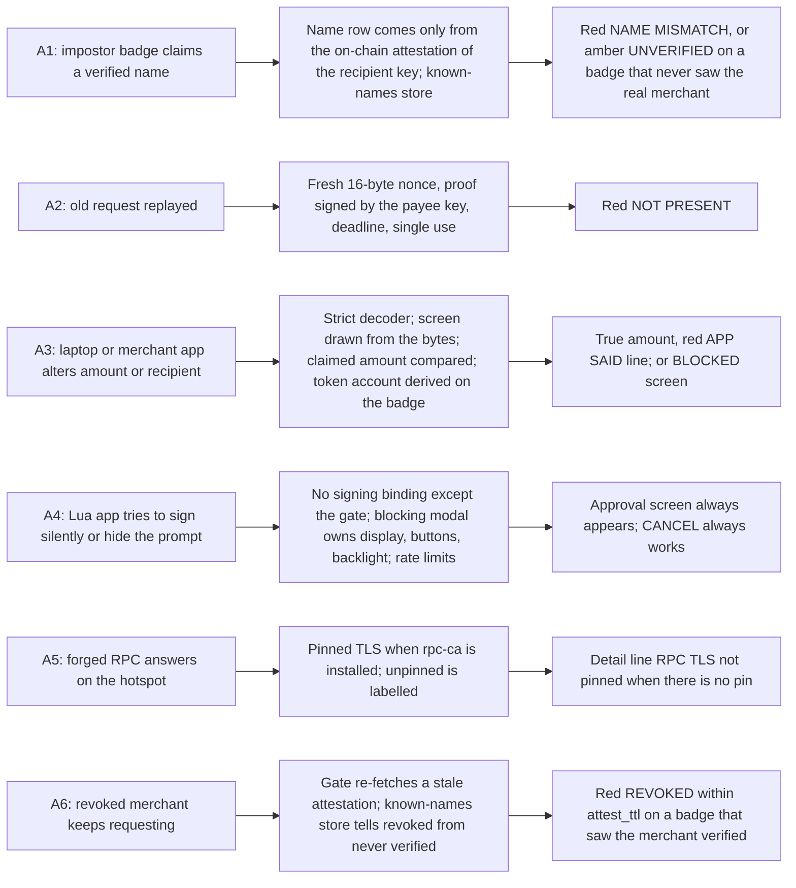

# Security model

What the badge protects, from whom, by what mechanism, how each claim is tested, and where the protection stops.

- Audience: everyone on the team; anyone answering a judge's technical question.
- Status: design, not yet built on hardware.
- Base: Solana OS, directory `firmware/solana-os/` at commit `812b8c7` of the [upstream repository](https://github.com/spacemandev-git/solana-defcon-badge-26/tree/812b8c7aca5c366d18c0b040fafd2999f7204d84/firmware/solana-os).

Tags: **[UPSTREAM]** exists at that commit; **[OURS]** our design; **[UNVERIFIED]** not yet confirmed on a badge. Every guarantee below is a design claim. The parts marked host-tested have passed tests on a development computer; **no guarantee has been demonstrated on a badge yet**, and the test column says what will demonstrate it.

The product makes three promises: a verified identity bound to the badge's key, proof that the payee is present, and "what you see is what you sign". This document restates them as twelve checkable guarantees and is explicit about twelve things the badge does not do. Terms are in the [glossary](../reference/glossary.md).

## Assets

| Asset | Where | Protected by |
|---|---|---|
| Badge private key | SE050 object `0xF0000001`, or a 32-byte seed in NVS `badgeid` | no API returns it; the `signGated` passkey, whose token type has a private user-provided constructor and so cannot be made outside `wallet::Gate` under any C++ standard ([Key gate](../wallet-core/signing-gate.md#key-gate)); the SE050 never exports |
| The user's HACK and SOL | on chain, controlled by that key | the approval screen; the decoder; cap and max |
| Truth of the approval screen | firmware | the blocking modal and firmware-only data sources (decisions D2, D3 in the [overview](../architecture/overview.md#decisions)); the modal owns display, buttons, backlight and LEDs |
| Registry binding name ↔ key | SAS accounts on devnet | on-device PDA derivation; owner and field checks ([Attestation](../identity/attestation.md)) |
| Wallet configuration | NVS `wallet` | the pairing code on the push API; an audit line on every change |

## Adversaries

The product's "attacker" role, made concrete.

| Adversary | Capabilities | Out of scope for them |
|---|---|---|
| **A1** Impostor badge | Runs any firmware, has its own key, sets any device name, sends any ESP-NOW frame | forging another key's signature; issuing attestations |
| **A2** Replayer / radio attacker | Records and re-sends any frame, sends from any MAC; a laptop or badge "posing as a badge" | producing a PROOF for a fresh nonce without the payee's key |
| **A3** Compromised laptop / merchant app | Supplies arbitrary transaction bytes and arbitrary claims to an honest app on the badge | pressing the badge's buttons |
| **A4** Malicious Lua app on the payer's badge | Any Lua code with any permissions, including `sign` | native code execution (sandbox, source-only loading [UPSTREAM `src/lua_sdk/lua_runtime.cpp:243-249`]) |
| **A5** Network attacker on the hotspot | Reads and modifies unpinned HTTP(S) traffic of the badge | breaking pinned TLS |
| **A6** Revoked former merchant | Holds a key whose attestation was closed | re-issuing its attestation |

Not modelled as adversaries, and therefore not defended against: someone with physical possession of a badge and a USB cable, someone who can flash firmware, and the holder of the registry authority key. These appear under [Non-goals and residual risks](#non-goals-and-residual-risks).

## Guarantees

Each guarantee has a mechanism and a test. Test ids starting `T-` are on-device checks in [Acceptance](../testing/acceptance.md); the attack flows are in [Attack scripts](../testing/attack-scripts.md); host tests are in [Host tests](../testing/host-tests.md).

| # | Guarantee | Mechanism | Test |
|---|---|---|---|
| G1 | No transaction signature without the firmware approval screen and a SELECT press on it | Only `wallet::Gate` can call `signGated`; the gate always runs the modal; Lua has no other binding | T-F1, T-F2, the grep rules in [Key gate](../wallet-core/signing-gate.md#key-gate) |
| G2 | The amount and token on the screen are what the signature authorises | Strict decoder; `TransferChecked` semantics; single instruction | host tests; T-F3; attack flow 3 |
| G3 | The recipient shown is the recipient paid | The destination must equal `ATA(recipient, mint)` derived on the badge, else it is shown as a bare token account (amber) | host PDA tests; T-F11c |
| G4 | An unattested key is never shown as verified; a claimed name is never shown in the name row | Row 2 is drawn only from a VERIFIED attestation fetched and parsed by firmware. An impostor using a verified name is red `NAME MISMATCH` on a badge whose known-names store holds the real merchant, which the pre-event seeding step guarantees; otherwise amber `UNVERIFIED`. | attack flow 1; the seeding check in the [pre-event checklist](../guides/pre-event-checklist.md) |
| G5 | A recorded request cannot produce a "present" payee | Fresh 16-byte nonce per CHAL, signature over nonce + payer key, deadline, single use | attack flow 2 |
| G6 | A revoked key shows red within one refresh, on a badge that has seen it verified | The gate re-fetches when the cache is older than `attest_ttl`; the known-names store, seeded before the event, tells revoked from never verified | attack flow 4 |
| G7 | Unknown instructions are blocked, not blind-signed | Decoder allowlist of one | host negative tests; T-F3 |
| G8 | A REQ/PROOF/RCPT signature cannot be used as a transaction signature, or the reverse | Domain prefixes; the structural argument in [Message signing](../wallet-core/signing-gate.md#message-signing) | `test_pay.c` |
| G9 | A Lua app cannot draw over, dim, or dismiss the approval screen | The app is not executing during the modal; backlight floor; full redraw | T-F2b |
| G10 | Large payments need a second deliberate gesture; very large are refused | `cap`, `max` | T-F14 |
| G11 | The key location is reported honestly | `identity::sourceName()` on Settings, `/api/identity`, the Wallet screen | T-NFR-honesty |
| G12 | Every signature leaves a record | Audit log and history written by the wallet core | T-F16 |

How the three product promises map to these:

| Product promise | Guarantees | Detail |
|---|---|---|
| Verified identity bound to hardware | G4, G6, G11 | [Attestation](../identity/attestation.md), [Keys and the SE050](../wallet-core/keys-and-se050.md) |
| Proof of presence | G5, G8 | [Payment protocol](../protocol/payment-protocol.md) |
| What you see is what you sign | G1, G2, G3, G7, G9, G10 | [Signing gate](../wallet-core/signing-gate.md), [Transaction decoder](../wallet-core/transaction-decoder.md), [Screens](../wallet-core/screens.md) |

Which guarantee answers which adversary:

| Adversary | Stopped by | What the payer sees |
|---|---|---|
| A1 impostor | G4 | `NAME MISMATCH` (red) if this badge has seen the real merchant verified; `UNVERIFIED` (amber) with `calls itself: <name>` if it has not |
| A2 replayer | G5 | `NOT PRESENT` (red). A request with a broken signature is never listed at all. |
| A3 compromised laptop | G2, G3, G7 | the true amount with `APP SAID <amount>` (red), or the blocked screen for anything that is not a plain transfer |
| A4 malicious Lua app | G1, G9, G12 | the real approval screen, always; every attempt in the audit log |
| A5 network attacker | G2 (cannot alter a signed transaction); pinned TLS for identity | `RPC TLS not pinned` when unpinned |
| A6 revoked merchant | G6 | `REVOKED` (red) |

### One precise statement about button presses

The product goal reads "every signature requires a physical button press". The implementation is narrower, and the difference should be stated before someone finds it:

- Every **transaction** signature has its own SELECT press on the approval screen.
- **Message** signatures (the payment request, proofs of presence, the receipt) trace to **one** SELECT press on the request or receive screen. That screen says what the press authorises. Proofs are limited to that one request id, its time to live, and eight proofs.

A proof has to be produced within a few hundred milliseconds to mean anything, so it cannot wait for a press. The signed bytes of these messages can never be a transaction (G8).

## Non-goals and residual risks

These are limits of the design, not bugs to be fixed during the event. State them plainly when asked.

1. **Native code is trusted.** A compiled-in C++ app, or any firmware bug giving native execution, runs in the same address space as the software seed and can call internal functions. The passkey idiom, the include rule and the grep rule stop mistakes, not malice. Mitigation: native apps are reviewed, listed in one table, and only the team can flash. Only Lua apps are an enforced boundary.
2. **Software-key fallback.** If the SE050 path is not proven on silicon, the seed sits in plaintext NVS; anyone with the badge and a USB cable can read it. Flash encryption and secure boot are not enabled (irreversible eFuse steps, out of scope for a 24-hour build). The badge says "software" wherever it reports the key.
3. **Relay.** A relay that forwards CHAL and PROOF within the deadline defeats proof of presence; there is no distance bounding. A relay cannot redirect funds: the payment goes to the key that signed the REQ. "Relay-resistant, not relay-proof."
4. **Dishonest verified party.** Identity names the counterparty; it does not judge them.
5. **Registry trust.** Whoever holds the registry authority key (the dashboard laptop) decides who is verified. Whoever holds a badge's pairing code can change that badge's `cred`, `schema`, `rpc_url` and so its notion of "verified". Change is audited, not prevented.
6. **RPC trust.** Attestation data comes from one RPC endpoint. Without the `rpc-ca` pin an on-path attacker can forge "verified" or hide a revocation; with the pin the RPC operator still can. The screen says `RPC TLS not pinned` when unpinned. No light-client proof is attempted.
7. **Look-alike names.** Names are printable ASCII, 1–32 characters, matching the dashboard rule (`/^[\x20-\x7E]+$/` after trim); the badge additionally rejects leading/trailing and double spaces. ASCII still has look-alikes (`I`/`l`/`1`, `O`/`0`, `rn`/`m`). Mitigations: a name is displayed only when attested, so a look-alike has to be issued by the registry admin; the short address is always shown under the name; the known-names store flags an exact duplicate on a different key. Residual: the admin issuing `MHacks Merch` and `MHacks Mcrch` to different keys.
8. **Fake pre-screens.** A Lua app can draw something that looks like the approval screen before calling `identity.sign`. It gains nothing: the real screen follows, is redrawn in full, and only its SELECT signs. There is no hardware-exclusive indicator a Lua app cannot imitate.
9. **Denial of service.** A hostile app or radio can spam prompts or frames. Rate limits bound it; they do not prevent an app from being annoying. CANCEL and hold-CANCEL always work.
10. **Receive-mode and request sessions sign PROOFs without a per-proof press.** Bounded to one request id, its TTL and 8 proofs ([Message signing](../wallet-core/signing-gate.md#message-signing)).
11. **Phone bridge.** The phone sees and can alter RPC traffic; identity is not shown as verified over the bridge. A signed transaction cannot be altered, only dropped.
12. **Devnet only.** `rpc_url` defaults to devnet; nothing here has been reviewed for real funds.

Two further points follow from the design and belong with the list:

- **The replay ring is in RAM.** After a reboot a replayed request is listed again; it then fails at the proof step (G5). The request id check is a convenience, the nonce is the defence.
- **Red needs the payer's badge to know the real merchant.** Red `NAME MISMATCH` and `REVOKED` need the payer's badge to have seen the real merchant verified once. The pre-event seeding step and the demo order guarantee that. A badge that has never seen the merchant shows amber `UNVERIFIED` — still never `verified`. On such a badge the claim appears as `calls itself: <name>`, never in the name row, and signing needs a two-second hold. What guarantees the knowledge in the demo:
  1. **Seeding**, once per judge badge before the event (the store survives reboots): with the merchant attested and requesting 10.00, open Pay on the judge badge, select the request, wait for the green Screen A showing `MHacks Merch` and `verified`, and press CANCEL. The attestation check that produced the green screen wrote the merchant to `/wallet/known.bin`. Check it by repeating with the impostor badge named `MHacks Merch`: the screen must be red `NAME MISMATCH`. The step is a row of the [pre-event checklist](../guides/pre-event-checklist.md).
  2. **Demo order**: paying the verified merchant always comes before the impostor, compromised-laptop and revocation steps, on the same judge badge ([Attack scripts](../testing/attack-scripts.md)).
  3. **Nothing erases the store** between seeding and the demo: never use Settings → Wallet → Forget known names, and never re-flash with a filesystem image (`write_flash 0x670000`).
  4. After the revocation demo, re-issue the merchant's attestation on the dashboard before the next audience. The known-names entry stays, and the merchant shows `verified` again within 30 s.

## What to say when asked

Short, accurate answers for technical questions. Where an answer depends on something not yet confirmed on hardware, it says so.

**Is the private key in a secure element?**
Look at Settings → Identity on that badge. `secure element` means the key was generated inside the SE050 and cannot be read out. `software` means the seed is in plaintext flash and could be read with a USB cable. The badge tells you which; we do not claim the secure element for a badge that reports software. (Until the SE050 path has signed a payment on a real badge, the honest answer is "software".)

**Can an app sign a transaction without me pressing a button?**
A Lua app cannot. The only signing call it has blocks inside firmware, which draws its own screen and waits for SELECT; the app is suspended and cannot draw, dim the screen or press buttons. A C++ app compiled into the firmware is trusted code, like the firmware itself; we do not claim to sandbox it.

**Does every signature need a press?**
Every transaction signature does. Payment requests and presence proofs are signed under one press that opens the session, limited to one request, its lifetime and eight proofs, and those signatures cannot be used as transactions.

**What if the laptop or the merchant app lies about the amount?**
The badge decodes the transaction bytes itself and shows what they say. If the app said 5.00 and the bytes say 500.00, the screen shows 500.00, a red line `APP SAID 5.00 HACK`, and signing is blocked.

**What if the transaction contains something other than a transfer?**
It is refused: `Unknown instruction`, nothing signed. The badge signs exactly one instruction, an SPL Token `TransferChecked` of the configured token from this badge's own token account. Priority-fee, memo, account-creation and Token-2022 instructions are all refused, on purpose.

**How does the badge know who "MHacks Merch" is?**
It derives the address of a Solana Attestation Service attestation for the recipient's key, fetches that account, and checks it belongs to the configured credential and schema. The name on screen comes from that account, not from anything the other badge or an app said.

**Who decides who is verified?**
Whoever holds the registry authority key. In the demo that is the dashboard laptop. The badge trusts the credential and schema it was configured with.

**What stops someone recording a payment request and replaying it later?**
The payer sends a fresh random 16-byte nonce and the payee must sign it with the attested key within a deadline. A recording contains no signature over the new nonce, so the screen shows `NOT PRESENT` and signing is blocked.

**What about a relay attack?**
A relay that forwards the challenge and the proof fast enough defeats the presence check. There is no distance bounding. It cannot redirect the money: the payment goes to the key that signed the request. We call it relay-resistant, not relay-proof.

**What if someone tampers with the network?**
A signed transaction cannot be altered, only dropped. Identity answers come from one RPC endpoint: with a pinned certificate an on-path attacker cannot forge them; without the pin they could, and the screen says `RPC TLS not pinned`. Over the phone bridge, identity is shown as not checked.

**What happens when a merchant is revoked?**
The badge re-fetches a stale attestation before every approval screen. Within `attest_ttl` seconds (default 30) of the revocation landing on chain, a payment to that key shows `REVOKED` in red, on any badge that had seen it verified. A badge that never saw it verified shows amber `UNVERIFIED`; either way it is never shown as verified.

**Can the screen be faked?**
An app can draw a look-alike before asking to sign. It gains nothing: the real screen replaces it, and only the real screen's SELECT produces a signature.

**Has this been audited? Is it safe for real money?**
No. It is a hackathon build on devnet with a demo token. Nothing here has been reviewed for real funds.

**Has it all been tested on the hardware?**
State what is true on the day. As of this document: the transaction decoder and builder, the address derivations, the payment message codec and the attestation account parser pass three host test suites on a development computer; nothing has run on a badge. The on-device checks are listed in [Acceptance](../testing/acceptance.md) and their results should be quoted as measured.

## Requirements covered

- Product security properties: verified identity bound to hardware, proof of presence, what you see is what you sign (mapping table above).
- **F1, F2, F3** (G1, G2, G7, G9), **F8, F9** (G5, G8), **F10, F11** (G3, G4), **F14** (G10), **F15** (G6), **F16** (G12), **F17** (G11 and residual risk 2).
- Non-functional "Security": no signing path outside the approval screen; keys never exported; unknown instructions blocked. "Honesty": key location reported.
- Product limitations to state before judges ask (residual risks 3, 4, 5, 12).

## Open items

- [UNVERIFIED] Every guarantee, on hardware. Each has a test in the table; none has been run on a badge. Fallback: a guarantee whose test fails is removed from what the team claims.
- [UNVERIFIED] SE050 path (G11, residual risk 2). Fallback: software key, reported as `software`.
- [UNVERIFIED] The proof deadline that separates "present" from "late" (G5). Fallback: a longer `deadline_ms`, which weakens relay resistance and is stated as such.
- [UNVERIFIED] Which CA root to pin for the RPC host (residual risk 6). Fallback: unpinned, labelled on screen.
- [UNVERIFIED] Whether a pinned TLS handshake checks certificate validity dates while the badge clock is unset (item U18 of the [register](../README.md#open-items)). The RPC client waits up to 5 s after Wi-Fi connects for the first SNTP sync before its first pinned request. Fallback: if pinned handshakes still fail with a date error, remove the `rpc-ca` certificate and run unpinned; the screen then says `RPC TLS not pinned`.
- [UNVERIFIED] That the known-names store on every judge badge holds the real merchant on the day (G4, G6). It is seeded by the pre-event step and checked there; a badge that was not seeded shows amber where the scripts expect red.
