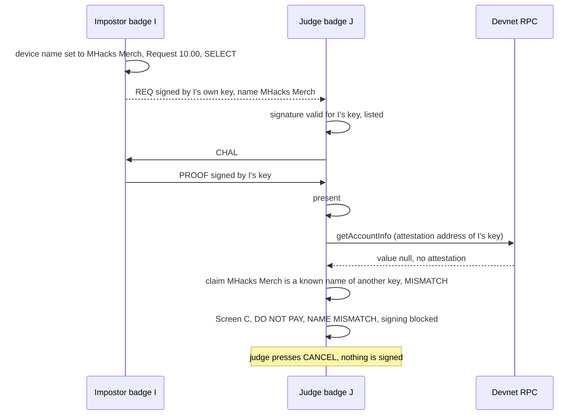
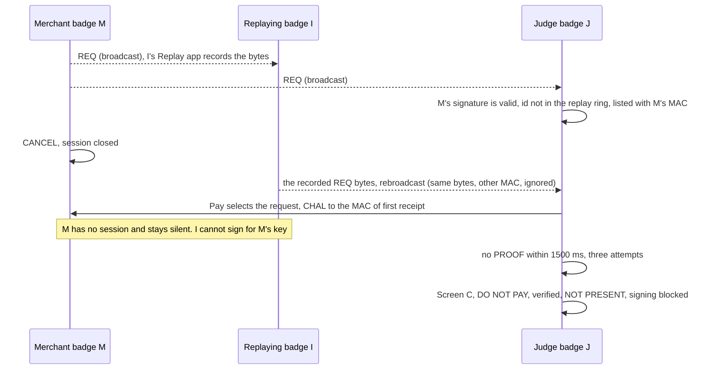
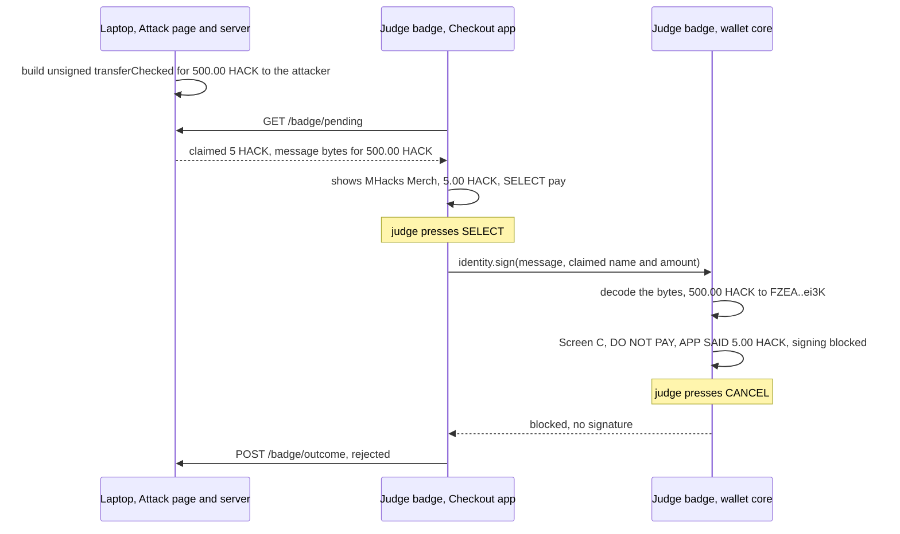
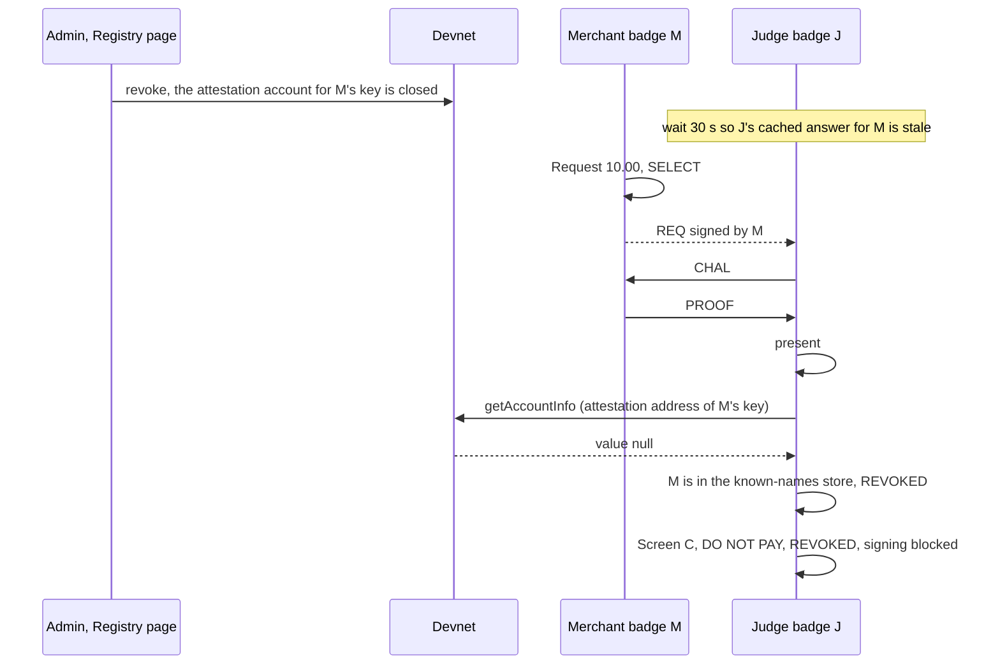

# Attack scripts

Step-by-step scripts for the four attacks the demo shows, with the exact screen the judge's badge must show for each and how to reset between runs.

- Audience: demo operators and testers.
- Status: design, not yet built on hardware.
- Base: Solana OS, directory `firmware/solana-os/` at commit `812b8c7` of the [upstream repository](https://github.com/spacemandev-git/solana-defcon-badge-26/tree/812b8c7aca5c366d18c0b040fafd2999f7204d84/firmware/solana-os).

Tags: **[UPSTREAM]** exists in Solana OS at that commit, with the path. **[OURS]** is our design decision. **[UNVERIFIED]** must be confirmed on a badge; a fallback is given.

None of these flows has been run: no badge has been flashed with this firmware. The "expected" screens are what the design specifies. The first run of each flow on hardware is a test of the design, not a rehearsal.

Buttons are named as printed on the badge: SELECT, CANCEL, UP, DOWN, LEFT, RIGHT.

## The four flows

| # | Attack | Stops at | Judge's badge shows | Can the judge sign? |
|---|---|---|---|---|
| 1 | An impostor badge requests payment under a verified merchant's name | attestation check | red `DO NOT PAY`, `NAME MISMATCH` | no (default config) |
| 2 | An old payment request is recorded and replayed | presence check | red `DO NOT PAY`, `NOT PRESENT` | no |
| 3 | A compromised laptop shows 5 HACK and sends a 500 HACK transaction | approval screen | red `DO NOT PAY`, `PAY 500.00 HACK`, `APP SAID 5.00 HACK` | no |
| 4 | A merchant whose verification was revoked requests payment | attestation check | red `DO NOT PAY`, `REVOKED` | no |

How this compares with the PRD's flow table:

| PRD says the judge sees | This design shows | Difference |
|---|---|---|
| Impostor: red "unverified" warning | red `NAME MISMATCH` if the judge's badge has seen the real merchant verified; amber `UNVERIFIED` if it has not | the red needs that badge to have seen the real merchant verified once; the seeding step and the demo order below guarantee it. See [flow 1b](#flow-1b-the-same-on-a-badge-that-never-saw-the-merchant) |
| Replay: "Not present" warning | red `NOT PRESENT` | none |
| Compromised laptop: true amount; judge presses CANCEL | true amount in red, plus what the app claimed | none |
| Revoked: red "revoked" warning | red `REVOKED` if the judge's badge has seen that key verified; amber `UNVERIFIED` if it has not | same condition as the impostor |

Red `NAME MISMATCH` and `REVOKED` need the payer's badge to have seen the real merchant verified once. The pre-event seeding step and the demo order guarantee that. A badge that has never seen the merchant shows amber `UNVERIFIED` — still never `verified`.

In all four the default config (`block_red = 1`) disables signing on a red screen: only CANCEL works, and the app receives `blocked`, whether the screen was closed with CANCEL or by the 60 s limit. `rejected` is returned only when the user declined something that could have been approved. The severity rules are in [signing gate, Severity and gestures](../wallet-core/signing-gate.md#severity-and-gestures); the screens are in [screens](../wallet-core/screens.md#screen-c).

## Setup

### Badges

The labels match `dashboard/server/config/badges.json`. The keys shown in this document are the dashboard's stand-in keys; real badges have their own.

| Short | Label | Example key | Role | State needed |
|---|---|---|---|---|
| M | Merchant (team), id 1 | `Gn2G..Ecxq` | the real merchant | attested as `MHacks Merch` |
| I | Impostor (team), id 2 | `DhEb..W511` | impostor in flow 1, replayer in flow 2 | no attestation; Replay app installed |
| J | Judge A, id 3 | `4vJD..BW97` | the payer, held by a judge | funded; seeded (has seen M verified once) |
| — | Judge B, id 4 | `FdBS..17XD` | second payer | as J |

The attacker's wallet in flow 3 is the dashboard's registry authority unless `ATTACKER_PUBKEY` is set; on the development laptop that is `FZEA..ei3K`.

### Before any flow

1. All badges and the laptop are on the same phone hotspot.
2. Every badge has its wallet config pushed and is listed in `badges.json` ([dashboard integration, Export commands](../integration/dashboard.md#export-commands)).
3. Config on every badge: `block_red` = 1, `attest_ttl` = 30, and `deadline_ms` set from a measurement. The default deadline of 400 ms is not measured; if it is too low, honest payees show as `NOT PRESENT` and flow 2 proves nothing.
4. M is attested: the dashboard's Badges page shows badge 1 as `verified`, "MHacks Merch", and M's Home shows `verified`.
5. Apps installed on every badge: `home`, `pay`, `request`, `history`, `checkout`. On I also `replay` (and `setname` for flow 1), listed below.
6. **Known names are seeded on every judge badge.** Done once per badge before the event; the store survives reboots. With M attested and requesting 10.00:
   1. On the judge badge open Pay and select M's request.
   2. Wait for the green [Screen A](../wallet-core/screens.md#screen-a) showing `MHacks Merch` and `verified`.
   3. Press CANCEL. On M, press CANCEL in Request.

   The attestation check that produced the green screen wrote M to `/wallet/known.bin` ([attestation, Known names](../identity/attestation.md#known-names)). Flows 1 and 3 show `NAME MISMATCH` because of it, and flow 4 shows `REVOKED` because of it. Check: repeat with I named `MHacks Merch` (flow 1); the screen must be red `NAME MISMATCH`.
7. **Demo order.** Demo step 1 (pay the verified merchant) always comes before the impostor, compromised-laptop and revocation steps, on the same judge badge.
8. **Never** use Settings → Wallet → Forget known names, and never re-flash with a filesystem image (`write_flash 0x670000`), between seeding and the demo. Both erase the store.
9. For flow 3: the dashboard server runs with the badge listener open, and `curl -i "http://<laptop-ip>:8788/badge/pending?badge=<J's key>"` from another hotspot client answers `204`.

## Flow 1: impostor using a verified name

**Setup.** M is attested as `MHacks Merch`. J is seeded (setup step 6). I is not attested.

**Steps.**

1. On I, set the device name to `MHacks Merch`. Upstream has no on-device name editor; the name is set from Lua with `badge.system.name()` [UPSTREAM `firmware/solana-os/src/lua_sdk/lib_system.cpp:90-110`]. Push the `setname` app below to I and run it once.
2. On I: open Request, choose 10.00, press SELECT on the firmware request screen ([Screen F](../wallet-core/screens.md#screen-f)). Under `AS` that screen shows the device name just set, and below it I's own status, `[!] UNVERIFIED`; I is honest with its own holder.
3. On J: open Pay. The list shows a request for 10.00 HACK under the claimed name: I has no attestation, so its REQ carries its device name ([name-setting app](#name-setting-app-for-flow-1)). This is an app screen and may show whatever the request claims.
4. On J: select the request with SELECT. Pay runs the presence check (I answers, it really is nearby), the attestation check, builds the transaction and asks the wallet to sign.
5. On J: the wallet screen below appears. Press CANCEL.

**Expected on J.**

```
+----------------------------------------+
| DO NOT PAY                 WiFi NOW 87%|
|########################################|  red band
| PAY   10.00 HACK                       |
|                                        |
| TO    unverified badge                 |
|       DhEb..W511                       |
|                                        |
| [x] NAME MISMATCH                      |
| [v] present                            |
| claims: MHacks Merch                   |
| MHacks Merch is verified for Gn2G..Ecxq|
|                                        |
| app: pay   tx: legacy                  |
|                                        |
| BLOCKED                CANCEL to close |
+----------------------------------------+
```

- The name row says `unverified badge`. The claimed name appears only in the detail line.
- `present` is correct: the impostor is a real badge standing next to the judge. Presence does not make it the merchant.
- Both LEDs are solid red while the screen is up.

**Expected elsewhere.** I receives nothing and its request expires. Nothing reaches the chain, so the dashboard feed shows nothing. That is the correct result. The Badges page shows badge 2 as `unverified`.



### Flow 1b: the same on a badge that never saw the merchant

**Setup.** As flow 1, but J's known-names store is empty: a fresh badge, or Settings → Wallet → "Forget known names" on J.

**Steps.** As flow 1.

**Expected on J.** Amber, not red ([Screen B](../wallet-core/screens.md#screen-b)):

```
+----------------------------------------+
| APPROVE PAYMENT            WiFi NOW 87%|
|########################################|  amber band
| PAY   10.00 HACK                       |
|                                        |
| TO    unverified badge                 |
|       DhEb..W511                       |
|                                        |
| [!] UNVERIFIED                         |
| [v] present                            |
| calls itself: MHacks Merch             |
|                                        |
| app: pay   tx: legacy                  |
| [=========>                          ] |
| hold SELECT 2s to sign   CANCEL reject |
+----------------------------------------+
```

The badge still does not present the impostor as verified, and signing takes a deliberate 2-second hold. It cannot say "mismatch" because it has never seen that name verified for anyone. The seeding step and the demo order exist so that flow 1 is red in front of a judge; this variant is run only to show the difference.

## Flow 2: replayed old request

**Setup.** M is attested. I runs the Replay app (listing below). J is in radio range of M and I, and is not in the Pay app.

**Steps.** The script forces the outcome "listed, then `NOT PRESENT`": M opens a new request that J does not touch.

1. On I: launch Replay. It shows `no REQ recorded`.
2. On M: open Request, choose 10.00, press SELECT on Screen F. This must be a **new** request, one J has not paid, cancelled or dismissed. M broadcasts it once a second. I's Replay shows `REQ recorded from <M's MAC>`.
3. On M: press CANCEL in Request. M's session is closed; M will not answer challenges for that request any more.
4. On I: press SELECT. Replay rebroadcasts the recorded 155 bytes. Press it again every few seconds while J looks at the list.
5. On J: open Pay and select the request. Pay challenges three times, 1.5 s each, and gets no valid answer. Then it asks the wallet to sign.
6. On J: the wallet screen below appears. Press CANCEL.

Do steps 2 to 5 within two minutes: J keeps the request for its `ttl_s` (120 s) from when J first heard it.

**Expected on J.**

```
+----------------------------------------+
| DO NOT PAY                 WiFi NOW 87%|
|########################################|  red band
| PAY   10.00 HACK                       |
|                                        |
| TO    MHacks Merch                     |
|       Gn2G..Ecxq                       |
|                                        |
| [v] verified                           |
| [x] NOT PRESENT                        |
|                                        |
|                                        |
|                                        |
| app: pay   tx: legacy                  |
|                                        |
| BLOCKED                CANCEL to close |
+----------------------------------------+
```

- The request is genuine: it carries M's valid signature, and M is verified, so the name row shows `MHacks Merch`. What is missing is M.
- The identity line is green and the screen is still red: a verified payee that is not present is red.

**Expected elsewhere.** M's session is closed and M sends no PROOF. I cannot produce one, because a PROOF must be signed by M's key over J's fresh nonce.

**Where the challenge goes.** An inbox entry keeps the MAC of its first receipt. A byte-identical REQ from that MAC refreshes the entry's RSSI and age; the same bytes from any other MAC are ignored. J heard the request from M first, so J's challenge goes to M, which has no session any more and stays silent; I's copies change nothing on J. If J did not hear M's own broadcast (out of range or switched off during step 2), the entry is created by I's copy, the challenge goes to I, and I cannot sign for M's key. No valid PROOF arrives either way. [OURS]

**The other outcome.** The payer keeps a ring of the last 32 request ids that reached an end (paid, rejected, dismissed, expired), in RAM. If J already paid, cancelled or dismissed that request, its id is in J's replay ring and the replay is never listed. The same happens once J's inbox entry has expired, 120 s after J first heard the request. Nothing appears in Pay. This is the rule "a reused request id is rejected" working, and it is also a pass; the script avoids it only because it shows nothing on screen.



**Tampered request (acceptance check for signed requests).** With a request recorded, press RIGHT on I instead of SELECT. Replay sends the same frame with one bit of the amount flipped (1000 becomes 1001). J must not list it, and J's log must show `[pay] req bad_sig from <mac>`, where `<mac>` is I's MAC in lower case ([payment protocol](../protocol/payment-protocol.md#frames-handled-on-the-payer)). Read J's log on Settings → Console or with `tools/badge-push.py --host <J's IP> --token <J's code> logs`. [UPSTREAM transports]

## Flow 3: compromised laptop alters the amount

**Setup.** The dashboard runs with `BADGE_LISTEN_HOST` set; J's `dash_url` points at it; J is in `badges.json`; J is seeded (setup step 6) and demo step 1 has been done on J. Details and the full message exchange are in [dashboard integration](../integration/dashboard.md#demo-walk-through).

**Steps.**

1. On the laptop: Attack page. Victim badge = J. "Checkout shows" = 5. "Transaction really moves" = 500. Click **Charge 5 HACK**. The panel shows `5 HACK ≠ 500 HACK`.
2. On J (showing Home): within about 3 s Home launches Checkout, which shows `MHacks Merch` and `5.00 HACK`, with `SELECT pay` / `CANCEL cancel`.
3. On J: press SELECT.
4. On J: the wallet screen below appears. Press CANCEL. The wallet returns `blocked` to Checkout, because signing was never possible on this screen, and Checkout posts `{"id":…,"outcome":"rejected"}` to the dashboard.
5. On the laptop: the attempt changes to `rejected` by itself.

Hand the badge over right after step 1: the attempt is served for 90 s and its blockhash goes stale after about that long.

**Expected on J.**

```
+----------------------------------------+
| DO NOT PAY                 WiFi NOW 87%|
|########################################|  red band
| PAY   500.00 HACK                      |
|                                        |
| TO    unverified badge                 |
|       FZEA..ei3K                       |
|                                        |
| [x] NAME MISMATCH                      |
| [!] presence not checked               |
| APP SAID 5.00 HACK                     |
| claims: MHacks Merch                   |
| MHacks Merch is verified for Gn2G..Ecxq|
| app: checkout   tx: legacy             |
|                                        |
| BLOCKED                CANCEL to close |
+----------------------------------------+
```

- The amount is the one in the bytes, 500.00, not the 5.00 the checkout showed.
- `APP SAID 5.00 HACK` states the lie outright. This line alone makes the screen red.
- The recipient is the attacker's wallet, not the merchant.

- The three detail lines are the first three that apply, in the wallet's fixed order: `APP SAID`, then the claim, then `<name> is verified for <short addr>` ([screens, Text strings](../wallet-core/screens.md#text-strings)).

**Expected elsewhere.** The Attack page shows `rejected` for the attempt. No transfer appears in the feed.

**If it differs.**

- Checkout never appears: `dash_url` is empty or wrong, J's key is not in `badges.json` (`/badge/pending` answers `404`), or the hotspot isolates clients. Use **Mark rejected** on the Attack page (offered on pending and on expired attempts) and narrate.
- Identity line is `UNVERIFIED` instead of `NAME MISMATCH`: J has not seen M verified (setup step 6), or its known-names store was erased (setup step 8). The screen is still red because of `APP SAID`; the claim line then reads `calls itself: MHacks Merch` and the `is verified for` line is absent.
- Row 2 says `token account`: the attacker's token account does not exist, so its owner could not be read. The Attack page shows a warning in that case; `npm run devnet:setup` creates the account.



**Variant: "what if they sign anyway".** Only with `block_red = 0` on J. The red screen then offers `hold SELECT 3s to sign anyway`. A judge who does that gets the large-payment screen ([Screen D](../wallet-core/screens.md#screen-d)) because 500.00 is above the cap of 100.00, and must hold SELECT for 2 s again. If both are done the transfer lands and the Attack page shows `signed`. Set `block_red` back to 1 afterwards.

## Flow 4: revoked badge

**Setup.** M is attested and J is seeded: M is in J's known-names store (setup step 6). This flow needs requirement F15 on the badge.

**Steps.**

1. On the laptop: Registry page, find M's row, click **Revoke**, confirm. A note appears with a **View transaction** link and the row's status becomes `revoked`.
2. Wait 30 s. That is `attest_ttl`: J re-fetches an attestation only when its cached copy is older than that.
3. On M: open Request, choose 10.00, press SELECT.
4. On J: open Pay, select the request.
5. On J: the wallet screen below appears. Press CANCEL.

**Expected on J.**

```
+----------------------------------------+
| DO NOT PAY                 WiFi NOW 87%|
|########################################|  red band
| PAY   10.00 HACK                       |
|                                        |
| TO    unverified badge                 |
|       Gn2G..Ecxq                       |
|                                        |
| [x] REVOKED                            |
| [v] present                            |
| calls itself: MHacks Merch             |
|                                        |
|                                        |
| app: pay   tx: legacy                  |
|                                        |
| BLOCKED                CANCEL to close |
+----------------------------------------+
```

- M is present and its request is correctly signed. Only the registry answer changed.
- The name row no longer shows `MHacks Merch`.
- The detail line shows whatever name M's request carries. Once M's own status has refreshed, that is M's device name instead.

**Expected elsewhere.** The Registry page shows M as `revoked`. M's own Home shows it is no longer verified after its next refresh (at most 30 s).

**Afterwards.** Re-issue M's attestation on the dashboard before the next audience. The known-names entry on J stays, and M shows `verified` again within 30 s.

**If it differs.** `[v] verified` still showing: fewer than 30 s have passed since J last checked M, or the revoke transaction has not confirmed. Amber `UNVERIFIED` instead of red `REVOKED`: J never saw M verified (setup step 6), or its known-names store was erased (setup step 8).



## Replay app

A test tool for flow 2 and for the tampered-request check. It records the last REQ it hears and rebroadcasts it. Two files under `apps/replay/`. [OURS] The Lua was parsed with `luac` and its logic run against a stub of the badge API on a development computer; it has not run on a badge.

`apps/replay/app.ini`:

```ini
name=Replay
version=1.0.0
author=team
description=Test tool: records a payment request and rebroadcasts it.
permissions=radio
```

`apps/replay/main.lua`:

```lua
-- Replay: records the last payment request (REQ) heard over ESP-NOW and rebroadcasts it.
-- Test tool for attack flow 2 and for the tampered-request check. Needs permissions=radio.
local g = badge.gfx
local saved, saved_from, sent, note = nil, "", 0, "listening"

function on_espnow(mac, data, rssi)
  -- A REQ is 155 bytes and starts with 'H' 'P', version 1, type 1.
  if #data == 155 and data:sub(1, 4) == "HP\1\1" then
    saved, saved_from, note = data, mac, "recorded"
  end
end

function on_button(key, pressed)
  if not pressed then return end
  if key == "b" then badge.system.exit() return end          -- CANCEL quits
  if key ~= "a" and key ~= "right" then return end
  if not saved then note = "nothing recorded yet" return end
  local frame = saved
  if key == "right" then                                      -- RIGHT: flip one bit of the amount (offset 36)
    frame = saved:sub(1, 36) .. string.char(saved:byte(37) ~ 1) .. saved:sub(38)
  end
  if badge.espnow.broadcast(frame) then                       -- SELECT: the recorded bytes, unchanged
    sent = sent + 1
    note = (key == "a") and "replayed" or "sent tampered"
  else
    note = "radio refused the frame"
  end
end

function on_draw()
  g.clear(g.BG)
  g.text("Replay (test tool)", 8, 8, g.WHITE, 2)
  g.text(saved and ("REQ recorded from " .. saved_from) or "no REQ recorded", 8, 48, g.MUTED, 1)
  g.text("frames sent: " .. sent .. "   " .. note, 8, 64, g.MUTED, 1)
  g.text("SELECT replay  RIGHT tampered  CANCEL quit", 8, 226, g.MUTED, 1)
end
```

Push it to I and start it (pairing code and IP are on I's Settings → Push) [UPSTREAM `firmware/solana-os/tools/badge-push.py`]:

```bash
cd firmware/solana-os
tools/badge-push.py --host <I's IP> --token <I's code> push apps/replay --run
```

How it works: the firmware hands every application frame to the wallet first and then to the running app, so an app can see payment frames; they are public radio data. `badge.espnow.broadcast` sends the bytes as an ordinary application frame, which the receiving wallet treats like any other REQ. Nothing in the app needs a key. That is the point: anyone can replay a request, and only the presence check tells the difference.

### Name-setting app for flow 1

`apps/setname/app.ini`:

```ini
name=Set name
version=1.0.0
author=team
description=Test tool: sets the device name once.
permissions=system
```

`apps/setname/main.lua`:

```lua
-- Sets this badge's device name, then exits. Needs permissions=system.
local NAME = "MHacks Merch"          -- 1 to 23 printable ASCII characters

function on_start()
  badge.system.name(NAME)
  badge.log("device name is now " .. badge.system.name())
  badge.system.exit()
end
```

```bash
tools/badge-push.py --host <I's IP> --token <I's code> push apps/setname --run
```

To restore I's name afterwards, change `NAME` to the old name and push again. The old name is the `device` line on Settings → Device info; note it before you start.

Why the device name matters: a REQ carries the same name an IAM reply does, the badge's own attested name if its cached own attestation is VERIFIED, otherwise the device name. I has no attestation, so its request claims whatever its device name is. Screen F on I shows the same name under `AS`. ([payment protocol, Payee state machine](../protocol/payment-protocol.md#payee-state-machine))

## Reset between runs

| After | Do this | Why |
|---|---|---|
| Flow 1 | On I: CANCEL in Request. Restore I's device name if I is needed as an ordinary badge | the request would otherwise stay listed until it expires |
| Flow 2 | On I: CANCEL to leave Replay. For another run, have M make a **new** request and record that one | the old request id is now in J's replay ring and will not be listed again until J reboots |
| Flow 3 | Nothing on the badge. On the laptop click **Charge** again for the next run | each attempt has its own id; an old one expires after 90 s |
| Flow 3 variant | Set `block_red` back to 1 on J | the default is what the demo claims |
| Flow 4 | Registry page: issue `MHacks Merch` to M again, before the next audience; wait 30 s before the next honest payment | J's cached "revoked" answer is used for up to `attest_ttl`. The known-names entry stays; M shows `verified` again within 30 s |
| Flow 1b | Repeat the seeding step (setup step 6) on J | refills J's known-names store |
| Any flow | Leave at least 2 s between attempts from the same app. After three refusals in a row within 60 s from one app, wait 30 s | wallet rate limits: a 2 s cooldown after each refusal, and a 30 s lockout after three ([rate limits](../wallet-core/signing-gate.md#rate-limits)). During a lockout the app gets `rate_limited` and no wallet screen appears |
| Stuck anywhere | Press CANCEL; hold CANCEL for 1.5 s to force-quit the app | always available [UPSTREAM `firmware/solana-os/solana-os.ino:74-78`] |

After every blocked or cancelled attempt, J's audit log has one `TX` line with the result (`blocked` or `rejected`) and no signature. Read it on Settings → Wallet → Audit log. After flow 3 the line is:

```
42 530911 TX checkout blocked 50000 FZEAS6Nayu6nMX1RVmoNwoPA4tu1KNM5pvfoXsQzei3K mismatch not_checked -
```

The fields are sequence number, uptime in milliseconds, event, app, result, raw amount, subject, identity, presence and signature prefix ([audit log](../wallet-core/config-limits-audit.md#audit-log)). J's History has no new entry, because nothing was signed.

## Requirements covered

| Id | Requirement | Flow |
|---|---|---|
| F8 | Signed payment requests | tampered-request check in flow 2 |
| F9 | Nonce handshake proves presence | flow 2 |
| F10, F11 | Attestation check; verified, unverified, mismatch on screen | flows 1 and 1b |
| F2, F3 | The approval screen shows what the bytes say | flow 3 |
| F12 | Compromised-laptop tool, badge side | flow 3 |
| F14 | Spending cap | flow 3 variant |
| F15 | Revocation within one refresh | flow 4 |
| Goals 2 and 3 | An impostor is never shown as verified; the true amount and recipient are shown | flows 1 and 3 |

## Open items

| Item | Status | Fallback or how to resolve |
|---|---|---|
| None of the flows has run on hardware | [UNVERIFIED] | run each once before the event; record what the screen showed |
| `deadline_ms` (default 400 ms) is unmeasured; flow 2 is only meaningful once honest payees show `present` reliably | [UNVERIFIED] | measure the round trip first ([measurements](measurements.md)); raise the deadline |
| The laptop and the badge can reach each other on the hotspot (flow 3) | [UNVERIFIED] | **Mark rejected** on the Attack page |
| Revocation needs the RPC to answer within the 4 s identity timeout | [UNVERIFIED] | on timeout the screen shows amber `NOT CHECKED`; try again |
| Red in flows 1, 3 (identity line) and 4 depends on J's known-names store | procedure | the seeding step (setup step 6), the demo order, and never erasing the store before the demo; unseeded, the badge shows amber `UNVERIFIED` |
| LED colours distinguishable at brightness 72 (the solid red in flows 1 to 4) | [UNVERIFIED] | raise LED brightness in the modal only |
