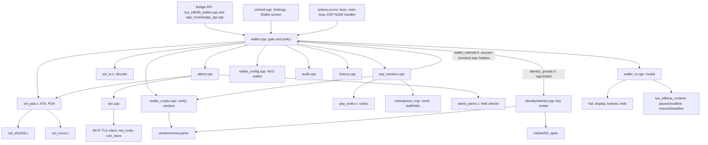

# Wallet core: the C API

The functions, types and call rules of the wallet core (`src/wallet/`), with five of its headers in full: `wallet.h`, `sol.h`, `pay_proto.h`, `wallet_crypto.h` and `wallet_internal.h`.

- Audience: firmware engineers.
- Status: design, not yet built on hardware.
- Base: Solana OS, directory `firmware/solana-os/` at commit `812b8c7` of the [upstream repository](https://github.com/spacemandev-git/solana-defcon-badge-26/tree/812b8c7aca5c366d18c0b040fafd2999f7204d84/firmware/solana-os). Paths are relative to that directory in our fork.

Tags: **[UPSTREAM]** exists at that commit (path given); **[OURS]** our decision; **[UNVERIFIED]** needs a badge (fallback given). "host-tested" means the file passed its tests on a development computer; see [Host tests](../testing/host-tests.md). Nothing here has run on a badge.

App authors do not call this API. They call the badge API (`badge.identity.sign` in Lua, `badge_identity_sign` in C), which is documented in the [API reference](../app-platform/api-reference.md) and forwards to the functions below. This document is for people writing or reviewing `src/wallet/`, `src/app_host/badge_api.cpp`, `src/lua_sdk/lib_wallet.cpp` and the shell's Wallet screen.

## Module list

Everything in `src/wallet/` is [OURS]. "Written" means the file exists in [`../reference/code/`](../reference/code/); its `sdk-headers/` directory holds the headers laid out as they will be under `src/`. "Syntax-checked" means the header passed a syntax-only compile as C99 and as C++17 on a development computer.

| File | Role | State |
|---|---|---|
| `sol.h` | API of the Solana primitives below | written, host-tested |
| `sol_b58.c` | base58 encode and decode | written, host-tested |
| `sol_sha256.c` | SHA-256: mbedTLS on the badge, a portable implementation on the host (`-DSOL_HOST_SHA256`) | written, host-tested (host path only) |
| `sol_curve.c` | `sol_is_on_curve()`: edwards25519 membership, needed for program-derived addresses | written, host-tested |
| `sol_pda.c` | `sol_find_pda`, `sol_ata`, `sol_sas_attestation_pda`, program-id constants | written, host-tested |
| `sol_tx.c` | strict transaction decoder, transfer builder, amount format and parse | written, host-tested; see [Transaction decoder](transaction-decoder.md) |
| `pay_proto.h`, `pay_proto.c` | fixed-size codec for the badge-to-badge payment messages | written, host-tested; see [Payment protocol](../protocol/payment-protocol.md) |
| `attest_parse.c` | `attest_parse()`: the field checks for one attestation account | written, host-tested by `test_attest.c`; see [Attestation](../identity/attestation.md) |
| `wallet.h` | public C API (`extern "C"`) | header written, syntax-checked only; listed [below](#walleth) |
| `wallet.cpp` | the gate: policy, rate limits, state machine, `wallet::Gate` | not written; see [Signing gate](signing-gate.md) |
| `wallet_internal.h` | the two session-checked sign helpers, shared inside `src/wallet/` only | header written, syntax-checked only; listed [below](#wallet_internalh) |
| `wallet_ui.h`, `wallet_ui.cpp` | the modal screens | not written; see [Screens](screens.md) |
| `wallet_config.h`, `wallet_config.cpp` | NVS namespace `wallet` | not written; see [Config, limits and audit](config-limits-audit.md) |
| `wallet_defaults.h` | compile-time defaults and switches | not written |
| `wallet_crypto.h`, `wallet_crypto.cpp` | signature verification and random bytes; has **no access to the key** | header written, syntax-checked only, listed [below](#wallet_cryptoh); `.cpp` not written |
| `pay_session.h`, `pay_session.cpp` | payee session, payer inbox, pending challenges, presence table, replay ring | header written, syntax-checked only: [`pay_session.h`](../reference/code/sdk-headers/wallet/pay_session.h), listed in [Payment protocol](../protocol/payment-protocol.md); `.cpp` not written |
| `attest.h`, `attest.cpp` | attestation fetch, cache and known-names store; `attest.h` also declares `attest_parse()` | header written, syntax-checked only: [`attest.h`](../reference/code/sdk-headers/wallet/attest.h), listed in [Attestation](../identity/attestation.md); `.cpp` not written |
| `rpc.h`, `rpc.cpp` | JSON-RPC client, pinned TLS when a CA is installed | not written; see [Transaction building](../protocol/transaction-building.md) |
| `audit.h`, `audit.cpp` | append-only audit log | header written, syntax-checked only: [`audit.h`](../reference/code/sdk-headers/wallet/audit.h), listed in [Config, limits and audit](config-limits-audit.md#audit-log); `.cpp` not written |
| `history.h`, `history.cpp` | payment history ring | header written, syntax-checked only: [`history.h`](../reference/code/sdk-headers/wallet/history.h), listed in [Config, limits and audit](config-limits-audit.md#history-store); `.cpp` not written |
| `vendor/` | Monocypher 4.0.2 (`monocypher.{c,h}`, `monocypher-ed25519.{c,h}`), jsmn v1.1.0 (`jsmn.h`) | third-party, to be vendored |

### Module dependencies



Two edges carry the security design:

- Only `wallet.cpp` includes `identity/identity_private.h`. No other file can name `identity::signGated`. See [Key gate](signing-gate.md#key-gate).
- `wallet_crypto.cpp` verifies signatures and draws random bytes but never sees the private key. Anything that only needs to *check* a signature (a received request, a proof, the badge's own output) depends on it and not on the key holder.

The pure-C files (`sol_*.c`, `pay_proto.c`, `attest_parse.c`) include nothing from Arduino or the firmware, use no heap, and are the only parts that are host-tested today, by three suites: `test_sol.c`, `test_pay.c` and `test_attest.c` ([Host tests](../testing/host-tests.md)).

## wallet.h

`src/wallet/wallet.h`, in full. File: [`../reference/code/sdk-headers/wallet/wallet.h`](../reference/code/sdk-headers/wallet/wallet.h). It has passed a syntax-only compile as C99 and as C++17; it has never been linked or run.

```c
#ifndef WALLET_H
#define WALLET_H
#include <stdbool.h>
#include <stddef.h>
#include <stdint.h>
#include "sol.h"
#ifdef __cplusplus
extern "C" {
#endif

typedef int32_t badge_err_t;                 /* values: enum in app_host/badge_api.h; meanings: the badge_err_t table */

typedef enum {                               /* what the approval screen says about WHO */
  WALLET_ID_VERIFIED = 0,                    /* valid attestation for the recipient key */
  WALLET_ID_UNVERIFIED = 1,                  /* no attestation account */
  WALLET_ID_MISMATCH = 2,                    /* claimed name conflicts with on-chain or known names */
  WALLET_ID_REVOKED = 3,                     /* was verified on this badge before, account is gone */
  WALLET_ID_EXPIRED = 4,                     /* attestation past expiry and the clock is trustworthy */
  WALLET_ID_UNKNOWN = 5                      /* could not check (offline, RPC error, untrusted route) */
} wallet_identity_t;

typedef enum {                               /* what the approval screen says about PRESENCE */
  WALLET_PRESENCE_PRESENT = 0,               /* fresh PROOF verified within the deadline */
  WALLET_PRESENCE_NOT_CHECKED = 1,           /* no handshake was attempted for this recipient */
  WALLET_PRESENCE_NOT_PRESENT = 2            /* handshake failed, late, bad signature, or request unknown */
} wallet_presence_t;

typedef enum { WALLET_SEV_GREEN = 0, WALLET_SEV_AMBER = 1, WALLET_SEV_RED = 2 } wallet_severity_t;

typedef struct {                             /* untrusted, optional; every pointer may be NULL */
  const uint8_t *recipient;                  /* 32 B: owner wallet the app believes it is paying */
  const char    *claimed_name;               /* what the requester called itself */
  const char    *claimed_amount;             /* raw units, decimal string, as the app displayed it */
  const uint8_t *request_id;                 /* 8 B: binds this payment to a received REQ */
} wallet_hint_t;

typedef struct {                             /* result of a pure decode + local policy, no network, no UI */
  sol_transfer_t tx;
  char amount_ui[24];                        /* "10.00" */
  char symbol[8];                            /* "HACK", or "" when the mint is not the configured one */
  bool mint_known, source_is_own_ata, payer_is_self;
} wallet_decoded_t;

typedef struct {
  bool     ready;                            /* identity ready AND mint configured */
  uint8_t  pubkey[32];
  uint8_t  key_source;                       /* 0 none, 1 se050, 2 software  (identity::Source) */
  uint8_t  mint[32];
  uint8_t  token_account[32];                /* ATA(pubkey, mint) */
  uint8_t  decimals;
  char     symbol[8];
  uint64_t cap, max;                         /* raw units */
  uint16_t deadline_ms;
  bool     block_red, tls_pinned, clock_synced;
  uint16_t attest_ttl_s;
  int8_t   rssi_min;
  bool     registry_set;                     /* cred and schema are both configured */
  uint8_t  cred[32], schema[32];             /* SAS credential and schema addresses */
  char     rpc_url[96];                      /* NUL-terminated */
  char     dash_url[64];                     /* NUL-terminated, "" when unset */
} wallet_info_t;

/* ---- lifecycle (main loop only) ---- */
void wallet_begin(void);
void wallet_update(void);
bool wallet_ready(void);
void wallet_get_info(wallet_info_t *out);

/* ---- transactions ---- */
/* Pure: decode + local checks. Used by apps to preview; the screen never trusts it.
   BADGE_OK whenever the decoder accepts the bytes; the local checks are reported ONLY through
   out->mint_known, out->source_is_own_ata and out->payer_is_self (false when the wallet is not ready).
   BADGE_ERR_UNKNOWN_INSTRUCTION with *detail set when the decoder rejects (including too_long).
   BADGE_ERR_BAD_ARG when msg or out is NULL. detail may be NULL. */
badge_err_t wallet_decode(const uint8_t *msg, size_t len, wallet_decoded_t *out, sol_tx_err_t *detail);

/* THE gate. Blocks: decode -> policy -> identity refresh -> approval screen -> sign -> self-verify.
   Returns BADGE_OK and 64 signature bytes only after SELECT on the approval screen.
   One 60 s budget covers the whole call (identity check, approval, large-payment confirmation). */
badge_err_t wallet_sign_transaction(const uint8_t *msg, size_t len, const wallet_hint_t *hint,
                                    uint8_t sig_out[64]);

/* ---- payment protocol (see pay_session.h for the tables) ---- */
#define WALLET_PAY_REQ_TTL_MAX_S      120   /* a larger ttl_s is clamped to this */
#define WALLET_PAY_RECEIVE_TTL_MAX_S  600   /* a larger ttl_s is clamped to this */
/* Confirm screen, signs REQ, opens the session and starts broadcasting.
   bad_arg: amount == 0 or ttl_s == 0.  over_limit: amount > max.  busy: a session is already open.
   Also: denied, not_ready, no_display, rate_limited, rejected, approval_timeout, sign_failed. */
badge_err_t wallet_pay_request(uint64_t amount, uint16_t ttl_s, uint8_t id_out[8]);
/* Confirm screen, opens a receive session (request id zero).  bad_arg: ttl_s == 0.  busy: a session is open.
   Also: denied, not_ready, no_display, rate_limited, rejected, approval_timeout. */
badge_err_t wallet_pay_receive(uint16_t ttl_s);
/* F19: signs and sends RCPT to the MAC the PAID hint came from. Once per session.
   no_session: no session in state paid.  rate_limited: already sent.  Also: sign_failed, io. */
badge_err_t wallet_pay_receipt(void);
void        wallet_pay_cancel(void);
void        wallet_pay_on_frame(const uint8_t mac[6], const uint8_t *data, size_t len, int8_t rssi, uint32_t rx_ms);

/* ---- used only by broker_client when WALLET_ENABLE_BROKER ---- */
typedef enum { WALLET_DOMAIN_BROKER = 1 } wallet_domain_t;   /* "solana-badge-register:" */
badge_err_t wallet_sign_domain(wallet_domain_t d, const uint8_t *suffix, size_t len, uint8_t sig_out[64]);

const char *badge_err_name(badge_err_t e);   /* "rejected", ... */

#ifdef __cplusplus
}
#endif
#endif
```

The table that the comment on `badge_err_t` names is [`badge_err_t`](../reference/error-codes.md#badge_err_t) in Error codes.

### Function reference

| Function | Blocks? | Screen | Returns |
|---|---|---|---|
| `wallet_begin()` | boot only | none | nothing. Loads configuration, derives the badge's own token account, opens `/wallet/` files, starts the audit log. Never fatal: on failure `wallet_ready()` stays false. |
| `wallet_update()` | no | none | nothing. Call once per main-loop tick. Rebroadcasts an open REQ every 1000 ms, expires sessions, flushes the audit log. |
| `wallet_ready()` | no | none | true when the identity is ready **and** a mint is configured |
| `wallet_get_info(out)` | no | none | fills `wallet_info_t`; when not ready, `ready` is false and the rest is whatever is known. See [the notes below](#wallet_info_t). |
| `wallet_decode(msg, len, out, detail)` | no | none | Pure decode plus local checks, no network, no UI. `BADGE_OK` whenever the decoder accepts the bytes: a failed local check is reported only through `mint_known`, `source_is_own_ata` and `payer_is_self` in `wallet_decoded_t`, which are all false when the wallet is not ready. `BADGE_ERR_UNKNOWN_INSTRUCTION` with `*detail` set when the decoder rejects the bytes (including a message over 256 bytes). `BADGE_ERR_BAD_ARG` when `msg` or `out` is `NULL`; `detail` may be `NULL`. `badge.identity.decode` and `badge_identity_decode` return the same. Apps use it to preview; **the approval screen never trusts it** and decodes again. |
| `wallet_sign_transaction(msg, len, hint, sig_out)` | **yes**, until the user decides or the call's 60 s budget ends. The one budget covers the identity check, the approval screen and the large-payment confirmation. | A, B or C; then D if `amount > cap`; E when blocked or when signing fails; H while checking | `BADGE_OK` and 64 bytes only after SELECT on the approval screen. Otherwise one of `denied`, `not_ready`, `no_display`, `rate_limited`, `busy`, `unknown_instruction`, `wrong_signer`, `unknown_mint`, `decimals`, `bad_source`, `over_limit`, `too_long`, `blocked`, `rejected`, `approval_timeout`, `sign_failed`. |
| `wallet_pay_request(amount, ttl_s, id_out)` | **yes**, on the confirm screen | F | `BADGE_OK` and the 8-byte request id after SELECT; the wallet signs the REQ, opens a payee session and starts broadcasting. `bad_arg` when `amount == 0` or `ttl_s == 0`; `over_limit` when `amount > max`; `busy` when a session is already open. A `ttl_s` above 120 (`WALLET_PAY_REQ_TTL_MAX_S`) is clamped to 120, and Screen F shows the clamped value. Also `denied`, `not_ready`, `no_display`, `rate_limited`, `rejected`, `approval_timeout`, `sign_failed`. |
| `wallet_pay_receive(ttl_s)` | **yes**, on the confirm screen | G | `BADGE_OK` after SELECT; opens a receive session (request id zero, no REQ is broadcast). `bad_arg` when `ttl_s == 0`; `busy` when a session is open. A `ttl_s` above 600 (`WALLET_PAY_RECEIVE_TTL_MAX_S`) is clamped to 600, and Screen G shows the clamped value. Also `denied`, `not_ready`, `no_display`, `rate_limited`, `rejected`, `approval_timeout`. |
| `wallet_pay_receipt()` | no | none | Signs a receipt (RCPT) and sends it to the MAC the PAID hint came from, once per session (requirement F19, [Receipts](../apps/receipts.md)). `no_session` when no session is in state `paid`; `rate_limited` when the receipt was already sent. Also `sign_failed`, `io`. |
| `wallet_pay_cancel()` | no | none | nothing. Closes any session. The app host calls it when the app that opened the session stops. |
| `wallet_pay_on_frame(mac, data, len, rssi, rx_ms)` | no | none | nothing. Called from the ESP-NOW receive handler for every application frame. Verifies REQ, answers CHAL and HELLO, records PROOF timing. |
| `wallet_sign_domain(d, suffix, len, sig_out)` | no | none | Signs `"solana-badge-register:"` ‖ `suffix`. Used only by `broker_client.cpp` in builds with `WALLET_ENABLE_BROKER`. Writes a `BROKER` audit line. |
| `badge_err_name(e)` | no | none | the Lua string for an error code, for example `"rejected"` |

### `wallet_info_t`

| Field | Content |
|---|---|
| `ready` | the identity is ready **and** a mint is configured |
| `pubkey`, `key_source` | the badge key and where it lives: `0` none, `1` se050, `2` software (the values of `identity::Source`); see [Keys and the SE050](keys-and-se050.md#honesty-rules) |
| `mint`, `token_account`, `decimals`, `symbol` | the configured token and the badge's own token account, `ATA(pubkey, mint)` |
| `cap`, `max`, `deadline_ms`, `block_red`, `attest_ttl_s`, `rssi_min`, `rpc_url`, `dash_url` | the [configuration keys](config-limits-audit.md#configuration-keys) of the same names (`attest_ttl_s` is the key `attest_ttl`); `dash_url` is `""` when unset |
| `cred`, `schema`, `registry_set` | the SAS credential and schema addresses; `registry_set` is true when both are configured |
| `tls_pinned` | a CA named `rpc-ca` is installed, so RPC calls are certificate-pinned ([Transport trust](../identity/attestation.md#transport-trust)) |
| `clock_synced` | set by the SNTP sync callback (`sntp_set_time_sync_notification_cb`) and additionally requires `time(nullptr) > 1750000000`. It is not inferred from the time alone, because upstream seeds the clock from the build date on the WPA2-Enterprise path [UPSTREAM `src/net/wifi_mgr.cpp:45-73`]. See [Clock](../identity/attestation.md#clock). |

Settings → Wallet is drawn from this structure. Apps see a subset of it through `badge.wallet.info()` and `badge_wallet_info()` ([API reference](../app-platform/api-reference.md)).

## sol.h

`src/wallet/sol.h`, in full. File: [`../reference/code/sol.h`](../reference/code/sol.h). [OURS] host-tested by `test_sol.c` ("all sol tests passed").

```c
/* sol.h - Solana primitives the wallet core needs. Pure C99, no heap, no Arduino.
   Host-testable: cc -std=c99 -Wall -Wextra -DSOL_HOST_SHA256 sol_*.c test_sol.c
   On the badge SOL_HOST_SHA256 is NOT defined and sol_sha256() wraps mbedtls. */
#ifndef SOL_H
#define SOL_H
#include <stddef.h>
#include <stdint.h>
#ifdef __cplusplus
extern "C" {
#endif

#define SOL_PUBKEY_LEN   32
#define SOL_SIG_LEN      64
#define SOL_B58_PUBKEY_MAX 45   /* 44 chars + NUL */
#define SOL_B58_SIG_MAX    89   /* 88 chars + NUL */
#define SOL_TX_MSG_MAX   256    /* largest message the wallet will look at */

/* ---- base58 (Bitcoin alphabet) ------------------------------------------ */
/* Returns chars written (excluding NUL), or 0 if out is too small. */
size_t sol_b58_encode(const uint8_t *in, size_t in_len, char *out, size_t out_cap);
/* Decodes exactly out_len bytes. Returns 0 on success, -1 on bad char / wrong length. */
int sol_b58_decode(const char *in, uint8_t *out, size_t out_len);

/* ---- sha256 -------------------------------------------------------------- */
typedef struct { const uint8_t *p; size_t n; } sol_slice_t;
void sol_sha256(const sol_slice_t *parts, size_t count, uint8_t out[32]);

/* ---- ed25519 curve membership (for program-derived addresses) ------------ */
/* 1 if the 32 bytes decompress to a point on edwards25519, else 0.
   Same answer as curve25519-dalek CompressedEdwardsY::decompress().is_some(). */
int sol_is_on_curve(const uint8_t p[32]);

/* ---- program-derived addresses ------------------------------------------- */
/* find_program_address: tries bump 255..0, returns 0 and fills out/bump on success. */
int sol_find_pda(const sol_slice_t *seeds, size_t seed_count, const uint8_t program_id[32],
                 uint8_t out[32], uint8_t *bump);
/* Associated token account for (owner, mint) under the classic Token program. */
int sol_ata(const uint8_t owner[32], const uint8_t mint[32], uint8_t out[32]);
/* SAS attestation PDA: seeds "attestation", credential, schema, nonce(subject pubkey). */
int sol_sas_attestation_pda(const uint8_t credential[32], const uint8_t schema[32],
                            const uint8_t subject[32], uint8_t out[32]);

extern const uint8_t SOL_TOKEN_PROGRAM_ID[32];   /* TokenkegQfeZyiNwAJbNbGKPFXCWuBvf9Ss623VQ5DA */
extern const uint8_t SOL_ATA_PROGRAM_ID[32];     /* ATokenGPvbdGVxr1b2hvZbsiqW5xWH25efTNsLJA8knL */
extern const uint8_t SOL_SAS_PROGRAM_ID[32];     /* 22zoJMtdu4tQc2PzL74ZUT7FrwgB1Udec8DdW4yw4BdG */

/* ---- transaction message decoder (structure only, no policy) ------------- */
typedef enum {
  SOL_TX_OK = 0,
  SOL_TX_ERR_TOO_LONG,        /* len > SOL_TX_MSG_MAX */
  SOL_TX_ERR_TRUNCATED,       /* ran out of bytes */
  SOL_TX_ERR_VERSION,         /* versioned message with version != 0 */
  SOL_TX_ERR_HEADER,          /* not exactly 1 required signature / readonly-signed != 0 */
  SOL_TX_ERR_ACCOUNTS,        /* account count != 5, or readonly-unsigned count != 2 */
  SOL_TX_ERR_LOOKUPS,         /* v0 message that uses address lookup tables */
  SOL_TX_ERR_IX_COUNT,        /* not exactly one instruction */
  SOL_TX_ERR_PROGRAM,         /* instruction program is not the SPL Token program */
  SOL_TX_ERR_IX_ACCOUNTS,     /* not exactly 4 instruction accounts, or an index out of range */
  SOL_TX_ERR_IX_DATA,         /* data is not 10 bytes starting with 12 (TransferChecked) */
  SOL_TX_ERR_AUTHORITY,       /* authority is not account 0 (the only signer / fee payer) */
  SOL_TX_ERR_ROLES,           /* source/destination not writable, mint/program not readonly, or aliasing */
  SOL_TX_ERR_AMOUNT_ZERO,     /* amount == 0 */
  SOL_TX_ERR_TRAILING         /* bytes left over after the message */
} sol_tx_err_t;

typedef struct {
  uint8_t  version;           /* 0xFF = legacy, 0 = v0 */
  uint8_t  fee_payer[32];     /* account 0; also the transfer authority */
  uint8_t  source[32];        /* token account debited */
  uint8_t  mint[32];
  uint8_t  destination[32];   /* token account credited */
  uint8_t  blockhash[32];
  uint64_t amount;            /* raw base units */
  uint8_t  decimals;
} sol_transfer_t;

/* Accepts ONLY: legacy or v0-without-lookups message, 1 signer, exactly 5 account keys,
   exactly 1 instruction = SPL Token TransferChecked with 4 accounts. Everything else is an
   error - the caller shows "Unknown instruction" and refuses to sign. */
sol_tx_err_t sol_tx_decode_transfer(const uint8_t *msg, size_t len, sol_transfer_t *out);
const char *sol_tx_err_name(sol_tx_err_t e);

/* Builds a legacy message for one TransferChecked (214 bytes).
   Account order: payer; the two token accounts in ascending raw-byte order; then mint and Token program
   in ascending raw-byte order. Guaranteed: the result is a valid Solana message and
   sol_tx_decode_transfer() accepts it and returns the same fields that were passed in.
   NOT guaranteed: byte equality with a message built by @solana/kit for the same inputs. kit orders
   keys inside each role class with a base58 text collation, which can differ from raw-byte order; the
   two are equal for vector V_LEGACY and differ for V_ALT_LEGACY (test_sol.c checks both). The order
   inside a role class has no effect on chain, and the decoder reads accounts through the instruction's
   indices, so it accepts either order.
   Returns the length, or 0 if cap < 214 or source == destination. */
size_t sol_tx_build_transfer(const uint8_t payer[32], const uint8_t source[32],
                             const uint8_t destination[32], const uint8_t mint[32],
                             const uint8_t blockhash[32], uint64_t amount, uint8_t decimals,
                             uint8_t *out, size_t cap);

/* "12.50" from (1250, 2). Returns chars written, 0 if cap too small. No float. */
size_t sol_format_amount(uint64_t raw, uint8_t decimals, char *out, size_t cap);
/* Parses "12.5" / "12" / "0.05" with at most `decimals` fraction digits. 0 on success. */
int sol_parse_amount(const char *text, uint8_t decimals, uint64_t *raw);

#ifdef __cplusplus
}
#endif
#endif
```

What the builder guarantees: `sol_tx_build_transfer` orders the two token accounts, and the mint and Token program, by raw bytes. The result is always a valid message that the decoder accepts and that decodes to the inputs. It equals `@solana/kit`'s bytes when kit's base58-text order coincides with raw-byte order (vector `V_LEGACY`) and differs otherwise (vector `V_ALT_LEGACY`: same transfer, different key order, both decode to the same fields). Order inside a role class has no effect on chain. [OURS] host-tested for both vectors; see [Transaction decoder, Tests](transaction-decoder.md#tests).

## pay_proto.h

`src/wallet/pay_proto.h`, in full. File: [`../reference/code/pay_proto.h`](../reference/code/pay_proto.h). [OURS] host-tested by `test_pay.c` ("all pay tests passed", signatures made and checked with Monocypher 4.0.2). The byte layouts are explained in [Payment protocol](../protocol/payment-protocol.md#messages).

```c
/* pay_proto.h - wire codec for the badge-to-badge payment messages (ESP-NOW application payloads).
   Pure C99, no heap. All integers little-endian. Signing and verification are supplied by the caller. */
#ifndef PAY_PROTO_H
#define PAY_PROTO_H
#include <stddef.h>
#include <stdint.h>
#ifdef __cplusplus
extern "C" {
#endif

#define PAY_MAGIC0 0x48 /* 'H' */
#define PAY_MAGIC1 0x50 /* 'P' */
#define PAY_VERSION 0x01

typedef enum {
  PAY_T_REQ = 0x01, PAY_T_CHAL = 0x02, PAY_T_PROOF = 0x03, PAY_T_HELLO = 0x04,
  PAY_T_IAM = 0x05, PAY_T_PAID = 0x06, PAY_T_RCPT = 0x07
} pay_type_t;

#define PAY_HDR_LEN     4
#define PAY_REQ_LEN   155
#define PAY_CHAL_LEN   60
#define PAY_PROOF_LEN 108
#define PAY_HELLO_LEN   4
#define PAY_IAM_LEN    69
#define PAY_PAID_LEN   76
#define PAY_RCPT_LEN  140
#define PAY_ID_LEN      8
#define PAY_NONCE_LEN  16
#define PAY_NAME_MAX   32

/* Domain-separation prefixes. The byte string that is signed is prefix || fields. */
#define PAY_DOMAIN_REQ   "pay-req:"     /* 8 bytes  */
#define PAY_DOMAIN_PROOF "pay-proof:"   /* 10 bytes */
#define PAY_DOMAIN_RCPT  "pay-rcpt:"    /* 9 bytes  */
#define PAY_REQ_SIGNED_LEN   (8 + 91)   /* 99  */
#define PAY_PROOF_SIGNED_LEN (10 + 56)  /* 66  */
#define PAY_RCPT_SIGNED_LEN  (9 + 72)   /* 81  */

typedef struct {
  uint8_t  payee[32];
  uint64_t amount;                 /* raw base units */
  uint8_t  mint_tag[4];            /* first 4 bytes of the mint public key */
  uint8_t  id[PAY_ID_LEN];
  uint16_t ttl_s;
  uint8_t  name_len;               /* 1..32 */
  char     name[PAY_NAME_MAX + 1]; /* NUL-terminated copy */
  uint8_t  sig[64];
} pay_req_t;

typedef struct { uint8_t id[PAY_ID_LEN]; uint8_t nonce[PAY_NONCE_LEN]; uint8_t payer[32]; } pay_chal_t;
typedef struct { uint8_t id[PAY_ID_LEN]; uint8_t payee[32]; uint8_t sig[64]; } pay_proof_t;
typedef struct { uint8_t pubkey[32]; uint8_t name_len; char name[PAY_NAME_MAX + 1]; } pay_iam_t;
typedef struct { uint8_t id[PAY_ID_LEN]; uint8_t tx_sig[64]; } pay_paid_t;
typedef struct { uint8_t id[PAY_ID_LEN]; uint8_t tx_sig[64]; uint8_t sig[64]; } pay_rcpt_t;

/* Returns the message type if buf is a well-formed header of this protocol version, else 0. */
int pay_peek(const uint8_t *buf, size_t len);

/* 1 if name is 1..32 bytes of printable ASCII (0x20..0x7E) with no leading/trailing space. */
int pay_name_ok(const char *name, size_t len);

/* Encoders write exactly PAY_*_LEN bytes. pay_req_encode leaves the signature field as given in r->sig. */
void pay_req_encode(const pay_req_t *r, uint8_t out[PAY_REQ_LEN]);
void pay_chal_encode(const pay_chal_t *c, uint8_t out[PAY_CHAL_LEN]);
void pay_proof_encode(const pay_proof_t *p, uint8_t out[PAY_PROOF_LEN]);
void pay_hello_encode(uint8_t out[PAY_HELLO_LEN]);
void pay_iam_encode(const pay_iam_t *m, uint8_t out[PAY_IAM_LEN]);
void pay_paid_encode(const pay_paid_t *m, uint8_t out[PAY_PAID_LEN]);
void pay_rcpt_encode(const pay_rcpt_t *m, uint8_t out[PAY_RCPT_LEN]);

/* Decoders return 0 on success, -1 on wrong length, header, or field rule. */
int pay_req_decode(const uint8_t *buf, size_t len, pay_req_t *r);
int pay_chal_decode(const uint8_t *buf, size_t len, pay_chal_t *c);
int pay_proof_decode(const uint8_t *buf, size_t len, pay_proof_t *p);
int pay_iam_decode(const uint8_t *buf, size_t len, pay_iam_t *m);
int pay_paid_decode(const uint8_t *buf, size_t len, pay_paid_t *m);
int pay_rcpt_decode(const uint8_t *buf, size_t len, pay_rcpt_t *m);

/* The exact bytes that are signed / verified. */
void pay_req_signed_bytes(const uint8_t req_wire[PAY_REQ_LEN], uint8_t out[PAY_REQ_SIGNED_LEN]);
void pay_proof_signed_bytes(const uint8_t id[PAY_ID_LEN], const uint8_t nonce[PAY_NONCE_LEN],
                            const uint8_t payer[32], uint8_t out[PAY_PROOF_SIGNED_LEN]);
void pay_rcpt_signed_bytes(const uint8_t id[PAY_ID_LEN], const uint8_t tx_sig[64],
                           uint8_t out[PAY_RCPT_SIGNED_LEN]);

#ifdef __cplusplus
}
#endif
#endif
```

## wallet_crypto.h

`src/wallet/wallet_crypto.h`, in full. File: [`../reference/code/sdk-headers/wallet/wallet_crypto.h`](../reference/code/sdk-headers/wallet/wallet_crypto.h). Syntax-checked only; `wallet_crypto.cpp` is not written. Everything that only needs to check a signature or draw random bytes includes this header and nothing from the key holder.

```c
/* src/wallet/wallet_crypto.h - Ed25519 verification and random bytes. No access to the badge key. */
#ifndef WALLET_CRYPTO_H
#define WALLET_CRYPTO_H
#include <stdbool.h>
#include <stddef.h>
#include <stdint.h>
#ifdef __cplusplus
extern "C" {
#endif

/* true if `sig` is a valid Ed25519 signature by `pubkey` over `msg`. Backend per WALLET_ED25519_BACKEND
   (1 Monocypher crypto_ed25519_check, 0 TweetNaCl crypto_sign_open). */
bool wallet_crypto_verify(const uint8_t pubkey[32], const uint8_t *msg, size_t len, const uint8_t sig[64]);

/* esp_fill_random(). True hardware entropy only while Wi-Fi or BLE is up; used for nonces and request ids. */
void wallet_crypto_random(uint8_t *out, size_t len);

#ifdef __cplusplus
}
#endif
#endif
```

## wallet_internal.h

`src/wallet/wallet_internal.h`, in full. File: [`../reference/code/sdk-headers/wallet/wallet_internal.h`](../reference/code/sdk-headers/wallet/wallet_internal.h). Syntax-checked only. These two functions are how `pay_session.cpp` obtains a proof or receipt signature without being able to name the gate; the mechanism is described in [Key gate](signing-gate.md#key-gate).

```c
/* src/wallet/wallet_internal.h - shared inside src/wallet/ only. Implemented in wallet.cpp, where
   wallet::Gate is defined. Gate's methods are public static members of a class whose definition exists
   only in wallet.cpp, so no other file can name them; these two functions are the only way out. */
#ifndef WALLET_INTERNAL_H
#define WALLET_INTERNAL_H
#include <stdint.h>
#include "wallet.h"
#ifdef __cplusplus
extern "C" {
#endif

/* Each checks the open session (pay_session_get) before asking the gate to sign, verifies the signature
   it produced, and writes one audit line.
   BADGE_OK, BADGE_ERR_NO_SESSION (no session, wrong request id, expired), BADGE_ERR_RATE_LIMITED,
   BADGE_ERR_SIGN_FAILED. */
badge_err_t wallet_internal_sign_proof(const uint8_t id[8], const uint8_t nonce[16], const uint8_t payer[32],
                                       uint8_t sig_out[64]);
badge_err_t wallet_internal_sign_receipt(const uint8_t id[8], const uint8_t tx_sig[64], uint8_t sig_out[64]);

#ifdef __cplusplus
}
#endif
#endif
```

## Other headers

Four more headers of `src/wallet/` are written and listed in the documents that explain them. All are syntax-checked only.

| Header | Declares | Listed in |
|---|---|---|
| [`pay_session.h`](../reference/code/sdk-headers/wallet/pay_session.h) | the payee session, the payer's inbox, pending challenges, the presence table and the replay ring, with their limits | [Payment protocol](../protocol/payment-protocol.md) |
| [`attest.h`](../reference/code/sdk-headers/wallet/attest.h) | `attest_parse`, `attest_check`, `attest_self`, `attest_cached`, `attest_result_t`, the `ATTEST_F_*` flags and the known-names functions | [Attestation](../identity/attestation.md) |
| [`audit.h`](../reference/code/sdk-headers/wallet/audit.h) | `audit_begin`, `audit_log`, `audit_tail` and the line format | [Config, limits and audit](config-limits-audit.md#audit-log) |
| [`history.h`](../reference/code/sdk-headers/wallet/history.h) | the 160-byte history record and the `history_*` functions | [Config, limits and audit](config-limits-audit.md#history-store) |

## Enums

### `wallet_identity_t`: what the approval screen says about who

| Value | Name | Meaning | Identity line on screen |
|---|---|---|---|
| 0 | `WALLET_ID_VERIFIED` | valid attestation for the recipient key | `verified` (green tick) |
| 1 | `WALLET_ID_UNVERIFIED` | no attestation account | `UNVERIFIED` (amber `!`) |
| 2 | `WALLET_ID_MISMATCH` | the claimed name conflicts with the on-chain name or with a known verified name | `NAME MISMATCH` (red cross) |
| 3 | `WALLET_ID_REVOKED` | was verified on this badge before; the account is gone | `REVOKED` (red cross) |
| 4 | `WALLET_ID_EXPIRED` | attestation past its expiry and the clock is trustworthy | `EXPIRED` (amber `!`) |
| 5 | `WALLET_ID_UNKNOWN` | could not check (offline, RPC error, untrusted route) | `NOT CHECKED` (amber `!`) |

How each value is decided: [Attestation, Decision](../identity/attestation.md#decision).

### `wallet_presence_t`: what the approval screen says about presence

| Value | Name | Meaning | Presence line on screen |
|---|---|---|---|
| 0 | `WALLET_PRESENCE_PRESENT` | a fresh PROOF was verified within the deadline | `present` (green tick) |
| 1 | `WALLET_PRESENCE_NOT_CHECKED` | no handshake was attempted for this recipient | `presence not checked` (amber `!`) |
| 2 | `WALLET_PRESENCE_NOT_PRESENT` | the handshake failed, was late, had a bad signature, or the request is unknown | `NOT PRESENT` (red cross) |

### `wallet_severity_t`

`WALLET_SEV_GREEN = 0`, `WALLET_SEV_AMBER = 1`, `WALLET_SEV_RED = 2`. Computed from the two enums above and the hint checks; the table and the gesture each severity requires are in [Severity and gestures](signing-gate.md#severity-and-gestures).

### `wallet_domain_t`

`WALLET_DOMAIN_BROKER = 1`: the prefix `"solana-badge-register:"`. It is the only value. The payment-protocol domains (`pay-req:`, `pay-proof:`, `pay-rcpt:`) are deliberately **not** reachable through `wallet_sign_domain`; they are signed only by the session code paths described in [Message signing](signing-gate.md#message-signing).

### `sol_tx_err_t`

Defined in `sol.h` above. The names returned by `sol_tx_err_name()` and the rule each one corresponds to are in [Error codes](../reference/error-codes.md#decoder-error-names) and [Transaction decoder](transaction-decoder.md#rules).

### `pay_type_t`

`PAY_T_REQ = 0x01`, `PAY_T_CHAL = 0x02`, `PAY_T_PROOF = 0x03`, `PAY_T_HELLO = 0x04`, `PAY_T_IAM = 0x05`, `PAY_T_PAID = 0x06`, `PAY_T_RCPT = 0x07`. The fourth byte of every payment frame.

### `badge_err_t`

`int32_t`. The values are defined in `app_host/badge_api.h` ([`../reference/code/sdk-headers/app_host/badge_api.h`](../reference/code/sdk-headers/app_host/badge_api.h)); `wallet.h` uses the same type. The full table is [Error codes](../reference/error-codes.md#badge_err_t).

## Call rules

1. **Main loop only.** Every function in `wallet.h` must be called on the Arduino loop task. None of them is safe from the Wi-Fi or BLE task, a timer or an interrupt. `wallet_pay_on_frame` is called from the ESP-NOW receive handler, which upstream already runs on the main loop after draining the receive queue [UPSTREAM `src/net/espnow_mgr.cpp:244-256`]. [OURS: the canvas, LittleFS and the Lua state are not thread-safe]
2. **Three functions block.** `wallet_sign_transaction`, `wallet_pay_request` and `wallet_pay_receive` draw a screen and pump the buttons themselves. While they run, the main loop does not: no app callback, no shell, no push server, no serial console. Each call has one 60 s budget (`WALLET_APPROVAL_TIMEOUT_MS`), counted from entry, that covers every prompt it shows: the identity refresh (at most 4 s of it), the approval screen and the large-payment confirmation. Only the blocked screen, which closes itself after 15 s, can add to that. The Lua callback deadline is paused for the duration (patch P3 in [Runtime and boot](../architecture/runtime-and-boot.md#upstream-patches)).
3. **One prompt at a time.** A call made while another wallet prompt is active returns `BADGE_ERR_BUSY` before any other check; `wallet_pay_request` and `wallet_pay_receive` also return it while a session is open. Because the app is suspended during a prompt, the first case is practically unreachable, so in practice `busy` means a second session was asked for.
4. **No caller argument.** The functions take no app handle. The caller is the app the app host is currently running, available to firmware as `badge_app_id()` and `badge_app_has(BADGE_CAP_SIGN)` (`app_host/badge_api.h`). The id is shown on the approval screen (`app: <id>`), written to the audit log, and used for per-app rate limits.
5. **Outputs are written only on success.** `sig_out` and `id_out` are untouched unless the function returns `BADGE_OK`. Do not read them otherwise.
6. **Hints are untrusted and optional.** `hint` may be `NULL`, and so may every pointer inside it. The pointers need to stay valid only until the call returns. `recipient` is 32 raw bytes, `request_id` is 8 raw bytes, the strings are NUL-terminated. A hint can lower the trust level shown, never raise it; see [Policy checks](signing-gate.md#policy-checks).
7. **The message is a transaction message, not a wire transaction.** Pass the bytes that get signed (214 for a legacy transfer, 216 for v0), without the leading signature count and signature slot. The caller assembles the wire transaction afterwards (`0x01` ‖ signature ‖ message). [OURS: decision D5, the first byte `0x01` is ambiguous between the two]
8. **Amounts are raw base units.** `uint64_t` in C; decimal strings in Lua. Use `sol_format_amount` and `sol_parse_amount`; never a float.
9. **Never call the key holder yourself.** `identity.h` no longer declares a sign function (patch P4). Code that needs a signature calls `wallet.h`; code that needs to verify one calls `wallet_crypto`. The pre-flash grep rules in [Key gate](signing-gate.md#key-gate) enforce this.

### Example: forwarding the badge API to the wallet core

`src/app_host/badge_api.cpp` implements the C ABI. The sign call is a thin wrapper: all checks, including the permission check, are inside the wallet core.

```cpp
#include "badge_api.h"
#include "../wallet/wallet.h"

extern "C" badge_err_t badge_identity_sign(const uint8_t *message, size_t len,
                                           const badge_sign_hint_t *hint, uint8_t sig_out[64]) {
  if (message == nullptr || sig_out == nullptr || len == 0) return BADGE_ERR_BAD_ARG;

  // badge_sign_hint_t and wallet_hint_t have the same four fields; copy rather than cast so
  // that a future change to either struct is a compile error here and not a silent mismatch.
  wallet_hint_t h = {nullptr, nullptr, nullptr, nullptr};
  if (hint != nullptr) {
    h.recipient = hint->recipient;
    h.claimed_name = hint->claimed_name;
    h.claimed_amount = hint->claimed_amount;
    h.request_id = hint->request_id;
  }
  // Blocks on the approval screen. Returns BADGE_OK only after SELECT on that screen.
  return wallet_sign_transaction(message, len, hint != nullptr ? &h : nullptr, sig_out);
}
```

### Example: building, signing and wrapping a transfer in native code

What a compiled-in C++ app (or a firmware test) does to pay 10.00 HACK (raw `1000`). The builder is a convenience: the wallet core decodes the bytes again from scratch before showing them.

```cpp
#include <string.h>
#include "../wallet/sol.h"
#include "../wallet/wallet.h"
#include "../app_host/badge_api.h"   // BADGE_OK, BADGE_ERR_*

// payee: 32-byte owner key of the recipient. blockhash: 32 bytes from getLatestBlockhash.
// wire: receives 1 + 64 + message bytes. Returns the wire length, or 0 with *err set.
size_t pay_ten_hack(const uint8_t payee[32], const uint8_t blockhash[32],
                    uint8_t *wire, size_t wire_cap, badge_err_t *err) {
  wallet_info_t info;
  wallet_get_info(&info);
  if (!info.ready) { *err = BADGE_ERR_NOT_READY; return 0; }

  uint8_t destination[32];
  if (sol_ata(payee, info.mint, destination) != 0) { *err = BADGE_ERR_BAD_ARG; return 0; }

  uint8_t msg[SOL_TX_MSG_MAX];
  const size_t n = sol_tx_build_transfer(info.pubkey, info.token_account, destination, info.mint,
                                         blockhash, 1000, info.decimals, msg, sizeof msg);
  if (n == 0) { *err = BADGE_ERR_BAD_ARG; return 0; }           // paying our own token account
  if (wire_cap < 1 + SOL_SIG_LEN + n) { *err = BADGE_ERR_TOO_LONG; return 0; }

  wallet_hint_t hint = {payee, nullptr, "1000", nullptr};       // lets the gate resolve the recipient wallet
  uint8_t sig[SOL_SIG_LEN];
  *err = wallet_sign_transaction(msg, n, &hint, sig);            // blocks on the approval screen
  if (*err != BADGE_OK) return 0;

  wire[0] = 0x01;                                                // one signature
  memcpy(wire + 1, sig, SOL_SIG_LEN);
  memcpy(wire + 1 + SOL_SIG_LEN, msg, n);
  return 1 + SOL_SIG_LEN + n;                                    // 279 for a legacy transfer
}
```

## Requirements covered

- F1: `identity.pubkey()` and `identity.sign(tx)` are bound to `wallet_get_info` and `wallet_sign_transaction`; signing is unreachable without the approval screen (rule 9, [Key gate](signing-gate.md#key-gate)).
- F2, F3, F11, F14: `wallet_sign_transaction` is the single entry point that runs the decoder, the policy checks, the identity and presence states and the cap; detail in [Signing gate](signing-gate.md).
- F6, F8, F9: `wallet_pay_request`, `wallet_pay_receive`, `wallet_pay_on_frame`; protocol in [Payment protocol](../protocol/payment-protocol.md).
- F19: `wallet_pay_receipt`; see [Receipts](../apps/receipts.md).

## Open items

- [UNVERIFIED] `wallet.h`, `wallet_crypto.h`, `wallet_internal.h`, `pay_session.h`, `attest.h`, `audit.h` and `history.h` have only been syntax-checked. Of the code behind them only `attest_parse.c` is written. Fallback: none; this is the work.
- [UNVERIFIED] That `sol_*.c`, `pay_proto.c` and `attest_parse.c` compile unchanged under the Arduino core. They are plain C99; fix warnings as they appear.
- [UNVERIFIED] Run time and stack use of `sol_ata` / `sol_find_pda` on the ESP32-S3 (each attempt is a SHA-256 and a curve check). Fallback: cache derived token accounts per payee.
- [UNVERIFIED] That the Arduino core provides the SNTP sync callback (`sntp_set_time_sync_notification_cb`) behind `clock_synced` (item U23 of the [register](../README.md#open-items)). Fallback: the time threshold alone, noting that the WPA2-Enterprise path can then read "synced".
