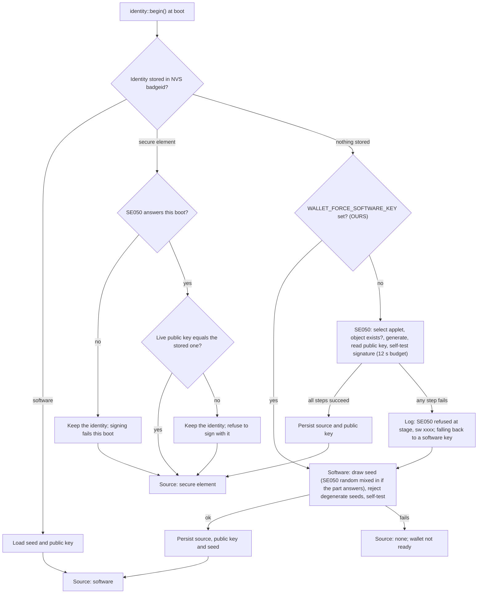

# Keys and the SE050

Where the badge's private key lives, how the badge reports that honestly, what has to change before the secure element can sign a payment, and what to do when it cannot.

- Audience: firmware engineers.
- Status: design, not yet built on hardware.
- Base: Solana OS, directory `firmware/solana-os/` at commit `812b8c7` of the [upstream repository](https://github.com/spacemandev-git/solana-defcon-badge-26/tree/812b8c7aca5c366d18c0b040fafd2999f7204d84/firmware/solana-os). Paths are relative to that directory in our fork.

Tags: **[UPSTREAM]** exists at that commit (path given); **[OURS]** our decision (reason given); **[UNVERIFIED]** needs a badge (fallback given).

Read this first: **the SE050 code path has never run against a real SE050**, by upstream's own statement (`src/hal/se050_apdu.cpp:1-4`), and we have not run it either. Everything about the secure element in this document is from reading source. The design therefore treats "key in the secure element" as a bonus to be proven on the day (requirement F17, priority P3), and treats the software key as the path that must work.

## Where the key lives

Each badge has one Ed25519 keypair, created on first boot. The public key is the badge's Solana address. [UPSTREAM `src/identity/identity.h:1-31`]

| Source | Where the private key is | Who can read it | Reported as |
|---|---|---|---|
| Secure element | Inside the NXP SE050, object id `0xF0000001`. Generated in the part and used there; never exported. [UPSTREAM `src/config.h:158`, `src/hal/se050_apdu.cpp:283-349`] | Nobody, including the firmware | `secure element` |
| Software | A 32-byte seed in NVS namespace `badgeid`, key `seed`, **in plaintext**; a copy is held in RAM while the badge runs. [UPSTREAM `src/identity/identity.cpp:82-98`] | Anyone with the badge and a USB cable (flash dump), and any native code running on the badge | `software` |

Flash encryption and secure boot are not enabled [UPSTREAM `README.md:1041-1048`]. Enabling them is an irreversible eFuse step and is out of scope.

Key generation is unchanged from upstream: the SE050 is tried first; if it fails for any reason a software key is created. [UPSTREAM `src/identity/identity.cpp:230-236`] The only thing we add to the decision is a build switch that skips the SE050 attempt (patch P14).



Details that matter in practice [UPSTREAM `src/identity/identity.cpp:186-268`]:

- A stored secure-element identity is **kept** even if the part does not answer on a later boot. The badge keeps its address and signing fails until the part answers. It does not silently replace the key.
- If the part answers and its live public key differs from the stored one, signing is refused. The log line is `[id] SE050 public key does not match stored identity; refusing to sign with it`.
- The identity survives reflashing the application: NVS and the SE050 are not touched by an application upload. `esptool.py erase_flash` destroys a software key.

## Honesty rules

The badge must say where its key is, in every place it reports the key. This is a product requirement ("Settings shows whether the key lives in the secure element or in software") and it matters more here because the fallback is likely.

| Place | What it shows | Status |
|---|---|---|
| Settings → Identity | `key lives in` + `secure element` (green) or `software` (amber) | [UPSTREAM `src/ui/shell.cpp:715-720`]; we add one line, `token account  <short address>` [OURS] |
| `GET /api/identity` | `"source":"secure element"\|"software"\|"none"` | [UPSTREAM `src/net/push_server.cpp:772-782`]; patch P11 adds `"key_location":"se050"\|"software"` (the value the dashboard's `badges.json` expects) and `"token_account"` [OURS] |
| Settings → Wallet | the first row: `Key  secure element` (value in `theme::GREEN`), `Key  software` (value in `theme::WARN`) or `Key  none` (value in `theme::ERR`), from `wallet_info_t.key_source` | [OURS]; see [Settings](../apps/settings.md) |
| `wallet_info_t.key_source` | `0` none, `1` se050, `2` software (the values of `identity::Source`) | [OURS] |
| Lua `badge.identity.source()` | `"se050"`, `"software"` or `"none"` | [OURS] |

Acceptance check T-NFR-honesty ([Acceptance](../testing/acceptance.md)) compares these places against each other and against the boot log.

Rules for people, not code:

- Never say "the key is in the secure element" about a badge that reports `software`.
- When a badge reports `software`, the accurate description is: the seed is in plaintext flash, readable with a USB cable; this is a demo on devnet.
- If any badge in the demo falls back, drop the secure-element line from the pitch for that badge, and from the pitch altogether if all of them fall back.

## SE050 path facts

All [UPSTREAM]; sources `src/hal/se050_apdu.{h,cpp}` and `src/hal/se050_t1.h`.

- **Part:** NXP SE050C2 (`SE050C2HQ1_Z01SDZ`) at I²C address `0x48`, enable line on GPIO8. (`pcb/v1/production/bom.csv:38`, `src/config.h:65-73`)
- **Transport:** T=1 over I²C, NAD `0x5A`/`0xA5`, CRC-16/X-25, `MAX_INF` 120 bytes per block (the Arduino `Wire` buffer is 128), chaining for longer APDUs, 15 ms turnaround, 2 retries. The block framing is verified against a frame the hardware test kit is known to exchange; the APDU encodings are verified on paper only.
- **Commands implemented:** SELECT applet; `CheckObjectExists` (`80 04 00 27`); `WriteECKey` generate (`80 01 61 00`, curve `0x40`); `ReadObject` (`80 02 00 00`); `EdDSASign` (`80 03 0C 09`, algorithm `0xA3`, pure Ed25519); `DeleteSecureObject` (`80 04 00 28`). **No SCP03** secure channel.
- **Budgets:** `BUDGET_MS` 120 for quick commands; `SLOW_BUDGET_MS` 3000 for key generation and signing.
- **Byte order:** the part returns public keys and each half of a signature reversed relative to RFC 8032; the code reverses them. (`src/hal/se050_apdu.cpp:34-42, 346-347, 387-389`)
- **Self-test:** at creation, a probe signature made in the part is verified in software before the key is trusted. A byte-order mistake fails here. (`src/identity/identity.cpp:65-76, 135-138`)
- **Sign limit:** `MAX_SIGN_MESSAGE_BYTES` = **180**. Pure Ed25519 hashes inside the part, so the whole message travels in the APDU. (`src/hal/se050_apdu.h:65-70`)
- **Failure reporting:** log tags `se050` and `id`; `se050_apdu::lastStage()` is one of `select`, `exists`, `generate`, `read`, `sign`, `delete`, `t1`; `lastStatusWord()` is the two-byte status word the applet returned, or 0 when the failure was below the APDU layer.

What upstream considers most likely to be wrong, in its own order (`src/hal/se050_apdu.cpp:21-48`): the part requires SCP03; the applet variant lacks Ed25519; the byte order; key generation outrunning the transport budget.

## What must change

### P6: raise the sign limit to 242 bytes

A payment message is 214 bytes (legacy) or 216 bytes (v0) ([Transaction decoder](transaction-decoder.md#annotated-vector)). Upstream's limit of 180 was sized for a ~90-byte registration string, so an unmodified badge with an SE050 key **cannot sign a payment**: `signEd25519` rejects the length before sending anything, and the log shows `[id] SE050 refused to sign at sign, sw 0000`.

`src/hal/se050_apdu.h`:

```diff
-constexpr size_t MAX_SIGN_MESSAGE_BYTES = 180;
+constexpr size_t MAX_SIGN_MESSAGE_BYTES = 242;
```

Why 242: the command is built with a single-byte length field, and the code refuses a data field longer than `0xFE` bytes (`src/hal/se050_apdu.cpp:364-367`). The data field is 6 bytes (object id TLV) + 3 bytes (algorithm TLV) + 3 bytes (message TLV header) + the message, so the message can be at most 254 − 12 = 242 bytes. [OURS]

Nothing else needs editing: `MAX_APDU` is derived from the constant (`src/hal/se050_apdu.cpp:96`). The two APDU buffers in `signEd25519` grow from about 200 to about 270 bytes each on the loop-task stack, which is one reason the stack is raised to 16 KB ([Runtime and boot](../architecture/runtime-and-boot.md#task-model)).

[UNVERIFIED on silicon] A 214-byte message makes an APDU of about 230 bytes, which needs **two chained T=1 blocks** out and one back. Chaining is implemented in `se050_t1` and, like the rest of the path, has never run. Upstream's own 180-byte limit would also have needed chaining, so this is not a new kind of risk, only an untested one. Fallback: [software key](#fallback).

The payment-protocol signatures (request 99 bytes, proof 66 bytes, receipt 81 bytes) fit in a single block and inside the unmodified 180-byte limit.

### P4 and P5: the sign function

`identity::sign` and `signBase64` are removed from `identity.h`; the same body becomes `identity::signGated`, which takes a `SignToken` only the wallet gate can construct ([Key gate](signing-gate.md#key-gate)). The SE050 branch is unchanged. The software branch gains the Monocypher backend ([below](#monocypher-backend)).

### `WALLET_FORCE_SOFTWARE_KEY`

Patch P14. A build switch (default `0`) that skips `createOnSecureElement(deadline)` in `create()` and goes straight to `createInSoftware()`, so a newly created identity is always a software key. `src/identity/identity.cpp` [UPSTREAM `create()` at lines 230-236]; the diff has not been compiled:

```diff
 bool create(uint32_t startedAt) {
+#if WALLET_FORCE_SOFTWARE_KEY
+  (void)startedAt;
+  badge_log::tagf("id", "SE050 key path disabled by build; using a software key");
+  return createInSoftware();
+#else
   const uint32_t deadline = startedAt + SE050_BUDGET_MS;
   if (createOnSecureElement(deadline)) return true;

   badge_log::tagf("id", "falling back to a software key");
   return createInSoftware();
+#endif
 }
```

It affects creation only. A badge that already stores a secure-element identity keeps it until Settings → Identity → New identity is used. P14 edits the same file as patch P5 and is listed separately in the [patch table](../architecture/runtime-and-boot.md#upstream-patches) because it is the SE050 fallback and is scheduled with P6.

## Bring-up procedure

Do this on one badge before relying on any secure-element claim.

1. Flash the firmware. Open the serial port at 115200 baud.
2. Read the `[id]` line at boot. It is one of:
   - `[id] <badgeId>, secure element (… ms)`: the part generated a key and its probe signature verified.
   - `[id] falling back to a software key`, preceded by `[id] SE050 refused at <stage>, sw <xxxx>` or `[id] SE050 unavailable (<stage>)`, and followed by `[id] <badgeId>, software (… ms)`.
3. If it fell back, map the stage and status word with the [table below](#status-words).
4. If it reports `secure element`, run acceptance check **T-SE1** ([Acceptance](../testing/acceptance.md)): sign a 214-byte transfer on that badge. Pass means the wallet's own verification of the signature succeeds (the call returns a signature, not `sign_failed`) and the transaction confirms on devnet. Record the signing time from the `[wallet] sign <n>ms verify <n>ms` log line.
5. Record the result per badge in `dashboard/server/config/badges.json` (`keyLocation`).

T-SE1 is the first time a real payment-sized message goes through the part. The boot-time self-test only signs a 31-byte string, so a badge can report `secure element` at boot and still fail T-SE1 on chaining or on the 242-byte limit.

## Status words

| Log line (tags `id`, `se050`) | Meaning | What to do |
|---|---|---|
| `SE050 unavailable (t1)` or stage `t1` with `sw 0000` | The block layer never got a well-formed answer: a bus, enable-line or reset problem, not an applet refusal. | Check that the I²C scan shows `0x48`. Upstream notes that its open sequence uses soft reset `0xCF` and suggests `0xC0` + `0xC7` if the open misbehaves (`src/hal/se050_t1.h`, "ONE KNOWN DEVIATION"). |
| `SE050 refused at exists, sw 6982` after a clean SELECT | "Security status not satisfied": the part wants an SCP03 secure channel. | Not fixable without the part's SCP03 keys. Use the software key. |
| `SE050 refused at generate, sw 6a80` or `sw 6a81` | "Wrong data" / "function not supported": this applet variant has no Ed25519. | Not fixable. Use the software key. |
| `SE050 signature failed local verification, not trusting it` | The probe signature did not verify in software: almost certainly the byte-order handling. | Fix the reversal in `se050_apdu.cpp` (public key, and each half of the signature) and retry; until then the badge falls back. |
| `SE050 out of time before key generation` | The 12 s first-boot budget ran out. | Power-cycle and read the earlier lines; a slow or half-dead part. |
| `[se050] generate outran the transport budget but landed` | Key generation took longer than `SLOW_BUDGET_MS` but succeeded. | Raise `SLOW_BUDGET_MS`. |
| `SE050 refused to sign at sign, sw 0000` | Below the applet: the message is longer than `MAX_SIGN_MESSAGE_BYTES` (patch P6 missing), or the transport failed during the chained exchange. | Confirm P6 is applied; then suspect T=1 chaining. |
| `SE050 refused to sign at sign, sw <non-zero>` | The applet refused the sign command. | Look the status word up in NXP AN12413 "SE050 APDU Specification", section 4.4. |
| `SE050 did not answer; identity present but cannot sign this boot` | A stored secure-element identity, and the part is silent. | Power-cycle. The identity is kept; signing returns `sign_failed`. |
| `SE050 public key does not match stored identity; refusing to sign with it` | The key object in the part was replaced. | Settings → Identity → New identity, then re-register the badge. |
| any other stage with a non-zero status word | The applet answered and refused. | AN12413 section 4.4. |

`0x9000` is success and is not logged as a failure. Inside the wallet, any signing failure, and any signature that does not verify against the badge's own public key, is returned as `sign_failed` ([Key gate](signing-gate.md#key-gate)).

## Timing

| Quantity | Value | Status |
|---|---|---|
| SE050 Ed25519 sign | about 261 ms | Cited by the product requirements from wolfSSL's SE050 benchmark page; not measured by us. [UNVERIFIED] |
| Transport turnaround | 15 ms per block, 3 blocks for a payment | [UPSTREAM] constants; total [UNVERIFIED] |
| Expected total for a payment signature with the SE050 | 300–350 ms | [UNVERIFIED] |
| Software sign, TweetNaCl | about a second, by upstream's own description (`src/identity/TWEETNACL-README:15-22`) | [UNVERIFIED] on the S3 |
| Software sign, Monocypher | faster than TweetNaCl by a factor of about 37 on a development host | host measurement only; [UNVERIFIED] on the S3 |

Consequences:

- A Lua callback has a 250 ms budget [UPSTREAM `src/config.h:195`], which an SE050 signature alone exceeds. This is not a problem for the approval flow, because the Lua deadline is **paused** for the whole wallet call (patch P3, [Runtime and boot](../architecture/runtime-and-boot.md#p3-pause-the-lua-deadline-during-wallet-prompts)), and the sign command has its own 3000 ms budget.
- It **is** a problem for proof of presence: a payee that signs each proof in the SE050 cannot answer inside a 250 ms deadline, and is marginal at the default 400 ms. If any badge signs with the SE050, set `deadline_ms` to 800. In a mixed fleet, `deadline_ms` must be set for the slowest signer. See [Payment protocol, Timing](../protocol/payment-protocol.md#timing).
- Measure before choosing: the wallet logs `[wallet] sign <n>ms verify <n>ms` at each signature (measurement M2 in [Measurements](../testing/measurements.md)).

## Fallback

When T-SE1 fails on a badge, or the boot log shows a fallback you cannot fix:

1. Build with `WALLET_FORCE_SOFTWARE_KEY 1` and flash.
2. On that badge: Settings → Identity → New identity [UPSTREAM screen, `src/ui/shell.cpp:748-804`]. This deletes the key object in the part if it can be reached and creates a software key. **The badge's address changes.**
3. Read the new key from Settings → Identity or `GET /api/identity`. Update `dashboard/server/config/badges.json` (`pubkey`, `keyLocation: "software"`), re-run the funding script and re-issue the attestation for the new key ([Dashboard integration](../integration/dashboard.md)).
4. The badge now reports `software` everywhere. Drop the secure-element line from the pitch.

A mixed fleet is allowed: each badge reports its own source.

Why fall back to software and not attempt SCP03 or another curve: without the part's SCP03 keys a secure channel is impossible, and a P-256 key would be secure and useless, because Solana verifies Ed25519. Upstream makes the same choice (`src/hal/se050_apdu.h:19-22`). An honest software key is better than a key nothing can check.

## Monocypher backend

`WALLET_ED25519_BACKEND` selects the software Ed25519 implementation:

| Value | Backend | Use |
|---|---|---|
| `1` (default) | Monocypher 4.0.2 (`src/wallet/vendor/monocypher.c`, `monocypher-ed25519.c`; licence BSD-2-Clause or CC0) | software-key signing, and **all** signature verification (requests, proofs, receipts, the self-check) |
| `0` | TweetNaCl (upstream's, `src/identity/tweetnacl.c`) | fallback if vendoring Monocypher fails to build |

Why [OURS]: the payer verifies a request signature and a proof signature, and a software-key payee signs each proof, all inside the proof deadline. At about a second per TweetNaCl operation that is impossible; the fallback value of `deadline_ms` with TweetNaCl is 2500 ms. Verification runs on every badge regardless of where its key is, so Monocypher matters even when all keys are in the SE050.

### Equivalence result

Switching backends must not change the badge's address or its signatures. This was checked on a development host (Apple Silicon, `cc -O2`) with upstream's `tweetnacl.c` and Monocypher 4.0.2 in one test program:

- The same 32-byte seed gives an **identical** public key, an identical 64-byte secret key (`seed ‖ public key`) and an **identical** signature over a 214-byte message.
- Monocypher verifies TweetNaCl's signature and rejects it with one bit flipped.
- Host time per operation: TweetNaCl sign 0.627 ms, verify 1.259 ms; Monocypher sign 0.017 ms, verify 0.044 ms. The ratio is about 37× for signing and 29× for verification.

The ratio is a host measurement. Absolute times on the ESP32-S3 are [UNVERIFIED]; fallback `WALLET_ED25519_BACKEND 0` with `deadline_ms` 2500, accepting amber screens more often.

The Monocypher functions used (from its header, version 4.0.2):

```c
void crypto_ed25519_key_pair(uint8_t secret_key[64], uint8_t public_key[32], uint8_t seed[32]);
void crypto_ed25519_sign(uint8_t signature[64], const uint8_t secret_key[64],
                         const uint8_t *message, size_t message_size);
int  crypto_ed25519_check(const uint8_t signature[64], const uint8_t public_key[32],
                          const uint8_t *message, size_t message_size);   /* 0 = valid */
```

### P5: the software branch

`src/identity/identity.cpp`, the software branch of the sign function (after patch P4 it is `signGated`). The stored seed and public key are unchanged; because the secret key is `seed ‖ public key` in both libraries, it is assembled on the stack and wiped after use.

```cpp
#include "../wallet/wallet_defaults.h"              // WALLET_ED25519_BACKEND
#if WALLET_ED25519_BACKEND == 1
extern "C" {
#include "../wallet/vendor/monocypher.h"            // crypto_wipe
#include "../wallet/vendor/monocypher-ed25519.h"
}
#endif

// inside identity::signGated(), replacing the software branch:
  if (!sHaveSeed) return false;
#if WALLET_ED25519_BACKEND == 1
  uint8_t secretKey[64];
  memcpy(secretKey, sSeed, 32);
  memcpy(secretKey + 32, sPublicKey, 32);
  crypto_ed25519_sign(out, secretKey, message, length);
  crypto_wipe(secretKey, sizeof(secretKey));
  return true;
#else
  return ed25519::sign(message, length, sSeed, sPublicKey, out);
#endif
```

The self-test verify changes in the same way:

```cpp
// inside selfTest(), replacing the final line:
#if WALLET_ED25519_BACKEND == 1
  return crypto_ed25519_check(signature, sPublicKey, message, length) == 0;
#else
  return ed25519::verify(message, length, signature, sPublicKey);
#endif
```

Key **generation** stays with upstream's `ed25519::generate` in both configurations, so an existing badge keeps its key when the backend changes.

## Requirements covered

- **F17**: key held in the SE050, verified on silicon. This document gives the change needed (P6), the bring-up test (T-SE1) and the fallback. The upstream pull request is the P6 change plus whatever bring-up fixes are found.
- Non-functional "Honesty": Settings shows whether the key lives in the secure element or in software ([Honesty rules](#honesty-rules)).
- Non-functional "Security: keys never exported": no API returns the private key; the SE050 cannot export it; the software seed is reachable only through `signGated`.
- Non-functional "Sandbox fit": an SE050 signature exceeds the 250 ms callback budget; the deadline is paused during wallet calls.

## Open items

All [UNVERIFIED]; the fallback for every one of them is the software key, reported as `software`.

- Whether the SE050C2 on these boards supports Ed25519 and accepts commands without SCP03.
- Whether the byte order of public keys and signatures matches the code's assumption.
- Whether T=1 chaining works for an APDU of about 230 bytes, and whether the part accepts a 214-byte message with the limit at 242.
- SE050 signing time on the badge (expected 300–350 ms), and Monocypher and TweetNaCl times on the ESP32-S3. Resolve with measurement M2; choose `deadline_ms` accordingly.
- Whether Monocypher compiles under the Arduino core without changes. Fallback: `WALLET_ED25519_BACKEND 0`.
- The P5, P6 and P14 edits shown here have not been compiled.
