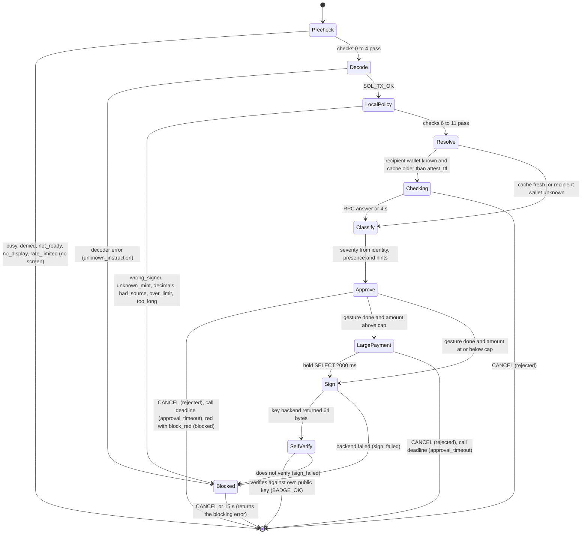
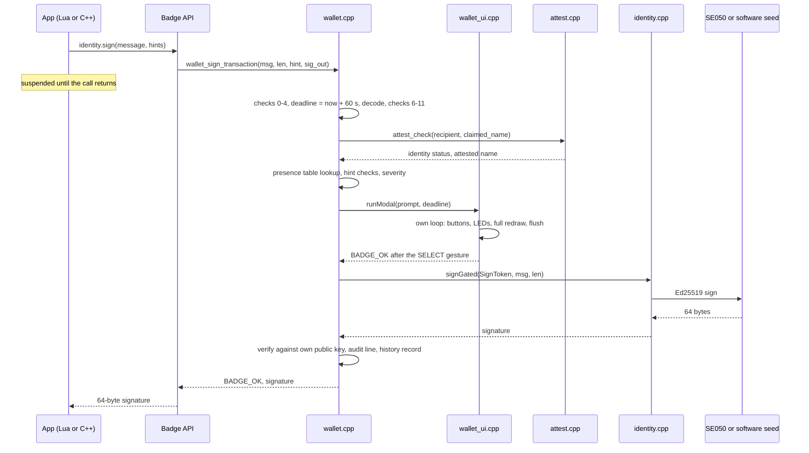

# Signing gate

How a signature happens on the badge: the checks a request passes through, the screen that takes over the display, the gesture that authorises it, and the mechanism that keeps every other piece of code away from the key.

- Audience: firmware engineers.
- Status: design, not yet built on hardware.
- Base: Solana OS, directory `firmware/solana-os/` at commit `812b8c7` of the [upstream repository](https://github.com/spacemandev-git/solana-defcon-badge-26/tree/812b8c7aca5c366d18c0b040fafd2999f7204d84/firmware/solana-os). Paths are relative to that directory in our fork.

Tags: **[UPSTREAM]** exists at that commit (path given); **[OURS]** our decision (reason given); **[UNVERIFIED]** needs a badge (fallback given). "host-tested" refers to the reference code in [`../reference/code/`](../reference/code/). `wallet.cpp` and `wallet_ui.cpp`, which this document specifies, are not written yet.

The rule this document implements:

> An app can ask for a signature. Only the wallet core can produce one. A transaction signature is produced only after the wallet core's own approval screen and a SELECT press on that screen. Message signatures exist only in three fixed, domain-separated formats built by the wallet core.

The entry point is `wallet_sign_transaction()` ([Wallet C API](api.md)). The screens it draws are specified pixel by pixel in [Screens](screens.md). Terms (hint, severity, ATA, modal) are in the [glossary](../reference/glossary.md).

## State machine

One call to `wallet_sign_transaction(msg, len, hint, sig_out)` runs this machine to completion on the loop task. The caller, Lua or C++, is suspended inside the call the whole time.



| State | Screen | What happens |
|---|---|---|
| Precheck | none | Policy checks 0–4. A failure returns at once, with nothing drawn. The gate also records the call's deadline here: `millis() + 60000`. |
| Decode | none | `sol_tx_decode_transfer()` on the exact bytes that would be signed ([Transaction decoder](transaction-decoder.md)). |
| LocalPolicy | none | Checks 6–11: is this our key, our token, our token account, within `max`, within the key backend's length limit. |
| Blocked | [Screen E](screens.md#screen-e) | Shows why, states that nothing was signed, closes on CANCEL or after 15 s (`WALLET_BLOCKED_AUTOCLOSE_MS`). Reached from a decoder or policy refusal, and from a signing failure after the gesture. |
| Resolve | none | Check 12: works out whether the recipient *wallet* is known. |
| Checking | [Screen H](screens.md#screen-h) | Check 13 when the cached attestation is stale: one RPC call, 4 s timeout, CANCEL works. |
| Classify | none | Checks 13–15 produce `wallet_identity_t`, `wallet_presence_t`, the detail lines and the severity. |
| Approve | [Screen A](screens.md#screen-a), [B](screens.md#screen-b) or [C](screens.md#screen-c) | The approval modal. Green: press SELECT. Amber: hold SELECT. Red: blocked, or hold SELECT if `block_red = 0`. Ends at the call's deadline. |
| LargePayment | [Screen D](screens.md#screen-d) | Second confirmation when `amount > cap`. Ends at the same deadline. |
| Sign | none | `wallet::Gate` constructs a `SignToken` and calls `identity::signGated`. |
| SelfVerify | none | The signature is verified against the badge's own public key before it is returned. A failure here or in Sign goes to the blocked screen with the headline `Signing failed`. |

**One 60 s budget per call.** The gate records `deadline = millis() + 60000` on entry, and Screens H, A/B/C and D all end at that deadline (`runModal(prompt, deadline)`): time spent on the identity check or on the approval screen is not given back on the large-payment screen. The reason for 60 s is the lifetime of a blockhash, which runs from when the app fetched it and not from when a screen opened. Screen E is outside the budget; it has its own 15 s auto-close. [OURS]

Every exit writes a `TX` line to the audit log with the result; a successful exit also appends an `out`/`signed` record to the payment history, so an app cannot pay without leaving a record ([Config, limits and audit](config-limits-audit.md)).

The sequence across modules for the successful case:



## Policy checks

Performed by `wallet.cpp`, in this order. The first failing check decides the result.

| # | Check | Error / effect |
|---|---|---|
| 0 | No other wallet prompt is active | `busy` (no screen, not counted by the rate limiter) |
| 1 | Caller has permission `sign` | `denied` (no screen) |
| 2 | `wallet_ready()` | `not_ready` (no screen) |
| 3 | Display and buttons present (`display` canvas allocated, `buttons::present()`) | `no_display` (no screen; logs `[wallet] no_display: refusing to sign`) |
| 4 | Rate limit ([Rate limits](#rate-limits)) | `rate_limited` (no screen) |
| 5 | Decoder OK | blocked screen, `unknown_instruction` |
| 6 | `fee_payer == own pubkey` | blocked screen, `wrong_signer` |
| 7 | `mint == config mint` | blocked screen, `unknown_mint` |
| 8 | `decimals == config decimals` | blocked screen, `decimals` |
| 9 | `source == ATA(own pubkey, mint)` (cached at boot) | blocked screen, `bad_source` |
| 10 | `amount <= max` | blocked screen, `over_limit` |
| 11 | Message length ≤ backend limit (242 for SE050) | blocked screen, `too_long` |
| 12 | **Recipient resolution**: if `hint.recipient` is given and `ATA(hint.recipient, mint) == destination`, the recipient wallet is `hint.recipient` (proven by derivation). Otherwise the recipient wallet is unknown and the screen shows the token account. | amber line "recipient is a token account" |
| 13 | **Identity**: if the recipient wallet is known, `attest_check(recipient, hint.claimed_name)`; refreshes over the network if the cache entry is older than `attest_ttl` (shows "Checking identity…", CANCEL works, 4 s timeout). | sets `wallet_identity_t` |
| 14 | **Presence**: lookup in the presence table by recipient pubkey, age ≤ 60 s. If `hint.request_id` is given: the inbox entry must exist, have a valid REQ signature, `payee == recipient` and `amount == tx amount`; else `NOT_PRESENT` with line "does not match the request". | sets `wallet_presence_t` |
| 15 | **Claimed amount**: if `hint.claimed_amount` parses and differs from the decoded amount → red line `APP SAID <x> <SYM>`. | severity red |

Why each group exists:

- **Check 0 is a re-entrancy guard and comes first.** With one application task, a second `identity.sign` while a prompt is up is practically unreachable, because the caller is suspended inside the first. For `pay.request` and `pay.receive`, `busy` also means a session is already open. [OURS]
- **Checks 1–4 run before anything is drawn** so that an app without permission, or one that is being rate-limited, cannot use the wallet screens to interrupt the user.
- **Check 3 fails closed.** If the framebuffer is missing or the TCA9534 button expander is absent, the wallet returns `no_display` and never signs. A wallet that cannot show what it signs must not sign. [OURS]
- **Checks 5–11 are local and absolute.** They need no network and no judgement. A message that fails any of them is not a payment from this badge in this token, so there is nothing for the user to approve; the blocked screen says so and the call returns the error. [OURS]
- **Check 9 pins the source.** Without it, a message could move tokens out of a different account for which this badge's key happens to be the authority.
- **Check 11 exists because the SE050 command has a hard size limit** (242 message bytes after patch P6; see [Keys and the SE050](keys-and-se050.md)). The decoder already limits a message to 256 bytes and accepts only 214 or 216, so this check cannot fail for an accepted message today. It is kept so that a later change to the decoder cannot hand the secure element something it will truncate or refuse.
- **Check 12 is why the screen can name a person.** A transaction names a destination *token account*. Token accounts do not carry names; attestations are issued to *wallet* keys. The app tells the gate which wallet it believes it is paying, and the gate verifies the claim by deriving `ATA(recipient, mint)` itself and comparing it with the destination in the bytes. A wrong or missing hint cannot make the screen show a name: it only downgrades the screen to "token account", amber. [OURS] host-tested derivation (`sol_ata`)
- **Checks 13–15 never trust the app.** The attestation is fetched and parsed by firmware ([Attestation](../identity/attestation.md#decision)); presence comes from the firmware's own table of verified proofs ([Payment protocol](../protocol/payment-protocol.md#rules)); and the amount the app showed the user is compared with the amount in the bytes. Check 15 is what catches a compromised merchant app: the app displayed 5.00, the bytes say 500.00, and the wallet screen prints both. [OURS]

The identity refresh in check 13 is what makes a revocation visible "within one refresh": a stale cache entry is re-fetched before the approval screen is shown, so the screen never rests on an attestation older than `attest_ttl` seconds (default 30) when the network is reachable. See [Cache](../identity/attestation.md#cache).

## Severity and gestures

Severity is computed from identity and presence:

| Identity \ Presence | PRESENT | NOT_CHECKED | NOT_PRESENT |
|---|---|---|---|
| VERIFIED | **green** | amber | red |
| UNVERIFIED, EXPIRED, UNKNOWN, or recipient wallet unknown | amber | amber | red |
| MISMATCH, REVOKED | red | red | red |

Any red line from checks 14–15 (`does not match the request`, `APP SAID …`) makes the screen red regardless of the table.

Green therefore means all three of: the bytes are a transfer of our token from our account, the recipient key holds a valid attestation whose name is shown, and that key answered a fresh challenge within the deadline.

The gesture each severity requires:

| Severity | To sign | Notes |
|---|---|---|
| green | press SELECT | — |
| amber | hold SELECT 2000 ms | progress bar fills |
| red, `block_red = 1` | not possible; only CANCEL | returns `blocked` after CANCEL or timeout |
| red, `block_red = 0` | hold SELECT 3000 ms | for demos that want the judge to be the last line of defence |

Then, if `amount > cap`: the second screen ([Screen D](screens.md#screen-d)), hold SELECT 2000 ms (requirement F14).

Why the gestures differ [OURS]: a press is easy to give by reflex, and that is acceptable only when firmware has verified everything it can. A two-second hold cannot be given by reflex and gives the user time to read the amber line. Red is blocked by default (decision D12) because the product flow says a bad signature, a slow reply or a missing attestation "blocks the payment before anything is signed".

Every gesture starts from a SELECT **press edge seen after the arming delay**. On a green screen that edge signs. On an amber screen, a red screen with `block_red = 0` and the large-payment screen, the hold is timed from that edge and aborted by release. A SELECT that is already down when the prompt opens does nothing until it is released and pressed again (acceptance check T-F2 in [Acceptance](../testing/acceptance.md)). [OURS]

## Approval modal

The modal is the takeover mechanism: one function that owns the display, the buttons, the backlight and the LEDs until the user decides. [OURS: upstream has no way for firmware to take the screen from a running app]

```cpp
// wallet_ui.cpp — the only code that runs while a prompt is up
// deadline: the millis() value at which the gate call's 60 s budget ends (set once, on entry to the gate)
badge_err_t wallet_ui::runModal(Prompt &p, uint32_t deadline) {
  runtime::pauseDeadline();                       // P3; no-op when the caller is native
  const uint8_t savedBacklight = display::brightness();
  if (savedBacklight < WALLET_MIN_BACKLIGHT) display::setBrightness(WALLET_MIN_BACKLIGHT);   // 160
  leds::stopAnimation();
  setLeds(p.severity);                            // both LEDs solid: green / amber / red / purple; off on Screen H

  waitAllReleased(2000);                          // an in-flight press is not consent
  uint32_t armedAt = millis() + WALLET_ARM_MS;    // 600 ms during which input is ignored
  badge_err_t result = BADGE_ERR_APPROVAL_TIMEOUT;

  for (;;) {
    buttons::update();
    leds::update();
    draw(p, heldFraction());                      // full redraw of the canvas, then:
    display::invalidate();
    display::flush();
    const uint32_t now = millis();
    if ((int32_t)(now - deadline) >= 0) break;                               // the call's budget is spent
    if ((int32_t)(now - armedAt) >= 0) {
      if (buttons::pressed(BTN_B)) { result = BADGE_ERR_REJECTED; break; }   // CANCEL always exits
      if (p.gestureSatisfied()) { result = BADGE_OK; break; }                // press or hold, per severity
    }
    delay(5);                                     // yields to Wi-Fi/BLE tasks
  }

  leds::off();
  display::setBrightness(savedBacklight);
  waitAllReleased(1000);                          // the app must not see the tail of this press
  display::invalidate();
  runtime::resumeDeadline();
  return result;
}
```

The functions it calls on the HAL exist upstream: `display::brightness()`, `setBrightness()`, `invalidate()`, `flush()` (`src/hal/display.h`); `buttons::update()`, `pressed()`, `heldMs()`, `present()` (`src/hal/buttons.h`); `leds::stopAnimation()`, `update()`, `off()` (`src/hal/leds.h`). `runtime::pauseDeadline()` and `resumeDeadline()` are patch P3 ([Runtime and boot](../architecture/runtime-and-boot.md#p3-pause-the-lua-deadline-during-wallet-prompts)).

The helpers inside `wallet_ui.cpp`:

| Helper | Contract |
|---|---|
| `setLeds(severity)` | Both LEDs solid in the severity colour: green, amber, red, or purple for payee-side prompts; off on Screen H ([Screens, LED colours](screens.md#led-colours)). |
| `waitAllReleased(ms)` | Pumps `buttons::update()` until no button is down or `ms` have passed. |
| `draw(p, fraction)` | Redraws the **whole** canvas for prompt `p`: status bar, band, rows, lines, progress bar filled to `fraction`, footer. |
| `heldFraction()` | 0..1: how far the current SELECT hold has progressed toward the required hold time; 0 when no hold is required or none is in progress. |
| `p.gestureSatisfied()` | True when the gesture for this prompt's severity has been completed since arming (see [Severity and gestures](#severity-and-gestures)). Always false for a blocked red prompt. |

Constants:

| Constant | Value | Meaning |
|---|---|---|
| `WALLET_ARM_MS` | 600 | input ignored for this long after the screen appears |
| `WALLET_APPROVAL_TIMEOUT_MS` | 60000 | the budget of one gate call, counted from entry; no decision by then → `approval_timeout` |
| `WALLET_HOLD_AMBER_MS` | 2000 | amber hold |
| `WALLET_HOLD_RED_MS` | 3000 | red hold when `block_red = 0` |
| `WALLET_HOLD_CAP_MS` | 2000 | hold on the large-payment screen |
| `WALLET_MIN_BACKLIGHT` | 160 | minimum backlight (of 255) during a prompt |
| `WALLET_BLOCKED_AUTOCLOSE_MS` | 15000 | the blocked screen closes itself |

For a red prompt with `block_red = 1`, `runModal` can only end with `rejected` (CANCEL) or `approval_timeout`; the gate returns `blocked` to the caller in both cases.

### Properties

Each of these is a property the implementation must keep, with the reason it holds.

- **The caller is blocked inside `wallet_sign_transaction()`.** No app callback runs, so no app can draw, flush, change the backlight, read buttons, or stop the prompt. This is the whole enforcement mechanism: there is one application task, and the modal is using it. [OURS]
- **The push server and the serial console are not serviced**, so a remote `POST /api/stop`, or a stop command sent over the serial console, cannot remove the prompt. The stop takes effect after the decision. [OURS]
- **CANCEL is honoured from the moment the arming delay ends, on every wallet screen.** The hold-CANCEL force quit (1.5 s) is unnecessary inside the modal because a CANCEL press already ends it. After the modal returns, the main loop's force quit works as upstream [UPSTREAM `solana-os.ino:74-78`].
- **The modal forces a minimum backlight of 160/255 and redraws the whole canvas every iteration**, so anything the app drew, and any `gfx.brightness(0)` it called before signing, is overwritten. The previous backlight is restored afterwards. [OURS]
- **Input is ignored until all buttons are released and 600 ms have passed.** An app can call `identity.sign` at the instant the user presses SELECT for something else; that press must not count. Upstream's app-store Offer screen uses the same idea [UPSTREAM `src/ui/shell.cpp:69-73, 991-994`]. After the decision the modal again waits for release, so the app does not receive the tail of the SELECT press as its own button event.
- **Timeout 60 s → `approval_timeout`, for the whole call.** A recent blockhash lives roughly 60–90 s, so a longer prompt would sign a dead transaction. The deadline is passed into `runModal`, so a second screen in the same call does not start a new 60 s. [OURS]
- **No display, no signature.** If the framebuffer is missing or the TCA9534 is absent, the wallet returns `no_display` before reaching the modal. [OURS]
- **`delay(5)` in the loop yields to the Wi-Fi and BLE tasks**, so radios stay alive during the prompt; received ESP-NOW frames queue (8 entries) until the main loop resumes.

What the modal does not protect against: an app can draw a look-alike screen *before* calling `identity.sign`. It gains nothing, because the real screen follows, is redrawn in full, and only its SELECT signs. This and the other limits are stated in the [Security model](../security/security-model.md#non-goals-and-residual-risks).

## Message signing

The wallet core signs exactly these byte strings and nothing else:

| Domain | Signed bytes | Length | Needs a press? |
|---|---|---|---|
| transaction | a message accepted by the [decoder](transaction-decoder.md#rules) and the [policy checks](#policy-checks) | 214 or 216 | SELECT on screen A/B/C (+ D) for each one |
| `pay-req:` | `"pay-req:"` ‖ REQ bytes `[0, 91)` | 99 | SELECT on screen F |
| `pay-proof:` | `"pay-proof:"` ‖ request_id(8) ‖ nonce(16) ‖ payer_pubkey(32) | 66 | no: authorised by the SELECT that opened the session (screen F or G), limited to that request id, its TTL and 8 proofs |
| `pay-rcpt:` | `"pay-rcpt:"` ‖ request_id(8) ‖ tx_signature(64) | 81 | no: at most one per session, same authorisation |
| `solana-badge-register:` | upstream broker registration, only if `WALLET_ENABLE_BROKER` | ~90 | no (upstream behaviour); logged |

This refines the product sentence "every signature requires a physical button press": every **transaction** signature has its own press; every **message** signature traces to one press that named what it authorises. A proof of presence has to be produced within the deadline (default 400 ms), which rules out a press per proof; the session screen says what the press allows ("nearby badges can check you are here") and the limits bound it.

### Domain separation

Domain separation means that a signature made for one purpose can never be valid for another. It matters here because the same key signs both payments and protocol messages: if an attacker could craft a "payment request" whose signed bytes were also a valid transaction, the payee's press on screen F would authorise a transfer.

A message signature can never be a transaction signature, for three independent reasons [OURS] host-tested by `test_pay.c`:

1. **The wallet only signs a transaction after `sol_tx_decode_transfer` accepts the exact bytes.** None of the prefixed strings is accepted by the decoder. The test feeds all three signed byte strings to the decoder and requires an error.
2. **The prefixed strings are not valid Solana messages at all.** Read as a legacy message, a string starting `pay-…` has header bytes `0x70 0x61 0x79` (112 required signatures) and account count `0x2d` (45). Solana rejects a message whose required signatures exceed its account keys, and 45 keys would need 1440 bytes; the strings are at most 99 bytes. Bit 7 of `0x70` is clear, so it is not a versioned message either. The same holds for `solana-badge-register:` (`0x73` = 115 signatures, 4th byte `0x61` = 97 keys). So even a different wallet or the network itself would not treat these signatures as transaction signatures.
3. **The reverse also holds.** A real transaction message starts `0x01` or `0x80`, never `p` or `s`, so a transaction can never be accepted as a REQ, PROOF or RCPT.

All three signed strings are at most 99 bytes, which fits even the unmodified SE050 limit of 180 bytes.

`wallet_sign_domain()` exposes only the broker domain. There is deliberately no "sign arbitrary bytes" function anywhere in the API.

## Key gate

Signing is reachable from exactly one class. The mechanism is the C++ passkey idiom: the sign function takes a token type that only one class is able to construct.

`src/identity/identity_private.h`, in full. File: [`../reference/code/sdk-headers/identity/identity_private.h`](../reference/code/sdk-headers/identity/identity_private.h).

```cpp
// src/identity/identity_private.h
// May be included ONLY by identity/identity.cpp and wallet/wallet.cpp.
#pragma once
#include <stddef.h>
#include <stdint.h>

namespace wallet { class Gate; }

namespace identity {

// Passkey: a SignToken can be created only inside wallet::Gate.
// The constructor is user-provided (an empty body, not "= default"). A class with a user-provided
// constructor is not an aggregate in any C++ standard, so both `SignToken{}` and `SignToken()` need
// the private constructor and fail to compile outside the gate. With "= default" the class would be
// an aggregate under C++14 and C++17 and `SignToken{}` would compile anywhere.
// Holds for C++11, C++14, C++17, C++20 and C++23; no assumption about the Arduino core's -std flag.
class SignToken {
  SignToken() {}
  SignToken(const SignToken &) = delete;
  SignToken &operator=(const SignToken &) = delete;
  friend class wallet::Gate;
};

// Ed25519 over `length` bytes with the badge key, 64 bytes into `out`. SE050 or software, per source().
// False if the identity is not ready or the key backend failed.
bool signGated(const SignToken &, const uint8_t *message, size_t length, uint8_t out[64]);

}  // namespace identity
```

The constructor is written `SignToken() {}` and not `SignToken() = default;` for a reason. With `= default` the class is an aggregate under C++14 and C++17, and `identity::SignToken{}` compiles anywhere, which defeats the passkey. A user-provided constructor makes the class a non-aggregate in every standard. The passkey therefore holds under C++11 through C++23 and does not depend on the Arduino core's `-std` flag. Do not change it back. The copy constructor and assignment are deleted so that a token cannot be duplicated once made. [OURS] Checked on a development computer: a file that writes `identity::SignToken{}`, `identity::SignToken t;` or `signGated({}, …)` outside `wallet::Gate` is rejected under `-std=c++11`, `c++14`, `c++17` and `c++20`; the same file against the `= default` form compiles under C++17.

- `identity.h` no longer declares any sign function (patch P4 removes `sign` and both `signBase64` overloads [UPSTREAM `src/identity/identity.h:67-72`]). Lua never had one [UPSTREAM: no `identity::` reference under `src/lua_sdk/`].
- `wallet::Gate` is a class **defined only in `wallet.cpp`**, with public static methods `signTransaction`, `signRequest`, `signProof`, `signReceipt` and `signBroker`. Each receives or builds the exact bytes for its domain. No header declares the class body (`identity_private.h` only forward-declares the name), so no other file can name the methods. The `extern "C"` functions in `wallet.cpp` call them directly. There are no `friend` declarations except the one in `SignToken`. [OURS]
- `pay_session.cpp` reaches `signProof` and `signReceipt` through the two functions declared in `wallet_internal.h` ([listing](api.md#wallet_internalh)) and implemented in `wallet.cpp`:

  ```c
  badge_err_t wallet_internal_sign_proof(const uint8_t id[8], const uint8_t nonce[16], const uint8_t payer[32], uint8_t sig_out[64]);
  badge_err_t wallet_internal_sign_receipt(const uint8_t id[8], const uint8_t tx_sig[64], uint8_t sig_out[64]);
  ```

  Both check the open session before asking the gate to sign, and return `BADGE_OK`, `no_session`, `rate_limited` or `sign_failed`. `pay_session.cpp` never includes `identity_private.h`.
- Every signature is verified against the badge's own public key before it is returned, with `bool wallet_crypto_verify(const uint8_t pubkey[32], const uint8_t *msg, size_t len, const uint8_t sig[64]);` (true = valid; [listing](api.md#wallet_cryptoh)). A failure returns `sign_failed`. [OURS: catches SE050 byte-order or transport faults before a bad signature leaves the badge]

A sketch of the key-touching part of `wallet.cpp`. It has not been compiled. `identity::SignToken`, `identity::signGated`, `wallet_crypto_verify` and the two `wallet_internal_*` functions are as declared in their headers; the parameter lists of the `Gate` methods are the sketch's own.

```cpp
// src/wallet/wallet.cpp (sketch)
#include <string.h>
#include "wallet.h"
#include "wallet_crypto.h"
#include "wallet_internal.h"
#include "pay_session.h"                      // pay_session_get
#include "../app_host/badge_api.h"            // BADGE_OK, BADGE_ERR_*
#include "../identity/identity.h"             // identity::publicKey()
#include "../identity/identity_private.h"     // the only include of this header outside src/identity/

namespace wallet {

// Defined here and nowhere else. identity_private.h forward-declares the name only, so in every other
// file wallet::Gate is an incomplete type and none of these methods can be named.
class Gate {
 public:
  Gate() = delete;

  // One method per signing domain. Each receives or builds the exact bytes for its domain.
  static badge_err_t signTransaction(const uint8_t *msg, size_t len, uint8_t sig_out[64]) {
    return signAndVerify(msg, len, sig_out);   // called only after the modal returned BADGE_OK
  }
  static badge_err_t signRequest(const uint8_t req_wire[155], uint8_t sig_out[64]);
  static badge_err_t signProof(const uint8_t id[8], const uint8_t nonce[16], const uint8_t payer[32],
                               uint8_t sig_out[64]);
  static badge_err_t signReceipt(const uint8_t id[8], const uint8_t tx_sig[64], uint8_t sig_out[64]);
  static badge_err_t signBroker(const uint8_t *suffix, size_t len, uint8_t sig_out[64]);

 private:
  // The single place a SignToken is constructed.
  static badge_err_t signAndVerify(const uint8_t *bytes, size_t len, uint8_t sig_out[64]) {
    uint8_t sig[64];
    const uint8_t *own = identity::publicKey();
    if (own == nullptr) return BADGE_ERR_NOT_READY;
    if (!identity::signGated(identity::SignToken(), bytes, len, sig)) return BADGE_ERR_SIGN_FAILED;
    if (!wallet_crypto_verify(own, bytes, len, sig)) return BADGE_ERR_SIGN_FAILED;
    memcpy(sig_out, sig, sizeof sig);
    return BADGE_OK;
  }
};

}  // namespace wallet

// The extern "C" entry points in this file call the gate directly. No friend declarations are needed.
extern "C" badge_err_t wallet_internal_sign_proof(const uint8_t id[8], const uint8_t nonce[16],
                                                  const uint8_t payer[32], uint8_t sig_out[64]) {
  pay_session_t s;
  pay_session_get(&s);
  // No open session, another request id, or expired: BADGE_ERR_NO_SESSION.
  // The session's proof limits are used up (see Rate limits): BADGE_ERR_RATE_LIMITED.
  // (checks elided)
  return wallet::Gate::signProof(id, nonce, payer, sig_out);   // then one PROOF audit line
}
```

### Pre-flash checks

Run from `firmware/solana-os/` before every flash. Both must print nothing.

```bash
grep -rn "identity_private.h" src | grep -v "src/wallet/wallet.cpp\|src/identity/"
grep -rn "signGated\|se050_apdu::signEd25519\|crypto_ed25519_sign\|crypto_sign(" src \
  | grep -v "src/identity/\|src/wallet/\|src/hal/se050_apdu"
```

The first finds any file other than `wallet.cpp` and the identity module that includes the private header. The second finds any call to a signing primitive (the gated function, the SE050 sign command, Monocypher's sign, TweetNaCl's sign) outside the three places allowed to contain one.

### What the gate does and does not enforce

The passkey, the include rule and the grep rule make it a compile-time or review-time error for native code to sign by accident. They are **not** a security boundary against hostile native code: every native function shares one address space with the software seed, and a compiled-in C++ app could call internal functions or read memory directly. That is why native apps are part of the trusted computing base, are listed in one registry table, and can only be changed by reflashing. The boundary that is enforced at run time is the one around Lua apps, which have no binding that reaches the key. See [Security model](../security/security-model.md#non-goals-and-residual-risks).

## Rate limits

| Limit | Value | Effect |
|---|---|---|
| Concurrent prompts | 1 | second caller gets `busy` |
| Cooldown after any prompt that ends without a signature | 2 s per app | `rate_limited` |
| Prompts from one app that end without a signature | 3 within 60 s → 30 s lockout for that app | `rate_limited`; audit line |
| PROOF signatures per session | ≤ 8, ≥ 200 ms apart, ≤ 3 per payer MAC | frame ignored |
| RCPT signatures per session | 1 | frame ignored |
| IAM replies | ≤ 5 per second | frame ignored |
| REQ rebroadcast | every 1000 ms while open | — |

Why [OURS]: an app holding `sign` could otherwise raise prompt after prompt until the user presses SELECT to make it stop. The cooldown and lockout bound that, and they are per app so a misbehaving app does not lock out the others. The proof limits bound what one session press authorises: at most eight signatures, each over a fixed 66-byte string that names the request and the challenger. The IAM limit stops a radio flood from occupying the main loop.

Rate limits bound annoyance; they do not prevent it. CANCEL and hold-CANCEL always work.

What counts as "a prompt that ends without a signature": `rejected`, `approval_timeout`, `blocked`, and every Screen E outcome (codes 20–25, `too_long` and `sign_failed`). Each starts the 2 s cooldown and counts toward the three-in-60-s lockout. Results that draw no screen (`denied`, `not_ready`, `no_display`, `busy`, `rate_limited`) do not count. [OURS]

## Requirements covered

- **F1**: signing is unreachable without the approval screen ([Key gate](#key-gate), [State machine](#state-machine)).
- **F2**: firmware-enforced approval screen; SELECT signs, CANCEL rejects; Lua cannot draw over or skip it ([Approval modal](#approval-modal)).
- **F3**: anything the decoder rejects is blocked, not signed (check 5).
- **F8**: signed payment requests use the `pay-req:` domain ([Message signing](#message-signing)).
- **F9**: proofs of presence use the `pay-proof:` domain and feed check 14.
- **F11**: verified, unverified and mismatch states and their colours ([Severity and gestures](#severity-and-gestures)).
- **F14**: second confirmation above `cap`, refusal above `max` (check 10, Screen D).
- **F19**: receipts use the `pay-rcpt:` domain.
- Non-functional: "no signing path exists outside the firmware approval screen"; "signing extends the Lua watchdog deadline" (the modal pauses it); "any flow abandons cleanly with CANCEL".

## Open items

- [UNVERIFIED] Nothing in this document has run. `wallet.cpp` and `wallet_ui.cpp` are not written.
- [UNVERIFIED] Frame time of a full redraw plus flush inside the modal loop, and therefore how smoothly the hold progress bar fills. Fallback: redraw only on change, but keep one full redraw at open and after any button edge.
- [UNVERIFIED] SE050 signing time inside the gate (expected 300–350 ms) and Monocypher signing time. Fallback and consequences: [Keys and the SE050](keys-and-se050.md#timing).
